# Class Diagram API Routes dan Services

Diagram ini menggambarkan struktur API Routes dan service layer yang menghubungkan frontend dengan backend Supabase. Class diagram backend terdiri dari:

1. **API Route Handlers**: ArticleAPI, UserAPI, CommentAPI, LikeAPI, ReportAPI, AdminAPI, SearchAPI, SettingsAPI yang menangani HTTP request dari frontend. Setiap API route handler mengimplementasikan metode HTTP (GET, POST, PATCH, DELETE) sesuai dengan endpoint yang didefinisikan dalam Next.js App Router.

2. **Service Classes**: ArticleService, UserService, CommentService, NotificationService, AdminService, SearchService yang berisi business logic dan interaksi dengan database. Service layer memisahkan logika bisnis dari API routes, memungkinkan reusability dan testability yang lebih baik.

3. **Utility Classes**: AuthHelper, ValidationHelper, ImageUploadHelper, SlugHelper yang menyediakan fungsi-fungsi utilitas yang digunakan oleh service classes. AuthHelper untuk verifikasi autentikasi dan authorization, ValidationHelper untuk validasi input, ImageUploadHelper untuk upload gambar ke Supabase Storage, SlugHelper untuk generate dan validasi slug artikel.

4. **Database Models**: ArticleModel, ProfileModel, CommentModel, NotificationModel, ReportModel yang merepresentasikan struktur data TypeScript interface sesuai dengan tabel database. Model-model ini digunakan untuk type safety dalam service layer.

5. **Supabase Client**: SupabaseClient yang menyediakan akses ke Supabase services (database, auth, storage) melalui QueryBuilder, AuthClient, dan StorageClient.

Relasi dependency (..>) menunjukkan bahwa API routes menggunakan service classes, service classes menggunakan utility classes dan database models, serta semua service classes menggunakan SupabaseClient untuk berinteraksi dengan backend. Arsitektur ini mengikuti pola layered architecture dengan pemisahan yang jelas antara presentation layer (API routes), business logic layer (services), dan data access layer (Supabase client).

## Cara Menggunakan

1. Buka [Mermaid Live Editor](https://mermaid.live)
2. Copy kode Mermaid di bawah ini
3. Paste ke editor
4. Export sebagai PNG dengan nama `bab5-class-diagram-backend.png`

## Kode Mermaid

```mermaid
classDiagram
    %% API Route Handlers
    class ArticleAPI {
        +GET /api/articles: getArticles()
        +GET /api/articles/[id]: getArticleById()
        +GET /api/articles/[slug]: getArticleBySlug()
        +POST /api/articles: createArticle()
        +PATCH /api/articles/[id]: updateArticle()
        +DELETE /api/articles/[id]: deleteArticle()
        +POST /api/articles/[id]/like: toggleLike()
        +GET /api/articles/featured: getFeaturedArticles()
    }
    
    class UserAPI {
        +GET /api/users: getUsers()
        +GET /api/users/[id]: getUserById()
        +GET /api/profile/[id]: getProfile()
        +PATCH /api/profile: updateProfile()
    }
    
    class CommentAPI {
        +GET /api/articles/[id]/comments: getComments()
        +POST /api/articles/[id]/comments: createComment()
        +PATCH /api/comments/[id]: updateComment()
        +DELETE /api/comments/[id]: deleteComment()
    }
    
    class LikeAPI {
        +POST /api/articles/[id]/like: toggleLike()
        +GET /api/articles/[id]/likes: getLikes()
    }
    
    class ReportAPI {
        +POST /api/reports: createReport()
        +GET /api/reports: getReports()
        +PATCH /api/reports/[id]: updateReport()
    }
    
    class AdminAPI {
        +GET /api/admin/users: getUsers()
        +PATCH /api/admin/users/[id]/role: updateUserRole()
        +DELETE /api/admin/users/[id]: deleteUser()
        +GET /api/admin/reports: getReports()
        +PATCH /api/admin/reports/[id]: resolveReport()
        +GET /api/admin/analytics: getAnalytics()
        +POST /api/admin/featured: addFeatured()
    }
    
    class SearchAPI {
        +GET /api/search: searchContent()
    }
    
    class SettingsAPI {
        +GET /api/settings: getSettings()
        +PATCH /api/settings: updateSettings()
    }
    
    %% Service Classes
    class ArticleService {
        +getArticles(filters): Promise~Article[]~
        +getArticleById(id): Promise~Article~
        +getArticleBySlug(slug): Promise~Article~
        +createArticle(data): Promise~Article~
        +updateArticle(id, data): Promise~Article~
        +deleteArticle(id): Promise~void~
        +getFeaturedArticles(): Promise~Article[]~
        +getRelatedArticles(articleId, category): Promise~Article[]~
        +incrementViews(articleId): Promise~void~
    }
    
    class UserService {
        +getUsers(filters): Promise~Profile[]~
        +getUserById(id): Promise~Profile~
        +updateProfile(id, data): Promise~Profile~
    }
    
    class CommentService {
        +getComments(articleId): Promise~Comment[]~
        +createComment(articleId, content, parentId): Promise~Comment~
        +updateComment(id, content): Promise~Comment~
        +deleteComment(id): Promise~void~
    }
    
    class NotificationService {
        +getNotifications(userId): Promise~Notification[]~
        +markAsRead(notificationId): Promise~void~
        +createNotification(data): Promise~Notification~
        +createLikeNotification(articleId, userId): Promise~void~
        +createCommentNotification(articleId, userId): Promise~void~
    }
    
    class AdminService {
        +getAllUsers(filters): Promise~Profile[]~
        +updateUserRole(userId, role): Promise~void~
        +deleteUser(userId): Promise~void~
        +getReports(filters): Promise~Report[]~
        +resolveReport(reportId, action): Promise~void~
        +getAnalytics(period): Promise~Analytics~
        +addFeaturedContent(articleId, priority): Promise~void~
    }
    
    class SearchService {
        +search(query, type, filters): Promise~SearchResult[]~
        +searchArticles(query): Promise~Article[]~
        +searchUsers(query): Promise~Profile[]~
        +searchCategories(query): Promise~Category[]~
    }
    
    %% Utility Classes
    class AuthHelper {
        +getCurrentUser(): Promise~User | null~
        +verifyAuth(): Promise~User~
        +checkAdminRole(userId): Promise~boolean~
        +checkOwnership(userId, resourceId): Promise~boolean~
    }
    
    class ValidationHelper {
        +validateArticle(data): ValidationResult~
        +validateComment(content): ValidationResult~
        +validateProfile(data): ValidationResult~
        +sanitizeInput(input): string~
    }
    
    class ImageUploadHelper {
        +uploadImage(file, folder): Promise~string | null~
        +getSignedUrl(filePath): Promise~string | null~
        +deleteImage(filePath): Promise~void~
        +validateImageFile(file): boolean~
    }
    
    class SlugHelper {
        +generateSlug(title): string~
        +checkSlugExists(slug): Promise~boolean~
    }
    
    %% Database Models (TypeScript Interfaces)
    class ArticleModel {
        +id: string
        +title: string
        +content: string
        +excerpt: string
        +category: string
        +author_id: string
        +published: boolean
        +slug: string
        +views: number
        +likes_count: number
        +comments_count: number
    }
    
    class ProfileModel {
        +id: string
        +full_name: string
        +email: string
        +bio: string | null
        +avatar_url: string | null
        +role: string
        +is_admin: boolean
    }
    
    class CommentModel {
        +id: string
        +article_id: string
        +author_id: string
        +content: string
        +parent_id: string | null
    }
    
    class NotificationModel {
        +id: string
        +type: string
        +actor_id: string
        +target_id: string
        +read: boolean
    }
    
    class ReportModel {
        +id: string
        +content_id: string
        +content_type: string
        +reporter_id: string
        +reason: string
        +status: string
    }
    
    %% Supabase Client
    class SupabaseClient {
        +from(table): QueryBuilder~
        +auth: AuthClient
        +storage: StorageClient
        +rpc(functionName, params): Promise~any~
    }
    
    %% Relationships - API Routes use Services
    ArticleAPI ..> ArticleService : uses
    UserAPI ..> UserService : uses
    CommentAPI ..> CommentService : uses
    LikeAPI ..> ArticleService : uses
    ReportAPI ..> AdminService : uses
    AdminAPI ..> AdminService : uses
    SearchAPI ..> SearchService : uses
    SettingsAPI ..> AdminService : uses
    
    %% Relationships - Services use Utilities
    ArticleService ..> AuthHelper : uses
    ArticleService ..> ValidationHelper : uses
    ArticleService ..> ImageUploadHelper : uses
    ArticleService ..> SlugHelper : uses
    UserService ..> AuthHelper : uses
    UserService ..> ValidationHelper : uses
    UserService ..> ImageUploadHelper : uses
    CommentService ..> AuthHelper : uses
    CommentService ..> ValidationHelper : uses
    CommentService ..> NotificationService : uses
    AdminService ..> AuthHelper : uses
    NotificationService ..> UserService : uses
    
    %% Relationships - Services use Database Models
    ArticleService ..> ArticleModel : uses
    UserService ..> ProfileModel : uses
    CommentService ..> CommentModel : uses
    NotificationService ..> NotificationModel : uses
    AdminService ..> ReportModel : uses
    
    %% Relationships - Services use Supabase Client
    ArticleService ..> SupabaseClient : uses
    UserService ..> SupabaseClient : uses
    CommentService ..> SupabaseClient : uses
    NotificationService ..> SupabaseClient : uses
    AdminService ..> SupabaseClient : uses
    SearchService ..> SupabaseClient : uses
```

