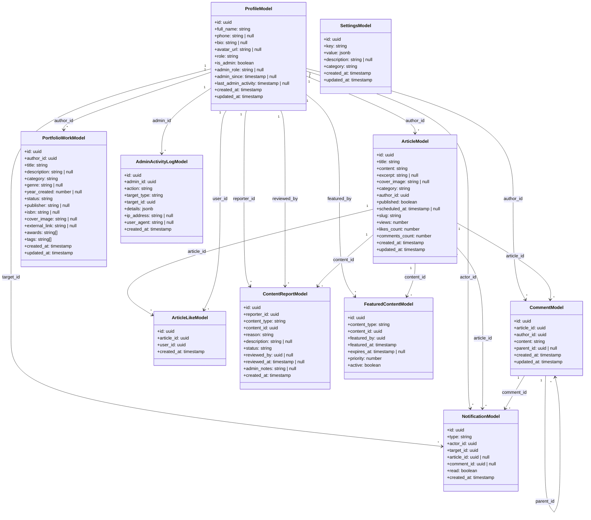

# Class Diagram Database Models

Diagram ini menggambarkan struktur model data yang merepresentasikan entitas dalam database PostgreSQL. Setiap model sesuai dengan tabel dalam ERD yang telah dibuat pada BAB 4. Class diagram database models terdiri dari:

1. **Core User Models**: ProfileModel yang menyimpan data profil pengguna termasuk informasi personal (full_name, bio, avatar_url), role dalam komunitas (role), dan informasi admin (is_admin, admin_role, admin_since). Model ini menjadi pusat relasi dengan model lainnya.

2. **Content Models**: ArticleModel yang menyimpan data artikel (title, content, excerpt, category, cover_image, slug, status published/scheduled), dan PortfolioWorkModel yang menyimpan data portofolio karya penulis (buku, ilustrasi, dll) dengan informasi lengkap seperti publisher, ISBN, awards, dan external link.

3. **Interaction Models**: CommentModel untuk komentar berulir dengan parent_id untuk mendukung nested comments, dan ArticleLikeModel untuk relasi many-to-many antara pengguna dan artikel yang disukai.

4. **Notification Models**: NotificationModel yang menyimpan notifikasi sistem untuk berbagai jenis aktivitas (like, comment) dengan relasi ke actor (yang melakukan aksi) dan target (yang menerima notifikasi).

5. **Moderation Models**: ContentReportModel untuk laporan konten dari pengguna dengan status pending/resolved/rejected, dan AdminActivityLogModel untuk mencatat semua aktivitas admin termasuk action, target, dan metadata (IP address, user agent).

6. **Feature Models**: FeaturedContentModel untuk mengelola konten yang ditampilkan di homepage dengan priority dan expiry date, dan SettingsModel untuk pengaturan platform yang disimpan sebagai key-value pairs dengan kategori.

Relasi one-to-many (1 --> *) menunjukkan bahwa satu ProfileModel dapat memiliki banyak ArticleModel, CommentModel, PortfolioWorkModel, dan model lainnya. ArticleModel memiliki relasi one-to-many dengan CommentModel dan ArticleLikeModel. CommentModel memiliki relasi self-referencing untuk mendukung komentar berulir. Setiap model menggunakan UUID sebagai primary key dan timestamp untuk created_at dan updated_at untuk tracking perubahan data.

## Cara Menggunakan

1. Buka [Mermaid Live Editor](https://mermaid.live)
2. Copy kode Mermaid di bawah ini
3. Paste ke editor
4. Export sebagai PNG dengan nama `bab5-class-diagram-models.png`

## Kode Mermaid

