# Class Diagram Komponen Frontend

Diagram ini menggambarkan struktur komponen React yang digunakan di frontend platform PaberLand. Class diagram frontend terdiri dari komponen-komponen utama meliputi:

1. **Layout Components**: Header, Footer, AdminSidebar yang digunakan di seluruh halaman untuk navigasi dan struktur layout. Header berisi fitur pencarian, notifikasi, dan logout. AdminSidebar khusus untuk navigasi panel admin.

2. **Article Components**: ArticleCard, ArticleDetail, ArticleList, ArticleContent, ArticleLikeSection, ArticleMetadata, AuthorProfile, RelatedArticles, SocialShare untuk menampilkan dan mengelola artikel. ArticleCard digunakan untuk preview artikel dalam list, ArticleDetail untuk halaman detail artikel lengkap, dan komponen pendukung lainnya untuk metadata, like, dan sharing.

3. **Editor Components**: WriteArticleForm dan TinyMCEEditor untuk penulisan artikel. WriteArticleForm menangani form input artikel (judul, kategori, cover image) dan integrasi dengan TinyMCE editor untuk konten artikel dengan fitur auto-save.

4. **Comment Components**: CommentList, CommentItem, CommentForm, CommentsSection untuk sistem komentar berulir (threaded comments). CommentItem mendukung komentar nested dengan parent_id, CommentForm untuk input komentar baru atau reply.

5. **Profile Components**: ProfileCard dan ProfileEdit untuk manajemen profil pengguna. ProfileCard menampilkan informasi profil, ProfileEdit untuk mengedit profil termasuk upload avatar.

6. **Admin Components**: AdminSidebar, UserManagement, ContentModeration untuk panel admin. UserManagement untuk mengelola pengguna (ubah role, ban/unban, delete), ContentModeration untuk meninjau dan menyelesaikan laporan konten.

7. **Auth Components**: LoginForm dan RegisterForm untuk autentikasi pengguna. LoginForm mendukung login email/password dan OAuth Google, RegisterForm untuk pendaftaran akun baru dengan validasi.

8. **Notification Components**: NotificationSystem untuk menampilkan dan mengelola notifikasi pengguna dengan fitur mark as read.

9. **Report Components**: ReportButton dan ReportModal untuk sistem pelaporan konten. ReportButton memicu modal, ReportModal menampilkan form laporan dengan pilihan alasan.

Setiap komponen memiliki props yang didefinisikan dengan TypeScript interface untuk memastikan type safety. Komponen-komponen ini saling berinteraksi melalui props passing dan context API (seperti AuthContext) untuk state management global seperti autentikasi. Relasi komposisi (*--*) menunjukkan bahwa komponen parent memiliki komponen child, sedangkan relasi dependency (..>) menunjukkan penggunaan atau navigasi antar komponen.

## Cara Menggunakan

1. Buka [Mermaid Live Editor](https://mermaid.live)
2. Copy kode Mermaid di bawah ini
3. Paste ke editor
4. Export sebagai PNG dengan nama `bab5-class-diagram-frontend.png`

## Kode Mermaid

```mermaid
classDiagram
    %% Layout Components
    class Header {
        +user: User | null
        +notifications: Notification[]
        +searchQuery: string
        +handleSearch(query: string): void
        +handleLogout(): void
        +render(): JSX.Element
    }
    
    class Footer {
        +render(): JSX.Element
    }
    
    class AdminSidebar {
        +pendingReports: number
        +activePath: string
        +handleNavigation(path: string): void
        +render(): JSX.Element
    }
    
    %% Article Components
    class ArticleCard {
        +article: Article
        +onClick(): void
        +render(): JSX.Element
    }
    
    class ArticleDetail {
        +article: Article
        +author: Profile
        +onLike(): void
        +onShare(): void
        +render(): JSX.Element
    }
    
    class ArticleList {
        +articles: Article[]
        +loading: boolean
        +onLoadMore(): void
        +render(): JSX.Element
    }
    
    class ArticleContent {
        +content: string
        +render(): JSX.Element
    }
    
    class ArticleLikeSection {
        +articleId: string
        +likesCount: number
        +isLiked: boolean
        +onLike(): void
        +render(): JSX.Element
    }
    
    class ArticleMetadata {
        +article: Article
        +author: Profile
        +render(): JSX.Element
    }
    
    class AuthorProfile {
        +author: Profile
        +articleCount: number
        +render(): JSX.Element
    }
    
    class LikeButton {
        +articleId: string
        +isLiked: boolean
        +likesCount: number
        +onToggle(): void
        +render(): JSX.Element
    }
    
    class RelatedArticles {
        +currentArticleId: string
        +category: string
        +articles: Article[]
        +render(): JSX.Element
    }
    
    class SocialShare {
        +article: Article
        +onShare(platform: string): void
        +render(): JSX.Element
    }
    
    %% Editor Components
    class WriteArticleForm {
        +articleId: string | null
        +title: string
        +content: string
        +category: string
        +coverImage: File | null
        +onSave(): void
        +onPublish(): void
        +onAutoSave(): void
        +render(): JSX.Element
    }
    
    class TinyMCEEditor {
        +value: string
        +onChange(content: string): void
        +onImageUpload(file: File): string
        +render(): JSX.Element
    }
    
    %% Comment Components
    class CommentList {
        +articleId: string
        +comments: Comment[]
        +onReply(commentId: string): void
        +render(): JSX.Element
    }
    
    class CommentItem {
        +comment: Comment
        +author: Profile
        +replies: Comment[]
        +onReply(): void
        +onDelete(): void
        +render(): JSX.Element
    }
    
    class CommentForm {
        +articleId: string
        +parentId: string | null
        +onSubmit(content: string): void
        +render(): JSX.Element
    }
    
    class CommentsSection {
        +articleId: string
        +comments: Comment[]
        +onCommentAdded(): void
        +render(): JSX.Element
    }
    
    %% Profile Components
    class ProfileCard {
        +profile: Profile
        +isOwnProfile: boolean
        +onEdit(): void
        +render(): JSX.Element
    }
    
    class ProfileEdit {
        +profile: Profile
        +onSave(profile: Profile): void
        +onAvatarUpload(file: File): void
        +render(): JSX.Element
    }
    
    %% Admin Components
    class UserManagement {
        +users: Profile[]
        +onUpdateRole(userId: string, role: string): void
        +onDeleteUser(userId: string): void
        +render(): JSX.Element
    }
    
    class ContentModeration {
        +reports: ContentReport[]
        +onResolve(reportId: string, action: string): void
        +render(): JSX.Element
    }
    
    %% Auth Components
    class LoginForm {
        +email: string
        +password: string
        +onSubmit(): void
        +onGoogleLogin(): void
        +render(): JSX.Element
    }
    
    class RegisterForm {
        +fullName: string
        +email: string
        +password: string
        +role: string
        +onSubmit(): void
        +render(): JSX.Element
    }
    
    %% Notification Components
    class NotificationSystem {
        +notifications: Notification[]
        +unreadCount: number
        +onMarkAsRead(id: string): void
        +render(): JSX.Element
    }
    
    %% Report Components
    class ReportButton {
        +contentId: string
        +contentType: string
        +onClick(): void
        +render(): JSX.Element
    }
    
    class ReportModal {
        +contentId: string
        +contentType: string
        +onSubmit(reason: string, description: string): void
        +onClose(): void
        +render(): JSX.Element
    }
    
    %% Relationships - Composition
    ArticleDetail *-- ArticleContent : contains
    ArticleDetail *-- ArticleLikeSection : contains
    ArticleDetail *-- ArticleMetadata : contains
    ArticleDetail *-- AuthorProfile : contains
    ArticleDetail *-- RelatedArticles : contains
    ArticleDetail *-- SocialShare : contains
    ArticleDetail *-- CommentsSection : contains
    
    ArticleList *-- ArticleCard : contains
    
    CommentsSection *-- CommentList : contains
    CommentList *-- CommentItem : contains
    CommentItem *-- CommentForm : contains
    
    WriteArticleForm *-- TinyMCEEditor : contains
    
    Header *-- NotificationSystem : contains
    
    %% Relationships - Dependency
    ArticleCard ..> ArticleDetail : navigates to
    CommentForm ..> CommentList : updates
    LikeButton ..> ArticleLikeSection : updates
    ReportButton ..> ReportModal : opens
    ProfileCard ..> ProfileEdit : navigates to
    
    %% Relationships - Usage
    ArticleDetail ..> LikeButton : uses
    ArticleDetail ..> ReportButton : uses
    AdminSidebar ..> UserManagement : navigates to
    AdminSidebar ..> ContentModeration : navigates to
```

