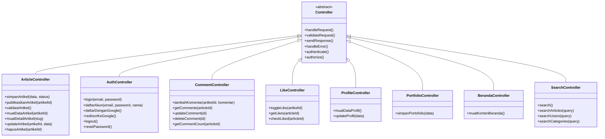
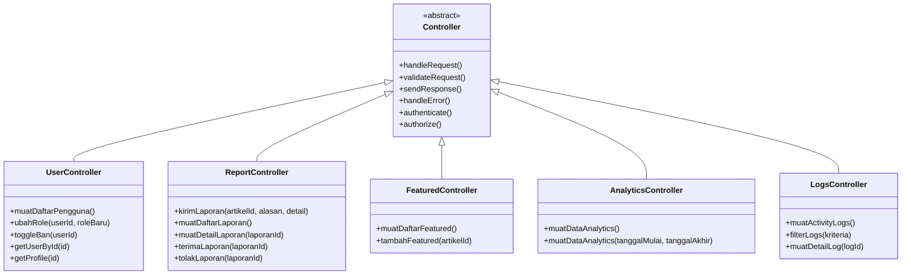
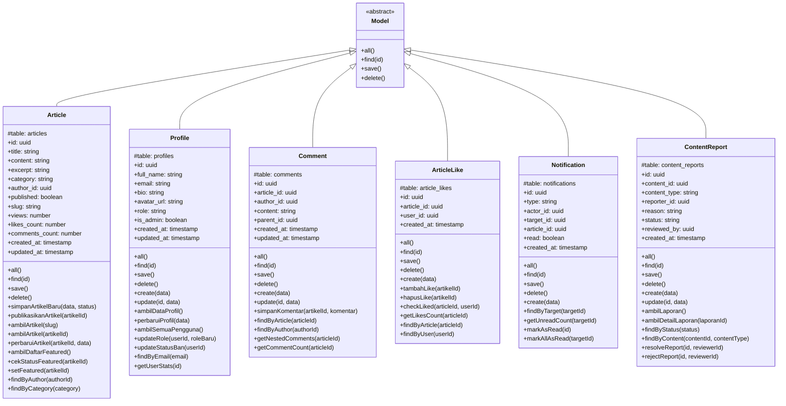
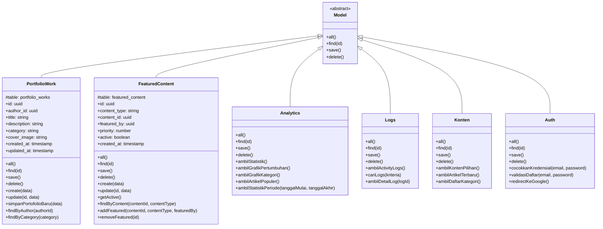

# Class Diagram Simple - Platform PaberLand

Diagram ini menggambarkan struktur class diagram Platform PaberLand dalam versi yang sangat sederhana, mengikuti pola inheritance seperti contoh yang diberikan.

## Struktur Diagram

Diagram ini terdiri dari 2 bagian utama:
1. **Controller/API Layer**: Base class Controller dengan class-class turunan untuk menangani HTTP requests
2. **Model Layer**: Base class Model dengan class-class turunan untuk representasi data

## Penjelasan Diagram

### Gambar 5.1 Rancangan Class Diagram Controller

Class diagram controller menggambarkan struktur pengendali sistem pada Platform PaberLand yang menggunakan pola pewarisan dengan kelas dasar `Controller` sebagai kelas abstrak. Diagram controller dibagi menjadi dua bagian yaitu controller fungsional (Gambar 5.1) yang terdiri dari delapan pengendali untuk fitur utama pengguna seperti `ArticleController`, `AuthController`, `CommentController`, `LikeController`, `ProfileController`, `PortfolioController`, `BerandaController`, dan `SearchController`, serta controller administrasi (Gambar 5.2) yang terdiri dari lima pengendali untuk fitur admin seperti `UserController`, `ReportController`, `FeaturedController`, `AnalyticsController`, dan `LogsController`. Semua pengendali mewarisi operasi dasar dari kelas `Controller` seperti `handleRequest()`, `validateRequest()`, `sendResponse()`, `handleError()`, `authenticate()`, dan `authorize()` untuk menjaga konsistensi implementasi sistem.

### Gambar 5.3 Rancangan Class Diagram Model

Class diagram model menggambarkan struktur data yang digunakan pada Platform PaberLand yang menggunakan pola pewarisan dengan kelas dasar `Model` sebagai kelas abstrak. Diagram model dibagi menjadi dua bagian yaitu model inti (Gambar 5.3) yang terdiri dari enam model utama yaitu `Article`, `Profile`, `Comment`, `ArticleLike`, `Notification`, dan `ContentReport` yang merepresentasikan data dan operasi inti platform, serta model pendukung (Gambar 5.4) yang terdiri dari enam model yaitu `PortfolioWork`, `FeaturedContent`, `Analytics`, `Logs`, `Konten`, dan `Auth` yang menyediakan fitur pendukung seperti portofolio, konten featured, analytics, activity logs, konten beranda, dan autentikasi. Semua model mewarisi operasi dasar dari kelas `Model` seperti `all()`, `find()`, `save()`, dan `delete()` untuk memastikan konsistensi dalam operasi database.

## Cara Menggunakan

1. Buka [Mermaid Live Editor](https://mermaid.live)
2. Copy kode Mermaid di bawah ini
3. Paste ke editor
4. Export sebagai PNG dengan nama `bab5-class-diagram-simple.png`

## Kode Mermaid

### Gambar 5.1 Rancangan Class Diagram Controller - Controller Fungsional

### Gambar 5.2 Rancangan Class Diagram Controller - Controller Administrasi

### Gambar 5.3 Rancangan Class Diagram Model - Model Inti

### Gambar 5.4 Rancangan Class Diagram Model - Model Pendukung

