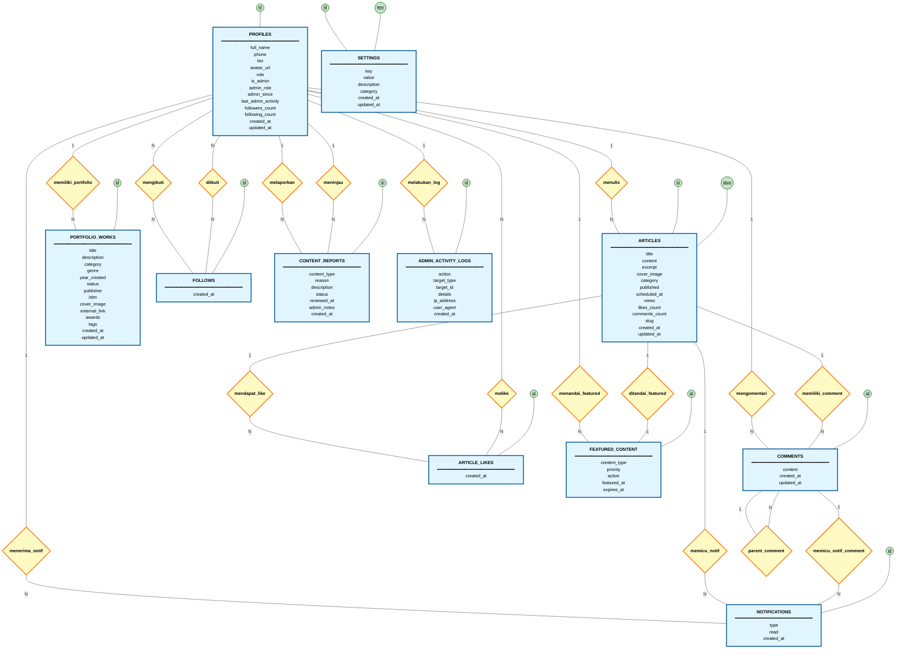

# ERD PaberLand - Chen Notation Murni

## Diagram ERD Chen Notation (Murni - Tanpa ID)

## Penjelasan ERD Chen Notation Murni

### **1. Entitas dan Atributnya**

#### **PROFILES** (User/Penulis)
- **full_name**: Nama lengkap user
- **phone**: Nomor telepon
- **bio**: Bio/deskripsi user
- **avatar_url**: URL foto profil
- **role**: Peran user (default: 'Penulis')
- **is_admin**: Status admin (default: false)
- **admin_role**: Peran admin (jika admin)
- **admin_since**: Kapan menjadi admin
- **last_admin_activity**: Aktivitas admin terakhir
- **followers_count**: Jumlah follower (derived)
- **following_count**: Jumlah following (derived)
- **created_at**: Waktu dibuat
- **updated_at**: Waktu diupdate
- **Primary Key**: `id` (digarisbawahi, ditampilkan sebagai oval terpisah)

#### **ARTICLES** (Artikel)
- **title**: Judul artikel
- **content**: Isi artikel (HTML)
- **excerpt**: Ringkasan artikel
- **cover_image**: URL gambar cover
- **category**: Kategori artikel
- **published**: Status publish (default: false)
- **scheduled_at**: Jadwal publish
- **views**: Jumlah view (derived)
- **likes_count**: Jumlah like (derived)
- **comments_count**: Jumlah komentar (derived)
- **slug**: URL slug unik
- **created_at**: Waktu dibuat
- **updated_at**: Waktu diupdate
- **Primary Key**: `id` (digarisbawahi)
- **Unique**: `slug` (digarisbawahi)

#### **COMMENTS** (Komentar)
- **content**: Isi komentar
- **created_at**: Waktu dibuat
- **updated_at**: Waktu diupdate
- **Primary Key**: `id` (digarisbawahi)

#### **PORTFOLIO_WORKS** (Karya Portofolio)
- **title**: Judul karya
- **description**: Deskripsi karya
- **category**: Kategori karya
- **genre**: Genre karya
- **year_created**: Tahun dibuat
- **status**: Status (default: 'unpublished')
- **publisher**: Penerbit
- **isbn**: ISBN
- **cover_image**: URL gambar cover
- **external_link**: Link eksternal
- **awards**: Array penghargaan
- **tags**: Array tag
- **created_at**: Waktu dibuat
- **updated_at**: Waktu diupdate
- **Primary Key**: `id` (digarisbawahi)

#### **ARTICLE_LIKES** (Junction Table - Like Artikel)
- **created_at**: Waktu like
- **Primary Key**: `id` (digarisbawahi)

#### **FOLLOWS** (Junction Table - Follow User)
- **created_at**: Waktu follow
- **Primary Key**: `id` (digarisbawahi)

#### **NOTIFICATIONS** (Notifikasi)
- **type**: Tipe notifikasi ('follow', 'like', 'comment', 'mention')
- **read**: Status baca (default: false)
- **created_at**: Waktu dibuat
- **Primary Key**: `id` (digarisbawahi)

#### **CONTENT_REPORTS** (Laporan Konten)
- **content_type**: Tipe konten ('article', 'comment', 'user')
- **reason**: Alasan laporan
- **description**: Deskripsi laporan
- **status**: Status ('pending', 'reviewed', 'resolved', 'dismissed')
- **reviewed_at**: Waktu ditinjau
- **admin_notes**: Catatan admin
- **created_at**: Waktu dibuat
- **Primary Key**: `id` (digarisbawahi)

#### **FEATURED_CONTENT** (Konten Unggulan)
- **content_type**: Tipe konten ('article', 'user')
- **priority**: Prioritas tampil (default: 1)
- **active**: Status aktif (default: true)
- **featured_at**: Waktu ditandai
- **expires_at**: Waktu kadaluarsa (optional)
- **Primary Key**: `id` (digarisbawahi)

#### **ADMIN_ACTIVITY_LOGS** (Log Aktivitas Admin)
- **action**: Aksi yang dilakukan
- **target_type**: Tipe target
- **target_id**: ID target
- **details**: Detail aksi (JSON)
- **ip_address**: IP address
- **user_agent**: User agent browser
- **created_at**: Waktu dibuat
- **Primary Key**: `id` (digarisbawahi)

#### **SETTINGS** (Pengaturan Sistem)
- **key**: Key pengaturan (unique)
- **value**: Nilai pengaturan (JSON)
- **description**: Deskripsi pengaturan
- **category**: Kategori (default: 'general')
- **created_at**: Waktu dibuat
- **updated_at**: Waktu diupdate
- **Primary Key**: `id` (digarisbawahi)
- **Unique**: `key` (digarisbawahi)

### **2. Relasi dan Kardinalitasnya**

#### **Relasi One-to-Many (1:N)**

1. **PROFILES (1) --[menulis]-- (N) ARTICLES**
   - Satu user menulis banyak artikel

2. **PROFILES (1) --[mengomentari]-- (N) COMMENTS**
   - Satu user membuat banyak komentar

3. **PROFILES (1) --[memiliki_portfolio]-- (N) PORTFOLIO_WORKS**
   - Satu user memiliki banyak karya portofolio

4. **PROFILES (1) --[menerima_notif]-- (N) NOTIFICATIONS**
   - Satu user menerima banyak notifikasi

5. **PROFILES (1) --[melaporkan]-- (N) CONTENT_REPORTS**
   - Satu user bisa membuat banyak laporan

6. **PROFILES (1) --[meninjau]-- (N) CONTENT_REPORTS**
   - Satu admin bisa meninjau banyak laporan

7. **PROFILES (1) --[melakukan_log]-- (N) ADMIN_ACTIVITY_LOGS**
   - Satu admin melakukan banyak log aktivitas

8. **PROFILES (1) --[menandai_featured]-- (N) FEATURED_CONTENT**
   - Satu admin bisa menandai banyak konten sebagai featured

9. **ARTICLES (1) --[memiliki_comment]-- (N) COMMENTS**
   - Satu artikel memiliki banyak komentar

10. **ARTICLES (1) --[mendapat_like]-- (N) ARTICLE_LIKES**
    - Satu artikel mendapat banyak like

11. **ARTICLES (1) --[memicu_notif]-- (N) NOTIFICATIONS**
    - Satu artikel bisa memicu banyak notifikasi

12. **COMMENTS (1) --[parent_comment]-- (N) COMMENTS**
    - Satu komentar bisa punya banyak komentar child (nested comments)

13. **COMMENTS (1) --[memicu_notif_comment]-- (N) NOTIFICATIONS**
    - Satu komentar bisa memicu banyak notifikasi

#### **Relasi One-to-One (1:1)**

14. **ARTICLES (1) --[ditandai_featured]-- (1) FEATURED_CONTENT**
    - Satu artikel maksimal satu featured content

#### **Relasi Many-to-Many (N:M)**

15. **PROFILES (N) --[melike]-- (N) ARTICLE_LIKES --[mendapat_like]-- (N) ARTICLES**
    - Banyak user bisa like banyak artikel

16. **PROFILES (N) --[mengikuti]-- (N) FOLLOWS --[diikuti]-- (N) PROFILES**
    - Banyak user bisa follow banyak user lain

### **3. Ringkasan Alur Data**

- **PROFILES** adalah entitas sentral yang menulis artikel, membuat komentar, memiliki portofolio, dan terlibat dalam semua aktivitas
- **ARTICLES** adalah konten utama yang mendapat komentar, like, dan bisa ditandai sebagai featured
- **COMMENTS** mendukung nested comments (parent-child relationship)
- **NOTIFICATIONS** dikirim otomatis via trigger saat ada follow, like, atau comment
- **ADMIN** (via PROFILES dengan is_admin=true) mengelola featured content, meninjau laporan, dan melakukan logging aktivitas
