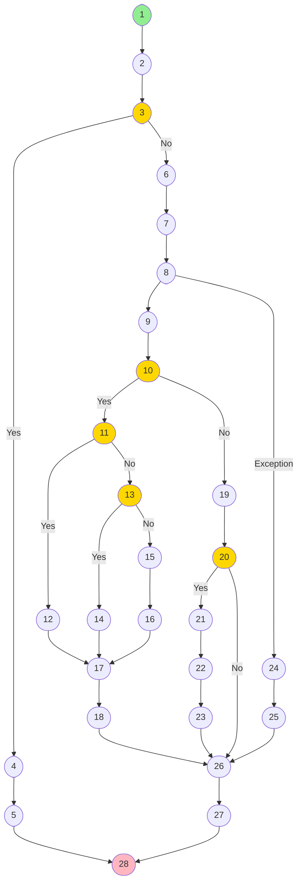

# Flowgraph Login Pengguna

```mermaid
flowchart TD
    1([1]) --> 2([2])
    2 --> 3([3])
    3 -->|Yes| 4([4])
    4 --> 5([5])
    5 --> 28([28])
    3 -->|No| 6([6])
    6 --> 7([7])
    7 --> 8([8])
    8 --> 9([9])
    9 --> 10([10])
    10 -->|Yes| 11([11])
    11 -->|Yes| 12([12])
    12 --> 17([17])
    11 -->|No| 13([13])
    13 -->|Yes| 14([14])
    14 --> 17
    13 -->|No| 15([15])
    15 --> 16([16])
    16 --> 17
    17 --> 18([18])
    18 --> 26([26])
    10 -->|No| 19([19])
    19 --> 20([20])
    20 -->|Yes| 21([21])
    21 --> 22([22])
    22 --> 23([23])
    23 --> 26
    20 -->|No| 26
    8 -->|Exception| 24([24])
    24 --> 25([25])
    25 --> 26
    26 --> 27([27])
    27 --> 28
    
    style 1 fill:#90EE90
    style 28 fill:#FFB6C1
    style 3 fill:#FFD700
    style 10 fill:#FFD700
    style 11 fill:#FFD700
    style 13 fill:#FFD700
    style 20 fill:#FFD700
```
