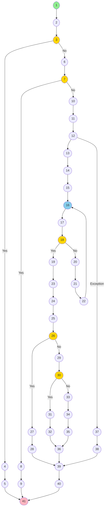

# Flowgraph Tambah Artikel

```mermaid
flowchart TD
    1([1]) --> 2([2])
    2 --> 3([3])
    3 -->|Yes| 4([4])
    4 --> 5([5])
    5 --> 41([41])
    3 -->|No| 6([6])
    6 --> 7([7])
    7 -->|Yes| 8([8])
    8 --> 9([9])
    9 --> 41
    7 -->|No| 10([10])
    10 --> 11([11])
    11 --> 12([12])
    12 --> 13([13])
    13 --> 14([14])
    14 --> 15([15])
    15 --> 16([16])
    16 --> 17([17])
    17 --> 18([18])
    18 -->|Yes| 19([19])
    19 --> 23([23])
    18 -->|No| 20([20])
    20 --> 21([21])
    21 --> 22([22])
    22 --> 16
    23 --> 24([24])
    24 --> 25([25])
    25 --> 26([26])
    26 -->|Yes| 27([27])
    27 --> 28([28])
    28 --> 39([39])
    26 -->|No| 29([29])
    29 --> 30([30])
    30 -->|Yes| 31([31])
    31 --> 32([32])
    32 --> 36([36])
    30 -->|No| 33([33])
    33 --> 34([34])
    34 --> 35([35])
    35 --> 36
    36 --> 39
    12 -->|Exception| 37([37])
    37 --> 38([38])
    38 --> 39
    39 --> 40([40])
    40 --> 41
    
    style 1 fill:#90EE90
    style 41 fill:#FFB6C1
    style 3 fill:#FFD700
    style 7 fill:#FFD700
    style 16 fill:#87CEEB
    style 18 fill:#FFD700
    style 26 fill:#FFD700
    style 30 fill:#FFD700
```
