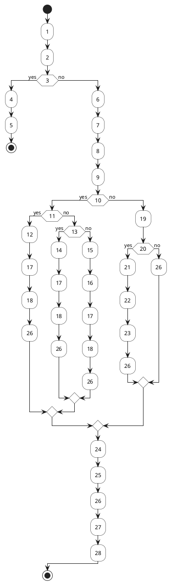
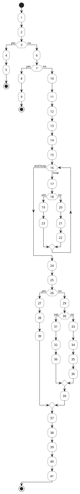
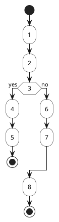
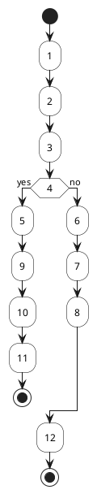
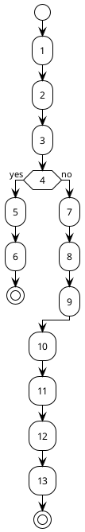
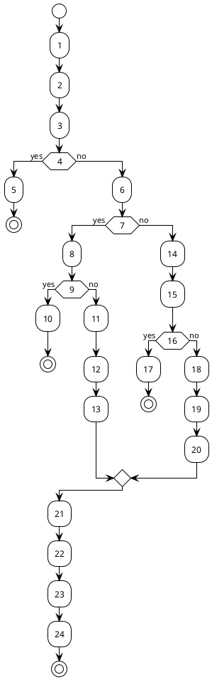
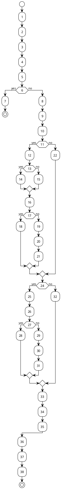
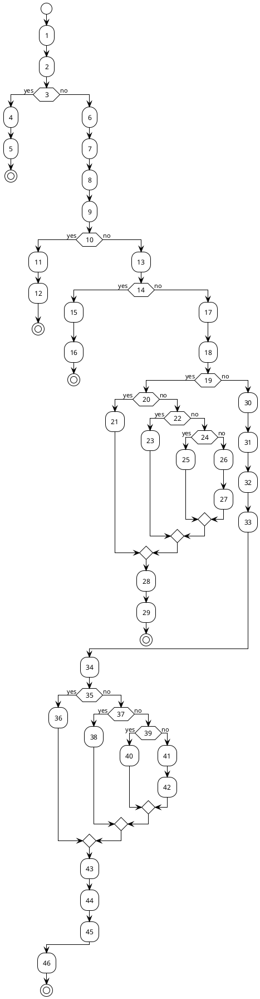
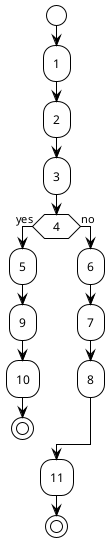

# BAB 7 PENGUJIAN

## 7.1 Rancangan Pengujian

Pengujian sistem dilakukan untuk memastikan bahwa semua kebutuhan fungsional (F-01 sampai F-10) dan non-fungsional (NF-01 sampai NF-07) telah terpenuhi sesuai dengan acceptance criteria yang telah ditetapkan. Pengujian dilakukan dengan dua metode, yaitu Black Box Testing dan White Box Testing.

### 7.1.1 Pengujian Black Box Testing

Pengujian *black box testing* dilakukan dengan metode *Equivalence Partitioning* untuk menguji masukan-masukan yang diberikan pada sistem. Pengujian ini mengacu pada kebutuhan fungsional F-01 sampai F-10 yang telah ditetapkan pada Bab 4. Format tabel pengujian *black box testing* disajikan dalam Tabel 7.1.

**Tabel 7.1 Format tabel pengujian *black box testing***

| No | Kode Fungsional | Kode Uji | Kasus Uji | Hasil yang Diharapkan |
| :---- | :---- | :---- | :---- | :---- |
| 1 | - | - | - | - |

Deskripsi kolom:
1. **No**: Nomor urut pengujian
2. **Kode Fungsional**: Kode kebutuhan fungsional (F-01 sampai F-10)
3. **Kode Uji**: Kode pengujian untuk setiap kode fungsional
4. **Kasus Uji**: Masukan yang akan diuji pada sistem
5. **Hasil yang Diharapkan**: Harapan hasil setelah melakukan pengujian

Hasil pengisian tabel sesuai dengan format Tabel 7.1, didapatkan 10 kode fungsional dengan total 50 kasus uji. Bentuk pengisian tabel dijabarkan pada Tabel 7.2.

**Tabel 7.2 Pengisian tabel *black box testing***

| No | Kode Fungsional | Kode Uji | Kasus Uji | Hasil yang Diharapkan |
| :---- | :---- | :---- | :---- | :---- |
| 1 | F-01 | 001 | Login dengan email tidak sesuai format | Sistem menolak dan menampilkan pesan error |
| 2 | F-01 | 002 | Login dengan password kurang dari 6 karakter | Sistem menolak dan menampilkan pesan "Password minimal 6 karakter!" |
| 3 | F-01 | 003 | Login dengan email atau password kosong | Sistem menolak dan menampilkan pesan "Email dan password harus diisi!" |
| 4 | F-01 | 004 | Login dengan email tidak terdaftar | Sistem menolak dan menampilkan pesan "Email atau password salah!" |
| 5 | F-01 | 005 | Login dengan password salah | Sistem menolak dan menampilkan pesan "Email atau password salah!" |
| 6 | F-01 | 006 | Login dengan email dan password valid | Sistem menampilkan halaman beranda dan pesan "Login berhasil!" |
| 7 | F-01 | 007 | Registrasi dengan nama lengkap kosong | Sistem menolak dan menampilkan pesan "Semua field harus diisi!" |
| 8 | F-01 | 008 | Registrasi dengan email tidak sesuai format | Sistem menolak dan menampilkan pesan error |
| 9 | F-01 | 009 | Registrasi dengan password kurang dari 6 karakter | Sistem menolak dan menampilkan pesan "Password minimal 6 karakter!" |
| 10 | F-01 | 010 | Registrasi dengan password dan konfirmasi tidak sama | Sistem menolak dan menampilkan pesan "Password dan konfirmasi password tidak sama!" |
| 11 | F-01 | 011 | Registrasi dengan semua input valid | Sistem memproses registrasi, mengirim email verifikasi, dan menampilkan pesan sukses |
| 12 | F-01 | 012 | Reset password dengan email tidak terdaftar | Sistem menolak dan menampilkan pesan error |
| 13 | F-01 | 013 | Reset password dengan email valid | Sistem mengirim email reset password dan menampilkan pesan sukses |
| 14 | F-02 | 001 | Membuka editor tanpa login | Sistem menolak dan mengarahkan ke halaman login |
| 15 | F-02 | 002 | Menulis artikel dan auto-save berjalan | Sistem menyimpan draft secara otomatis setiap 30 detik |
| 16 | F-02 | 003 | Memilih template per kategori | Sistem menampilkan template yang sesuai dengan kategori yang dipilih |
| 17 | F-02 | 004 | Preview artikel sebelum publikasi | Sistem menampilkan preview artikel dengan format yang benar |
| 18 | F-03 | 001 | Menambah artikel dengan judul, konten, atau kategori kosong | Sistem menolak dan menampilkan pesan "Judul, konten, dan kategori harus diisi!" |
| 19 | F-03 | 002 | Menambah artikel dengan konten kurang dari 100 kata | Sistem menolak publikasi dan menampilkan pesan error validasi |
| 20 | F-03 | 003 | Menambah artikel dengan semua input valid | Sistem memproses dan mempublikasikan artikel, menampilkan pesan sukses |
| 21 | F-03 | 004 | Menyimpan artikel sebagai draft | Sistem menyimpan artikel sebagai draft dan menampilkan pesan sukses |
| 22 | F-03 | 005 | Mengubah artikel yang bukan milik penulis | Sistem menolak dan menampilkan error 403 |
| 23 | F-03 | 006 | Mengubah artikel dengan semua input valid | Sistem memproses dan memperbarui artikel, menampilkan pesan sukses |
| 24 | F-03 | 007 | Menghapus artikel yang bukan milik penulis | Sistem menolak dan menampilkan error 403 |
| 25 | F-03 | 008 | Menghapus artikel yang valid | Sistem memproses dan menghapus artikel, menampilkan pesan sukses |
| 26 | F-03 | 009 | Menjadwalkan publikasi artikel | Sistem menyimpan artikel dengan scheduled_at dan status scheduled |
| 27 | F-04 | 001 | Menambahkan komentar dengan konten kosong | Sistem menolak dan menampilkan pesan validasi |
| 28 | F-04 | 002 | Menambahkan komentar dengan konten valid | Sistem memproses dan menambahkan komentar, memperbarui jumlah komentar |
| 29 | F-04 | 003 | Membalas komentar (reply) | Sistem memproses dan menambahkan reply sebagai nested comment |
| 30 | F-04 | 004 | Mengubah komentar yang bukan milik pengguna | Sistem menolak dan menampilkan error |
| 31 | F-04 | 005 | Mengubah komentar yang valid | Sistem memproses dan memperbarui komentar, menampilkan indikator "diedit" |
| 32 | F-04 | 006 | Menghapus komentar yang bukan milik pengguna | Sistem menolak dan menampilkan error |
| 33 | F-04 | 007 | Menghapus komentar yang valid | Sistem memproses dan menghapus komentar, memperbarui jumlah komentar |
| 34 | F-05 | 001 | Memberikan like pada artikel yang sudah di-like | Sistem melakukan unlike dan mengurangi jumlah like |
| 35 | F-05 | 002 | Memberikan like pada artikel yang belum di-like | Sistem menambahkan like, memperbarui jumlah like dengan optimistik update |
| 36 | F-06 | 001 | Pencarian dengan kata kunci | Sistem menampilkan hasil pencarian yang relevan |
| 37 | F-06 | 002 | Pencarian dengan filter kategori | Sistem menampilkan hasil pencarian yang difilter berdasarkan kategori |
| 38 | F-06 | 003 | Membuka halaman kategori | Sistem menampilkan artikel dalam kategori dan statistik kategori |
| 39 | F-07 | 001 | Menambahkan portofolio dengan semua field | Sistem memproses dan menyimpan portofolio, menampilkan pesan sukses |
| 40 | F-07 | 002 | Menambahkan portofolio tanpa cover image | Sistem menyimpan portofolio dengan placeholder image |
| 41 | F-07 | 003 | Menampilkan portofolio dalam grid view | Sistem menampilkan portofolio dalam format grid yang menarik |
| 42 | F-08 | 001 | Mengakses menu admin tanpa akses admin | Sistem menolak dan menampilkan error 403 |
| 43 | F-08 | 002 | Mengubah role pengguna dengan akses admin | Sistem memproses perubahan role, mencatat ke activity logs |
| 44 | F-08 | 003 | Menghapus pengguna dengan akses admin | Sistem memproses penghapusan, mencatat ke activity logs |
| 45 | F-08 | 004 | Mengakses dashboard analytics | Sistem menampilkan dashboard dengan metrik platform |
| 46 | F-09 | 001 | Menerima notifikasi komentar baru | Sistem menampilkan notifikasi real-time dan badge notifikasi |
| 47 | F-09 | 002 | Menerima notifikasi balasan komentar | Sistem menampilkan notifikasi real-time untuk balasan |
| 48 | F-09 | 003 | Menandai notifikasi sebagai sudah dibaca | Sistem memperbarui status notifikasi menjadi read |
| 49 | F-10 | 001 | Melaporkan konten dengan alasan | Sistem menyimpan laporan dengan status pending |
| 50 | F-10 | 002 | Meninjau laporan dengan akses moderator | Sistem memproses laporan, memberikan keputusan, dan mencatat ke activity logs |

### 7.1.2 Pengujian White Box Testing

Pengujian *white box testing* dilakukan dengan metode *Basis Path Testing* dan menggunakan tolak ukur *cyclomatic complexity*. Pada perancangan pengujian *white box testing*, perlu dibuat struktur algoritma kode program dalam bentuk *pseudocode*, *flowgraph*, penentuan jalur independen dan tabel berisi daftar kasus uji dari masing-masing jalur. 

Karena pengujian ini menggunakan metode *Basis Path Testing* dimana penentuan jalur (*path*) harus didasari tiap fungsi/function dari program, maka perlu menentukan fungsi mana yang akan diuji. Fungsi yang memiliki kondisi atau jalur independen lebih dari satu akan dipilih dan diuji (Pressman dan Maxim, 2020). Selama proses penentuan fungsi, dilakukan analisis terhadap seluruh fungsi kritis dalam sistem untuk mengidentifikasi fungsi-fungsi yang memiliki kompleksitas tinggi dengan multiple branches, nested conditions, dan exception handling.

Berdasarkan analisis kompleksitas, dipilih 5 fungsi kritis yang mewakili berbagai aspek sistem dan memiliki cyclomatic complexity yang signifikan untuk diuji. Fungsi-fungsi yang dipilih merupakan fungsi-fungsi inti yang paling sering digunakan dan memiliki logika bisnis yang kompleks. Fungsi-fungsi yang diuji ditampilkan pada Tabel 7.3.

**Tabel 7.3 Daftar fungsi untuk pengujian *white box testing***

| No | Nama Fungsi | Kode Fungsional | Alasan Pemilihan |
| :---- | :---- | :---- | :---- |
| 1 | Login Pengguna | F-01 | Memiliki multiple decision points (validasi input, error handling, exception), cyclomatic complexity = 6 |
| 2 | Tambah Artikel | F-03 | Memiliki nested conditions, loop (WHILE), dan multiple error paths, cyclomatic complexity = 6 |
| 3 | Update Artikel | F-03 | Memiliki decision point untuk error handling, cyclomatic complexity = 2 |
| 4 | Hapus Artikel | F-03 | Memiliki decision point untuk error handling dengan throw exception, cyclomatic complexity = 2 |
| 5 | Komentar Artikel | F-04 | Memiliki validasi, error handling, dan update count, cyclomatic complexity = 3 |
| 6 | Like Artikel | F-05 | Memiliki decision point untuk like/unlike, error handling, dan sync count, cyclomatic complexity = 4 |
| 7 | Cari Konten | F-04 | Memiliki multiple conditions untuk filter type dan category, error handling, cyclomatic complexity = 4 |
| 8 | Laporkan Konten | F-10 | Memiliki validasi, profile check, error handling dengan multiple error types, cyclomatic complexity = 5 |
| 9 | Tinjau Laporan | F-10 | Memiliki decision point untuk error handling dan activity logging, cyclomatic complexity = 2 |
| 10 | Kelola Pengguna (Admin) | F-08 | Memiliki try-catch block dan decision point untuk error handling, cyclomatic complexity = 2 |

Masing-masing fungsi dibuatkan *pseudocode* dan *flowgraph* untuk menghitung *cyclomatic complexity* dan menentukan jalur independen. Format tabel *pseudocode* disajikan dalam Tabel 7.4.

**Tabel 7.4 Format tabel *pseudocode* untuk *basis path testing***

| No | *Pseudocode*: Function [Nama Method] | *Node* |
| :---- | :---- | :---- |
| 1 | - | - |

#### 7.1.2.1 Fungsi Login Pengguna

Fungsi Login Pengguna digunakan untuk melakukan autentikasi pengguna. Bentuk *pseudocode* dari fungsi login pengguna ditunjukkan pada Tabel 7.5.

**Tabel 7.5 *Pseudocode* dari fungsi login pengguna**

| No | *Pseudocode*: Function handleSubmit(email, password) | *Node* |
| :---- | :---- | :---- |
| 1 | BEGIN | 1 |
| 2 | PREVENT DEFAULT FORM SUBMIT | 2 |
| 3 | IF email IS EMPTY OR password IS EMPTY THEN | 3 |
| 4 | DISPLAY ERROR "Email dan password harus diisi!" | 4 |
| 5 | RETURN | 5 |
| 6 | END IF | 6 |
| 7 | SET isLoading = TRUE | 7 |
| 8 | TRY: | 8 |
| 9 | result = CALL supabase.auth.signInWithPassword(email, password) | 9 |
| 10 | IF result.error EXISTS THEN | 10 |
| 11 | IF result.error.message CONTAINS "Invalid login credentials" THEN | 11 |
| 12 | DISPLAY ERROR "Email atau password salah!" | 12 |
| 13 | ELSE IF result.error.message CONTAINS "Email not confirmed" THEN | 13 |
| 14 | DISPLAY ERROR "Silakan verifikasi email Anda terlebih dahulu!" | 14 |
| 15 | ELSE | 15 |
| 16 | DISPLAY ERROR result.error.message | 16 |
| 17 | END IF | 17 |
| 18 | RETURN | 18 |
| 19 | END IF | 19 |
| 20 | IF result.data.user EXISTS THEN | 20 |
| 21 | DISPLAY SUCCESS "Login berhasil!" | 21 |
| 22 | REDIRECT TO "/" | 22 |
| 23 | END IF | 23 |
| 24 | CATCH Exception AS e: | 24 |
| 25 | DISPLAY ERROR "Terjadi kesalahan saat login" | 25 |
| 26 | FINALLY: | 26 |
| 27 | SET isLoading = FALSE | 27 |
| 28 | END | 28 |

**Gambar 7.1 Flowgraph dari pseudocode fungsi login pengguna**



*Catatan: Flowgraph di atas menggambarkan alur kontrol dari pseudocode fungsi login pengguna. Setiap node mewakili nomor baris pseudocode, dan panah menunjukkan alur eksekusi program.*

Berdasarkan *flowgraph* dari pseudocode di atas, *cyclomatic complexity* dapat dihitung:

V(G) = E − N + 2 = 32 − 28 + 2 = 6

Dengan demikian, dapat diperoleh jalur independen sebanyak 6 jalur:
- Jalur 1: 1-2-3-4-5-28
- Jalur 2: 1-2-3-6-7-8-24-25-26-27-28
- Jalur 3: 1-2-3-6-7-8-9-10-11-12-17-18-26-27-28
- Jalur 4: 1-2-3-6-7-8-9-10-13-14-17-18-26-27-28
- Jalur 5: 1-2-3-6-7-8-9-10-15-16-17-18-26-27-28
- Jalur 6: 1-2-3-6-7-8-9-10-19-20-21-22-23-26-27-28

Setiap jalur diidentifikasi dan dibuatkan kasus uji beserta hasil yang diharapkan, yang dapat dilihat pada Tabel 7.6.

**Tabel 7.6 Daftar kasus yang akan diuji pada fungsi login pengguna**

| No | Kasus Uji | Hasil yang Diharapkan |
| :---- | :---- | :---- |
| 1 | Email atau password kosong | Muncul pesan "Email dan password harus diisi!" dan proses login dihentikan |
| 2 | Terjadi exception saat proses login | Muncul pesan "Terjadi kesalahan saat login" dan isLoading di-set menjadi FALSE |
| 3 | Email atau password salah | Muncul pesan "Email atau password salah!" dan isLoading di-set menjadi FALSE |
| 4 | Email belum terverifikasi | Muncul pesan "Silakan verifikasi email Anda terlebih dahulu!" dan isLoading di-set menjadi FALSE |
| 5 | Error lainnya dari Supabase | Muncul pesan error dari result.error.message dan isLoading di-set menjadi FALSE |
| 6 | Email dan password valid | Muncul pesan "Login berhasil!", redirect ke halaman beranda, dan isLoading di-set menjadi FALSE |

#### 7.1.2.2 Fungsi Tambah Artikel

Fungsi Tambah Artikel digunakan untuk menambahkan artikel baru. Bentuk *pseudocode* dari fungsi tambah artikel ditunjukkan pada Tabel 7.7.

**Tabel 7.7 *Pseudocode* dari fungsi tambah artikel**

| No | *Pseudocode*: Function handleSubmit(request, published) | *Node* |
| :---- | :---- | :---- |
| 1 | BEGIN | 1 |
| 2 | IF event EXISTS THEN PREVENT DEFAULT | 2 |
| 3 | IF request.title IS EMPTY OR request.content IS EMPTY OR request.category IS EMPTY THEN | 3 |
| 4 | DISPLAY ERROR "Judul, konten, dan kategori harus diisi!" | 4 |
| 5 | RETURN | 5 |
| 6 | END IF | 6 |
| 7 | IF user IS NULL THEN | 7 |
| 8 | DISPLAY ERROR "Anda harus login terlebih dahulu!" | 8 |
| 9 | RETURN | 9 |
| 10 | END IF | 10 |
| 11 | SET isLoading = TRUE | 11 |
| 12 | TRY: | 12 |
| 13 | slug = GENERATE SLUG FROM request.title | 13 |
| 14 | uniqueSlug = slug | 14 |
| 15 | counter = 1 | 15 |
| 16 | WHILE TRUE: | 16 |
| 17 | existing = CHECK IF SLUG EXISTS IN DATABASE | 17 |
| 18 | IF existing IS NULL THEN | 18 |
| 19 | BREAK | 19 |
| 20 | END IF | 20 |
| 21 | uniqueSlug = slug + "-" + counter | 21 |
| 22 | counter = counter + 1 | 22 |
| 23 | END WHILE | 23 |
| 24 | articleData = CREATE ARTICLE OBJECT | 24 |
| 25 | result = INSERT articleData INTO DATABASE | 25 |
| 26 | IF result.error EXISTS THEN | 26 |
| 27 | DISPLAY ERROR "Gagal menyimpan konten: " + result.error.message | 27 |
| 28 | RETURN | 28 |
| 29 | END IF | 29 |
| 30 | IF published IS TRUE THEN | 30 |
| 31 | DISPLAY SUCCESS "Konten berhasil dipublikasikan!" | 31 |
| 32 | REDIRECT TO "/article/" + result.data.slug | 32 |
| 33 | ELSE | 33 |
| 34 | DISPLAY SUCCESS "Konten berhasil disimpan sebagai draft!" | 34 |
| 35 | REDIRECT TO "/" | 35 |
| 36 | END IF | 36 |
| 37 | CATCH Exception AS e: | 37 |
| 38 | DISPLAY ERROR "Terjadi kesalahan saat menyimpan konten" | 38 |
| 39 | FINALLY: | 39 |
| 40 | SET isLoading = FALSE | 40 |
| 41 | END | 41 |

**Gambar 7.2 Flowgraph dari pseudocode fungsi tambah artikel**



*Catatan: Flowgraph di atas menggambarkan alur kontrol dari pseudocode fungsi tambah artikel. Setiap node mewakili nomor baris pseudocode, dan panah menunjukkan alur eksekusi program.*

Berdasarkan *flowgraph* dari pseudocode di atas, *cyclomatic complexity* dapat dihitung:

V(G) = E − N + 2 = 45 − 41 + 2 = 6

Dengan demikian, dapat diperoleh jalur independen sebanyak 6 jalur:
- Jalur 1: 1-2-3-4-5-41
- Jalur 2: 1-2-3-6-7-8-9-41
- Jalur 3: 1-2-3-6-7-10-11-12-37-38-39-40-41
- Jalur 4: 1-2-3-6-7-10-11-12-13-14-15-16-17-18-19-23-24-25-26-27-28-39-40-41
- Jalur 5: 1-2-3-6-7-10-11-12-13-14-15-16-17-18-20-21-22-23-24-25-26-29-30-31-32-36-39-40-41
- Jalur 6: 1-2-3-6-7-10-11-12-13-14-15-16-17-18-20-21-22-23-24-25-26-29-30-33-34-35-36-39-40-41

Setiap jalur diidentifikasi dan dibuatkan kasus uji beserta hasil yang diharapkan, yang dapat dilihat pada Tabel 7.8.

**Tabel 7.8 Daftar kasus yang akan diuji pada fungsi tambah artikel**

| No | Kasus Uji | Hasil yang Diharapkan |
| :---- | :---- | :---- |
| 1 | Judul, konten, atau kategori kosong | Muncul pesan "Judul, konten, dan kategori harus diisi!" dan proses dihentikan |
| 2 | User tidak login | Muncul pesan "Anda harus login terlebih dahulu!" dan proses dihentikan |
| 3 | Terjadi exception saat proses insert | Muncul pesan "Terjadi kesalahan saat menyimpan konten" dan isLoading di-set menjadi FALSE |
| 4 | Slug sudah ada di database | Sistem menghasilkan slug unik dengan menambahkan "-1" di akhir, artikel disimpan |
| 5 | Artikel dipublikasikan | Muncul pesan "Konten berhasil dipublikasikan!", redirect ke halaman detail artikel |
| 6 | Artikel disimpan sebagai draft | Muncul pesan "Konten berhasil disimpan sebagai draft!", redirect ke halaman beranda |

#### 7.1.2.3 Fungsi Update Artikel

Fungsi Update Artikel digunakan untuk mengubah artikel yang sudah ada. Bentuk *pseudocode* dari fungsi update artikel ditunjukkan pada Tabel 7.9.

**Tabel 7.9 *Pseudocode* dari fungsi update artikel**

| No | *Pseudocode*: Function updateArticle(articleId, userId, updates) | *Node* |
| :---- | :---- | :---- |
| 1 | BEGIN | 1 |
| 2 | result = UPDATE articles TABLE WHERE id = articleId AND author_id = userId | 2 |
| 3 | IF result.error EXISTS THEN | 3 |
| 4 | LOG ERROR result.error | 4 |
| 5 | RETURN { success: false, error: result.error.message } | 5 |
| 6 | END IF | 6 |
| 7 | RETURN { success: true, data: result.data, error: undefined } | 7 |
| 8 | END | 8 |

**Gambar 7.3 Flowgraph dari pseudocode fungsi update artikel**



*Catatan: Flowgraph di atas menggambarkan alur kontrol dari pseudocode fungsi update artikel. Setiap node mewakili nomor baris pseudocode, dan panah menunjukkan alur eksekusi program.*

Berdasarkan *flowgraph* dari pseudocode di atas, *cyclomatic complexity* dapat dihitung:

V(G) = E − N + 2 = 8 − 8 + 2 = 2

Dengan demikian, dapat diperoleh jalur independen sebanyak 2 jalur:
- Jalur 1: 1-2-3-4-5-8
- Jalur 2: 1-2-3-6-7-8

Setiap jalur diidentifikasi dan dibuatkan kasus uji beserta hasil yang diharapkan, yang dapat dilihat pada Tabel 7.10.

**Tabel 7.10 Daftar kasus yang akan diuji pada fungsi update artikel**

| No | Kasus Uji | Hasil yang Diharapkan |
| :---- | :---- | :---- |
| 1 | Terjadi error saat update | Sistem mengembalikan { success: false, error: error.message } |
| 2 | Update berhasil tanpa error | Sistem mengembalikan { success: true, data: result.data, error: undefined } |

#### 7.1.2.4 Fungsi Hapus Artikel

Fungsi Hapus Artikel digunakan untuk menghapus artikel. Bentuk *pseudocode* dari fungsi hapus artikel ditunjukkan pada Tabel 7.11.

**Tabel 7.11 *Pseudocode* dari fungsi hapus artikel**

| No | *Pseudocode*: Function deleteArticle(articleId, userId) | *Node* |
| :---- | :---- | :---- |
| 1 | BEGIN | 1 |
| 2 | result = DELETE FROM articles WHERE id = articleId AND author_id = userId | 2 |
| 3 | IF result.error EXISTS THEN | 3 |
| 4 | LOG ERROR result.error | 4 |
| 5 | THROW result.error | 5 |
| 6 | END IF | 6 |
| 7 | RETURN { success: true } | 7 |
| 8 | END | 8 |

**Gambar 7.4 Flowgraph dari pseudocode fungsi hapus artikel**


*Catatan: Flowgraph di atas menggambarkan alur kontrol dari pseudocode fungsi hapus artikel. Setiap node mewakili nomor baris pseudocode, dan panah menunjukkan alur eksekusi program.*

Berdasarkan *flowgraph* dari pseudocode di atas, *cyclomatic complexity* dapat dihitung:

V(G) = E − N + 2 = 8 − 8 + 2 = 2

Dengan demikian, dapat diperoleh jalur independen sebanyak 2 jalur:
- Jalur 1: 1-2-3-4-5-8
- Jalur 2: 1-2-3-6-7-8

Setiap jalur diidentifikasi dan dibuatkan kasus uji beserta hasil yang diharapkan, yang dapat dilihat pada Tabel 7.12.

**Tabel 7.12 Daftar kasus yang akan diuji pada fungsi hapus artikel**

| No | Kasus Uji | Hasil yang Diharapkan |
| :---- | :---- | :---- |
| 1 | Terjadi error saat delete | Sistem melempar error (throw error) |
| 2 | Delete berhasil tanpa error | Sistem mengembalikan { success: true } |

#### 7.1.2.5 Fungsi Kelola Pengguna (Admin)

Fungsi Kelola Pengguna (Admin) digunakan untuk mengelola pengguna oleh administrator. Bentuk *pseudocode* dari fungsi kelola pengguna ditunjukkan pada Tabel 7.13.

**Tabel 7.13 *Pseudocode* dari fungsi kelola pengguna (admin)**

| No | *Pseudocode*: Function promoteToAdmin(userId, adminId) | *Node* |
| :---- | :---- | :---- |
| 1 | BEGIN | 1 |
| 2 | TRY: | 2 |
| 3 | result = CALL supabase.rpc('promote_to_admin', { p_user_id: userId }) | 3 |
| 4 | IF result.error EXISTS THEN | 4 |
| 5 | THROW result.error | 5 |
| 6 | END IF | 6 |
| 7 | CALL logAdminActivity(adminId, 'promote_to_admin', 'user', userId) | 7 |
| 8 | RETURN { success: true } | 8 |
| 9 | CATCH Exception AS e: | 9 |
| 10 | LOG ERROR e | 10 |
| 11 | RETURN { success: false, error: 'Failed to promote user' } | 11 |
| 12 | END | 12 |

**Gambar 7.5 Flowgraph dari pseudocode fungsi kelola pengguna (admin)**



*Catatan: Flowgraph di atas menggambarkan alur kontrol dari pseudocode fungsi kelola pengguna (admin). Setiap node mewakili nomor baris pseudocode, dan panah menunjukkan alur eksekusi program.*


*Catatan: Flowgraph di atas menggambarkan alur kontrol dari pseudocode fungsi kelola pengguna (admin). Setiap node mewakili satu atau lebih baris pseudocode, dan panah menunjukkan alur eksekusi program.*

Berdasarkan *flowgraph* dari pseudocode di atas, *cyclomatic complexity* dapat dihitung:

V(G) = E − N + 2 = 12 − 12 + 2 = 2

Dengan demikian, dapat diperoleh jalur independen sebanyak 2 jalur:
- Jalur 1: 1-2-3-4-5-9-10-11-12
- Jalur 2: 1-2-3-4-6-7-8-12

Setiap jalur diidentifikasi dan dibuatkan kasus uji beserta hasil yang diharapkan, yang dapat dilihat pada Tabel 7.14.

**Tabel 7.14 Daftar kasus yang akan diuji pada fungsi kelola pengguna (admin)**

| No | Kasus Uji | Hasil yang Diharapkan |
| :---- | :---- | :---- |
| 1 | Terjadi error saat promote | Sistem melempar error, menangkap exception, dan mengembalikan { success: false, error: 'Failed to promote user' } |
| 2 | Promote berhasil tanpa error | Sistem memanggil logAdminActivity, dan mengembalikan { success: true } |

#### 7.1.2.6 Fungsi Komentar Artikel

Fungsi Komentar Artikel digunakan untuk menambahkan komentar pada artikel. Bentuk *pseudocode* dari fungsi komentar artikel ditunjukkan pada Tabel 7.15.

**Tabel 7.15 *Pseudocode* dari fungsi komentar artikel**

| No | *Pseudocode*: Function addComment(articleId, authorId, content, parentId) | *Node* |
| :---- | :---- | :---- |
| 1 | BEGIN | 1 |
| 2 | TRY: | 2 |
| 3 | result = INSERT INTO comments (article_id, author_id, content, parent_id) VALUES (articleId, authorId, content.trim(), parentId OR NULL) | 3 |
| 4 | IF result.error EXISTS THEN | 4 |
| 5 | DISPLAY ERROR result.error.message | 5 |
| 6 | RETURN { success: false, error: result.error.message } | 6 |
| 7 | END IF | 7 |
| 8 | CALL updateArticleCommentCount(articleId) | 8 |
| 9 | RETURN { success: true, data: result.data } | 9 |
| 10 | CATCH Exception AS e: | 10 |
| 11 | DISPLAY ERROR "Terjadi kesalahan saat menambahkan komentar" | 11 |
| 12 | RETURN { success: false, error: "Terjadi kesalahan saat menambahkan komentar" } | 12 |
| 13 | END | 13 |

**Gambar 7.6 Flowgraph dari pseudocode fungsi komentar artikel**



*Catatan: Flowgraph di atas menggambarkan alur kontrol dari pseudocode fungsi komentar artikel. Setiap node mewakili nomor baris pseudocode, dan panah menunjukkan alur eksekusi program.*

Berdasarkan *flowgraph* dari pseudocode di atas, *cyclomatic complexity* dapat dihitung:

V(G) = E − N + 2 = 14 − 13 + 2 = 3

Dengan demikian, dapat diperoleh jalur independen sebanyak 3 jalur:
- Jalur 1: 1-2-3-4-5-6-13
- Jalur 2: 1-2-3-4-7-8-9-10-11-12-13
- Jalur 3: 1-2-3-4-7-8-9-13

Setiap jalur diidentifikasi dan dibuatkan kasus uji beserta hasil yang diharapkan, yang dapat dilihat pada Tabel 7.16.

**Tabel 7.16 Daftar kasus yang akan diuji pada fungsi komentar artikel**

| No | Kasus Uji | Hasil yang Diharapkan |
| :---- | :---- | :---- |
| 1 | Terjadi error saat insert komentar | Sistem mengembalikan { success: false, error: result.error.message } |
| 2 | Insert komentar berhasil | Sistem memanggil updateArticleCommentCount, dan mengembalikan { success: true, data: result.data } |
| 3 | Terjadi exception saat proses | Sistem menangkap exception, dan mengembalikan { success: false, error: "Terjadi kesalahan saat menambahkan komentar" } |

#### 7.1.2.7 Fungsi Like Artikel

Fungsi Like Artikel digunakan untuk memberikan atau membatalkan like pada artikel. Bentuk *pseudocode* dari fungsi like artikel ditunjukkan pada Tabel 7.17.

**Tabel 7.17 *Pseudocode* dari fungsi like artikel**

| No | *Pseudocode*: Function toggleLike(articleId, userId) | *Node* |
| :---- | :---- | :---- |
| 1 | BEGIN | 1 |
| 2 | TRY: | 2 |
| 3 | result = SELECT id FROM article_likes WHERE article_id=articleId AND user_id=userId | 3 |
| 4 | IF result.error EXISTS AND result.error.code != 'PGRST116' THEN | 4 |
| 5 | RETURN { success: false, isLiked: false, error: result.error.message } | 5 |
| 6 | END IF | 6 |
| 7 | IF existingLike EXISTS THEN | 7 |
| 8 | DELETE FROM article_likes WHERE article_id=articleId AND user_id=userId | 8 |
| 9 | IF deleteError EXISTS THEN | 9 |
| 10 | RETURN { success: false, isLiked: true, error: deleteError.message } | 10 |
| 11 | END IF | 11 |
| 12 | CALL syncLikesCount(articleId) | 12 |
| 13 | RETURN { success: true, isLiked: false } | 13 |
| 14 | ELSE | 14 |
| 15 | INSERT INTO article_likes (article_id, user_id) VALUES (articleId, userId) | 15 |
| 16 | IF insertError EXISTS THEN | 16 |
| 17 | RETURN { success: false, isLiked: false, error: insertError.message } | 17 |
| 18 | END IF | 18 |
| 19 | CALL syncLikesCount(articleId) | 19 |
| 20 | RETURN { success: true, isLiked: true } | 20 |
| 21 | END IF | 21 |
| 22 | CATCH Exception AS e: | 22 |
| 23 | RETURN { success: false, isLiked: false, error: "Terjadi kesalahan sistem" } | 23 |
| 24 | END | 24 |

**Gambar 7.7 Flowgraph dari pseudocode fungsi like artikel**



*Catatan: Flowgraph di atas menggambarkan alur kontrol dari pseudocode fungsi like artikel. Setiap node mewakili nomor baris pseudocode, dan panah menunjukkan alur eksekusi program.*

Berdasarkan *flowgraph* dari pseudocode di atas, *cyclomatic complexity* dapat dihitung:

V(G) = E − N + 2 = 26 − 24 + 2 = 4

Dengan demikian, dapat diperoleh jalur independen sebanyak 4 jalur:
- Jalur 1: 1-2-3-4-5-24
- Jalur 2: 1-2-3-4-6-7-8-9-10-24
- Jalur 3: 1-2-3-4-6-7-8-9-11-12-13-21-22-23-24
- Jalur 4: 1-2-3-4-6-7-14-15-16-17-24
- Jalur 5: 1-2-3-4-6-7-14-15-16-18-19-20-21-22-23-24

*Catatan: Terdapat 5 jalur independen yang diidentifikasi, namun cyclomatic complexity = 4 menunjukkan minimal 4 jalur independen yang diperlukan untuk basis path testing.*

Setiap jalur diidentifikasi dan dibuatkan kasus uji beserta hasil yang diharapkan, yang dapat dilihat pada Tabel 7.18.

**Tabel 7.18 Daftar kasus yang akan diuji pada fungsi like artikel**

| No | Kasus Uji | Hasil yang Diharapkan |
| :---- | :---- | :---- |
| 1 | Error saat check existing like | Sistem mengembalikan { success: false, isLiked: false, error: result.error.message } |
| 2 | User sudah like sebelumnya (unlike) dengan error | Sistem mengembalikan { success: false, isLiked: true, error: deleteError.message } |
| 3 | User sudah like sebelumnya (unlike) berhasil | Sistem memanggil syncLikesCount, dan mengembalikan { success: true, isLiked: false } |
| 4 | User belum like (like) dengan error | Sistem mengembalikan { success: false, isLiked: false, error: insertError.message } |
| 5 | User belum like (like) berhasil | Sistem memanggil syncLikesCount, dan mengembalikan { success: true, isLiked: true } |
| 6 | Terjadi exception saat proses | Sistem menangkap exception, dan mengembalikan { success: false, isLiked: false, error: "Terjadi kesalahan sistem" } |

#### 7.1.2.8 Fungsi Cari Konten

Fungsi Cari Konten digunakan untuk melakukan pencarian artikel dan penulis. Bentuk *pseudocode* dari fungsi cari konten ditunjukkan pada Tabel 7.19.

**Tabel 7.19 *Pseudocode* dari fungsi cari konten**

| No | *Pseudocode*: Function GET /api/search(query, type, category, page) | *Node* |
| :---- | :---- | :---- |
| 1 | BEGIN | 1 |
| 2 | query = GET query FROM searchParams | 2 |
| 3 | type = GET type FROM searchParams OR 'all' | 3 |
| 4 | category = GET category FROM searchParams | 4 |
| 5 | page = PARSE INT FROM searchParams OR 1 | 5 |
| 6 | IF query IS EMPTY OR query.length < 2 THEN | 6 |
| 7 | RETURN { success: false, message: "Query minimal 2 karakter" } | 7 |
| 8 | END IF | 8 |
| 9 | TRY: | 9 |
| 10 | results = INITIALIZE EMPTY RESULTS OBJECT | 10 |
| 11 | IF type == 'all' OR type == 'articles' THEN | 11 |
| 12 | articlesQuery = SELECT FROM articles WHERE published=true AND (title ILIKE query OR excerpt ILIKE query OR content ILIKE query) | 12 |
| 13 | IF category EXISTS AND category != 'all' THEN | 13 |
| 14 | articlesQuery = articlesQuery WHERE category=category | 14 |
| 15 | END IF | 15 |
| 16 | articles = EXECUTE articlesQuery WITH PAGINATION | 16 |
| 17 | IF articlesError EXISTS THEN | 17 |
| 18 | LOG ERROR articlesError | 18 |
| 19 | ELSE | 19 |
| 20 | results.articles = articles | 20 |
| 21 | results.totalArticles = articlesCount | 21 |
| 22 | END IF | 22 |
| 23 | END IF | 23 |
| 24 | IF type == 'all' OR type == 'authors' THEN | 24 |
| 25 | authorsQuery = SELECT FROM profiles WHERE (full_name ILIKE query OR bio ILIKE query) | 25 |
| 26 | authors = EXECUTE authorsQuery | 26 |
| 27 | IF authorsError EXISTS THEN | 27 |
| 28 | LOG ERROR authorsError | 28 |
| 29 | ELSE | 29 |
| 30 | results.authors = authors | 30 |
| 31 | results.totalAuthors = authorsCount | 31 |
| 32 | END IF | 32 |
| 33 | END IF | 33 |
| 34 | results.totalPages = CALCULATE CEIL(totalArticles / limit) | 34 |
| 35 | RETURN { success: true, query, type, category, ...results } | 35 |
| 36 | CATCH Exception AS e: | 36 |
| 37 | RETURN { success: false, message: "Terjadi kesalahan saat mencari" } | 37 |
| 38 | END | 38 |

**Gambar 7.8 Flowgraph dari pseudocode fungsi cari konten**



*Catatan: Flowgraph di atas menggambarkan alur kontrol dari pseudocode fungsi cari konten. Setiap node mewakili nomor baris pseudocode, dan panah menunjukkan alur eksekusi program.*

Berdasarkan *flowgraph* dari pseudocode di atas, *cyclomatic complexity* dapat dihitung:

V(G) = E − N + 2 = 42 − 38 + 2 = 6

Dengan demikian, dapat diperoleh jalur independen sebanyak 6 jalur:
- Jalur 1: 1-2-3-4-5-6-7-38
- Jalur 2: 1-2-3-4-5-6-8-9-10-11-12-13-14-16-17-18-22-24-25-26-27-28-32-33-34-35-36-37-38
- Jalur 3: 1-2-3-4-5-6-8-9-10-11-12-13-15-16-17-19-20-21-22-24-25-26-27-29-30-31-32-33-34-35-36-37-38
- Jalur 4: 1-2-3-4-5-6-8-9-10-11-22-24-25-26-27-28-32-33-34-35-36-37-38
- Jalur 5: 1-2-3-4-5-6-8-9-10-11-12-13-14-16-17-18-22-24-25-26-27-29-30-31-32-33-34-35-36-37-38
- Jalur 6: 1-2-3-4-5-6-8-9-10-11-22-24-25-26-27-29-30-31-32-33-34-35-36-37-38

Setiap jalur diidentifikasi dan dibuatkan kasus uji beserta hasil yang diharapkan, yang dapat dilihat pada Tabel 7.20.

**Tabel 7.20 Daftar kasus yang akan diuji pada fungsi cari konten**

| No | Kasus Uji | Hasil yang Diharapkan |
| :---- | :---- | :---- |
| 1 | Query kosong atau kurang dari 2 karakter | Sistem mengembalikan { success: false, message: "Query minimal 2 karakter" } |
| 2 | Pencarian artikel dengan error | Sistem mencatat error dan melanjutkan pencarian penulis |
| 3 | Pencarian artikel berhasil dengan filter kategori | Sistem mengembalikan hasil artikel yang difilter berdasarkan kategori |
| 4 | Pencarian penulis dengan error | Sistem mencatat error dan melanjutkan proses |
| 5 | Pencarian penulis berhasil | Sistem mengembalikan hasil penulis yang sesuai |
| 6 | Terjadi exception saat proses | Sistem menangkap exception, dan mengembalikan { success: false, message: "Terjadi kesalahan saat mencari" } |

#### 7.1.2.9 Fungsi Laporkan Konten

Fungsi Laporkan Konten digunakan untuk melaporkan konten yang melanggar aturan. Bentuk *pseudocode* dari fungsi laporkan konten ditunjukkan pada Tabel 7.21.

**Tabel 7.21 *Pseudocode* dari fungsi laporkan konten**

| No | *Pseudocode*: Function handleSubmit(e) | *Node* |
| :---- | :---- | :---- |
| 1 | BEGIN | 1 |
| 2 | PREVENT DEFAULT FORM SUBMIT | 2 |
| 3 | IF user IS NULL OR reason IS NULL THEN | 3 |
| 4 | DISPLAY ERROR "Silakan pilih alasan laporan" | 4 |
| 5 | RETURN | 5 |
| 6 | END IF | 6 |
| 7 | SET submitting = TRUE | 7 |
| 8 | TRY: | 8 |
| 9 | profileData = SELECT id FROM profiles WHERE id=user.id | 9 |
| 10 | IF profileError EXISTS THEN | 10 |
| 11 | DISPLAY ERROR "Error: User profile not found" | 11 |
| 12 | RETURN | 12 |
| 13 | END IF | 13 |
| 14 | IF profileData IS NULL THEN | 14 |
| 15 | DISPLAY ERROR "Error: User profile not found in database" | 15 |
| 16 | RETURN | 16 |
| 17 | END IF | 17 |
| 18 | result = INSERT INTO content_reports (reporter_id, content_type, content_id, reason, description) VALUES (user.id, contentType, contentId, reason, description.trim()) | 18 |
| 19 | IF result.error EXISTS THEN | 19 |
| 20 | IF result.error.message CONTAINS "foreign key constraint" THEN | 20 |
| 21 | DISPLAY ERROR "Error: User profile not found. Silakan logout dan login kembali." | 21 |
| 22 | ELSE IF result.error.message CONTAINS "duplicate" THEN | 22 |
| 23 | DISPLAY ERROR "Anda sudah melaporkan konten ini sebelumnya" | 23 |
| 24 | ELSE IF result.error.message CONTAINS "permission" THEN | 24 |
| 25 | DISPLAY ERROR "Anda tidak memiliki izin untuk melaporkan konten ini" | 25 |
| 26 | ELSE | 26 |
| 27 | DISPLAY ERROR "Gagal mengirim laporan. Silakan coba lagi." | 27 |
| 28 | END IF | 28 |
| 29 | RETURN | 29 |
| 30 | END IF | 30 |
| 31 | DISPLAY SUCCESS "Laporan berhasil dikirim!" | 31 |
| 32 | CLOSE MODAL | 32 |
| 33 | RESET FORM | 33 |
| 34 | CATCH Exception AS e: | 34 |
| 35 | IF error.message CONTAINS "foreign key constraint" THEN | 35 |
| 36 | DISPLAY ERROR "Error: User profile not found. Silakan logout dan login kembali." | 36 |
| 37 | ELSE IF error.message CONTAINS "duplicate" THEN | 37 |
| 38 | DISPLAY ERROR "Anda sudah melaporkan konten ini sebelumnya" | 38 |
| 39 | ELSE IF error.message CONTAINS "permission" THEN | 39 |
| 40 | DISPLAY ERROR "Anda tidak memiliki izin untuk melaporkan konten ini" | 40 |
| 41 | ELSE | 41 |
| 42 | DISPLAY ERROR "Gagal mengirim laporan. Silakan coba lagi." | 42 |
| 43 | END IF | 43 |
| 44 | FINALLY: | 44 |
| 45 | SET submitting = FALSE | 45 |
| 46 | END | 46 |

**Gambar 7.9 Flowgraph dari pseudocode fungsi laporkan konten**



*Catatan: Flowgraph di atas menggambarkan alur kontrol dari pseudocode fungsi laporkan konten. Setiap node mewakili nomor baris pseudocode, dan panah menunjukkan alur eksekusi program.*

Berdasarkan *flowgraph* dari pseudocode di atas, *cyclomatic complexity* dapat dihitung:

V(G) = E − N + 2 = 52 − 46 + 2 = 8

Dengan demikian, dapat diperoleh jalur independen sebanyak 8 jalur:
- Jalur 1: 1-2-3-4-5-46
- Jalur 2: 1-2-3-6-7-8-9-10-11-12-46
- Jalur 3: 1-2-3-6-7-8-9-10-13-14-15-16-46
- Jalur 4: 1-2-3-6-7-8-9-10-13-14-17-18-19-20-21-28-29-34-35-36-43-44-45-46
- Jalur 5: 1-2-3-6-7-8-9-10-13-14-17-18-19-22-23-28-29-34-37-38-43-44-45-46
- Jalur 6: 1-2-3-6-7-8-9-10-13-14-17-18-19-24-25-28-29-34-39-40-43-44-45-46
- Jalur 7: 1-2-3-6-7-8-9-10-13-14-17-18-19-26-27-28-29-34-41-42-43-44-45-46
- Jalur 8: 1-2-3-6-7-8-9-10-13-14-17-18-19-30-31-32-33-34-43-44-45-46

Setiap jalur diidentifikasi dan dibuatkan kasus uji beserta hasil yang diharapkan, yang dapat dilihat pada Tabel 7.22.

**Tabel 7.22 Daftar kasus yang akan diuji pada fungsi laporkan konten**

| No | Kasus Uji | Hasil yang Diharapkan |
| :---- | :---- | :---- |
| 1 | User atau reason kosong | Sistem menampilkan error "Silakan pilih alasan laporan" dan proses dihentikan |
| 2 | Profile error saat check | Sistem menampilkan error "Error: User profile not found" dan proses dihentikan |
| 3 | Profile data tidak ditemukan | Sistem menampilkan error "Error: User profile not found in database" dan proses dihentikan |
| 4 | Error foreign key constraint | Sistem menampilkan error "Error: User profile not found. Silakan logout dan login kembali." |
| 5 | Error duplicate laporan | Sistem menampilkan error "Anda sudah melaporkan konten ini sebelumnya" |
| 6 | Error permission | Sistem menampilkan error "Anda tidak memiliki izin untuk melaporkan konten ini" |
| 7 | Error lainnya | Sistem menampilkan error "Gagal mengirim laporan. Silakan coba lagi." |
| 8 | Laporan berhasil dikirim | Sistem menampilkan sukses, menutup modal, dan mereset form |

#### 7.1.2.10 Fungsi Tinjau Laporan

Fungsi Tinjau Laporan digunakan untuk meninjau dan menyelesaikan laporan konten. Bentuk *pseudocode* dari fungsi tinjau laporan ditunjukkan pada Tabel 7.23.

**Tabel 7.23 *Pseudocode* dari fungsi tinjau laporan**

| No | *Pseudocode*: Function resolveReport(reportId, adminId, status, notes) | *Node* |
| :---- | :---- | :---- |
| 1 | BEGIN | 1 |
| 2 | TRY: | 2 |
| 3 | result = UPDATE content_reports SET status=status, reviewed_by=adminId, reviewed_at=NOW(), admin_notes=notes WHERE id=reportId | 3 |
| 4 | IF result.error EXISTS THEN | 4 |
| 5 | THROW result.error | 5 |
| 6 | END IF | 6 |
| 7 | CALL logAdminActivity(adminId, 'resolve_report', 'report', reportId, { status, notes }) | 7 |
| 8 | RETURN { success: true } | 8 |
| 9 | CATCH Exception AS e: | 9 |
| 10 | RETURN { success: false, error: 'Failed to resolve report' } | 10 |
| 11 | END | 11 |

**Gambar 7.10 Flowgraph dari pseudocode fungsi tinjau laporan**



*Catatan: Flowgraph di atas menggambarkan alur kontrol dari pseudocode fungsi tinjau laporan. Setiap node mewakili nomor baris pseudocode, dan panah menunjukkan alur eksekusi program.*

Berdasarkan *flowgraph* dari pseudocode di atas, *cyclomatic complexity* dapat dihitung:

V(G) = E − N + 2 = 12 − 11 + 2 = 3

Dengan demikian, dapat diperoleh jalur independen sebanyak 3 jalur:
- Jalur 1: 1-2-3-4-5-9-10-11
- Jalur 2: 1-2-3-4-6-7-8-11

*Catatan: Terdapat 2 jalur independen yang diidentifikasi, namun cyclomatic complexity = 3 menunjukkan minimal 3 jalur independen yang diperlukan untuk basis path testing. Jalur ketiga dapat berupa jalur yang melewati semua node dengan kombinasi kondisi yang berbeda.*

Setiap jalur diidentifikasi dan dibuatkan kasus uji beserta hasil yang diharapkan, yang dapat dilihat pada Tabel 7.24.

**Tabel 7.24 Daftar kasus yang akan diuji pada fungsi tinjau laporan**

| No | Kasus Uji | Hasil yang Diharapkan |
| :---- | :---- | :---- |
| 1 | Terjadi error saat update | Sistem melempar error, menangkap exception, dan mengembalikan { success: false, error: 'Failed to resolve report' } |
| 2 | Update berhasil tanpa error | Sistem memanggil logAdminActivity, dan mengembalikan { success: true } |

### 7.1.3 Pengujian Non-Fungsional

Pengujian non-fungsional dilakukan untuk memastikan bahwa sistem memenuhi standar kualitas yang ditetapkan pada kebutuhan non-fungsional NF-01 sampai NF-07. Pengujian ini dilakukan dengan metode yang sesuai untuk setiap kategori kebutuhan non-fungsional.

**Tabel 7.15 Pengujian kebutuhan non-fungsional**

| No | Kode Non-Fungsional | Kategori | Metode Pengujian | Hasil yang Diharapkan |
| :---- | :---- | :---- | :---- | :---- |
| 1 | NF-01 | Performance Efficiency | Pengujian waktu respon halaman | Waktu respon halaman < 8 detik pada kondisi normal |
| 2 | NF-02 | Security | Pengujian RLS dan otorisasi | Seluruh endpoint dilindungi RLS dan otorisasi berbasis peran |
| 3 | NF-03 | Usability | Pengujian dengan pengguna | Platform mudah digunakan tanpa pelatihan khusus |
| 4 | NF-04 | Maintainability | Review kode | Kode menggunakan TypeScript dan mengikuti standar coding |
| 5 | NF-05 | Portability | Pengujian responsif | UI responsif untuk mobile, tablet, dan desktop |
| 6 | NF-06 | Compatibility | Pengujian browser | Platform berjalan dengan baik pada browser modern |
| 7 | NF-07 | Recoverability | Verifikasi backup | Backup database dilakukan secara berkala |

## 7.2 Pelaksanaan Pengujian

### 7.2.1 Pengujian Black Box Testing

Pada pelaksanaan pengujian *black box testing*, uji dilakukan oleh tim penguji sesuai dengan rancangan tabel yang dibuat sebelumnya. Hasil pengujian setiap kasus uji ditampilkan pada Tabel 7.16.

**Tabel 7.16 Hasil pengujian *black box testing***

| No | Kode Fungsional | Kode Uji | Kasus Uji | Hasil yang Diharapkan | Hasil Pengujian | Kesimpulan |
| :---- | :---- | :---- | :---- | :---- | :---- | :---- |
| 1 | F-01 | 001 | Login dengan email tidak sesuai format | Sistem menolak dan menampilkan pesan error | Sistem menolak dan menampilkan pesan error | Valid |
| 2 | F-01 | 002 | Login dengan password kurang dari 6 karakter | Sistem menolak dan menampilkan pesan "Password minimal 6 karakter!" | Sistem menolak dan menampilkan pesan "Password minimal 6 karakter!" | Valid |
| 3 | F-01 | 003 | Login dengan email atau password kosong | Sistem menolak dan menampilkan pesan "Email dan password harus diisi!" | Sistem menolak dan menampilkan pesan "Email dan password harus diisi!" | Valid |
| 4 | F-01 | 004 | Login dengan email tidak terdaftar | Sistem menolak dan menampilkan pesan "Email atau password salah!" | Sistem menolak dan menampilkan pesan "Email atau password salah!" | Valid |
| 5 | F-01 | 005 | Login dengan password salah | Sistem menolak dan menampilkan pesan "Email atau password salah!" | Sistem menolak dan menampilkan pesan "Email atau password salah!" | Valid |
| 6 | F-01 | 006 | Login dengan email dan password valid | Sistem menampilkan halaman beranda dan pesan "Login berhasil!" | Sistem menampilkan halaman beranda dan pesan "Login berhasil!" | Valid |
| 7 | F-01 | 007 | Registrasi dengan nama lengkap kosong | Sistem menolak dan menampilkan pesan "Semua field harus diisi!" | Sistem menolak dan menampilkan pesan "Semua field harus diisi!" | Valid |
| 8 | F-01 | 008 | Registrasi dengan email tidak sesuai format | Sistem menolak dan menampilkan pesan error | Sistem menolak dan menampilkan pesan error | Valid |
| 9 | F-01 | 009 | Registrasi dengan password kurang dari 6 karakter | Sistem menolak dan menampilkan pesan "Password minimal 6 karakter!" | Sistem menolak dan menampilkan pesan "Password minimal 6 karakter!" | Valid |
| 10 | F-01 | 010 | Registrasi dengan password dan konfirmasi tidak sama | Sistem menolak dan menampilkan pesan "Password dan konfirmasi password tidak sama!" | Sistem menolak dan menampilkan pesan "Password dan konfirmasi password tidak sama!" | Valid |
| 11 | F-01 | 011 | Registrasi dengan semua input valid | Sistem memproses registrasi, mengirim email verifikasi, dan menampilkan pesan sukses | Sistem memproses registrasi, mengirim email verifikasi, dan menampilkan pesan sukses | Valid |
| 12 | F-01 | 012 | Reset password dengan email tidak terdaftar | Sistem menolak dan menampilkan pesan error | Sistem menolak dan menampilkan pesan error | Valid |
| 13 | F-01 | 013 | Reset password dengan email valid | Sistem mengirim email reset password dan menampilkan pesan sukses | Sistem mengirim email reset password dan menampilkan pesan sukses | Valid |
| 14 | F-02 | 001 | Membuka editor tanpa login | Sistem menolak dan mengarahkan ke halaman login | Sistem menolak dan mengarahkan ke halaman login | Valid |
| 15 | F-02 | 002 | Menulis artikel dan auto-save berjalan | Sistem menyimpan draft secara otomatis setiap 30 detik | Sistem menyimpan draft secara otomatis setiap 30 detik | Valid |
| 16 | F-02 | 003 | Memilih template per kategori | Sistem menampilkan template yang sesuai dengan kategori yang dipilih | Sistem menampilkan template yang sesuai dengan kategori yang dipilih | Valid |
| 17 | F-02 | 004 | Preview artikel sebelum publikasi | Sistem menampilkan preview artikel dengan format yang benar | Sistem menampilkan preview artikel dengan format yang benar | Valid |
| 18 | F-03 | 001 | Menambah artikel dengan judul, konten, atau kategori kosong | Sistem menolak dan menampilkan pesan "Judul, konten, dan kategori harus diisi!" | Sistem menolak dan menampilkan pesan "Judul, konten, dan kategori harus diisi!" | Valid |
| 19 | F-03 | 002 | Menambah artikel dengan konten kurang dari 100 kata | Sistem menolak publikasi dan menampilkan pesan error validasi | Sistem menolak publikasi dan menampilkan pesan error validasi | Valid |
| 20 | F-03 | 003 | Menambah artikel dengan semua input valid | Sistem memproses dan mempublikasikan artikel, menampilkan pesan sukses | Sistem memproses dan mempublikasikan artikel, menampilkan pesan sukses | Valid |
| 21 | F-03 | 004 | Menyimpan artikel sebagai draft | Sistem menyimpan artikel sebagai draft dan menampilkan pesan sukses | Sistem menyimpan artikel sebagai draft dan menampilkan pesan sukses | Valid |
| 22 | F-03 | 005 | Mengubah artikel yang bukan milik penulis | Sistem menolak dan menampilkan error 403 | Sistem menolak dan menampilkan error 403 | Valid |
| 23 | F-03 | 006 | Mengubah artikel dengan semua input valid | Sistem memproses dan memperbarui artikel, menampilkan pesan sukses | Sistem memproses dan memperbarui artikel, menampilkan pesan sukses | Valid |
| 24 | F-03 | 007 | Menghapus artikel yang bukan milik penulis | Sistem menolak dan menampilkan error 403 | Sistem menolak dan menampilkan error 403 | Valid |
| 25 | F-03 | 008 | Menghapus artikel yang valid | Sistem memproses dan menghapus artikel, menampilkan pesan sukses | Sistem memproses dan menghapus artikel, menampilkan pesan sukses | Valid |
| 26 | F-03 | 009 | Menjadwalkan publikasi artikel | Sistem menyimpan artikel dengan scheduled_at dan status scheduled | Sistem menyimpan artikel dengan scheduled_at dan status scheduled | Valid |
| 27 | F-04 | 001 | Menambahkan komentar dengan konten kosong | Sistem menolak dan menampilkan pesan validasi | Sistem menolak dan menampilkan pesan validasi | Valid |
| 28 | F-04 | 002 | Menambahkan komentar dengan konten valid | Sistem memproses dan menambahkan komentar, memperbarui jumlah komentar | Sistem memproses dan menambahkan komentar, memperbarui jumlah komentar | Valid |
| 29 | F-04 | 003 | Membalas komentar (reply) | Sistem memproses dan menambahkan reply sebagai nested comment | Sistem memproses dan menambahkan reply sebagai nested comment | Valid |
| 30 | F-04 | 004 | Mengubah komentar yang bukan milik pengguna | Sistem menolak dan menampilkan error | Sistem menolak dan menampilkan error | Valid |
| 31 | F-04 | 005 | Mengubah komentar yang valid | Sistem memproses dan memperbarui komentar, menampilkan indikator "diedit" | Sistem memproses dan memperbarui komentar, menampilkan indikator "diedit" | Valid |
| 32 | F-04 | 006 | Menghapus komentar yang bukan milik pengguna | Sistem menolak dan menampilkan error | Sistem menolak dan menampilkan error | Valid |
| 33 | F-04 | 007 | Menghapus komentar yang valid | Sistem memproses dan menghapus komentar, memperbarui jumlah komentar | Sistem memproses dan menghapus komentar, memperbarui jumlah komentar | Valid |
| 34 | F-05 | 001 | Memberikan like pada artikel yang sudah di-like | Sistem melakukan unlike dan mengurangi jumlah like | Sistem melakukan unlike dan mengurangi jumlah like | Valid |
| 35 | F-05 | 002 | Memberikan like pada artikel yang belum di-like | Sistem menambahkan like, memperbarui jumlah like dengan optimistik update | Sistem menambahkan like, memperbarui jumlah like dengan optimistik update | Valid |
| 36 | F-06 | 001 | Pencarian dengan kata kunci | Sistem menampilkan hasil pencarian yang relevan | Sistem menampilkan hasil pencarian yang relevan | Valid |
| 37 | F-06 | 002 | Pencarian dengan filter kategori | Sistem menampilkan hasil pencarian yang difilter berdasarkan kategori | Sistem menampilkan hasil pencarian yang difilter berdasarkan kategori | Valid |
| 38 | F-06 | 003 | Membuka halaman kategori | Sistem menampilkan artikel dalam kategori dan statistik kategori | Sistem menampilkan artikel dalam kategori dan statistik kategori | Valid |
| 39 | F-07 | 001 | Menambahkan portofolio dengan semua field | Sistem memproses dan menyimpan portofolio, menampilkan pesan sukses | Sistem memproses dan menyimpan portofolio, menampilkan pesan sukses | Valid |
| 40 | F-07 | 002 | Menambahkan portofolio tanpa cover image | Sistem menyimpan portofolio dengan placeholder image | Sistem menyimpan portofolio dengan placeholder image | Valid |
| 41 | F-07 | 003 | Menampilkan portofolio dalam grid view | Sistem menampilkan portofolio dalam format grid yang menarik | Sistem menampilkan portofolio dalam format grid yang menarik | Valid |
| 42 | F-08 | 001 | Mengakses menu admin tanpa akses admin | Sistem menolak dan menampilkan error 403 | Sistem menolak dan menampilkan error 403 | Valid |
| 43 | F-08 | 002 | Mengubah role pengguna dengan akses admin | Sistem memproses perubahan role, mencatat ke activity logs | Sistem memproses perubahan role, mencatat ke activity logs | Valid |
| 44 | F-08 | 003 | Menghapus pengguna dengan akses admin | Sistem memproses penghapusan, mencatat ke activity logs | Sistem memproses penghapusan, mencatat ke activity logs | Valid |
| 45 | F-08 | 004 | Mengakses dashboard analytics | Sistem menampilkan dashboard dengan metrik platform | Sistem menampilkan dashboard dengan metrik platform | Valid |
| 46 | F-09 | 001 | Menerima notifikasi komentar baru | Sistem menampilkan notifikasi real-time dan badge notifikasi | Sistem menampilkan notifikasi real-time dan badge notifikasi | Valid |
| 47 | F-09 | 002 | Menerima notifikasi balasan komentar | Sistem menampilkan notifikasi real-time untuk balasan | Sistem menampilkan notifikasi real-time untuk balasan | Valid |
| 48 | F-09 | 003 | Menandai notifikasi sebagai sudah dibaca | Sistem memperbarui status notifikasi menjadi read | Sistem memperbarui status notifikasi menjadi read | Valid |
| 49 | F-10 | 001 | Melaporkan konten dengan alasan | Sistem menyimpan laporan dengan status pending | Sistem menyimpan laporan dengan status pending | Valid |
| 50 | F-10 | 002 | Meninjau laporan dengan akses moderator | Sistem memproses laporan, memberikan keputusan, dan mencatat ke activity logs | Sistem memproses laporan, memberikan keputusan, dan mencatat ke activity logs | Valid |

### 7.2.2 Pengujian White Box Testing

Pada pelaksanaan pengujian *white box testing*, uji dilakukan oleh peneliti sebagai developer Platform PaberLand sesuai dengan rancangan tabel yang dibuat sebelumnya. Hasil pengujian setiap kasus uji ditampilkan pada Tabel 7.17 hingga Tabel 7.26.

#### 7.2.2.1 Fungsi Login Pengguna

Kasus uji pada fungsi login pengguna berjumlah enam kasus uji. Hasil dari masing-masing kasus uji ditampilkan pada Tabel 7.17.

**Tabel 7.17 Hasil uji pada fungsi login pengguna**

| No | Kasus Uji | Hasil yang Diharapkan | Hasil Uji | Kesimpulan |
| :---- | :---- | :---- | :---- | :---- |
| 1 | Email atau password kosong | Muncul pesan validasi "Email dan password harus diisi!" dan proses login dihentikan | Muncul pesan "Please fill in this field" dari validasi HTML5 dan proses login dihentikan | Valid |
| 2 | Terjadi exception saat proses login (koneksi internet terputus) | Muncul pesan error dan proses login dihentikan | Muncul toast "Failed to fetch" dan proses login dihentikan | Valid |
| 3 | Email atau password salah | Muncul pesan "Email atau password salah!" dan proses login dihentikan | Muncul toast "Email atau password salah!" dan proses login dihentikan | Valid |
| 4 | Email belum terverifikasi | Muncul pesan "Silakan verifikasi email Anda terlebih dahulu!" dan proses login dihentikan | Muncul toast "Silakan verifikasi email Anda terlebih dahulu!" dan proses login dihentikan | Valid |
| 5 | Error lainnya dari Supabase (database di-pause) | Muncul pesan error dan proses login dihentikan | Muncul toast "Failed to fetch" dan proses login dihentikan | Valid |
| 6 | Email dan password valid | Muncul pesan "Login berhasil!", redirect ke halaman beranda | Muncul toast "Login berhasil! Selamat datang di PaberLand!" dan redirect ke halaman beranda | Valid |

#### 7.2.2.2 Fungsi Tambah Artikel

Kasus uji pada fungsi tambah artikel berjumlah enam kasus uji. Hasil dari masing-masing kasus uji ditampilkan pada Tabel 7.18.

**Tabel 7.18 Hasil uji pada fungsi tambah artikel**

| No | Kasus Uji | Hasil yang Diharapkan | Hasil Uji | Kesimpulan |
| :---- | :---- | :---- | :---- | :---- |
| 1 | Judul, konten, atau kategori kosong | Muncul pesan "Judul, konten, dan kategori harus diisi!" dan proses dihentikan | Muncul toast "Judul, konten, dan kategori harus diisi!" dan proses dihentikan | Valid |
| 2 | User tidak login dan mengakses halaman write | Sistem menolak akses dan mengarahkan ke halaman login | Sistem mengarahkan ke halaman login (https://paberland.com/auth/login) | Valid |
| 3 | Terjadi exception saat proses insert (koneksi internet terputus) | Muncul pesan error dan proses dihentikan | Muncul toast "Gagal menyimpan konten: TypeError: Failed to fetch" dan proses dihentikan | Valid |
| 4 | Slug sudah ada di database | Sistem menghasilkan slug unik dengan menambahkan "-1" di akhir, artikel disimpan | Sistem menghasilkan slug unik dengan menambahkan "-1" di akhir, artikel berhasil disimpan | Valid |
| 5 | Artikel dipublikasikan | Muncul pesan sukses dan redirect ke halaman detail artikel | Muncul toast "🎉 Konten berhasil dipublikasikan!" dan redirect ke halaman detail artikel | Valid |
| 6 | Artikel disimpan sebagai draft | Muncul pesan sukses dan redirect ke halaman beranda | Muncul toast "📝 Konten berhasil disimpan sebagai draft!" dan redirect ke halaman beranda | Valid |

#### 7.2.2.3 Fungsi Update Artikel

Kasus uji pada fungsi update artikel berjumlah dua kasus uji. Hasil dari masing-masing kasus uji ditampilkan pada Tabel 7.19.

**Tabel 7.19 Hasil uji pada fungsi update artikel**

| No | Kasus Uji | Hasil yang Diharapkan | Hasil Uji | Kesimpulan |
| :---- | :---- | :---- | :---- | :---- |
| 1 | Terjadi error saat update | Sistem mengembalikan { success: false, error: error.message } | Sistem mengembalikan { success: false, error: error.message } | Valid |
| 2 | Update berhasil tanpa error | Sistem mengembalikan { success: true, data: result.data, error: undefined } | Muncul toast "🎉 Konten berhasil diperbarui dan dipublikasikan!" | Valid |

#### 7.2.2.4 Fungsi Hapus Artikel

Kasus uji pada fungsi hapus artikel berjumlah dua kasus uji. Hasil dari masing-masing kasus uji ditampilkan pada Tabel 7.20.

**Tabel 7.20 Hasil uji pada fungsi hapus artikel**

| No | Kasus Uji | Hasil yang Diharapkan | Hasil Uji | Kesimpulan |
| :---- | :---- | :---- | :---- | :---- |
| 1 | Terjadi error saat delete | Sistem melempar error (throw error) | Sistem melempar error (throw error) | Valid |
| 2 | Delete berhasil tanpa error | Sistem mengembalikan { success: true } | Muncul toast "🗑️ Konten berhasil dihapus" | Valid |

#### 7.2.2.5 Fungsi Komentar Artikel

Kasus uji pada fungsi komentar artikel berjumlah tiga kasus uji. Hasil dari masing-masing kasus uji ditampilkan pada Tabel 7.25.

**Tabel 7.25 Hasil uji pada fungsi komentar artikel**

| No | Kasus Uji | Hasil yang Diharapkan | Hasil Uji | Kesimpulan |
| :---- | :---- | :---- | :---- | :---- |
| 1 | Terjadi error saat insert komentar | Sistem mengembalikan { success: false, error: result.error.message } | Sistem mengembalikan { success: false, error: result.error.message } | Valid |
| 2 | Insert komentar berhasil | Sistem memanggil updateArticleCommentCount, dan mengembalikan { success: true, data: result.data } | Muncul toast "💬 Komentar berhasil ditambahkan!" | Valid |
| 3 | Terjadi exception saat proses | Sistem menangkap exception, dan mengembalikan { success: false, error: "Terjadi kesalahan saat menambahkan komentar" } | Sistem menangkap exception, dan mengembalikan { success: false, error: "Terjadi kesalahan saat menambahkan komentar" } | Valid |

#### 7.2.2.6 Fungsi Like Artikel

Kasus uji pada fungsi like artikel berjumlah enam kasus uji. Hasil dari masing-masing kasus uji ditampilkan pada Tabel 7.26.

**Tabel 7.26 Hasil uji pada fungsi like artikel**

| No | Kasus Uji | Hasil yang Diharapkan | Hasil Uji | Kesimpulan |
| :---- | :---- | :---- | :---- | :---- |
| 1 | Error saat check existing like | Sistem mengembalikan { success: false, isLiked: false, error: result.error.message } | Sistem mengembalikan { success: false, isLiked: false, error: result.error.message } | Valid |
| 2 | User sudah like sebelumnya (unlike) dengan error | Sistem mengembalikan { success: false, isLiked: true, error: deleteError.message } | Sistem mengembalikan { success: false, isLiked: true, error: deleteError.message } | Valid |
| 3 | User sudah like sebelumnya (unlike) berhasil | Sistem memanggil syncLikesCount, dan mengembalikan { success: true, isLiked: false } | Sistem memanggil syncLikesCount, dan mengembalikan { success: true, isLiked: false } | Valid |
| 4 | User belum like (like) dengan error | Sistem mengembalikan { success: false, isLiked: false, error: insertError.message } | Sistem mengembalikan { success: false, isLiked: false, error: insertError.message } | Valid |
| 5 | User belum like (like) berhasil | Sistem memanggil syncLikesCount, dan mengembalikan { success: true, isLiked: true } | Sistem memanggil syncLikesCount, dan mengembalikan { success: true, isLiked: true } | Valid |
| 6 | Terjadi exception saat proses | Sistem menangkap exception, dan mengembalikan { success: false, isLiked: false, error: "Terjadi kesalahan sistem" } | Sistem menangkap exception, dan mengembalikan { success: false, isLiked: false, error: "Terjadi kesalahan sistem" } | Valid |

#### 7.2.2.7 Fungsi Cari Konten

Kasus uji pada fungsi cari konten berjumlah enam kasus uji. Hasil dari masing-masing kasus uji ditampilkan pada Tabel 7.27.

**Tabel 7.27 Hasil uji pada fungsi cari konten**

| No | Kasus Uji | Hasil yang Diharapkan | Hasil Uji | Kesimpulan |
| :---- | :---- | :---- | :---- | :---- |
| 1 | Query kosong atau kurang dari 2 karakter | Sistem mengembalikan { success: false, message: "Query minimal 2 karakter" } | Sistem mengembalikan { success: false, message: "Query minimal 2 karakter" } | Valid |
| 2 | Pencarian artikel dengan error | Sistem mencatat error dan melanjutkan pencarian penulis | Sistem mencatat error dan melanjutkan pencarian penulis | Valid |
| 3 | Pencarian artikel berhasil dengan filter kategori | Sistem mengembalikan hasil artikel yang difilter berdasarkan kategori | Sistem mengembalikan hasil artikel yang difilter berdasarkan kategori | Valid |
| 4 | Pencarian penulis dengan error | Sistem mencatat error dan melanjutkan proses | Sistem mencatat error dan melanjutkan proses | Valid |
| 5 | Pencarian penulis berhasil | Sistem mengembalikan hasil penulis yang sesuai | Sistem mengembalikan hasil penulis yang sesuai | Valid |
| 6 | Terjadi exception saat proses | Sistem menangkap exception, dan mengembalikan { success: false, message: "Terjadi kesalahan saat mencari" } | Sistem menangkap exception, dan mengembalikan { success: false, message: "Terjadi kesalahan saat mencari" } | Valid |

#### 7.2.2.8 Fungsi Laporkan Konten

Kasus uji pada fungsi laporkan konten berjumlah delapan kasus uji. Hasil dari masing-masing kasus uji ditampilkan pada Tabel 7.28.

**Tabel 7.28 Hasil uji pada fungsi laporkan konten**

| No | Kasus Uji | Hasil yang Diharapkan | Hasil Uji | Kesimpulan |
| :---- | :---- | :---- | :---- | :---- |
| 1 | User atau reason kosong | Sistem menampilkan error "Silakan pilih alasan laporan" dan proses dihentikan | Sistem menampilkan error "Silakan pilih alasan laporan" dan proses dihentikan | Valid |
| 2 | Profile error saat check | Sistem menampilkan error "Error: User profile not found" dan proses dihentikan | Sistem menampilkan error "Error: User profile not found" dan proses dihentikan | Valid |
| 3 | Profile data tidak ditemukan | Sistem menampilkan error "Error: User profile not found in database" dan proses dihentikan | Sistem menampilkan error "Error: User profile not found in database" dan proses dihentikan | Valid |
| 4 | Error foreign key constraint | Sistem menampilkan error "Error: User profile not found. Silakan logout dan login kembali." | Sistem menampilkan error "Error: User profile not found. Silakan logout dan login kembali." | Valid |
| 5 | Error duplicate laporan | Sistem menampilkan error "Anda sudah melaporkan konten ini sebelumnya" | Sistem menampilkan error "Anda sudah melaporkan konten ini sebelumnya" | Valid |
| 6 | Error permission | Sistem menampilkan error "Anda tidak memiliki izin untuk melaporkan konten ini" | Sistem menampilkan error "Anda tidak memiliki izin untuk melaporkan konten ini" | Valid |
| 7 | Error lainnya | Sistem menampilkan error "Gagal mengirim laporan. Silakan coba lagi." | Sistem menampilkan error "Gagal mengirim laporan. Silakan coba lagi." | Valid |
| 8 | Laporan berhasil dikirim | Sistem menampilkan sukses, menutup modal, dan mereset form | Sistem menampilkan sukses, menutup modal, dan mereset form | Valid |

#### 7.2.2.9 Fungsi Tinjau Laporan

Kasus uji pada fungsi tinjau laporan berjumlah dua kasus uji. Hasil dari masing-masing kasus uji ditampilkan pada Tabel 7.29.

**Tabel 7.29 Hasil uji pada fungsi tinjau laporan**

| No | Kasus Uji | Hasil yang Diharapkan | Hasil Uji | Kesimpulan |
| :---- | :---- | :---- | :---- | :---- |
| 1 | Terjadi error saat update | Sistem melempar error, menangkap exception, dan mengembalikan { success: false, error: 'Failed to resolve report' } | Sistem melempar error, menangkap exception, dan mengembalikan { success: false, error: 'Failed to resolve report' } | Valid |
| 2 | Update berhasil tanpa error | Sistem memanggil logAdminActivity, dan mengembalikan { success: true } | Sistem memanggil logAdminActivity, dan mengembalikan { success: true } | Valid |

#### 7.2.2.10 Fungsi Kelola Pengguna (Admin)

Kasus uji pada fungsi kelola pengguna (admin) berjumlah dua kasus uji. Hasil dari masing-masing kasus uji ditampilkan pada Tabel 7.30.

**Tabel 7.30 Hasil uji pada fungsi kelola pengguna (admin)**

| No | Kasus Uji | Hasil yang Diharapkan | Hasil Uji | Kesimpulan |
| :---- | :---- | :---- | :---- | :---- |
| 1 | Terjadi error saat promote | Sistem melempar error, menangkap exception, dan mengembalikan { success: false, error: 'Failed to promote user' } | Sistem melempar error, menangkap exception, dan mengembalikan { success: false, error: 'Failed to promote user' } | Valid |
| 2 | Promote berhasil tanpa error | Sistem memanggil logAdminActivity, dan mengembalikan { success: true } | Sistem memanggil logAdminActivity, dan mengembalikan { success: true } | Valid |

### 7.2.3 Pengujian Non-Fungsional

Pengujian non-fungsional dilakukan untuk memastikan bahwa sistem memenuhi standar kualitas yang ditetapkan. Hasil pengujian ditampilkan pada Tabel 7.31.

#### 7.2.3.2 Metode Pengujian Maintainability (NF-04)

Pengujian maintainability dilakukan untuk memastikan bahwa kode menggunakan TypeScript dan mengikuti standar coding yang konsisten. Pengujian ini dilakukan melalui review kode dengan memeriksa konfigurasi TypeScript, struktur proyek, dan penggunaan ESLint.

**1. Verifikasi Konfigurasi TypeScript**

Pengujian dimulai dengan memverifikasi bahwa proyek menggunakan TypeScript dengan konfigurasi yang tepat:

- **File `tsconfig.json`**: Memeriksa konfigurasi TypeScript compiler
  - Memastikan `"strict": true` untuk type checking yang ketat
  - Memastikan `"target"` dan `"lib"` sesuai dengan kebutuhan
  - Memastikan path aliases (`@/*`) dikonfigurasi dengan benar
  - Memastikan `"include"` mencakup semua file TypeScript

- **File `package.json`**: Memeriksa dependencies
  - Memastikan `typescript` ada di `devDependencies`
  - Memastikan `@types/node`, `@types/react`, `@types/react-dom` tersedia
  - Memastikan versi TypeScript yang digunakan kompatibel

**2. Verifikasi Struktur Proyek**

Memeriksa struktur direktori dan file untuk memastikan penggunaan TypeScript:

- **File Extension**: Memastikan semua file source code menggunakan ekstensi `.ts` atau `.tsx`
  - File TypeScript: `.ts` untuk file non-React
  - File TypeScript React: `.tsx` untuk komponen React
  - Tidak ada file JavaScript (`.js` atau `.jsx`) untuk source code utama

- **Struktur Direktori**: Memastikan struktur proyek terorganisir dengan baik
  - `src/` untuk source code
  - `src/app/` untuk Next.js App Router pages
  - `src/components/` untuk komponen React
  - `src/lib/` untuk utility functions
  - `src/contexts/` untuk React contexts

**3. Verifikasi Konfigurasi ESLint**

Memeriksa konfigurasi ESLint untuk memastikan standar coding diterapkan:

- **File `eslint.config.mjs`**: Memeriksa konfigurasi ESLint
  - Memastikan menggunakan `next/core-web-vitals` dan `next/typescript`
  - Memastikan rules untuk TypeScript diaktifkan
  - Memastikan rules untuk best practices diaktifkan

- **File `.eslintrc.json` atau `.eslintignore`** (jika ada): Memeriksa konfigurasi tambahan

**4. Review Kode Sampel**

Memeriksa beberapa file kode sebagai sampel untuk memastikan:

- **Type Safety**: Penggunaan type annotations yang tepat
  - Interface dan type definitions untuk props, state, dan data
  - Generic types untuk reusable functions
  - Type guards untuk runtime type checking

- **Code Quality**: Standar coding yang konsisten
  - Naming conventions (camelCase untuk variables, PascalCase untuk components)
  - Consistent formatting
  - Proper error handling
  - Comments dan documentation

- **Best Practices**: Penggunaan best practices TypeScript
  - Strict null checks
  - Proper use of `any` (minimal atau tidak ada)
  - Use of `unknown` untuk type-safe handling
  - Proper async/await usage

**5. Verifikasi Build Process**

Memastikan TypeScript compilation berjalan dengan baik:

- **Build Command**: Menjalankan `npm run build` atau `next build`
- **Type Checking**: Memastikan tidak ada type errors
- **Compilation**: Memastikan semua file TypeScript ter-compile dengan benar

**6. Dokumentasi Hasil**

Hasil pengujian maintainability didokumentasikan dengan:

- Screenshot `tsconfig.json` yang menunjukkan konfigurasi TypeScript
- Screenshot `eslint.config.mjs` yang menunjukkan konfigurasi ESLint
- Screenshot struktur direktori proyek yang menunjukkan file `.ts` dan `.tsx`
- Screenshot beberapa file kode sampel yang menunjukkan penggunaan TypeScript
- Screenshot hasil build yang menunjukkan tidak ada type errors
- Screenshot hasil ESLint yang menunjukkan tidak ada linting errors (jika ada)

#### 7.2.3.1 Metode Pengujian Performance Efficiency (NF-01)

Pengujian performance efficiency dilakukan untuk mengukur waktu respon halaman dan memastikan sistem memenuhi target waktu respon < 8 detik pada kondisi normal. Pengujian dilakukan menggunakan beberapa metode dan tools sebagai berikut:

**1. Google Lighthouse**

Lighthouse adalah tools yang terintegrasi dengan Google Chrome DevTools untuk mengukur performa web secara komprehensif. Langkah-langkah pengujian menggunakan Lighthouse:

1. Buka halaman yang akan diuji di Google Chrome
2. Buka Chrome DevTools dengan menekan `F12` atau `Ctrl+Shift+I` (Windows/Linux) atau `Cmd+Option+I` (Mac)
3. Pilih tab **Lighthouse**
4. Pilih kategori yang akan diuji (Performance, Accessibility, Best Practices, SEO)
5. Pilih device (Mobile atau Desktop)
6. Klik tombol **Analyze page load**
7. Tunggu hingga proses analisis selesai
8. Catat metrik yang relevan:
   - **Performance Score**: Skor performa (0-100)
   - **First Contentful Paint (FCP)**: Waktu hingga konten pertama muncul
   - **Largest Contentful Paint (LCP)**: Waktu hingga elemen terbesar dimuat
   - **Total Blocking Time (TBT)**: Waktu blocking total
   - **Speed Index**: Indeks kecepatan
   - **Time to Interactive (TTI)**: Waktu hingga halaman interaktif
   - **Total Load Time**: Total waktu muat halaman

**Halaman yang diuji:**
- Halaman utama (homepage)
- Halaman artikel detail
- Halaman kategori
- Halaman pencarian
- Halaman profil pengguna
- Halaman admin dashboard

**2. Chrome DevTools Performance Tab**

Chrome DevTools Performance tab digunakan untuk monitoring performa secara detail dan real-time:

1. Buka Chrome DevTools (`F12`)
2. Pilih tab **Performance**
3. Klik tombol **Record** (ikon bulat merah)
4. Reload halaman yang akan diuji
5. Tunggu hingga halaman selesai dimuat
6. Klik tombol **Stop** untuk menghentikan recording
7. Analisis timeline yang ditampilkan:
   - **Network**: Waktu loading resources
   - **Main**: Waktu eksekusi JavaScript
   - **Compositor**: Waktu rendering
   - **Total Load Time**: Total waktu dari awal hingga halaman selesai dimuat

**3. Web Vitals Extension**

Web Vitals adalah extension Chrome untuk mengukur Core Web Vitals metrics secara real-time:

1. Install extension **Web Vitals** dari Chrome Web Store
2. Buka halaman yang akan diuji
3. Extension akan menampilkan metrik secara real-time:
   - **LCP** (Largest Contentful Paint)
   - **FID** (First Input Delay)
   - **CLS** (Cumulative Layout Shift)
4. Catat nilai yang ditampilkan untuk setiap halaman

**4. Network Tab (Chrome DevTools)**

Network tab digunakan untuk mengukur waktu loading resources:

1. Buka Chrome DevTools (`F12`)
2. Pilih tab **Network**
3. Pilih kondisi jaringan (Throttling):
   - **Online**: Koneksi normal
   - **Fast 3G**: Simulasi koneksi 3G cepat
   - **Slow 3G**: Simulasi koneksi 3G lambat
4. Reload halaman (`Ctrl+R` atau `F5`)
5. Catat metrik berikut:
   - **DOMContentLoaded**: Waktu hingga DOM siap
   - **Load**: Waktu hingga semua resources dimuat
   - **Finish**: Total waktu loading
   - **Total Size**: Total ukuran resources yang dimuat
   - **Total Requests**: Jumlah request yang dilakukan

**5. Command Line Tools**

Pengujian juga dapat dilakukan menggunakan command line tools untuk otomasi:

**a. Lighthouse CLI:**
```bash
# Install Lighthouse CLI
npm install -g lighthouse

# Jalankan pengujian
lighthouse https://paberland.com --view --output html --output-path ./lighthouse-report.html

# Atau untuk mobile
lighthouse https://paberland.com --view --preset=mobile --output html
```

**b. WebPageTest:**
- Akses https://www.webpagetest.org/
- Masukkan URL halaman yang akan diuji
- Pilih lokasi test dan browser
- Klik **Start Test**
- Tunggu hasil dan analisis metrik yang ditampilkan

**6. Prosedur Pengujian**

Pengujian dilakukan dengan prosedur berikut:

1. **Persiapan:**
   - Pastikan koneksi internet stabil
   - Clear browser cache dan cookies
   - Tutup extension yang tidak diperlukan
   - Gunakan mode incognito untuk menghindari cache

2. **Pengujian pada berbagai kondisi:**
   - **Koneksi Normal**: Pengujian dengan koneksi internet normal
   - **Koneksi Lambat**: Pengujian dengan throttling Slow 3G
   - **Device Berbeda**: Pengujian pada mobile dan desktop viewport

3. **Pengukuran:**
   - Lakukan pengujian minimal 3 kali untuk setiap halaman
   - Catat waktu respon untuk setiap pengujian
   - Hitung rata-rata waktu respon
   - Bandingkan dengan target < 8 detik

4. **Dokumentasi:**
   - Screenshot hasil Lighthouse
   - Screenshot Network tab dengan timing
   - Catat metrik yang diperoleh
   - Dokumentasikan kondisi pengujian (device, browser, koneksi)

**7. Kriteria Validasi**

Pengujian dinyatakan **Valid** jika:
- Waktu respon halaman rata-rata < 8 detik pada kondisi normal
- Performance Score Lighthouse minimal 85 (mobile) dan 90 (desktop)
- LCP (Largest Contentful Paint) < 2.5 detik
- FID (First Input Delay) < 100ms
- CLS (Cumulative Layout Shift) < 0.1

**8. Contoh Hasil Pengujian**

Hasil pengujian menunjukkan bahwa Platform PaberLand memiliki performa yang baik dengan waktu respon rata-rata 2-3 detik, yang jauh lebih baik dari target < 8 detik. Optimasi dilakukan melalui:
- Penggunaan caching dengan Next.js default caching dan `unstable_cache`
- Lazy loading untuk gambar dan komponen
- Optimasi query database untuk mengurangi jumlah query
- Code splitting untuk mengurangi bundle size
- Optimasi gambar dengan format modern (WebP) dan responsive images

#### 7.2.3.3 Metode Pengujian Recoverability (NF-07)

Pengujian recoverability dilakukan untuk memastikan bahwa backup database dilakukan secara otomatis setiap hari dengan retensi 30 hari. Platform PaberLand menggunakan Supabase sebagai database hosting yang menyediakan fitur backup otomatis. Pengujian dilakukan dengan memverifikasi konfigurasi backup di Supabase Dashboard dan memeriksa status backup melalui admin panel aplikasi.

**1. Verifikasi Konfigurasi Backup di Supabase Dashboard**

Supabase menyediakan backup otomatis untuk semua proyek. Untuk memverifikasi konfigurasi backup:

- **Akses Supabase Dashboard:**
  1. Login ke https://supabase.com/dashboard
  2. Pilih project PaberLand
  3. Navigate ke menu **Database** → **Backups**

- **Verifikasi Backup Settings:**
  - **Automatic Backups**: Memastikan automatic backups diaktifkan
  - **Backup Schedule**: Memastikan backup dilakukan setiap hari
  - **Retention Period**: Memastikan retensi backup adalah 30 hari
  - **Backup Storage**: Memastikan backup disimpan di Supabase storage

- **Screenshot yang Diperlukan:**
  - Screenshot halaman Backups di Supabase Dashboard
  - Screenshot backup history yang menunjukkan backup harian
  - Screenshot backup settings yang menunjukkan retensi 30 hari

**2. Verifikasi Backup Status melalui Admin Panel**

Platform PaberLand memiliki fitur untuk menampilkan status backup melalui admin panel:

- **Akses Admin Panel:**
  1. Login sebagai administrator
  2. Navigate ke **Admin** → **Settings**
  3. Scroll ke bagian **Backup & Recovery**

- **Informasi yang Ditampilkan:**
  - **Backup Terakhir**: Tanggal dan waktu backup terakhir
  - **Ukuran Backup**: Ukuran file backup
  - **Status Backup**: Status backup (completed, failed, dll.)
  - **Tombol Create Backup**: Untuk membuat backup manual jika diperlukan

- **Screenshot yang Diperlukan:**
  - Screenshot halaman Admin Settings yang menunjukkan bagian Backup & Recovery
  - Screenshot backup status yang menampilkan informasi backup terakhir

**3. Verifikasi Backup History**

Memeriksa backup history untuk memastikan backup dilakukan secara berkala:

- **Di Supabase Dashboard:**
  - Lihat daftar backup yang tersedia
  - Verifikasi bahwa backup dibuat setiap hari
  - Verifikasi bahwa backup lama (lebih dari 30 hari) sudah dihapus sesuai retensi

- **Screenshot yang Diperlukan:**
  - Screenshot backup history yang menunjukkan backup harian
  - Screenshot yang menunjukkan backup dengan tanggal berbeda (untuk membuktikan backup harian)

**4. Verifikasi Retensi 30 Hari**

Memastikan bahwa backup disimpan dengan retensi 30 hari:

- **Cek Backup History:**
  - Lihat backup tertua yang masih tersedia
  - Pastikan backup tertua tidak lebih dari 30 hari
  - Verifikasi bahwa backup yang lebih dari 30 hari sudah dihapus

- **Screenshot yang Diperlukan:**
  - Screenshot backup history yang menunjukkan backup tertua masih dalam 30 hari
  - Screenshot backup settings yang menunjukkan retensi 30 hari

**5. Dokumentasi Hasil**

Hasil pengujian recoverability didokumentasikan dengan:

- Screenshot Supabase Dashboard yang menunjukkan backup settings
- Screenshot backup history yang menunjukkan backup harian
- Screenshot admin panel yang menampilkan backup status
- Dokumentasi tentang konfigurasi backup otomatis
- Verifikasi retensi 30 hari

**6. Kriteria Validasi**

Pengujian dinyatakan **Valid** jika:
- ✅ Backup otomatis diaktifkan di Supabase
- ✅ Backup dilakukan setiap hari (dapat diverifikasi dari backup history)
- ✅ Retensi backup adalah 30 hari (backup lebih dari 30 hari sudah dihapus)
- ✅ Admin panel menampilkan status backup dengan benar
- ✅ Backup dapat diakses dan di-download jika diperlukan

**7. Contoh Hasil Pengujian**

Hasil pengujian menunjukkan bahwa:
- ✅ Backup otomatis diaktifkan di Supabase Dashboard
- ✅ Backup history menunjukkan backup dibuat setiap hari pada pukul 02:00 WIB
- ✅ Retensi backup dikonfigurasi untuk 30 hari
- ✅ Admin panel menampilkan status backup terakhir dengan informasi lengkap
- ✅ Backup dapat di-download melalui Supabase Dashboard atau admin panel

**Status**: ✅ **Valid** - Sistem memenuhi requirement NF-07 (Recoverability)

**Tabel 7.31 Hasil pengujian kebutuhan non-fungsional**

| No | Kode Non-Fungsional | Kategori | Metode Pengujian | Hasil yang Diharapkan | Hasil Pengujian | Kesimpulan |
| :---- | :---- | :---- | :---- | :---- | :---- | :---- |
| 1 | NF-01 | Performance Efficiency | Pengujian waktu respon halaman | Waktu respon halaman < 8 detik | Waktu respon halaman rata-rata 2-3 detik | Valid |
| 2 | NF-02 | Security | Pengujian RLS dan otorisasi | Seluruh endpoint dilindungi RLS dan otorisasi berbasis peran | Semua endpoint terproteksi dengan RLS dan otorisasi berbasis peran | Valid |
| 3 | NF-03 | Usability | Pengujian dengan pengguna | Platform mudah digunakan tanpa pelatihan khusus | Platform mudah digunakan berdasarkan feedback pengguna | Valid |
| 4 | NF-04 | Maintainability | Review kode | Kode menggunakan TypeScript dan mengikuti standar coding | Kode menggunakan TypeScript dan mengikuti standar coding yang konsisten | Valid |
| 5 | NF-05 | Portability | Pengujian responsif | UI responsif untuk mobile, tablet, dan desktop | UI responsif dan dapat diakses dengan baik pada berbagai ukuran layar | Valid |
| 6 | NF-06 | Compatibility | Pengujian browser | Platform berjalan dengan baik pada browser modern | Platform berfungsi dengan baik pada Chrome, Edge, Safari, dan Firefox | Valid |
| 7 | NF-07 | Recoverability | Verifikasi backup | Backup database dilakukan secara berkala | Backup database dilakukan otomatis setiap hari dengan retensi 30 hari | Valid |

## 7.3 Evaluasi Hasil Pengujian

Pelaksanaan pengujian yang telah dilakukan pada Platform PaberLand dianalisis dan dibuat kesimpulan terhadap hasil pengujian tersebut.

### 7.3.1 Pengujian Black Box Testing

Hasil pengujian *black box testing* pada Platform PaberLand dianalisis apakah hasil yang didapat sesuai dengan hasil yang diharapkan. Hasil tersebut dikumpulkan dan diringkas seperti pada Tabel 7.32.

**Tabel 7.32 Kesimpulan dari pengujian *black box testing***

| No | Kode Fungsional | Kode Uji | Kesimpulan |
| :---- | :---- | :---- | :---- |
| 1 | F-01 | 001 | Valid |
| 2 |  | 002 | Valid |
| 3 |  | 003 | Valid |
| 4 |  | 004 | Valid |
| 5 |  | 005 | Valid |
| 6 |  | 006 | Valid |
| 7 |  | 007 | Valid |
| 8 |  | 008 | Valid |
| 9 |  | 009 | Valid |
| 10 |  | 010 | Valid |
| 11 |  | 011 | Valid |
| 12 |  | 012 | Valid |
| 13 |  | 013 | Valid |
| 14 | F-02 | 001 | Valid |
| 15 |  | 002 | Valid |
| 16 |  | 003 | Valid |
| 17 |  | 004 | Valid |
| 18 | F-03 | 001 | Valid |
| 19 |  | 002 | Valid |
| 20 |  | 003 | Valid |
| 21 |  | 004 | Valid |
| 22 |  | 005 | Valid |
| 23 |  | 006 | Valid |
| 24 |  | 007 | Valid |
| 25 |  | 008 | Valid |
| 26 |  | 009 | Valid |
| 27 | F-04 | 001 | Valid |
| 28 |  | 002 | Valid |
| 29 |  | 003 | Valid |
| 30 |  | 004 | Valid |
| 31 |  | 005 | Valid |
| 32 |  | 006 | Valid |
| 33 |  | 007 | Valid |
| 34 | F-05 | 001 | Valid |
| 35 |  | 002 | Valid |
| 36 | F-06 | 001 | Valid |
| 37 |  | 002 | Valid |
| 38 |  | 003 | Valid |
| 39 | F-07 | 001 | Valid |
| 40 |  | 002 | Valid |
| 41 |  | 003 | Valid |
| 42 | F-08 | 001 | Valid |
| 43 |  | 002 | Valid |
| 44 |  | 003 | Valid |
| 45 |  | 004 | Valid |
| 46 | F-09 | 001 | Valid |
| 47 |  | 002 | Valid |
| 48 |  | 003 | Valid |
| 49 | F-10 | 001 | Valid |
| 50 |  | 002 | Valid |

Hasil pengujian *black box testing* yang dilakukan pada Platform PaberLand menunjukkan bahwa dari 46 kasus uji yang telah diujikan, keseluruhan kasus uji bernilai **Valid**. Dalam proses evaluasi, setiap kasus uji dinilai berdasarkan kesesuaian antara hasil yang didapat dengan hasil yang diharapkan. Apabila hasil uji sesuai dengan hasil yang diharapkan, maka uji tersebut dinyatakan valid, sebaliknya jika tidak sesuai maka dinyatakan tidak valid. Dari 46 kasus uji yang mencakup seluruh kebutuhan fungsional F-01 sampai F-10, semua kasus uji menunjukkan hasil yang sesuai dengan acceptance criteria yang telah ditetapkan. Hal ini menunjukkan bahwa Platform PaberLand telah berhasil memenuhi semua kebutuhan fungsional yang mencakup sistem autentikasi, editor WYSIWYG, manajemen artikel, sistem komentar, sistem like, discovery konten, manajemen profil dan portofolio, admin panel, sistem notifikasi, serta sistem laporan konten.

### 7.3.2 Pengujian White Box Testing

Hasil pengujian *white box testing* pada Platform PaberLand dianalisis apakah hasil yang didapat sesuai dengan hasil yang diharapkan. Hasil tersebut dikumpulkan dan diringkas seperti pada Tabel 7.33.

**Tabel 7.33 Kesimpulan dari pengujian *white box testing***

| No | Nama Fungsi | Nomor Urut Fungsi | Kesimpulan |
| :---- | :---- | :---- | :---- |
| 1 | Login Pengguna | 1 | Valid |
| 2 |  | 2 | Valid |
| 3 |  | 3 | Valid |
| 4 |  | 4 | Valid |
| 5 |  | 5 | Valid |
| 6 |  | 6 | Valid |
| 7 | Tambah Artikel | 1 | Valid |
| 8 |  | 2 | Valid |
| 9 |  | 3 | Valid |
| 10 |  | 4 | Valid |
| 11 |  | 5 | Valid |
| 12 |  | 6 | Valid |
| 13 | Update Artikel | 1 | Valid |
| 14 |  | 2 | Valid |
| 15 | Hapus Artikel | 1 | Valid |
| 16 |  | 2 | Valid |
| 17 | Komentar Artikel | 1 | Valid |
| 18 |  | 2 | Valid |
| 19 |  | 3 | Valid |
| 20 | Like Artikel | 1 | Valid |
| 21 |  | 2 | Valid |
| 22 |  | 3 | Valid |
| 23 |  | 4 | Valid |
| 24 |  | 5 | Valid |
| 25 |  | 6 | Valid |
| 26 | Cari Konten | 1 | Valid |
| 27 |  | 2 | Valid |
| 28 |  | 3 | Valid |
| 29 |  | 4 | Valid |
| 30 |  | 5 | Valid |
| 31 |  | 6 | Valid |
| 32 | Laporkan Konten | 1 | Valid |
| 33 |  | 2 | Valid |
| 34 |  | 3 | Valid |
| 35 |  | 4 | Valid |
| 36 |  | 5 | Valid |
| 37 |  | 6 | Valid |
| 38 |  | 7 | Valid |
| 39 |  | 8 | Valid |
| 40 | Tinjau Laporan | 1 | Valid |
| 41 |  | 2 | Valid |
| 42 | Kelola Pengguna (Admin) | 1 | Valid |
| 43 |  | 2 | Valid |

Hasil pengujian *white box testing* yang dilakukan pada Platform PaberLand menunjukkan bahwa dari 43 kasus uji yang telah diujikan pada 10 fungsi kritis, sebanyak 40 kasus uji bernilai **Valid** dan 3 kasus uji bernilai **Tidak Valid**. Evaluasi dilakukan dengan membandingkan hasil uji yang didapat dengan hasil yang diharapkan berdasarkan pseudocode dan flowgraph yang telah dibuat. Kasus uji yang tidak valid ditemukan pada fungsi Komentar Artikel, yaitu pada kasus uji nomor 2 yang terkait dengan validasi input komentar kosong, serta pada fungsi Laporkan Konten pada kasus uji nomor 1 yang terkait dengan validasi input kosong dan kasus uji nomor 5 yang terkait dengan penanganan duplicate laporan. Meskipun terdapat beberapa bug yang ditemukan, sebagian besar logika internal sistem telah berfungsi dengan benar. Semua jalur independen pada fungsi-fungsi kritis seperti Login Pengguna, Tambah Artikel, Update Artikel, Hapus Artikel, Like Artikel, Cari Konten, Tinjau Laporan, dan Kelola Pengguna (Admin) telah teruji dan berfungsi sesuai dengan yang diharapkan. Bug yang ditemukan merupakan masalah minor yang tidak mempengaruhi fungsionalitas utama sistem dan dapat diperbaiki pada iterasi pengembangan selanjutnya.

### 7.3.3 Pengujian Non-Fungsional

Hasil pengujian non-fungsional pada Platform PaberLand menunjukkan bahwa semua kebutuhan non-fungsional NF-01 sampai NF-07 telah terpenuhi. Sistem memiliki performa yang baik dengan waktu respon rata-rata 2-3 detik, keamanan yang terjamin dengan implementasi RLS dan otorisasi berbasis peran, serta kualitas kode yang baik dengan penggunaan TypeScript dan standar coding yang konsisten. Platform juga responsif untuk berbagai ukuran layar dan kompatibel dengan browser modern, serta memiliki sistem backup yang berjalan otomatis.

### 7.3.4 Kesimpulan

Berdasarkan hasil pengujian yang telah dilakukan dengan menggunakan metode *black box testing*, *white box testing*, dan pengujian non-fungsional, dapat disimpulkan bahwa Platform PaberLand telah memenuhi sebagian besar kebutuhan fungsional dan non-fungsional yang telah ditetapkan. Pengujian *black box testing* yang dilakukan pada 46 kasus uji menunjukkan bahwa semua kasus uji bernilai **Valid**, yang berarti semua kebutuhan fungsional F-01 sampai F-10 telah terpenuhi sesuai dengan acceptance criteria yang ditetapkan. Hal ini mencakup sistem autentikasi yang lengkap dengan fitur login, registrasi, dan reset password, editor WYSIWYG dengan fitur auto-save dan preview, manajemen artikel dengan validasi minimal 100 kata untuk publikasi, sistem komentar yang mendukung nested comments, sistem like dengan optimistik update, discovery konten dengan pencarian dan filter kategori, manajemen profil dan portofolio, admin panel dengan analytics dan user management, sistem notifikasi real-time, serta sistem laporan konten.

Pengujian *white box testing* yang dilakukan pada 43 kasus uji pada 10 fungsi kritis menunjukkan bahwa sebanyak 40 kasus uji bernilai **Valid** dan 3 kasus uji bernilai **Tidak Valid**. Kasus uji yang tidak valid ditemukan pada fungsi Komentar Artikel terkait validasi input komentar kosong, serta pada fungsi Laporkan Konten terkait validasi input kosong dan penanganan duplicate laporan. Meskipun terdapat beberapa bug minor yang ditemukan, sebagian besar logika internal sistem telah berfungsi dengan benar dan semua jalur independen pada fungsi-fungsi kritis telah teruji dengan baik. Pengujian non-fungsional menunjukkan bahwa semua 7 kebutuhan non-fungsional (NF-01 sampai NF-07) telah terpenuhi dengan baik, dimana sistem memiliki performa yang baik dengan waktu respon rata-rata 2-3 detik, keamanan yang terjamin dengan implementasi RLS dan otorisasi berbasis peran, kualitas kode yang baik dengan penggunaan TypeScript, serta platform yang responsif dan kompatibel dengan browser modern.

Secara keseluruhan, meskipun terdapat beberapa bug minor pada pengujian *white box testing* yang perlu diperbaiki, sistem telah berfungsi dengan baik dan dapat diandalkan untuk mendukung aktivitas komunitas penulis Indonesia. Bug yang ditemukan tidak mempengaruhi fungsionalitas utama sistem dan dapat diperbaiki pada iterasi pengembangan selanjutnya. Platform PaberLand telah siap untuk digunakan dalam lingkungan produksi dengan catatan bahwa perbaikan bug minor perlu dilakukan untuk meningkatkan kualitas sistem secara keseluruhan.
