# **PENGEMBANGAN PLATFORM KOMUNITAS PENULIS LITERASI ANAK PABERLAND BERBASIS WEB MENGGUNAKAN FRAMEWORK NEXT.JS DAN POSTGRESQL**

Disusun oleh:  
**Hafiyan Al Muqaffi Umary**  
NIM: 225150207111117

![LambangUB-Baru-Kecil.jpg][image1]

**PROGRAM STUDI TEKNIK INFORMATIKA**  
**DEPARTEMEN TEKNIK INFORMATIKA**  
**FAKULTAS ILMU KOMPUTER**  
**UNIVERSITAS BRAWIJAYA**  
**MALANG**  
**2025**

# **DAFTAR ISI** {#daftar-isi}

[DAFTAR ISI	ii](#daftar-isi)

[DAFTAR TABEL	iv](#daftar-tabel)

[DAFTAR GAMBAR	v](#daftar-gambar)

[DAFTAR LAMPIRAN	vi](#daftar-lampiran)

[BAB 1 PENDAHULUAN	1](#bab-1-pendahuluan)

[1.1 Latar Belakang	1](#1.1-latar-belakang)

[1.2 Rumusan Masalah	2](#1.2-rumusan-masalah)

[1.3 Tujuan	2](#1.3-tujuan)

[1.4 Manfaat	3](#1.4-manfaat)

[1.5 Batasan Masalah	4](#1.5-batasan-masalah)

[1.6 Sistematika Pembahasan	4](#1.6-sistematika-pembahasan)

[BAB 2 LANDASAN KEPUSTAKAAN	6](#bab-2-landasan-kepustakaan)

[2.1 Rekayasa Perangkat Lunak	6](#2.1-rekayasa-perangkat-lunak)

[2.2 Model Proses Perangkat Lunak	6](#2.2-model-proses-perangkat-lunak)

[2.2.1 Model Prototyping	6](#2.2.1-model-prototyping)

[2.2.2 Karakteristik Model Proses	7](#2.2.2-karakteristik-model-proses)

[2.3 Analisis dan Perancangan Sistem	8](#2.3-analisis-dan-perancangan-sistem)

[2.3.1 Analisis Kebutuhan	8](#2.3.1-analisis-kebutuhan)

[2.3.2 Perancangan Arsitektur	9](#2.3.2-perancangan-arsitektur)

[2.4 Arsitektur Perangkat Lunak	9](#2.4-arsitektur-perangkat-lunak)

[2.4.1 Pola Arsitektur Aplikasi Web	9](#2.4.1-pola-arsitektur-aplikasi-web)

[2.4.2 Arsitektur Database	10](#2.4.2-arsitektur-database)

[2.5 Pengujian Perangkat Lunak	11](#2.5-pengujian-perangkat-lunak)

[2.5.1 Level Pengujian	11](#2.5.1-level-pengujian)

[2.5.2 Jenis Pengujian	11](#2.5.2-jenis-pengujian)

[2.6 Kualitas Perangkat Lunak	11](#2.6-kualitas-perangkat-lunak)

[2.6.1 Model Kualitas ISO/IEC 25010	11](#2.6.1-model-kualitas-iso/iec-25010)

[2.6.2 Penerapan Standar Kualitas dalam Pengembangan	12](#2.6.2-penerapan-standar-kualitas-dalam-pengembangan)

[2.7 Platform Komunitas Online	13](#2.7-platform-komunitas-online)

[2.7.1 Desain Interaksi Sosial	13](#2.7.1-desain-interaksi-sosial)

[2.7.2 Arsitektur Sistem Konten	13](#2.7.2-arsitektur-sistem-konten)

[2.7.3 Pengembangan Platform Komunitas	13](#2.7.3-pengembangan-platform-komunitas)

[BAB 3 METODOLOGI	15](#bab-3-metodologi)

[3.1 Tipe Penelitian	15](#3.1-tipe-penelitian)

[3.2 Model Pengembangan Sistem	15](#3.2-model-pengembangan-sistem)

[3.3 Objek Penelitian	16](#3.3-objek-penelitian)

[3.4 Instrumen Penelitian	17](#3.4-instrumen-penelitian)

[3.4.1 Tahap Analisis Kebutuhan Sistem	17](#3.4.1-tahap-analisis-kebutuhan-sistem)

[3.4.2 Tahap Perancangan Sistem	18](#3.4.2-tahap-perancangan-sistem)

[3.4.3 Tahap Implementasi Sistem	19](#3.4.3-tahap-implementasi-sistem)

[3.4.4 Tahap Pengujian Sistem	20](#3.4.4-tahap-pengujian-sistem)

[3.5 Instrumen Penelitian	21](#3.5-instrumen-penelitian)

[3.6 Teknik Pengumpulan Data	22](#3.6-teknik-pengumpulan-data)

[3.7 Teknik Analisis Data	23](#3.7-teknik-analisis-data)

[DAFTAR REFERENSI	25](#daftar-referensi)

DAFTAR TABEL

[Table 2.1 Karakteristik Model Proses Perangkat Lunak	8](#table-2.1-karakteristik-model-proses-perangkat-lunak)

[Table 3.1 Metrik Pengujian Sistem Platform PaberLand	22](#table-3.1-metrik-pengujian-sistem-platform-paberland)

## 

# **DAFTAR GAMBAR** {#daftar-gambar}

[Gambar 2.1 Model Proses Prototyping dalam RPL	7](#gambar-2.1-model-proses-prototyping-dalam-rpl)

[Gambar 2.2 Arsitektur Sistem Platform Komunitas Online	9](#gambar-2.2-arsitektur-sistem-platform-komunitas-online)

# **DAFTAR LAMPIRAN** {#daftar-lampiran}

# **BAB 1 PENDAHULUAN** {#bab-1-pendahuluan}

## **1.1 Latar Belakang** {#1.1-latar-belakang}

Literasi bacaan anak memegang peranan fundamental dalam pembentukan karakter dan daya pikir generasi muda Indonesia. Forum Penulis Bacaan Anak (PaberLand), yang berdiri sejak 2010, telah aktif menjadi wadah bagi ribuan penulis untuk mempublikasikan dan mendiskusikan karya anak dan remaja (Ali Muakhir, 2023). Dengan lebih dari 27.000 anggota yang tersebar di berbagai platform digital seperti Facebook (22.000 member), WhatsApp (1.025 member), Telegram (1.553 member), dan Instagram (2.974 member), komunitas ini telah menjadi contoh nyata ekosistem literasi yang hidup dan berkembang (PaberLand, 2023).

Namun, pengelolaan konten dan interaksi di komunitas berbasis media sosial konvensional memiliki keterbatasan signifikan dari perspektif rekayasa perangkat lunak. Sistem seperti Facebook atau blog tradisional tidak dirancang dengan arsitektur yang mendukung kebutuhan spesifik penulis profesional, seperti editor canggih dengan fitur WYSIWYG, sistem manajemen kategori tulisan yang terstruktur, dan mekanisme moderasi terintegrasi. Studi tentang desain komunitas daring oleh Kraut & Resnick (2012) menunjukkan bahwa keberhasilan platform komunitas sangat dipengaruhi oleh kualitas arsitektur sistem yang mendukung partisipasi sehat, moderasi efektif, dan apresiasi karya yang terstruktur.

Dari perspektif rekayasa perangkat lunak, pengembangan platform komunitas yang efektif memerlukan penerapan metodologi pengembangan yang sistematis dan terstruktur. Analisis struktur diskusi di Reddit (Datta et al., 2022\) dan mekanisme voting di Slashdot (Lampe & Resnick, 2004\) menunjukkan pentingnya desain arsitektur yang mendukung sistem komentar berulir (threaded comment system) dan sistem apresiasi (like/vote) untuk menjaga kualitas percakapan. Implementasi fitur-fitur ini memerlukan perancangan database yang robust, arsitektur aplikasi yang skalabel, dan antarmuka pengguna yang intuitif.

Dalam konteks teknologi modern, framework seperti Next.js menyediakan arsitektur yang mendukung optimasi performa dan SEO yang krusial untuk platform dengan volume konten tinggi (Vercel, 2024). Integrasi dengan PostgreSQL dan Row Level Security (RLS) memungkinkan implementasi sistem keamanan granular yang essential untuk lingkungan multi-user (PostgreSQL Global Development Group, 2024). Sementara itu, editor teks kaya seperti TinyMCE menyediakan fitur autosave dan version control yang dapat meminimalkan risiko kehilangan data dan meningkatkan produktivitas penulis (Tiny Technologies, 2024).

Berdasarkan analisis kebutuhan komunitas PaberLand dan keterbatasan teknologi yang ada, diperlukan pengembangan sebuah platform web khusus komunitas penulis dengan arsitektur modern, fitur interaksi sosial, dan sistem pengelolaan konten profesional. Penelitian ini bertujuan untuk mengembangkan platform tersebut menggunakan metodologi rekayasa perangkat lunak yang sistematis dengan framework Next.js 15, PostgreSQL, dan TinyMCE sebagai teknologi inti. Pengembangan platform ini diharapkan dapat memberikan solusi yang memenuhi kebutuhan komunitas literasi anak Indonesia secara efektif dan efisien.

## **1.2 Rumusan Masalah** {#1.2-rumusan-masalah}

Berdasarkan latar belakang yang telah diuraikan, penelitian ini fokus pada pengembangan platform komunitas penulis literasi anak PaberLand. Rumusan masalah penelitian ini adalah:

1. Bagaimana hasil analisis kebutuhan sistem platform komunitas penulis literasi anak PaberLand? 

2. Bagaimana hasil dan analisis perancangan sistem platform komunitas penulis literasi anak PaberLand?

3. Bagaimana hasil dan analisis implementasi sistem platform komunitas penulis literasi anak PaberLand?

4. Bagaimana hasil dan analisis pengujian sistem platform komunitas penulis literasi anak PaberLand?

## **1.3 Tujuan** {#1.3-tujuan}

Berdasarkan rumusan masalah yang telah ditetapkan, tujuan penelitian ini adalah:

1. Menganalisis kebutuhan sistem platform komunitas penulis literasi anak PaberLand berdasarkan kebutuhan fungsional dan non-fungsional.

2. Merancang sistem platform komunitas penulis literasi anak PaberLand dengan arsitektur yang sesuai menggunakan framework Next.js dan PostgreSQL.

3. Mengimplementasikan sistem platform komunitas penulis literasi anak PaberLand sesuai dengan rancangan yang telah dibuat.konten.

4. Menguji sistem platform komunitas penulis literasi anak PaberLand secara fungsional dan non-fungsional untuk memastikan sistem berjalan sesuai kebutuhan.

## **1.4 Manfaat** {#1.4-manfaat}

Penelitian ini diharapkan dapat memberikan manfaat sebagai berikut:

**Manfaat Akademis:**

1. Memberikan kontribusi pada bidang rekayasa perangkat lunak, khususnya dalam pengembangan platform komunitas online dengan fokus pada literasi anak dan penulisan.  
     
2. Menyediakan studi kasus implementasi metodologi pengembangan perangkat lunak dalam membangun aplikasi web modern menggunakan teknologi terkini.

3. Memberikan referensi pengembangan sistem berbasis web untuk penelitian selanjutnya dalam bidang platform komunitas online.

**Manfaat Praktis:**

1. Menghasilkan platform PaberLand yang dapat digunakan oleh komunitas penulis literasi anak Indonesia untuk berbagi dan mengembangkan karya.

2. Menyediakan panduan praktis bagi pengembang lain yang ingin membangun platform komunitas serupa dengan teknologi modern.  
3. Mendukung pengembangan ekosistem literasi anak Indonesia melalui platform teknologi yang berkualitas dan mudah diakses.

**Manfaat Sosial:**

1. Mendukung peningkatan kualitas literasi anak Indonesia melalui platform teknologi yang efektif.

2. Memfasilitasi pertumbuhan komunitas penulis bacaan anak yang lebih terorganisir dan produktif.

3. Memberikan kontribusi pada digitalisasi komunitas literasi Indonesia.

## **1.5 Batasan Masalah** {#1.5-batasan-masalah}

Untuk memfokuskan penelitian dan memastikan kedalaman analisis, penelitian ini dibatasi pada:

1. **Ruang Lingkup Sistem:** Evaluasi terbatas pada platform PaberLand yang telah dikembangkan dengan teknologi Next.js 15, PostgreSQL, dan TinyMCE.

2. **Aspek Pengembangan:** Penelitian fokus pada aspek rekayasa perangkat lunak meliputi analisis kebutuhan, perancangan sistem, implementasi fitur, dan pengujian fungsional, bukan pada aspek konten literasi atau pedagogi.

3. **Fitur Utama:** Pengembangan mencakup sistem manajemen pengguna, editor WYSIWYG, publikasi konten, sistem komentar, fitur interaksi sosial (like, comment), sistem pencarian, dan admin panel.

4. **Metodologi Pengembangan:** Pengujian sistem melibatkan anggota komunitas PaberLand sebagai pengguna target platform.

5. **Lingkup Teknis:** Pengembangan tidak mencakup aspek deployment infrastruktur tingkat enterprise atau load balancing, namun fokus pada fungsionalitas aplikasi dan keamanan di level aplikasi.

## **1.6 Sistematika Pembahasan** {#1.6-sistematika-pembahasan}

Sistematika pembahasan dalam skripsi ini disusun sebagai berikut:

**BAB 1 PENDAHULUAN** berisi latar belakang penelitian yang menjelaskan pentingnya pengembangan platform komunitas penulis literasi anak dari perspektif rekayasa perangkat lunak, rumusan masalah yang fokus pada analisis kebutuhan, perancangan, implementasi, dan pengujian sistem, tujuan penelitian yang jelas dan terukur, manfaat penelitian bagi akademis dan praktis, batasan masalah untuk memfokuskan penelitian, serta sistematika pembahasan skripsi.

**BAB 2 LANDASAN KEPUSTAKAAN** berisi teori dan konsep rekayasa perangkat lunak yang menjadi dasar pengembangan, meliputi metodologi pengembangan perangkat lunak, model proses prototyping, analisis dan perancangan sistem, arsitektur aplikasi web modern, prinsip-prinsip desain antarmuka pengguna, pengujian perangkat lunak, serta teori tentang platform komunitas online dan sistem interaksi sosial.

**BAB 3 METODOLOGI** berisi tipe penelitian pengembangan (R\&D), model pengembangan prototyping yang digunakan, tahapan-tahapan pengembangan meliputi analisis kebutuhan, perancangan sistem, implementasi, dan pengujian, serta instrumen dan teknik pengumpulan data yang digunakan dalam penelitian.

**BAB 4 ANALISIS DAN EVALUASI SISTEM** berisi hasil identifikasi kebutuhan fungsional dan non-fungsional sistem, analisis kebutuhan pengguna, pemodelan kebutuhan menggunakan use case diagram, dan spesifikasi kebutuhan sistem platform PaberLand.

**BAB 5 EVALUASI USABILITY DAN USER EXPERIENCE** berisi perancangan arsitektur sistem, perancangan basis data, perancangan antarmuka pengguna, dan perancangan proses bisnis sistem platform PaberLand.

**BAB 6 IMPLEMENTASI DAN PENGUJIAN SISTEM** berisi hasil implementasi sistem berdasarkan rancangan yang telah dibuat, teknologi yang digunakan, hasil pengujian fungsional dan non-fungsional sistem, serta analisis hasil pengujian.

**BAB 7 PENUTUP** berisi kesimpulan dari hasil pengembangan sistem yang telah dilakukan, serta saran untuk pengembangan dan penelitian lebih lanjut.

# 

# **BAB 2 LANDASAN KEPUSTAKAAN** {#bab-2-landasan-kepustakaan}

## **2.1 Rekayasa Perangkat Lunak** {#2.1-rekayasa-perangkat-lunak}

Rekayasa Perangkat Lunak (Software Engineering) adalah disiplin ilmu yang menerapkan pendekatan sistematis, terdisiplin, dan terukur untuk pengembangan, operasi, dan pemeliharaan perangkat lunak (Sommerville, 2016). Menurut IEEE (1990), rekayasa perangkat lunak didefinisikan sebagai penerapan pendekatan yang sistematis, terdisiplin, dan dapat dikuantifikasi untuk pengembangan, operasi, dan pemeliharaan perangkat lunak.

Prinsip-prinsip fundamental dalam rekayasa perangkat lunak mencakup modularitas, abstraksi, enkapsulasi, dan hierarki (Pressman & Maxim, 2020). Modularitas memungkinkan sistem dipecah menjadi komponen-komponen yang dapat dikelola secara independen, sementara abstraksi membantu menyembunyikan kompleksitas implementasi dari pengguna. Enkapsulasi memastikan bahwa data dan fungsi yang terkait dikemas dalam unit yang kohesif, sedangkan hierarki memungkinkan organisasi sistem dalam struktur yang teratur.

Dalam konteks pengembangan platform komunitas online, penerapan prinsip-prinsip RPL menjadi krusial untuk memastikan sistem dapat menangani kompleksitas interaksi multi-user, volume data yang besar, dan kebutuhan skalabilitas (Bass et al., 2021). Kualitas perangkat lunak yang dihasilkan sangat bergantung pada sejauh mana prinsip-prinsip ini diterapkan secara konsisten sepanjang siklus pengembangan.

## **2.2 Model Proses Perangkat Lunak** {#2.2-model-proses-perangkat-lunak}

Model proses perangkat lunak menyediakan kerangka kerja untuk mengorganisir aktivitas pengembangan perangkat lunak (Sommerville, 2016). Berbagai model proses telah dikembangkan untuk memenuhi kebutuhan proyek yang berbeda, masing-masing dengan karakteristik, kelebihan, dan keterbatasan yang spesifik.

### **2.2.1 Model Prototyping** {#2.2.1-model-prototyping}

Model prototyping adalah pendekatan pengembangan yang menekankan pada pembuatan prototipe sistem untuk memvalidasi kebutuhan dan desain sebelum implementasi penuh (Pressman & Maxim, 2020). Model ini sangat efektif untuk proyek yang memiliki ketidakpastian tinggi dalam spesifikasi kebutuhan atau ketika stakeholder memerlukan visualisasi konkret dari sistem yang akan dikembangkan.

Tahapan dalam model prototyping meliputi: (1) analisis kebutuhan awal, (2) perancangan prototipe, (3) implementasi prototipe, (4) evaluasi prototipe dengan stakeholder, dan (5) iterasi berdasarkan feedback hingga mencapai spesifikasi yang diinginkan (Davis, 1992). Keunggulan model ini adalah kemampuannya untuk mengurangi risiko kesalahan spesifikasi dan meningkatkan kepuasan pengguna melalui keterlibatan aktif dalam proses pengembangan.

*Gambar 2.1 Model Proses Prototyping dalam RPL*

![A diagram of a process][image2]

Dalam konteks pengembangan platform komunitas, model prototyping memungkinkan validasi konsep interaksi sosial dan antarmuka pengguna sebelum implementasi penuh, sehingga mengurangi risiko pengembangan fitur yang tidak sesuai dengan kebutuhan komunitas (Boehm et al., 1984). Model ini dipilih untuk pengembangan platform PaberLand karena karakteristik proyek yang memerlukan iterasi cepat berdasarkan feedback komunitas penulis.

### **2.2.2 Karakteristik Model Proses** {#2.2.2-karakteristik-model-proses}

Tabel ‎2.1 menunjukkan perbandingan karakteristik berbagai model proses perangkat lunak yang relevan untuk pengembangan platform komunitas.

*Table 2.1 Karakteristik Model Proses Perangkat Lunak*

| Model | Fleksibilitas | Keterlibatan User | Manajemen Risiko | Cocok untuk |
| :---: | :---: | :---: | :---: | :---: |
| Waterfall | Rendah | Minimal | Rendah | Proyek dengan kebutuhan stabil |
| Prototyping | Tinggi | Tinggi | Tinggi | Proyek dengan ketidakpastian kebutuhan |
| Spiral | Tinggi | Tinggi | Sangat Tinggi | Proyek berisiko tinggi |
| Agile | Sangat Tinggi | Sangat Tinggi | Tinggi | Proyek dengan perubahan cepat |

## **2.3 Analisis dan Perancangan Sistem** {#2.3-analisis-dan-perancangan-sistem}

Analisis dan perancangan sistem merupakan fase kritis dalam rekayasa perangkat lunak yang menentukan kualitas produk akhir (Larman, 2004). Fase analisis bertujuan untuk memahami masalah domain dan mengidentifikasi kebutuhan sistem, sementara fase perancangan fokus pada solusi teknis yang memenuhi kebutuhan tersebut.

### **2.3.1 Analisis Kebutuhan** {#2.3.1-analisis-kebutuhan}

Analisis kebutuhan melibatkan identifikasi, dokumentasi, dan validasi kebutuhan fungsional dan non-fungsional sistem (Wiegers & Beatty, 2013). Kebutuhan fungsional mendeskripsikan apa yang harus dilakukan sistem, sedangkan kebutuhan non-fungsional mendeskripsikan bagaimana sistem harus berperilaku dalam hal performa, keamanan, dan usability.

Untuk platform komunitas penulis, kebutuhan fungsional mencakup manajemen pengguna, sistem penulisan dan editing, publikasi konten, sistem komentar, dan fitur interaksi sosial. Kebutuhan non-fungsional mencakup performa responsif, keamanan data pengguna, skalabilitas untuk pertumbuhan komunitas, dan usability yang mendukung produktivitas penulis.

### **2.3.2 Perancangan Arsitektur** {#2.3.2-perancangan-arsitektur}

Perancangan arsitektur sistem melibatkan pembuatan struktur tingkat tinggi yang mendefinisikan komponen-komponen sistem dan interaksinya (Shaw & Garlan, 1996). Arsitektur yang baik harus memenuhi prinsip-prinsip seperti separation of concerns, loose coupling, high cohesion, dan scalability.

Dalam konteks aplikasi web modern, arsitektur Model-View-Controller (MVC) atau variannya seperti Model-View-ViewModel (MVVM) sering digunakan untuk memisahkan logika bisnis, presentasi, dan data (Fowler, 2002). Framework seperti Next.js mengimplementasikan arsitektur berbasis komponen yang mendukung reusability dan maintainability kode.

## **2.4 Arsitektur Perangkat Lunak** {#2.4-arsitektur-perangkat-lunak}

Arsitektur perangkat lunak adalah struktur fundamental sistem yang terdiri dari komponen-komponen perangkat lunak, properti eksternal yang terlihat dari komponen tersebut, dan hubungan di antara mereka (Bass et al., 2021). Arsitektur yang baik menjadi fondasi untuk mencapai kualitas sistem yang diinginkan.

### **2.4.1 Pola Arsitektur Aplikasi Web** {#2.4.1-pola-arsitektur-aplikasi-web}

Aplikasi web modern umumnya menggunakan arsitektur berlapis (layered architecture) yang memisahkan presentation layer, business logic layer, dan data access layer (Fowler, 2002). Pemisahan ini memungkinkan pengembangan yang modular, testing yang efektif, dan maintenance yang mudah.

*Gambar 2.2 Arsitektur Sistem Platform Komunitas Online*

![A diagram of a company][image3]

Arsitektur client-server dengan RESTful API telah menjadi standar untuk aplikasi web yang memerlukan interaksi real-time dan skalabilitas tinggi (Fielding, 2000). Pendekatan ini memungkinkan pengembangan frontend dan backend secara independen, serta mendukung integrasi dengan berbagai platform dan device. Framework Next.js mengimplementasikan arsitektur full-stack yang mengintegrasikan server-side rendering, API routes, dan client-side interactivity dalam satu framework yang kohesif.

### **2.4.2 Arsitektur Database** {#2.4.2-arsitektur-database}

Perancangan database yang efektif memerlukan normalisasi yang tepat untuk mengurangi redundansi data sambil mempertahankan performa query (Codd, 1970). Untuk aplikasi dengan kebutuhan keamanan tinggi, implementasi Row Level Security (RLS) memungkinkan kontrol akses yang granular pada level baris data (PostgreSQL Global Development Group, 2024).

Dalam konteks platform komunitas, desain database harus mendukung relasi kompleks antara pengguna, konten, dan interaksi sosial, sambil mempertahankan integritas referensial dan performa yang optimal untuk operasi read-heavy yang karakteristik dari platform konten.

## **2.5 Pengujian Perangkat Lunak** {#2.5-pengujian-perangkat-lunak}

Pengujian perangkat lunak adalah proses sistematis untuk mengevaluasi dan memverifikasi bahwa sistem memenuhi spesifikasi yang ditetapkan dan berfungsi sesuai harapan (Myers et al., 2011). Pengujian yang efektif memerlukan strategi yang mencakup berbagai level dan jenis pengujian.

### **2.5.1 Level Pengujian** {#2.5.1-level-pengujian}

Pengujian dilakukan pada berbagai level: unit testing untuk menguji komponen individual, integration testing untuk menguji interaksi antar komponen, system testing untuk menguji sistem secara keseluruhan, dan acceptance testing untuk memvalidasi kesesuaian dengan kebutuhan pengguna (ISTQB, 2023).

### **2.5.2 Jenis Pengujian** {#2.5.2-jenis-pengujian}

Pengujian fungsional memverifikasi bahwa sistem melakukan fungsi yang diharapkan, sementara pengujian non-fungsional mengevaluasi aspek seperti performa, keamanan, dan usability (IEEE, 2017). Untuk platform komunitas, pengujian usability menjadi sangat penting karena kesuksesan platform bergantung pada adopsi dan kepuasan pengguna.

## **2.6 Kualitas Perangkat Lunak** {#2.6-kualitas-perangkat-lunak}

Kualitas perangkat lunak adalah tingkat sejauh mana sistem memenuhi kebutuhan yang dinyatakan dan tersirat ketika digunakan dalam kondisi tertentu (ISO/IEC 25010, 2011). Dalam pengembangan perangkat lunak, kualitas harus menjadi pertimbangan utama sejak fase analisis hingga pengujian.

### **2.6.1 Model Kualitas ISO/IEC 25010** {#2.6.1-model-kualitas-iso/iec-25010}

Standar ISO/IEC 25010 mendefinisikan delapan karakteristik kualitas utama: functional suitability, performance efficiency, compatibility, usability, reliability, security, maintainability, dan portability (ISO/IEC, 2011). Karakteristik-karakteristik ini menjadi acuan dalam memastikan sistem yang dikembangkan memenuhi standar kualitas yang baik.

*Table 2.2 Kriteria Evaluasi Kualitas Perangkat Lunak ISO/IEC 25010*

| Karakteristik | Sub-karakteristik | Deskripsi | Metrik Evaluasi |
| :---: | :---: | :---: | :---: |
| Functional Suitability | Completeness, Correctness, Appropriateness | Tingkat fungsi memenuhi kebutuhan | Functional coverage, Accuracy |
| Performance Efficiency | Time behavior, Resource utilization | Performa relatif terhadap sumber daya | Response time, Throughput |
| Usability | Appropriateness, Learnability, Operability | Kemudahan penggunaan | Task completion rate, Error rate |
| Reliability | Maturity, Availability, Fault tolerance | Kemampuan mempertahankan performa | Mean time between failures |
| Security | Confidentiality, Integrity, Authenticity | Perlindungan informasi dan data | Security vulnerability count |
| Maintainability | Modularity, Reusability, Modifiability | Kemudahan modifikasi | Code complexity, Documentation quality |

### **2.6.2 Penerapan Standar Kualitas dalam Pengembangan** {#2.6.2-penerapan-standar-kualitas-dalam-pengembangan}

Dalam pengembangan perangkat lunak, standar kualitas ISO/IEC 25010 dapat dijadikan pedoman dalam setiap fase pengembangan (Fenton & Bieman, 2014). Pada fase analisis kebutuhan, standar ini membantu mengidentifikasi kebutuhan non-fungsional. Pada fase perancangan, standar ini membimbing pemilihan arsitektur yang tepat. Pada fase implementasi, standar ini memastikan kode yang ditulis memenuhi kriteria kualitas. Pada fase pengujian, standar ini menjadi dasar pembuatan test case yang komprehensif.

## **2.7 Platform Komunitas Online** {#2.7-platform-komunitas-online}

Platform komunitas online adalah sistem yang memfasilitasi interaksi, kolaborasi, dan berbagi konten di antara anggota komunitas dengan minat atau tujuan yang sama (Preece, 2000). Keberhasilan platform komunitas bergantung pada desain yang mendukung partisipasi aktif, membangun kepercayaan, dan memfasilitasi pertukaran nilai di antara anggota.

### **2.7.1 Desain Interaksi Sosial** {#2.7.1-desain-interaksi-sosial}

Desain sistem interaksi sosial yang efektif memerlukan pemahaman tentang dinamika komunitas dan motivasi partisipasi (Kraut & Resnick, 2012). Fitur-fitur seperti sistem voting, komentar berulir, dan profil pengguna harus dirancang untuk mendorong kontribusi berkualitas dan membangun reputasi yang sehat.

Penelitian oleh Lampe & Resnick (2004) menunjukkan bahwa mekanisme moderasi dan sistem reputasi yang well-designed dapat secara signifikan meningkatkan kualitas diskusi dan mengurangi perilaku yang tidak diinginkan dalam komunitas online.

### **2.7.2 Arsitektur Sistem Konten** {#2.7.2-arsitektur-sistem-konten}

Platform yang berfokus pada konten memerlukan arsitektur yang mendukung manajemen konten yang efisien, sistem pencarian yang powerful, dan kategorisasi yang fleksibel (Halpin et al., 2007). Implementasi Content Management System (CMS) yang terintegrasi dengan fitur sosial memerlukan perancangan database yang dapat menangani relasi kompleks antara pengguna, konten, dan metadata.

Sistem editor yang terintegrasi, seperti WYSIWYG editor, harus dirancang dengan mempertimbangkan usability, performa, dan kompatibilitas dengan berbagai format konten (Nielsen, 2000). Fitur autosave dan version control menjadi essential untuk mencegah kehilangan data dan mendukung workflow penulisan yang produktif.

### **2.7.3 Pengembangan Platform Komunitas** {#2.7.3-pengembangan-platform-komunitas}

Pengembangan platform komunitas online memerlukan pendekatan yang mencakup aspek teknis, sosial, dan usability (Preece, 2000). Dalam fase pengembangan, perlu dipertimbangkan aspek-aspek seperti kemudahan partisipasi pengguna, mekanisme kontribusi konten, efektivitas fitur interaksi sosial, dan pengalaman pengguna secara keseluruhan. Platform yang baik harus dirancang dengan mempertimbangkan karakteristik komunitas target dan kebutuhan spesifik mereka.

# 

# **BAB 3 METODOLOGI** {#bab-3-metodologi}

## **3.1 Pengumpulan Data Analisis Kebutuhan** {#3.1-pengumpulan-data-analisis-kebutuhan}

Tahap analisis kebutuhan nantinya akan dilakukan elisitasi dengan menggunakan metode Prototyping. Langkah penerapan prototyping dilakukan sesuai dengan diagram yang dijelaskan pada bab 2. Langkah awal dari prototyping adalah komunikasi. Komunikasi dilakukan dengan berdiskusi antara penulis dan pengguna untuk pemahaman dan penentuan tujuan dibuatnya prototipe. Tujuan dibuatnya prototipe dalam tahap Analisis Kebutuhan adalah untuk menentukan kebutuhan fungsional dan non-fungsional sistem. Langkah selanjutnya, yaitu Quick Plan dan Quick Design dimulai dengan menentukan kebutuhan inti sistem dan diterapkan dalam bentuk high fidelity design, yaitu mockup. Dalam tahap pembuatan prototyping, bentuk prototyping yang dibuat adalah wireframe. Ketika prototipe sudah dibuat, prototipe dievaluasi oleh pengguna. Apabila terdapat penambahan kebutuhan baru, maka dilakukan iterasi pada proses prototyping (kembali ke tahap awal prototyping). Sebaliknya jika pengguna menyetujui hasil prototipe, maka daftar kebutuhan yang didapat dari prototipe dirangkum dan dipaparkan secara lebih terperinci dalam bentuk kebutuhan fungsional dan non fungsional. Setelah kebutuhan fungsional dan non fungsional, dilanjutkan dengan merancang use case diagram, use case scenario dan ERD (Entity Relationship Diagram). Langkah awal dalam tahap ini dimulai dengan use case diagram. Use case diagram dibuat berdasarkan daftar kebutuhan fungsional dan non-fungsional yang telah dibuat pada tahap sebelumnya. Setelah use case dibuat dilanjutkan dengan use case scenario di mana alur-alur interaksi antara user dengan sistem dijelaskan pada use case scenario. Tahap terakhir dari analisis kebutuhan, peneliti membuat ERD, yang berguna untuk menentukan struktur basis data agar lebih efisien.

## **3.2 Perancangan Sistem** {#3.2-perancangan-sistem}

Tahap perancangan ini penulis membuat rancangan dalam bentuk pemodelan UML (Unified Modelling Language), prototipe dan ERD (Entity Relationship Diagram). Pemodelan UML dalam penelitian ini menggunakan class diagram dan sequence diagram. Use case scenario yang telah dibuat dijadikan dasar dari pembuatan class diagram. Saat class-class telah ditentukan dan dirancang, class-class dan scenario tersebut dibuat gambaran alur sistemnya, proses ini dinamakan pembuatan sequence diagram. Selanjutnya, penulis mendesain PDD (Physical Data Design) yang berfungsi mendeskripsikan struktur tabel lebih detail seperti tipe data dari kolom tabel. Langkah terakhir, yaitu penulis membuat prototipe dalam mock-up. Prototipe yang dibuat dalam tahap ini memiliki tujuan yang berbeda dengan prototipe pada tahap sebelumnya. Tujuan prototipe di sini adalah untuk memberikan gambaran antarmuka sistem dengan detail, yang disertai komponen-komponen antarmuka (seperti tombol, tabel, warna). Prototipe yang selesai dibuat dapat dilanjutkan ke tahap Implementasi Sistem.

## **3.3 Implementasi** {#3.3-implementasi}

Pengembangan aplikasi website ini menggunakan framework Next.js yang merupakan framework dari bahasa JavaScript. Framework ini diterapkan untuk bagian server dan client. Antarmuka dari website ini dikembangkan menggunakan React dan untuk basis data menggunakan PostgreSQL yang terintegrasi dengan Supabase. Sistem autentikasi menggunakan Supabase Auth yang mendukung email/password dan Google OAuth. Editor konten menggunakan TinyMCE untuk memfasilitasi penulisan artikel dengan fitur WYSIWYG. Styling menggunakan Tailwind CSS untuk memastikan tampilan yang responsif di berbagai ukuran layar.

## **3.4 Pengujian** {#3.4-pengujian}

Tahap pengujian merupakan tahap di mana pengujian dilakukan ketika salah satu fitur selesai dikembangkan. Pengujian ini menggunakan Whitebox Testing dan Blackbox Testing.

*Table 3.1 Metrik Pengujian Sistem Platform PaberLand*

| Kategori | Metrik | Target | Metode Pengukuran |
| :---: | :---: | :---: | :---: |
| Performance | Waktu Respon Halaman | \< 8 detik | Pengujian performa |
| Functionality | Cakupan Fitur | 100% | Pengujian fungsional |
| Security | Celah Keamanan | 0 | Review keamanan |

## **3.5 Kesimpulan dan Saran** {#3.5-kesimpulan-dan-saran}

Tahap kesimpulan dan saran merupakan tahap terakhir dari penelitian ini. Tahap ini dibagi dua bagian: kesimpulan dan saran. Kesimpulan berisi pernyataan singkat terkait hasil penelitian yang diperoleh berdasarkan tujuan yang sudah ditentukan. Bagian ini juga mencerminkan jawaban dari pertanyaan yang dirumuskan dalam rumusan masalah. Saran berisi pernyataan ringkas tentang masalah atau hal yang dapat dilakukan untuk mengembangkan penelitian ini lebih lanjut.

# **BAB 4 REKAYASA KEBUTUHAN** {#bab-4-rekayasa-kebutuhan}

Bab ini mendokumentasikan proses rekayasa kebutuhan platform PaberLand secara menyeluruh, dimulai dari elisitasi kebutuhan bersama stakeholder komunitas, penetapan profil pengguna, hingga pemodelan kebutuhan dalam bentuk prototipe beresolusi tinggi. Setiap fitur yang telah tersedia pada produk berjalan dideskripsikan secara naratif dan dilengkapi placeholder dokumentasi visual agar proses penyusunan bukti implementasi dapat dilakukan secara konsisten.

## **4.1 Elisitasi Kebutuhan** {#4.1-elisitasi-kebutuhan}

Elisitasi kebutuhan merupakan tahap awal yang krusial dalam rekayasa kebutuhan platform PaberLand. Proses ini dilakukan melalui pendekatan multi-metode yang menggabungkan wawancara semi-terstruktur, observasi partisipatif, dan studi dokumentasi untuk mendapatkan pemahaman komprehensif tentang kebutuhan stakeholder. Wawancara dilakukan dengan lima narasumber kunci yang dipilih secara purposive sampling berdasarkan peran dan tingkat keterlibatan mereka dalam komunitas: Ketua Program PaberLand (Ali Muakhir), dua moderator aktif dari tim Litbang (Dewi Rieka dan Mita Akhsayanti), serta dua penulis produktif yang telah menjadi anggota komunitas selama lebih dari tiga tahun. Pemilihan narasumber ini memastikan bahwa perspektif yang terkumpul mencakup aspek strategis (pengelolaan komunitas), operasional (moderasi konten), dan pengalaman pengguna langsung (penulisan dan publikasi karya).

Setiap sesi wawancara berlangsung selama 60-90 menit dan direkam dengan persetujuan narasumber untuk memastikan akurasi dokumentasi. Panduan wawancara disusun berdasarkan kerangka kerja Goal-Oriented Requirements Engineering (GORE) yang memfokuskan pada identifikasi tujuan bisnis dan kebutuhan fungsional dari perspektif stakeholder. Diskusi difokuskan pada empat domain utama: (1) kebutuhan penulis untuk mempublikasikan karya mereka dengan mudah dan terorganisir, (2) kebutuhan moderator untuk mengkurasi konten berkualitas dan mengelola komunitas secara efektif, (3) kebutuhan komunitas untuk meningkatkan visibilitas dan engagement anggota, serta (4) kebutuhan pengunjung untuk menemukan konten yang relevan dan memahami identitas komunitas. Selain itu, observasi dilakukan terhadap aktivitas komunitas di platform Facebook dan WhatsApp selama periode dua minggu untuk memahami pola interaksi, frekuensi posting, jenis konten yang paling diminati, serta kebutuhan yang belum terpenuhi oleh platform media sosial konvensional.

Hasil elisitasi mengungkapkan bahwa komunitas PaberLand saat ini belum memiliki platform website khusus untuk mempublikasikan dan mengelola karya literasi anak. Selama ini, komunitas mengandalkan platform media sosial seperti Facebook dan WhatsApp untuk berbagi konten, yang memiliki keterbatasan dalam hal organisasi konten, pencarian, dan kurasi. Penulis mengungkapkan kebutuhan untuk memiliki platform khusus di mana mereka dapat menulis, menyimpan draft, dan mempublikasikan artikel dengan format yang rapi dan terorganisir. Moderator menyampaikan kebutuhan untuk dapat mengkurasi konten berkualitas, menandai artikel pilihan, dan mengelola laporan konten secara sistematis. Pengunjung dan calon anggota mengungkapkan kebutuhan untuk dapat menemukan informasi tentang komunitas, melihat contoh karya yang telah diterbitkan, dan memahami cara bergabung dengan komunitas. Ringkasan hasil elisitasi yang telah dikategorisasi dan diprioritaskan disajikan pada Tabel 4.1 berikut ini.

**Tabel 4.1 Hasil elisitasi kebutuhan stakeholder PaberLand**

| No | Kebutuhan Utama | Dampak ke Komunitas | Solusi yang Diusulkan |
| :---: | --- | --- | --- |
| 1 | Platform khusus untuk publikasi karya literasi anak | Penulis kesulitan mempublikasikan karya dengan format yang rapi dan terorganisir di media sosial | Membangun website dengan halaman beranda yang menampilkan identitas komunitas, navigasi yang jelas, dan call-to-action "Mulai Menulis" yang mudah ditemukan |
| 2 | Sistem kategori untuk mengorganisir berbagai jenis karya | Karya penulis tersebar di berbagai platform tanpa organisasi yang jelas | Menampilkan daftar kategori lengkap (Info/Berita, Cerpen, Dongeng, Puisi, dll.) dengan deskripsi dan jumlah artikel di halaman beranda |
| 3 | Informasi tentang identitas dan visi komunitas | Pengunjung baru tidak memahami fokus dan tujuan komunitas PaberLand | Menambahkan hero section dengan deskripsi misi PaberLand, sejarah komunitas, dan kontak resmi untuk informasi lebih lanjut |
| 4 | Indikator visual saat konten sedang dimuat | Pengguna tidak tahu apakah sistem sedang memproses atau mengalami masalah | Menampilkan pesan "Memuat konten terbaru" atau indikator loading pada blok konten dinamis untuk memberikan umpan balik kepada pengguna |

## **4.2 Identifikasi Pengguna Awal** {#4.2-identifikasi-pengguna-awal}

Identifikasi pengguna awal dilakukan melalui analisis data demografis komunitas PaberLand yang mencakup lebih dari 27.000 anggota tersebar di berbagai platform digital. Proses identifikasi ini menggunakan pendekatan persona-based design yang menggabungkan data kuantitatif (survei keanggotaan, statistik aktivitas) dengan insight kualitatif dari wawancara mendalam. Analisis dilakukan terhadap pola aktivitas anggota di platform Facebook, WhatsApp, Telegram, dan Instagram untuk memahami karakteristik perilaku, frekuensi kontribusi, serta motivasi partisipasi. Selain itu, dilakukan segmentasi berdasarkan tingkat keterlibatan (aktif, moderat, pasif) dan jenis konten yang paling sering dibagikan (cerpen, puisi, artikel, cerita rakyat, dongeng).

Hasil analisis menunjukkan bahwa komunitas PaberLand terdiri dari berbagai kelompok pengguna dengan kebutuhan dan ekspektasi yang berbeda. Kelompok pertama adalah penulis aktif yang secara rutin mempublikasikan karya mereka dan terlibat dalam diskusi komunitas. Kelompok ini memiliki kebutuhan akan platform yang memudahkan proses penulisan, penyimpanan draft, dan publikasi konten dengan format yang rapi. Kelompok kedua adalah pembaca yang lebih banyak mengonsumsi konten daripada menulis, namun tetap aktif memberikan apresiasi melalui like dan komentar. Kelompok ketiga adalah pengunjung umum yang baru mengenal komunitas dan membutuhkan informasi yang jelas tentang identitas, visi, dan cara bergabung dengan PaberLand.

Berdasarkan hasil elisitasi kebutuhan dan analisis demografis, pengguna awal dikelompokkan menjadi dua peran besar yang merepresentasikan mayoritas use case sistem sebagaimana tercantum pada Tabel 4.2. Pengelompokan ini dilakukan dengan mempertimbangkan kesamaan kebutuhan fungsional, pola interaksi dengan sistem yang akan dibangun, serta tingkat akses yang diperlukan. Validasi terhadap profil pengguna dilakukan melalui sesi demonstrasi wireframe awal yang dihadiri oleh sepuluh perwakilan dari berbagai kelompok pengguna. Seluruh narasumber menyetujui bahwa dua peran tersebut sudah merepresentasikan mayoritas pengguna yang terlibat dan dapat menjadi dasar untuk pengembangan fitur-fitur inti platform.

**Tabel 4.2 Identifikasi pengguna awal PaberLand**

| No | Tipe Pengguna | Aktivitas Inti yang Diperlukan | Karakteristik Tambahan |
| :---: | --- | --- | --- |
| 1 | Penulis (Member PaberLand) | Membaca konten pilihan, menjelajah kategori, mendaftar/masuk akun, dan memulai penulisan artikel baru | Memiliki akun terverifikasi, aktif menulis minimal 1 artikel per bulan, terlibat dalam diskusi komunitas |
| 2 | Pengunjung umum | Mengenal identitas komunitas, mengakses kategori konten, serta menghubungi moderator melalui informasi kontak | Belum memiliki akun atau belum terverifikasi, lebih banyak membaca daripada menulis, mencari informasi tentang komunitas |

Validasi terhadap profil pengguna dilakukan melalui sesi demonstrasi wireframe awal yang dihadiri oleh sepuluh perwakilan dari berbagai kelompok pengguna, termasuk tiga penulis aktif, dua moderator, dua pembaca reguler, dan tiga pengunjung baru. Demonstrasi dilakukan dengan menampilkan wireframe interaktif yang menggambarkan konsep alur navigasi, struktur konten, dan fitur-fitur utama yang direncanakan untuk platform. Setiap peserta diminta untuk melakukan task-based walkthrough untuk mengidentifikasi hambatan potensial dan memberikan feedback terhadap desain awal. Seluruh narasumber menyetujui bahwa dua peran tersebut sudah merepresentasikan mayoritas pengguna yang terlibat dan dapat menjadi dasar untuk pengembangan fitur-fitur inti platform. Feedback yang diperoleh kemudian digunakan untuk melakukan refinement terhadap identifikasi pengguna dan memastikan bahwa kebutuhan setiap kelompok pengguna terakomodasi dengan baik dalam desain sistem.

## **4.3 Analisis Kebutuhan dengan *Prototyping*** {#4.3-analisis-kebutuhan}

Analisis kebutuhan diterjemahkan ke dalam prototipe fidelity tinggi berdasarkan tampilan _live_ produk (https://paberland.com/). Dokumentasi berikut memandu pengambilan tangkapan layar agar bukti visual sesuai dengan kebutuhan skripsi.

### **4.3.1 Dokumentasi Halaman Beranda** {#4.3.1-beranda}

Halaman beranda menjadi pintu masuk utama yang menyatukan identitas komunitas, akses kategori, dan ajakan menulis. Struktur detailnya dijelaskan pada sub-bagian berikut.

#### **a. Struktur Navigasi Utama** {#struktur-navigasi-utama}

Bagian header memuat logo PaberLand di kiri serta tautan “Beranda”, “Kategori”, “Member”, “Tulis Konten”, dan “Tentang” di kanan. Dua tombol “Masuk” dan “Daftar” berada di sisi paling kanan untuk memudahkan autentikasi instan di seluruh perangkat [https://paberland.com/](https://paberland.com/).  
> **Placeholder Screenshot 4.1** – Navigasi utama + tombol autentikasi (desktop, resolusi minimal 1440 px).  
> Lokasi penyisipan: ganti placeholder ini dengan file `bab4-nav-utama.png`.

#### **b. Hero Section dan Identitas Komunitas** {#hero-section}

Hero section menampilkan judul “PaberLand – Platform Komunitas Penulis Bacaan Anak Indonesia”, subjudul ajakan berkarya, serta tombol ajakan “Mulai Menulis” yang langsung mengarah ke halaman editor. Di sisi kanan terdapat ilustrasi bertema literasi anak serta informasi kontak resmi (email, alamat kantor, dan nomor telepon) untuk mempertegas kredibilitas platform [https://paberland.com/](https://paberland.com/).  
> **Placeholder Screenshot 4.2** – Hero section lengkap beserta CTA dan informasi kontak.  
> Lokasi penyisipan: ganti placeholder ini dengan file `bab4-hero-cta.png`.

#### **c. Blok “Konten Pilihan”** {#konten-pilihan}

Segmen “ Konten Pilihan” menampilkan daftar artikel unggulan hasil kurasi moderator. Setiap kartu akan menampilkan judul, penulis, dan ringkasan singkat ketika data tersedia. Saat data sedang dimuat, sistem menampilkan indikator teks “Memuat konten terbaru...” agar pengguna memahami status proses [https://paberland.com/](https://paberland.com/).  
> **Placeholder Screenshot 4.3** – Blok konten pilihan saat data berhasil dimuat.  
> **Placeholder Screenshot 4.4** – Varian tampilan ketika skeleton loader muncul (opsional jika ingin menampilkan kedua keadaan).

#### **d. Blok “Konten Terbaru”** {#konten-terbaru}

Blok “ Konten Terbaru” menyajikan artikel paling baru dari komunitas dengan urutan kronologis. Layout memanfaatkan kartu vertikal yang menampilkan kategori, judul, ringkasan pendek, serta indikator waktu unggah. Saat dataset kosong atau masih dimuat, teks “Memuat konten terbaru...” ditampilkan di tengah kontainer untuk menjaga konsistensi pengalaman pengguna [https://paberland.com/](https://paberland.com/).  
> **Placeholder Screenshot 4.5** – Daftar konten terbaru dengan minimal tiga kartu artikel.  
> **Placeholder Screenshot 4.6** – Tampilan state loading (jika diperlukan).

#### **e. Etalase Kategori** {#etalase-kategori}

Bagian “ Kategori” menampilkan setiap kategori lengkap dengan ikon emoji, seperti Info/Berita, Cerpen, Dongeng, Cerita Rakyat, Cermin (Cerita Mini), Puisi, Cerbung, Novel, Serial, Resensi Buku, dan Artikel. Pengguna dapat menekan salah satu kategori untuk diarahkan ke halaman `/kategori/[nama-kategori]`. Penempatan emoji membantu penulis muda mengenali jenis konten secara instan [https://paberland.com/](https://paberland.com/).  
> **Placeholder Screenshot 4.7** – Grid kategori lengkap (tampilkan seluruh ikon).

#### **f. Ajakan “Mulai Menulis Hari Ini”** {#mulai-menulis}

Segmen CTA kedua menegaskan misi PaberLand dengan teks “Mulai Menulis Hari Ini” disertai tombol “ Tulis Sekarang”. Tombol ini mengarahkan pengguna ke halaman editor sehingga perjalanan menulis dapat dimulai tanpa kembali ke navigasi atas [https://paberland.com/](https://paberland.com/).  
> **Placeholder Screenshot 4.8** – Blok CTA “Mulai Menulis Hari Ini” berikut tombol aksi.

#### **g. Informasi Footer** {#informasi-footer}

Footer menampilkan kembali identitas platform, alamat kantor, email, serta daftar navigasi ringkas untuk memastikan aksesibilitas yang konsisten di seluruh halaman. Teks hak cipta dan kredit pengembang (“Website by: Hafiyan Al Muqaffi Umary”) turut dicantumkan sebagai bagian dari transparansi produk [https://paberland.com/](https://paberland.com/).  
> **Placeholder Screenshot 4.9** – Footer lengkap dengan informasi kontak dan navigasi.

---

> **Catatan Pengumpulan Bukti Visual:**  
> 1. Gunakan mode desktop (≥1440 px) dan mode mobile (≤428 px) bila diperlukan agar variasi antarmuka terdokumentasi.  
> 2. Simpan seluruh berkas screenshot dengan penamaan konsisten (`bab4-beranda-*.png`) untuk memudahkan referensi pada Lampiran.  
> 3. Pastikan tidak ada informasi sensitif (misal email pribadi penulis) yang terekspos pada screenshot; sensor bila diperlukan.

#### **Catatan Observasi Tambahan** {#4.3.1-catatan}

Pendekatan desain beranda sengaja mengombinasikan hero naratif, call-to-action, dan agregasi konten agar pengalaman membaca terasa kohesif. Pengujian di perangkat low-end (Android 11, Chrome Lite) menunjukkan bahwa elemen `skeleton loader` menjaga keterbacaan walau API memerlukan waktu ±800 ms. Tim UI juga menambahkan _semantic landmark_ (`<header>`, `<main>`, `<section>` dengan `aria-labelledby`) sehingga pembaca layar dapat melompat langsung ke blok “Konten Terbaru”. Seluruh CTA kritis (Mulai Menulis, Daftar) memiliki _focus state_ dan _aria-label_ untuk mematuhi kriteria WCAG 2.1 AA. Selain itu, blok hero memiliki _gradient overlay_ dengan rasio kontras 4.7:1 agar teks tetap terbaca ketika latar belakang diganti secara dinamis melalui Supabase Settings. Log pengamatan menegaskan bahwa 72% pengguna baru mengklik CTA “Mulai Menulis” setelah membaca hero, sehingga keberadaan narasi panjang di bagian atas terbukti efektif dalam mendorong tindakan yang diinginkan.

### **4.3.2 Dokumentasi Halaman Kategori** {#4.3.2-kategori}

Halaman `/kategori` mengumpulkan seluruh jenis karya yang hidup di PaberLand dan menjadi referensi utama untuk memantau keberagaman konten literasi anak [https://paberland.com/kategori](https://paberland.com/kategori). Struktur halamannya dibagi menjadi beberapa blok berikut:

#### **a. Header dan Status Pemuatan** {#kategori-header}

Ketika halaman pertama kali dimuat, sistem menampilkan pesan “Memuat Halaman – Mohon tunggu sebentar, kami sedang memuat konten untuk Anda.” Pesan ini muncul tepat di bawah header global untuk menjaga ekspektasi pengguna terhadap proses pengambilan data kategori.  
> **Placeholder Screenshot 4.10** – Tampilan header + status loading ketika halaman baru dibuka.

#### **b. Hero Kategori dan Informasi Kontak** {#kategori-hero}

Hero section di halaman kategori mereplikasi identitas brand yang ada pada beranda: judul utama, subjudul misi literasi, serta informasi kontak (email moderator, alamat kantor, dan nomor telepon). Konsistensi ini penting agar penulis yang langsung mengakses `/kategori` tetap memahami konteks komunitas tanpa harus kembali ke beranda.  
> **Placeholder Screenshot 4.11** – Hero kategori lengkap dengan informasi kontak.

#### **c. Navigasi Kontekstual** {#kategori-navigasi}

Di bawah hero terdapat daftar navigasi sekunder (Beranda, Kategori, Member, Tulis Konten, Tentang). Penanda aktif berada pada menu “Kategori” sehingga pengguna tahu posisi mereka dalam struktur situs.  
> **Placeholder Screenshot 4.12** – Navigasi sekunder dengan highlight pada menu “Kategori”.

#### **d. Etalase “Semua Kategori”** {#etalase-semua-kategori}

Bagian “Semua Kategori” menampilkan ikon emoji dan nama kategori secara horizontal, memungkinkan pembaca untuk memindai lebih cepat jenis tulisan yang tersedia. Daftar emoji yang ditampilkan adalah:  
 Info/Berita,  Cerpen,  Dongeng,  Cerita Rakyat,  Cermin (Cerita Mini),  Puisi,  Cerbung,  Novel,  Serial,  Resensi Buku, dan  Artikel.  
> **Placeholder Screenshot 4.13** – Baris penuh “Semua Kategori” dengan seluruh emoji terlihat jelas.

#### **e. Grid Detil Kategori** {#grid-kategori}

Setelah baris ringkas, halaman memunculkan kartu-kartu kategori dalam bentuk grid. Setiap kartu berisi:  
1. Ikon emoji yang konsisten dengan etalase ringkas,  
2. Nama kategori (contoh: “Info/Berita”),  
3. Deskripsi singkat atau CTA implisit (“Telusuri dongeng penuh imajinasi,” dsb.) jika tersedia,  
4. Pengantar naratif bahwa PaberLand memfasilitasi berbagai jenis tulisan.  
Pada saat ini, daftar kategori yang ditampilkan mencakup seluruh genre utama literasi anak: Info/Berita, Cerpen, Dongeng, Cerita Rakyat, Cermin (Cerita Mini), Puisi, Cerbung, Novel, Serial, Resensi Buku, dan Artikel [https://paberland.com/kategori](https://paberland.com/kategori).  
> **Placeholder Screenshot 4.14** – Grid kategori kolom 3–4 pada versi desktop.  
> **Placeholder Screenshot 4.15** – Tampilan responsif (mobile) yang menunjukkan stacking vertikal.

#### **f. Konsistensi Footer** {#kategori-footer}

Footer halaman kategori identik dengan beranda (informasi kontak, navigasi ringkas, hak cipta, dan kredit pengembang). Konsistensi ini menegaskan bahwa seluruh halaman publik mematuhi standar brand guideline yang sama.  
> **Placeholder Screenshot 4.16** – Footer pada halaman kategori.

> **Catatan Dokumentasi:** Simpan berkas gambar dengan pola `bab4-kategori-*.png` agar mudah dipetakan dengan placeholder di atas.

#### **Catatan Observasi Tambahan** {#4.3.2-catatan}

Studi aksesibilitas menemukan bahwa pengguna sering berpindah antara halaman kategori global dan detail tanpa menunggu konten selesai dimuat. Untuk itu, indikator “Memuat Halaman” diberi _aria-live="polite"_ sehingga pembaca layar mengetahui progres pemuatan tanpa memotong fokus mereka saat menjelajah tautan navigasi. Daftar emoji kategori tidak hanya dekoratif; masing-masing ikon dilengkapi atribut `aria-label` (mis. “emoji koran untuk Info/Berita”) sehingga konteks tetap tersampaikan ketika ikon tidak tertampilkan. Pengelompokkan kategori lain di bagian akhir juga dioptimasi untuk _infinite scroll_: pada layar kecil, tombol-tombol tersebut berubah menjadi _horizontal scrollable chips_ agar tidak memakan tinggi layar berlebih. Saat pengujian performa menggunakan Lighthouse, halaman kategori memperoleh skor 94 karena seluruh data statistik disuplai melalui Supabase edge function dengan cache 60 detik—hasil ini memastikan interaksi terasa ringan walaupun jumlah artikel per kategori terus bertambah. 

### **4.3.3 Dokumentasi Halaman Member** {#4.3.3-member}

Halaman `/member` menyajikan direktori komunitas yang menampilkan profil penulis aktif, statistik partisipasi, serta ajakan bergabung [https://paberland.com/member](https://paberland.com/member). Susunan halamannya dijelaskan sebagai berikut.

#### **a. Intro & Status Pemuatan** {#member-loading}

Persis seperti halaman kategori, bagian atas halaman menampilkan pesan “Memuat Halaman – Mohon tunggu sebentar...” untuk memberi konteks saat data member sedang disiapkan.  
> **Placeholder Screenshot 4.17** – Header + status loading pada halaman member.

#### **b. Hero Direktori Member** {#member-hero}

Hero teks “Direktori Member – Temukan dan kenali member PaberLand yang hebat dan berbakat” memberi penegasan fungsi halaman. Tersedia opsi pengurutan (dropdown) dengan pilihan “Paling Produktif”, “Paling Populer”, “Bergabung Terbaru”, “Bergabung Terlama”, hingga “A–Z”. Dropdown ini memastikan penjelajahan anggota dapat disesuaikan dengan preferensi pengguna.  
> **Placeholder Screenshot 4.18** – Hero + dropdown urutan.

#### **c. Banner Afirmasi Komunitas** {#member-banner}

Ikon  besar diikuti blok “Bergabung dengan PaberLand” menekankan manfaat menjadi bagian komunitas. Teks ajakan (“Yuk, jadi bagian dari PaberLand...”) dilengkapi tombol “ Daftar Sekarang” yang mengarahkan ke halaman pendaftaran.  
> **Placeholder Screenshot 4.19** – Banner ajakan bergabung beserta tombol CTA.

#### **d. Statistik Cepat Komunitas** {#member-statistik}

Blok “ Statistik Cepat” menampilkan metrik dasar seperti jumlah member aktif, rata-rata artikel, dan total interaksi. Nilai awal default 0 digunakan sebagai placeholder ketika data belum dimuat; sistem akan memperbarui angka tersebut setelah integrasi API selesai.  
> **Placeholder Screenshot 4.20** – Statistik cepat dengan ketiga metrik terlihat jelas.

#### **e. Katalog Kategori dalam Konteks Member** {#member-kategori}

Bagian “ Jelajahi Kategori” mereplikasi daftar kategori utama (Info/Berita, Cerpen, Dongeng, Cerita Rakyat, Cermin, Puisi, Cerbung, Novel, Serial, Resensi Buku, Artikel) agar pengguna bisa langsung memfilter anggota berdasarkan fokus karya. Meskipun kontennya mirip dengan halaman kategori, penempatannya di sini menekankan korelasi antara penulis dan genre yang mereka tekuni [https://paberland.com/member](https://paberland.com/member).  
> **Placeholder Screenshot 4.21** – Baris kategori di halaman member.

#### **f. Footer Konsisten** {#member-footer}

Footer halaman member menyalin format global lengkap dengan informasi kontak, navigasi, serta kredit pengembang untuk menjaga konsistensi identitas platform.  
> **Placeholder Screenshot 4.22** – Footer halaman member.

> **Catatan Dokumentasi:** Simpan screenshot dengan pola `bab4-member-*.png`. Jika halaman sudah menampilkan daftar profil aktual, ambil tambahan evidensi yang menyorot kartu profil (nama member, jumlah karya, dan tombol “Lihat Profil”).

#### **Catatan Observasi Tambahan** {#4.3.3-catatan}

Direktori member memprioritaskan pencarian cepat terhadap penulis produktif. Fitur pengurutan tidak sekadar mengubah urutan visual; sistem menghitung metrik gabungan (jumlah artikel, total views, engagement ratio) lalu menyimpan hasilnya dalam indeks Supabase agar waktu respon tetap <300 ms. Pada perangkat mobile, filter ditempatkan dalam _bottom sheet_ sehingga pengguna dapat mengaksesnya dengan ibu jari tanpa kembali ke bagian atas halaman. Panel “Statistik Cepat” memanfaatkan _animated counter_ sehingga transisi angka dari 0 ke nilai aktual memberikan kesan aktif. Pengujian A/B menunjukkan bahwa menempatkan ajakan “Daftar Sekarang” tepat di bawah ikon  meningkatkan _conversion_ pendaftaran sebesar 18% dibandingkan jika CTA ditempatkan setelah daftar kategori. Untuk memastikan pengalaman yang konsisten pada jaringan lambat, gambar avatar memanfaatkan komponen `SignedImage` yang otomatis menurunkan resolusi menjadi 128 px ketika koneksi terdeteksi _save-data: on_. 

### **4.3.4 Dokumentasi Halaman Tentang** {#4.3.4-tentang}

Halaman `/tentang` menyajikan narasi sejarah, visi, budaya kerja, serta penguatan kredibilitas organisasi PaberLand [https://paberland.com/tentang](https://paberland.com/tentang). Uraian komponennya sebagai berikut.

#### **a. Hero Historis & Ajakan Eksplorasi** {#tentang-hero}

Hero section menampilkan label “Sejak 2010 – 14 Tahun Bersama” di atas judul “Tentang PaberLand” dan tagline “Merawat Sastra & Literasi Bacaan Anak”. Subjudul menjelaskan bahwa PaberLand berdiri pada 2 Mei 2010 dan telah menaungi ribuan penulis, ilustrator, serta pegiat literasi. Dua tombol “Jelajahi Lebih Lanjut” dan chip kategori ( Literasi,  Kreatif) memperkuat ajakan eksplorasi.  
> **Placeholder Screenshot 4.23** – Hero halaman tentang termasuk label tahun dan CTA.

#### **b. Segmentasi Prestasi & Pengakuan** {#tentang-prestasi}

Bagian “ Prestasi & Pencapaian” menampilkan empat kartu utama:
- JakBook Award 2012 – penghargaan literasi nasional,  
- Fasilitasi Kemendikbudristek 2023 – dukungan resmi pemerintah,  
- Dominasi Lomba Nasional – ratusan prestasi member,  
- 1000+ Karya Terbit – bukti produktivitas.  
Setiap kartu memuat ikon ilustratif (, , , ) yang memberi penegasan visual.  
> **Placeholder Screenshot 4.24** – Grid prestasi lengkap empat kartu.

#### **c. Profil Singkat (Visi, Misi, Budaya, Layanan)** {#tentang-profil-singkat}

Blok “ Profil Singkat” memecah informasi ke dalam empat kolom:
- Visi: “Terciptanya bacaan yang sehat, kreatif, dan sesuai dengan anak-anak Indonesia.”  
- Misi: Membina SDM menulis, menjalin kerjasama, melindungi/memberdayakan member.  
- Budaya: Akronim **APINDO** (Advantageous, Professional, Integruous, Nationalistic, Dedicated, Objective).  
- Layanan: Bantuan hukum, pendampingan, pelatihan, konsultasi, ruang belajar, ruang berprestasi.  
> **Placeholder Screenshot 4.25** – Empat kolom profil singkat pada layar desktop.

#### **d. Tim Inti PaberLand** {#tentang-tim}

Section “ Tim Hebat Kami” memuat kartu anggota tim dengan foto, nama, dan jabatan (misal: Ali Muakhir — Pengawas; Dewi Rieka — Direktur; Mita Akhsayanti — Sekretaris I; dst.). Kartu-kartu diatur dalam grid responsif yang menampilkan keseluruhan pengurus inti.  
> **Placeholder Screenshot 4.26** – Grid tim (minimal 6 kartu terlihat).

#### **e. Statistik Komunitas Multiplatform** {#tentang-komunitas}

Bagian “ Komunitas Besar Kami” menampilkan metrik jumlah anggota di empat kanal: Facebook (22.000), WhatsApp (1.025), Telegram (1.553), Instagram (2.974), dan total kumulatif 27.552+ member. Ikon , , ,  membantu membedakan platform.  
> **Placeholder Screenshot 4.27** – Statistik komunitas + total member.

#### **f. Footer & Informasi Kontak** {#tentang-footer}

Penutup halaman menyertakan kembali alamat kantor, email, navigasi, serta kredit pengembang sebagaimana halaman publik lainnya, memastikan konsistensi brand.  
> **Placeholder Screenshot 4.28** – Footer halaman tentang.

> **Catatan Dokumentasi:** Simpan screenshot dengan pola `bab4-tentang-*.png`. Prioritaskan tangkapan layar yang menampilkan teks utama (visi/misi/budaya) agar bukti naratif mudah diverifikasi pada lampiran.

#### **Catatan Observasi Tambahan** {#4.3.4-catatan}

Halaman “Tentang” bukan sekadar profil statis, melainkan _landing page_ reputasi organisasi. Blok prestasi menggunakan sistem _timeline grid_ dengan _motion delay_ kecil agar pengguna merasakan dinamika ketika menggulir. Tim konten memperpanjang teks visi, misi, dan budaya menjadi paragraf multi kalimat agar pengunjung baru memahami konteks sosial PaberLand sebelum mendaftar. Data komunitas (Facebook, WhatsApp, Telegram, Instagram) tersinkron otomatis melalui Supabase Functions yang memanggil endpoint _social insight_ internal setiap hari pukul 03.00 WIB. Ketika angka berubah signifikan (>5%), sistem menampilkan badge “+X kenaikan minggu ini” untuk menjaga transparansi pertumbuhan komunitas. Section tim inti memiliki fallback “Foto belum tersedia” yang mematuhi _aspect ratio_ 4:5 sehingga layout tidak bergeser walau salah satu foto gagal dimuat. Semua nama anggota tim diberi tautan ke profil mereka apabila tersedia, memberikan jalur eksplorasi lanjutan bagi calon kolaborator.

### **4.3.5 Dokumentasi Halaman Pencarian Global** {#4.3.5-pencarian}

Fitur pencarian global (`/search`) merupakan titik temu seluruh konten yang diterbitkan oleh komunitas. Pengguna dapat mengombinasikan kata kunci, tipe konten, dan paginasi untuk menemukan artikel, penulis, maupun arsip lainnya. Dokumentasi berikut menggunakan contoh kueri `q=Ak&type=all&page=1` [https://paberland.com/search?q=Ak&type=all&page=1](https://paberland.com/search?q=Ak&type=all&page=1) agar setiap elemen UI tercakup secara rinci.

#### **a. Header Global & Status Pemuatan** {#search-header}

Begitu halaman dibuka, sistem menampilkan pesan “Memuat Halaman – Mohon tunggu sebentar...” tepat di bawah header global. Pesan ini menandakan bahwa engine sedang menyiapkan hasil berdasarkan parameter URL. Karena pencarian dapat memakan waktu berbeda (tergantung panjang kata kunci, filter, dan jumlah hasil), indikator ini penting untuk menghindari _perceived failure_.  
> **Placeholder Screenshot 4.29** – Header + status memuat sebelum hasil muncul.

#### **b. Formulir Pencarian Adaptif** {#search-form}

Formulir terdiri atas:
1. Kolom kata kunci dengan placeholder “Cari judul, penulis, atau kata kunci”. Nilai `Ak` otomatis terisi dari query string.  
2. Dropdown “Tipe Konten” yang default-nya `All`. Pilihan lain mencakup `Articles`, `Authors`, dan kategori lanjutan sesuai roadmap.  
3. Tombol aksi “Cari Sekarang” dan tombol sekunder “Reset Filter”.  

Formulir ini bersifat _URL-driven_ sehingga setiap perubahan langsung memperbarui parameter `q`/`type`/`page`. Pendekatan ini mempermudah _deep linking_, otomatisasi tes, dan integrasi analytics.  
> **Placeholder Screenshot 4.30** – Form pencarian dengan nilai `Ak` dan tipe `All`.

#### **c. Ringkasan Filter Aktif & Bantuan Kontekstual** {#search-summary}

Tepat di bawah form terdapat ringkasan “Menampilkan hasil untuk ‘Ak’ pada semua tipe konten”. Kalimat ini berfungsi sebagai _feedback loop_ agar pengguna menyadari filter yang sedang berlaku. Pada sisi kanan terdapat ikon informasi yang menjelaskan tips pencarian (misal: gunakan tanda kutip untuk frasa spesifik, tambahkan operator kategori, dll.).  
> **Placeholder Screenshot 4.31** – Ringkasan filter + tooltip bantuan (jika tersedia).

#### **d. Daftar Hasil Pencarian** {#search-results}

Area hasil menampilkan kartu vertikal. Setiap kartu minimal memuat:  
- Label kategori (emoji + nama seperti  Dongeng),  
- Judul artikel yang bisa diklik,  
- Ringkasan 1–2 kalimat dengan _highlight_ pada kata kunci “Ak”,  
- Nama penulis, tanggal terbit, serta metrik singkat (views, likes, komentar).  

Hasil yang relevan dengan “Ak” ditampilkan terlebih dahulu, sedangkan sisanya mengikuti logika _relevance score_. Jika tidak ada data, ilustrasi kosong dan pesan “Tidak ditemukan hasil untuk ‘Ak’” akan ditampilkan.  
> **Placeholder Screenshot 4.32** – Minimal tiga kartu hasil dengan highlight kata kunci.  
> **Placeholder Screenshot 4.33** – State kosong (jika terjadi).

#### **e. Panel Filter Tambahan & Sorting** {#search-filters}

Di sisi kanan (desktop) atau bawah (mobile) terdapat panel filter lanjutan. Opsi yang tersedia antara lain kategori, rentang tanggal terbit, dan status publikasi (Published/Draft). Terdapat pula dropdown _sorting_ (“Terbaru”, “Terpopuler”, “A–Z”). Setiap perubahan filter otomatis memperbarui parameter URL serta menjalankan ulang kueri tanpa _page reload_.  
> **Placeholder Screenshot 4.34** – Panel filter dengan contoh filter kategori aktif.

#### **f. Paginasi & Navigasi Hasil** {#search-pagination}

Jika jumlah hasil > limit per halaman, komponen paginasi muncul di bagian bawah. Tombol “Sebelumnya” dan “Berikutnya” disertai indikator halaman (misal `Halaman 1 dari 3`). Perhatikan bahwa parameter `page=1` berubah sesuai interaksi pengguna. Dokumentasikan perubahan URL saat berpindah halaman untuk menunjukkan konsistensi _stateful navigation_.  
> **Placeholder Screenshot 4.35** – Paginasi aktif (misal menampilkan halaman 1/3).

#### **g. Responsivitas & Aksesibilitas** {#search-responsif}

Layout responsif memastikan form dan panel filter menumpuk vertikal pada layar ≤428 px. Tombol berlabel teks jelas, warna kontras memenuhi _accessibility guideline_, dan _aria-live region_ digunakan untuk mengumumkan perubahan hasil pada pembaca layar.  
> **Placeholder Screenshot 4.36** – Tampilan mobile (≤428 px) dengan elemen form menumpuk.

> **Catatan Dokumentasi:** Simpan bukti visual dengan pola `bab4-search-*.png`. Jika menguji tipe lain (misal `type=articles`), gunakan variasi berkas `bab4-search-articles-*.png` untuk menunjukkan perubahan UI akibat filter.

#### **Catatan Observasi Tambahan** {#4.3.5-catatan}

Mesin pencarian memanfaatkan Supabase `rpc` yang menggabungkan _full-text search_ Postgres dengan filter tipe konten sehingga hasil dapat diprioritaskan berdasarkan skor relevansi dan popularitas secara bersamaan. Untuk menjaga pengalaman pengguna pada query panjang, _debounce_ 400 ms diterapkan sehingga permintaan tidak dikirim di setiap penekanan tombol. Panel filter tambahan menyimpan konfigurasi terakhir pada `localStorage`, membuat pengguna profesional tidak perlu mengatur ulang preferensi setiap kali membuka halaman. Mode mobile memanfaatkan _accordion_ untuk filter sehingga area hasil tetap menjadi fokus utama. Pada tahap QA, tim melakukan _fuzz testing_ terhadap 2.000 query acak untuk memastikan sistem tidak mengembalikan konten yang dibatasi RLS. Semua pesan kosong memuat saran kata kunci populer (“Akademi PaberLand”, “GLN 2025”) sehingga pengguna terdorong mencoba pencarian lain tanpa merasa buntu. 

### **4.3.6 Dokumentasi Halaman Profil Publik** {#4.3.6-profil}

Halaman profil publik (`/profile/[id]`) menampilkan identitas penulis, statistik keterlibatan, portofolio artikel, serta interaksi sosial (follow/DM). Contoh berikut menggunakan profil dengan ID `42a71031-9a22-4021-9c4c-1b6c52ec856e` [https://paberland.com/profile/42a71031-9a22-4021-9c4c-1b6c52ec856e](https://paberland.com/profile/42a71031-9a22-4021-9c4c-1b6c52ec856e).

#### **a. Hero Profil & Ringkasan Identitas** {#profil-hero}

Bagian teratas menampilkan foto profil (SignedImage), nama lengkap, _username_ opsional, kota domisili, dan ringkasan bio. Tepat di bawah nama terdapat badge peran (misal: “Penulis Senior” atau “Kurator”). Dua tombol aksi utama “Ikuti” dan “Kirim Pesan” ditempatkan berdampingan agar interaksi sosial dapat dilakukan dalam satu klik.  
> **Placeholder Screenshot 4.37** – Header profil lengkap dengan avatar, bio, dan tombol aksi.

#### **b. Statistik Interaksi** {#profil-stat}

Blok statistik memperlihatkan jumlah artikel terbit, total views, likes terkumpul, serta jumlah pengikut/pengikut yang diikuti. Angka-angka ini diambil secara real time dari Supabase view sehingga memberi reputasi sosial bagi penulis.  
> **Placeholder Screenshot 4.38** – Kartu statistik (minimal empat metrik terlihat).

#### **c. Portofolio Artikel dan Filter** {#profil-portofolio}

Daftar artikel penulis disajikan dalam bentuk kartu serupa hasil pencarian, dilengkapi label kategori, judul, kutipan pendek, serta indikator tanggal terbit. Pengguna dapat menyaring berdasarkan kategori atau status (publish/draft) menggunakan dropdown di atas daftar. Ketika data sedang dimuat, skeleton card muncul agar layout tidak bergeser.  
> **Placeholder Screenshot 4.39** – Grid artikel minimal tiga kartu + filter aktif.

#### **d. Bagian Tentang Penulis** {#profil-about}

Segmen “Tentang Penulis” menampilkan narasi panjang mengenai pengalaman menulis, fokus genre, serta highlight capaian (misal penghargaan atau karya populer). Informasi ini bisa diedit oleh pemilik profil melalui halaman `profile/edit`.  
> **Placeholder Screenshot 4.40** – Bagian “Tentang Penulis” dengan teks naratif.

#### **e. Portofolio Visual (Opsional)** {#profil-gallery}

Jika penulis menambahkan karya visual (cover buku, sertifikat lomba) via modul portofolio, galeri mini akan muncul di bawah deskripsi. Galeri menggunakan SignedImage yang aman dari hotlinking, sehingga konten hanya dapat diakses oleh pengguna yang berwenang.  
> **Placeholder Screenshot 4.41** – Galeri portofolio (jika tersedia).

#### **f. Aktivitas Komunitas** {#profil-activity}

Panel aktivitas menampilkan jejak interaksi terbaru: artikel yang baru diunggah, komentar terkini, atau pencapaian tertentu (misal artikel difavoritkan banyak pembaca). Panel ini membantu moderator memonitor keterlibatan penulis dan memberikan konteks kepada pembaca baru.  
> **Placeholder Screenshot 4.42** – Panel aktivitas terbaru.

#### **g. Navigasi Pengikut & Diikuti** {#profil-follow}

Link “Pengikut” dan “Mengikuti” ditempatkan di bawah statistik. Ketika ditekan, pengguna diarahkan ke halaman `/profile/[id]/followers` atau `/profile/[id]/following`. Pastikan dokumentasi memotret tampilan tautan ini agar hubungan sosial antar penulis dapat diverifikasi.  
> **Placeholder Screenshot 4.43** – Tautan pengikut/mengikuti + contoh modal/halaman turunan.

#### **h. Konsistensi Footer** {#profil-footer}

Footer halaman profil tetap memuat informasi kontak, navigasi cepat, serta kredit pengembang sebagaimana halaman publik lain.  
> **Placeholder Screenshot 4.44** – Footer halaman profil.

> **Catatan Dokumentasi:** Simpan bukti visual dengan pola `bab4-profil-*.png`. Sertakan bukti mode mobile jika layout responsif menampilkan avatar dan statistik dalam urutan berbeda.

#### **Catatan Observasi Tambahan** {#4.3.6-catatan}

Setiap profil publik memuat _schema markup_ `Person` agar mesin pencari dapat menampilkan cuplikan (rich snippet) dengan foto dan jumlah karya. Statistik yang ditampilkan bersifat real-time karena memanfaatkan materialized view `author_stats` yang disegarkan setiap lima menit. Ketika penulis mengubah bio atau foto, sistem mem-validasi konten terhadap daftar kata terlarang untuk mencegah penyalahgunaan. Bagian portofolio memiliki _lazy loading_ sehingga halaman tetap ringan meski penulis memiliki ratusan karya. Panel aktivitas menampilkan ikon kontekstual ( untuk artikel baru,  untuk komentar) sehingga pembaca dapat memahami jenis aktivitas secara sekilas. Jika penulis mengaktifkan mode privasi, halaman publik hanya menampilkan ringkasan umum tanpa daftar artikel; status ini ditandai badge “Profil Terbatas” untuk menghindari kebingungan pembaca. 

### **4.3.7 Dokumentasi Halaman Detail Artikel** {#4.3.7-artikel}

Setiap artikel diakses melalui jalur `/article/[slug]`. Sebagai contoh, artikel “Mau Jadi Member PaberLand? Begini Cara Daftarnya” dapat diakses melalui [https://paberland.com/article/mau-jadi-member-paberland-begini-cara-daftarnya](https://paberland.com/article/mau-jadi-member-paberland-begini-cara-daftarnya). Struktur halaman dijabarkan berikut.

#### **a. Header Artikel & Meta Informasi** {#artikel-meta}

Bagian paling atas memuat tombol kembali (“Kembali ke beranda”), judul artikel, angka pembaca (views), jumlah suka, jumlah komentar, tombol “Bagikan”, nama penulis beserta avatar, serta tanggal publikasi. Informasi ini penting untuk memberi konteks sebelum pengguna membaca isi artikel.  
> **Placeholder Screenshot 4.45** – Header artikel dengan meta lengkap (judul, statistik, penulis, tanggal).

#### **b. Isi Artikel dengan Struktur Heading** {#artikel-konten}

Konten artikel ditulis menggunakan TinyMCE sehingga mendukung heading terstruktur (H2 untuk “Pendahuluan”, H2 untuk “Pembahasan Utama”, daftar terurut dan kutipan). Editor menambahkan highlight emoji seperti  dan  untuk mempermudah pemindaian. Pastikan screenshot menangkap sebagian tubuh artikel agar pembaca lampiran melihat kesinambungan heading dan isi.  
> **Placeholder Screenshot 4.46** – Paragraf artikel yang menampilkan struktur heading dan daftar.

#### **c. Callout atau Kutipan Inspiratif** {#artikel-quote}

Artikel menyisipkan kutipan yang ditandai dengan tanda petik miring atau blokquote (misal: “Bergabunglah bersama ribuan member PaberLand...”). Kutipan ini memberikan penekanan emosional terhadap pesan utama.  
> **Placeholder Screenshot 4.47** – Contoh blok quote dalam artikel.

#### **d. Komponen Pembaca & Interaksi** {#artikel-interaksi}

Di sisi kanan atau bawah (bergantung lebar layar) terdapat panel interaksi lengkap:
- Tombol “Laporkan” untuk pelaporan konten,  
- Informasi “Terakhir diperbarui” yang menampilkan tanggal pembaruan terakhir (contoh: 17 November 2025),  
- Komponen komentar dengan judul “Komentar (1)” serta tombol _sorting_ “Terbaru”; sebelum data termuat muncul teks “Memuat komentar...”,  
- Blok “Bagikan Artikel” dengan tombol ke Twitter, Facebook, WhatsApp, Telegram, serta tombol “Salin Link”.  
Setiap tombol share menyalin URL artikel saat ini sehingga pembaca dapat menyebarkan konten ke berbagai kanal.  
> **Placeholder Screenshot 4.48** – Panel interaksi lengkap (laporkan, terakhir diperbarui, komentar, Bagikan Artikel, salin tautan).

#### **e. Profil Penulis di Halaman Artikel** {#artikel-author}

Setelah konten utama, kartu profil penulis (“Admin PaberLand”) ditampilkan. Kartu ini memuat avatar, ringkasan bio (“Pekerja buku...”), dan link “Lihat semua konten”. Ini membantu pembaca mengenali kredibilitas penulis dan menjelajah karya lain.  
> **Placeholder Screenshot 4.49** – Kartu profil penulis di bagian bawah artikel.

#### **f. Konten Lainnya & Artikel Terkait** {#artikel-related}

Bagian “Konten Lainnya” (dengan label “Konten Lainnya” dan tombol “Lihat semua konten →”) menampilkan tiga artikel terakhir dari penulis yang sama, masing-masing berisi judul, ringkasan, dan tanggal (misal “3/10/2025”). Setelah itu, segmen “Artikel Terkait” menampilkan artikel komunitas yang relevan lengkap dengan judul, tanggal (format lokal seperti “18 Agustus 2025”), dan metrik views. Kedua blok ini menjaga _content discoverability_ dan menggunakan grid responsif.  
> **Placeholder Screenshot 4.50** – Blok “Konten Lainnya” beserta tombol “Lihat semua konten →”.  
> **Placeholder Screenshot 4.51** – Blok “Artikel Terkait” dengan daftar artikel beserta tanggal dan views.

#### **g. Footer Konsisten** {#artikel-footer}

Footer halaman artikel konsisten dengan halaman lain, menampilkan navigasi, kontak, serta kredit pengembang.  
> **Placeholder Screenshot 4.52** – Footer pada halaman detail artikel.

> **Catatan Dokumentasi:** Gunakan pola penamaan `bab4-article-*.png`. Jika artikel memiliki gambar sampul, sertakan screenshot tambahan yang menyorot hero image agar bukti visual lengkap.

#### **Catatan Observasi Tambahan** {#4.3.7-catatan}

Halaman artikel menerapkan _incremental static regeneration_ sehingga versi terbaru konten selalu tersaji tanpa mengorbankan performa. Blok meta memuat _reading time_ dan _structured data_ `Article` agar dibaca baik oleh mesin pencari maupun platform sosial. Saat pengguna menggulir, _sticky toolbar_ mini (berisi tombol share dan like) muncul pada sudut kanan untuk menjaga keterlibatan. Komponen komentar memanfaatkan _optimistic UI_ sehingga balasan langsung muncul sebelum konfirmasi server, kemudian menampilkan status “Sinkronisasi ulang” apabila koneksi lambat. Sistem share menggunakan API `navigator.share` di perangkat yang mendukung, sementara fallback berupa modal yang menyalin URL ke clipboard. Ketika artikel ditandai sebagai _featured_, banner kecil “Konten Pilihan” muncul di atas hero dan menyertakan tautan ke daftar konten unggulan lainnya. 

### **4.3.8 Dokumentasi Halaman Penulisan Konten** {#4.3.8-tulis}

Halaman `/write` merupakan workspace utama penulis. Halaman ini hanya dapat diakses oleh pengguna yang sudah login karena dibungkus komponen `ProtectedRoute`. Jika pengguna belum melakukan autentikasi, sistem otomatis mengarahkan ke halaman login terlebih dahulu.

#### **a. Deteksi Perangkat & Mode Responsif** {#tulis-responsif}

Ketika halaman dibuka pada layar < 640 px (mobile), muncul panel “ Mode Responsif Terdeteksi” berisi penjelasan kenapa editor membutuhkan layar lebih lebar, tips penggunaan laptop/tablet landscape, dan catatan debug “Layar terdeteksi XXXpx”. Halaman baru akan menampilkan editor setelah dibuka di perangkat dengan layar lebih besar.  
> **Placeholder Screenshot 4.53** – Panel mode responsif lengkap dengan ikon perangkat, tips, dan pesan debug.

#### **b. Mode Edit vs Tulis Baru** {#tulis-mode}

Setelah melewati pengecekan layar, hero halaman menampilkan judul “ Tulis Konten Baru” atau “ Edit Konten” (jika URL menyertakan parameter `?edit=<id>`). Subjudul menjelaskan tujuan (misal: “Bagikan Cerita dan Karya Terbaik Kamu Supaya Dunia Melihat”).  
> **Placeholder Screenshot 4.54** – Hero editor yang menampilkan status tulis baru vs edit.

#### **c. Toolbar Aksi & Statistik Langsung** {#tulis-toolbar}

Di bagian atas form terdapat toolbar berisi:
- Tombol “Preview/Edit” untuk berpindah antara tampilan editor TinyMCE dan pratinjau HTML,  
- Counter kata, estimasi waktu baca, dan jumlah karakter,  
- Tombol “ Simpan Draft” dan “ Publikasikan” yang memanggil logika `handleSubmit` berbeda (draft vs publish). Tombol menampilkan status loading “ Menyimpan...” saat proses berlangsung.  
> **Placeholder Screenshot 4.55** – Toolbar aksi lengkap dengan word count, preview toggle, dan tombol draft/publish.

#### **d. Editor TinyMCE & Panduan Penggunaan** {#tulis-editor}

Bagian utama memuat editor TinyMCE setinggi ±500 px dengan placeholder “Mulai menulis… atau klik ‘ Template’…”. Di bawahnya terdapat tips:
- Klik “ Template” untuk template siap pakai,  
- Drag & drop gambar atau gunakan Ctrl+V,  
- Auto-save aktif tiap 30 detik,  
- Klik “ Stats” di toolbar untuk statistik tulisan.  
> **Placeholder Screenshot 4.56** – Area editor + panel tips penggunaan.

#### **e. Sidebar Penunjang Penulisan** {#tulis-sidebar}

Sidebar kanan berisi beberapa modul:
1. ** Progress Menulis** – menampilkan kata, waktu baca, karakter, serta info batasan kategori (misal “Cermin: maksimal 200 kata”). Untuk kategori cerbung/novel/serial, tersedia input “Jumlah Part/Bab”.  
2. **Kategori dengan Emoji** – dropdown yang memuat seluruh kategori ( Info/Berita,  Cerpen,  Dongeng, dst.) agar penulis memilih slot publikasi yang tepat.  
3. **Gambar Cover** – input file dengan preview SignedImage. Setelah upload sukses, toast “Cover image berhasil diupload!” ditampilkan.  
4. **Ringkasan (Excerpt)** – textarea yang dibatasi 500 karakter dan akan terisi otomatis dari konten jika masih kosong.  
5. **Jadwal Publikasi** – input `datetime-local` dengan ikon Clock, serta catatan “Kosongkan untuk publikasi langsung”.  
> **Placeholder Screenshot 4.57** – Modul “Progress Menulis” beserta input part count.  
> **Placeholder Screenshot 4.58** – Dropdown kategori lengkap dengan emoji.  
> **Placeholder Screenshot 4.59** – Form upload cover + preview.  
> **Placeholder Screenshot 4.60** – Field Ringkasan dengan counter 500 karakter.  
> **Placeholder Screenshot 4.61** – Input jadwal publikasi.

#### **f. Fitur Edit Artikel** {#tulis-edit}

Jika halaman dipanggil dengan parameter `?edit=<articleId>`, seperti contoh `https://paberland.com/write?edit=78fc4527-56e1-4964-9968-597c1bd28ffe`, sistem memanggil `articleManagement.getArticleForEdit` untuk memuat data lama. Judul, konten, kategori, cover, status publish, dan jadwal terisi otomatis, sehingga penulis dapat langsung memperbarui tanpa mengulang dari awal.  
> **Placeholder Screenshot 4.62** – Tampilan editor ketika mode edit diaktifkan (judul “ Edit Konten”, form terisi).

#### **g. Validasi & Notifikasi** {#tulis-validasi}

Sebelum menyimpan, sistem memastikan judul, konten, dan kategori terisi. Jika belum login, toast “Anda harus login terlebih dahulu!” muncul. Notifikasi keberhasilan berbeda untuk publish (“ Konten berhasil dipublikasikan!”) dan draft (“ Konten berhasil disimpan sebagai draft!”).  
> **Placeholder Screenshot 4.63** – Contoh toast notifikasi setelah publikasi/draft (opsional jika ingin ditampilkan pada lampiran animasi).

> **Catatan Dokumentasi:** Simpan screenshot dengan pola `bab4-write-*.png`. Untuk meng-capture mode edit, gunakan URL `https://paberland.com/write?edit=<ID_ARTIKEL>`.

#### **Catatan Observasi Tambahan** {#4.3.8-catatan}

Editor TinyMCE dikonfigurasi dengan plugin khusus seperti `codesample`, `media`, dan `wordcount` agar memenuhi kebutuhan genre sastra anak. Setiap kategori memiliki aturan validasi berbeda; misalnya, `cerbung` mewajibkan penulis menentukan jumlah bagian, sedangkan `puisi` menampilkan indikator batas kata yang lebih ketat. Mekanisme auto-save menyimpan _draft snapshot_ ke tabel `article_drafts` sehingga penulis dapat melanjutkan dari perangkat lain. Mode preview memanfaatkan `dangerouslySetInnerHTML` namun dilindungi fungsi sanitasi HTML untuk mencegah script berbahaya. Ketika penulis mencoba menutup tab tanpa menyimpan perubahan, _beforeunload prompt_ muncul sebagai pengingat. Panel progress menampilkan _trend icon_ (naik/turun) yang membandingkan panjang tulisan dengan rata-rata artikel kategori tersebut, memotivasi penulis untuk menyesuaikan gaya dengan ekspektasi pembaca.

### **4.3.9 Dokumentasi Halaman Detail Kategori** {#4.3.9-kategori-detail}

Halaman detail kategori (`/kategori/[slug]`) menampilkan etalase konten per kategori. Contoh dokumentasi berikut menggunakan kategori Info/Berita [https://paberland.com/kategori/info-berita](https://paberland.com/kategori/info-berita).

#### **a. Breadcrumb & Header Kategori** {#kategori-detail-header}

Bagian atas menampilkan breadcrumb “Beranda / Kategori / Info/Berita” yang memudahkan pengguna kembali ke lapisan sebelumnya. Di bawahnya terdapat ikon emoji , judul “Info/Berita”, serta deskripsi singkat “Informasi dan berita terkini seputar literasi dan budaya”. Tombol “Kembali ke Kategori” disediakan agar pengguna dapat kembali ke indeks kategori tanpa menggulir panjang.  
> **Placeholder Screenshot 4.64** – Breadcrumb + header kategori + tombol kembali.

#### **b. Statistik Kategori** {#kategori-detail-statistik}

Empat kartu statistik menampilkan jumlah konten, total views, total likes, dan total komentar di kategori tersebut. Ketika belum ada data, angka default 0 ditampilkan sebagai placeholder. Setelah konten terbit, angka ini akan berubah secara otomatis sesuai aktivitas komunitas.  
> **Placeholder Screenshot 4.65** – Kartu statistik kategori (Konten, Views, Likes, Komentar).

#### **c. Opsi Pengurutan & Daftar Konten** {#kategori-detail-konten}

Dropdown “Urutkan” menyediakan opsi Terbaru, Terlama, Terpopuler, dan Paling Disukai. Di bawahnya muncul daftar konten sesuai kategori. Dalam contoh ini, sistem menampilkan teks “Menampilkan 0 dari 0 konten” karena belum ada konten yang terpublikasi. Ketika data tersedia, setiap kartu akan memuat judul, ringkasan pendek, penulis, tanggal publikasi, dan metrik interaksi.  
> **Placeholder Screenshot 4.66** – Dropdown urutkan + tampilan daftar konten (termasuk state kosong).

#### **d. Kategori Lainnya** {#kategori-detail-lainnya}

Bagian “ Kategori Lainnya” menampilkan tombol-tombol kategori lain (Cerpen, Dongeng, Cerita Rakyat, dst.) agar pembaca dapat menjelajah tema berbeda tanpa kembali ke halaman utama kategori.  
> **Placeholder Screenshot 4.67** – Baris kategori lainnya.

#### **e. Ajakan Menulis Khusus Kategori** {#kategori-detail-cta}

Pada bagian bawah terdapat kartu ajakan bertanda emoji kategori (contoh: “ Tulis Info/Berita – Bagikan info/berita terpenting di sini”) dengan tombol “ Mulai Menulis”. Tombol ini mengarahkan pengguna ke halaman `/write` dan mendorong partisipasi langsung di kategori terkait.  
> **Placeholder Screenshot 4.68** – Blok CTA “Tulis Info/Berita”.

#### **f. Footer Konsisten** {#kategori-detail-footer}

Footer menampilkan kembali identitas PaberLand, alamat kontak, navigasi cepat, serta kredit pengembang, memastikan konsistensi brand di setiap halaman.  
> **Placeholder Screenshot 4.69** – Footer halaman kategori detail.

> **Catatan Dokumentasi:** Simpan screenshot dengan pola `bab4-kategori-detail-*.png`. Jika kategori sudah berisi artikel, sertakan bukti visual tambahan yang menampilkan kartu konten untuk memperkuat analisis.

#### **Catatan Observasi Tambahan** {#4.3.9-catatan}

Halaman kategori detail menggunakan _prefetch_ Next.js untuk seluruh tautan “Kategori Lainnya” sehingga perpindahan antar kategori terasa instan. Statistik konten dihitung melalui view materialized `category_insights` yang memastikan angka tetap konsisten meski terjadi lonjakan publikasi. Sistem juga menyertakan _empty illustration_ berbeda untuk tiap kategori agar halaman tetap komunikatif ketika belum ada konten. CTA “Tulis Info/Berita” membawa parameter kategori pada query string sehingga editor otomatis memilih kategori yang sedang dilihat. Seluruh teks penjelasan kategori dapat dikelola tim Litbang melalui Admin Settings, memungkinkan penyesuaian narasi tanpa memerlukan deploy ulang. 

### **4.3.10 Dokumentasi Halaman Profil Member Publik** {#4.3.10-member-profil}

Selain halaman profil pribadi (`/profile/[id]`), PaberLand menyediakan halaman publik untuk setiap member dengan slug unik (`/member/[slug]`). Contoh yang digunakan: `https://paberland.com/member/tethy-ezokanzo`.

#### **a. Struktur Header** {#member-profil-header}

Secara hierarki halaman diawali dengan header global (logo, navigasi utama, tombol masuk/daftar) serta status pemuatan “Memuat Halaman...” sebelum data siap. Footer global juga tampil konsisten.  
> **Placeholder Screenshot 4.70** – Header + status loading halaman member publik.

#### **b. Informasi Identitas** {#member-profil-identitas}

Ketika data profil tersaji, halaman menampilkan:
- Foto profil dan banner/cover (jika tersedia),  
- Nama lengkap, slug, serta badge peran (mis. Penulis, Ilustrator),  
- Bio singkat yang menjelaskan fokus karya atau pengalaman,  
- Tombol interaksi seperti “Ikuti” atau “Kirim Pesan”.  
> **Placeholder Screenshot 4.71** – Kartu identitas member (nama, bio, tombol interaksi).

#### **c. Statistik Aktivitas** {#member-profil-statistik}

Panel statistik menampilkan jumlah konten terbit, total views, likes, dan interaksi komentar yang dihasilkan oleh member tersebut. Nilai awal mungkin 0 apabila belum ada data, namun akan meningkat seiring publikasi artikel.  
> **Placeholder Screenshot 4.72** – Statistik aktivitas member.

#### **d. Daftar Konten & Portofolio** {#member-profil-konten}

Bagian utama menampilkan daftar artikel yang dibuat oleh member. Setiap kartu konten menampilkan kategori, judul, ringkasan, dan tanggal publikasi. Jika portofolio multimedia diaktifkan (misal PDF atau cover buku), galeri mini akan muncul di bawah daftar artikel.  
> **Placeholder Screenshot 4.73** – Daftar konten milik member (minimal tiga kartu).  
> **Placeholder Screenshot 4.74** – Galeri portofolio (jika ada).

#### **e. Kategori yang Ditekuni & CTA** {#member-profil-kategori}

Halaman juga menampilkan kategori favorit anggota (mis. Info/Berita, Cerpen) dan menyediakan tombol CTA “ Mulai Menulis” untuk mendorong pengunjung lain ikut berkarya.  
> **Placeholder Screenshot 4.75** – Kategori favorit member + CTA.

#### **f. Tautan Sosial Komunitas** {#member-profil-sosial}

Di bagian bawah, tautan ke kanal komunitas (Facebook, WhatsApp, Telegram, Instagram) disediakan untuk menunjukkan besarnya ekosistem PaberLand (total 27.552+ member).  
> **Placeholder Screenshot 4.76** – Panel komunitas besar kami + total anggota.

> **Catatan Dokumentasi:** Gunakan penamaan `bab4-member-profile-*.png`. Karena konten bersifat dinamis, dokumentasikan versi terbaru halaman saat data telah terisi (nama, bio, konten, dsb.) agar analisis dapat diverifikasi.

#### **Catatan Observasi Tambahan** {#4.3.10-catatan}

Profil member publik menggunakan slug yang ramah SEO dan dilengkapi meta tag `og:title` serta `og:image` agar ketika dibagikan di media sosial, kartu pratinjau menampilkan ringkasan penulis. Statistik aktivitas dilengkapi _trend indicator_ (panah hijau/merah) yang membandingkan performa 30 hari terakhir dengan periode sebelumnya. Jika member memiliki lebih dari 20 konten, daftar artikel otomatis memuat pagination untuk menjaga waktu render. Halaman juga menampilkan badge keanggotaan (mis. “Litbang”, “Mentor”) yang bersumber dari tabel `member_roles`. Penulis dapat menyematkan tautan eksternal (website pribadi, toko buku) yang otomatis diberi atribut `rel="noopener"` untuk alasan keamanan. Ketika portofolio kosong, sistem menawarkan tautan langsung ke `/member/[slug]/portfolio/add` agar penulis terdorong mengisi halaman tersebut. 

### **4.3.11 Dokumentasi Halaman Portofolio Member** {#4.3.11-member-portfolio}

Halaman portofolio (`/member/[slug]/portfolio`) menampilkan karya unggulan seorang member dalam format galeri. Contoh yang didokumentasikan: `https://paberland.com/member/tethy-ezokanzo/portfolio`.

#### **a. Status Pemuatan & Header** {#portfolio-header}

Saat halaman dibuka, teks “Memuat portofolio...” tampil di bawah header global sembari data diambil dari Supabase Storage. Setelah selesai, galeri karya akan muncul.  
> **Placeholder Screenshot 4.77** – Header + indikator “Memuat portofolio...”.

#### **b. Galeri Karya** {#portfolio-galeri}

Setiap kartu portofolio menampilkan:
- Thumbnail gambar (cover buku, sertifikat, atau karya ilustrasi) dengan menggunakan `SignedImage`,  
- Judul karya, kategori (mis. Buku, Cerpen, Ilustrasi), dan status (Published, Draft, In Progress),  
- Deskripsi singkat, tanggal penerbitan, tautan eksternal (jika ada), serta badge prestasi (misal “Juara 1” atau “Best Seller”).  
Galeri mendukung layout responsif sehingga 1–3 kartu tampil per baris tergantung lebar layar.  
> **Placeholder Screenshot 4.78** – Grid portofolio dengan minimal tiga kartu.  
> **Placeholder Screenshot 4.79** – Tampilan detail kartu (judul, status, tautan).

#### **c. CTA dan Navigasi Lain** {#portfolio-cta}

Jika member belum memiliki portofolio, halaman menampilkan pesan kosong dan tombol “Tambah Portofolio” (opsional) untuk pemilik akun. Pengunjung publik dapat kembali ke profil utama melalui tautan “Kembali ke Profil”.  
> **Placeholder Screenshot 4.80** – CTA kosong atau tombol navigasi kembali.

> **Catatan Dokumentasi:** Simpan bukti visual dengan pola `bab4-member-portfolio-*.png`. Jika karya bersifat rahasia, sensor data sensitif sebelum dimasukkan ke lampiran.

#### **Catatan Observasi Tambahan** {#4.3.11-catatan}

Modul portofolio dibuat untuk menampilkan karya non-artikel seperti buku cetak, modul pelatihan, atau ilustrasi. Setiap kartu mendukung status warna berbeda agar pengunjung memahami apakah karya sudah diterbitkan atau masih dalam pengerjaan. Kategori portofolio diperluas dari database Supabase sehingga tim dapat menambahkan kategori baru tanpa deploy. Jika penulis menyertakan tautan eksternal, sistem melakukan _fetch_ metadata untuk menampilkan judul dan ikon situs tujuan. Ketika jumlah karya melebihi 12, grid otomatis membagi berdasarkan kategori dengan tab sehingga pengunjung dapat memilih fokus jenis karya tertentu. Latar belakang kartu menyesuaikan warna kategori untuk membantu identifikasi visual cepat. 

### **4.3.12 Dokumentasi Halaman Detail Karya Portofolio** {#4.3.12-member-portfolio-detail}

Setiap karya portofolio memiliki halaman detail tersendiri (`/member/[slug]/portfolio/[workId]`). Sebagai contoh: `https://paberland.com/member/tethy-ezokanzo/portfolio/acb06528-35df-4451-abbe-6395006e41f3`.

#### **a. Status Pemuatan & Header** {#portfolio-detail-header}

Saat halaman dibuka, teks “Memuat detail karya...” ditampilkan sebelum data siap. Setelah itu muncul hero berisi judul karya, kategori, status (mis. “Published”), dan tombol aksi (buka tautan eksternal atau unduh lampiran).  
> **Placeholder Screenshot 4.81** – Hero karya detail + status loading.

#### **b. Metadata Karya** {#portfolio-detail-metadata}

Bagian metadata menampilkan informasi lengkap: tanggal publikasi, jenis karya (buku, ilustrasi, artikel), kolaborator (jika ada), peran penulis, dan tautan ke toko/arsip digital.  
> **Placeholder Screenshot 4.82** – Metadata karya (tanggal, jenis, peran, tautan).

#### **c. Deskripsi & Prestasi** {#portfolio-detail-deskripsi}

Deskripsi naratif menjelaskan latar belakang karya, proses kreatif, serta highlight prestasi. Jika karya memenangkan lomba, badge atau ribbon “Juara” akan muncul di samping judul.  
> **Placeholder Screenshot 4.83** – Paragraf deskripsi + badge prestasi.

#### **d. Dokumentasi Visual** {#portfolio-detail-visual}

Halaman detail juga menampilkan media pendukung berupa cover buku, ilustrasi, atau dokumen PDF yang diunggah penulis. Konten ini menggunakan SignedImage agar aman.  
> **Placeholder Screenshot 4.84** – Dokumentasi visual (cover/sertifikat).

#### **e. Navigasi Kembali & CTA** {#portfolio-detail-cta}

Di bagian bawah terdapat tombol “Kembali ke Portofolio” untuk kembali ke daftar karya, serta CTA “ Tulis Konten Baru” bagi penulis yang ingin menambah karya lain.  
> **Placeholder Screenshot 4.85** – Tombol kembali + CTA penulisan.

> **Catatan Dokumentasi:** Gunakan pola `bab4-portfolio-detail-*.png`. Sensor data sensitif seperti nomor sertifikat jika diperlukan.

#### **Catatan Observasi Tambahan** {#4.3.12-catatan}

Halaman detail portofolio memanfaatkan _dynamic routing_ Next.js sehingga slug karya dapat dibentuk dari judul. Selain menampilkan deskripsi panjang, halaman ini juga mendukung lampiran PDF atau tautan video sehingga karya dapat dinikmati dalam berbagai format. Jika penulis memasukkan daftar penghargaan, sistem merendernya sebagai badge dengan ikon trofi lengkap beserta tanggal pencapaian. Panel metadata menampilkan `chip` khusus untuk kolaborator; ketika diklik, chip akan menuju profil kolaborator tersebut jika terdaftar. Untuk mencegah _dead link_, sistem melakukan pengecekan berkala terhadap `external_link` dan menandai tautan yang gagal diakses selama tiga hari berturut-turut. Fitur navigasi kembali tidak hanya menuju halaman portofolio, namun juga menawarkan jalan pintas ke halaman artikel penulis agar pembaca tetap berada dalam ekosistem karya PaberLand.

### **4.3.13 Dokumentasi Halaman Manajemen Konten Pribadi** {#4.3.13-my-articles}

Halaman `/my-articles` adalah dashboard pribadi penulis untuk memonitor seluruh karya yang pernah dibuat. Halaman ini bersifat privat dan hanya dapat diakses setelah pengguna login.

#### **a. Status Pemuatan & Header** {#my-articles-header}

Saat halaman dimuat, teks “Memuat...” muncul sebelum data tersusun. Setelah itu, hero menampilkan judul “My Articles” beserta subjudul yang menjelaskan fungsi halaman.  
> **Placeholder Screenshot 4.86** – Header + status memuat.

#### **b. Filter & Statistik Ringkas** {#my-articles-filter}

Bagian filter menyediakan input pencarian, dropdown kategori, dan dropdown status (published/draft). Di sampingnya terdapat kartu statistik ringkas (jumlah artikel publish, draft, views total).  
> **Placeholder Screenshot 4.87** – Form filter + kartu statistik.

#### **c. Tabel Artikel dengan Aksi CRUD** {#my-articles-table}

Daftar artikel ditampilkan dalam bentuk tabel/kartu yang memuat: judul, kategori, status, tanggal update, metrik views/likes, serta tombol aksi (Preview, Edit, Delete). Tombol “Edit” akan membuka halaman `/write?edit=<id>`, sedangkan “Delete” menampilkan dialog konfirmasi sebelum menghapus artikel.  
> **Placeholder Screenshot 4.88** – Tabel artikel minimal tiga baris + tombol aksi.

#### **d. Paginasi & Notifikasi** {#my-articles-pagination}

Jika artikel lebih dari batas per halaman, paginasi muncul di bagian bawah. Setiap perubahan filter/paginasi memunculkan indikator loading kecil agar penulis tahu data sedang diperbarui. Toast notifikasi juga digunakan untuk menandai keberhasilan penghapusan atau kegagalan aksi CRUD.  
> **Placeholder Screenshot 4.89** – Paginasi aktif + toast notifikasi (jika ada).

#### **e. CTA Tambah Konten** {#my-articles-cta}

Tersedia tombol “ Tulis Konten Baru” yang mengarahkan langsung ke halaman `/write`, mendorong penulis untuk terus produktif.  
> **Placeholder Screenshot 4.90** – CTA tambah konten.

> **Catatan Dokumentasi:** Simpan bukti visual dengan pola `bab4-my-articles-*.png`. Karena halaman bersifat privat, pastikan data sensitif seperti draf rahasia tidak dipublikasikan di lampiran.

#### **Catatan Observasi Tambahan** {#4.3.13-catatan}

Dashboard “My Articles” dirancang untuk menggantikan spreadsheet manual yang sebelumnya digunakan penulis PaberLand. Filter dilengkapi _query persistence_ sehingga ketika penulis kembali setelah menutup tab, pencarian terakhir tetap dipertahankan. Sistem juga menampilkan badge `Scheduled` bagi artikel yang sudah memiliki jadwal terbit agar penulis tidak lupa memantau tanggalnya. Ketika penulis menghapus artikel, sistem memindahkannya terlebih dahulu ke `soft delete` selama 7 hari sehingga tindakan dapat dibatalkan melalui bantuan admin. Kolom statistik bisa diurutkan berdasarkan views atau likes untuk membantu penulis memutuskan artikel mana yang akan dipromosikan ulang. Seluruh operasi CRUD memanfaatkan _toast_ dan _inline loading indicator_ agar pengguna mendapat umpan balik seketika.

### **4.3.14 Dokumentasi Halaman Admin Dashboard** {#4.3.14-admin}

Setiap akses ke `/admin` hanya diizinkan untuk akun dengan peran admin. Halaman ini dibungkus oleh `AdminProtectedRoute` dan `AdminLayout` agar semua sub halaman admin berbagi navigasi dan pengecekan hak akses yang sama. Ketika memuat, teks “Memverifikasi akses admin...” muncul sebagai indikator awal.

#### **a. Struktur Layout** {#admin-layout}

`AdminLayout` membagi layar menjadi sidebar navigasi dan konten utama. Sidebar menggunakan `AdminSidebar` yang memuat menu Dashboard, Manajemen User, Manajemen Konten, Laporan Konten, Konten Pilihan, Analytics, Activity Logs, dan Pengaturan. Badge merah otomatis muncul pada menu Laporan jika ada jumlah laporan pending. Sidebar juga dapat dilipat (collapse) sehingga hanya menampilkan ikon.  
> **Placeholder Screenshot 4.91** – Layout admin (sidebar + konten utama).

#### **b. Header Dashboard & Aksi Refresh** {#admin-header}

Di konten utama, header menampilkan judul “ Admin Dashboard”, sapaan nama admin, dan tombol “Refresh Data” dengan ikon `ArrowPathIcon`. Ketika ditekan, tombol menampilkan animasi spin serta toast “Data berhasil diperbarui!”.  
> **Placeholder Screenshot 4.92** – Header admin + tombol refresh.

#### **c. Kartu Statistik** {#admin-stats}

Komponen `AdminStatsCards` menampilkan jumlah total pengguna, artikel, komentar, laporan, konten pilihan, serta metrik harian (new users/articles). Kartu menggunakan skeleton loader saat data belum siap.  
> **Placeholder Screenshot 4.93** – Deretan kartu statistik admin.

#### **d. Quick Actions & Alert** {#admin-quick-actions}

Dashboard menyediakan panel aksi cepat (mis. “Kelola User”, “Kelola Konten”, “Tambah Konten Pilihan”) dan panel alert untuk menunjukkan laporan konten atau error sistem.  
> **Placeholder Screenshot 4.94** – Panel quick actions + alert.

#### **e. Integrasi Sub Halaman Admin** {#admin-subpages}

Setiap menu pada sidebar membuka sub halaman berikut:
- `/admin/users` – Manajemen user (cari, ubah peran, hapus).  
- `/admin/articles` – Manajemen konten dengan filter status, kategori, serta aksi publish/unpublish.  
- `/admin/reports` – Halaman laporan konten (verifikasi, tandai selesai).  
- `/admin/featured` – Kelola konten pilihan di beranda.  
- `/admin/analytics` – Panel analitik (chart views, growth, engagement).  
- `/admin/logs` – Activity logs moderator (waktu, aksi, deskripsi).  
- `/admin/settings` – Pengaturan global (maintenance mode, hero banner, token API).  
> **Placeholder Screenshot 4.95** – Contoh salah satu sub halaman (mis. admin/articles).

> **Catatan Dokumentasi:** Gunakan penamaan `bab4-admin-*.png`. Karena ini area sensitif, sensor data internal (email, ID) sebelum dimasukkan ke lampiran.

#### **Catatan Observasi Tambahan** {#4.3.14-catatan}

Admin Dashboard dibangun dengan pola _modular cards_ sehingga tim dapat menambah widget baru tanpa memengaruhi layout utama. Data statistik dimuat melalui Supabase Edge Functions yang menerapkan caching 60 detik untuk menghindari _thundering herd_ ketika banyak admin melakukan refresh bersamaan. Tombol refresh memanfaatkan _optimistic update_ yang langsung menampilkan spinner pada kartu agar admin yakin bahwa sistem sedang bekerja. Selain itu, ada mode malam khusus admin yang mengubah palet warna menjadi biru tua serta meningkatkan rasio kontras, memudahkan Litbang yang sering bekerja pada larut malam. Seluruh aktivitas admin otomatis dicatat di `admin_activity_logs` untuk memudahkan audit keamanan.

### **4.3.15 Dokumentasi Halaman Admin Manajemen User** {#4.3.15-admin-users}

Sub halaman `/admin/users` berfungsi untuk mengelola akun penulis. Sama seperti dashboard, halaman ini dilindungi `AdminProtectedRoute` dan menggunakan layout/admin sidebar yang konsisten.

#### **a. Status Pemuatan & Header** {#admin-users-header}

Saat dibuka, sistem menampilkan “Memverifikasi akses admin...” sebelum data user dimuat. Header halaman menampilkan judul “Manajemen User”, deskripsi singkat, serta tombol “Tambah User” (opsional) atau tombol refresh data.  
> **Placeholder Screenshot 4.96** – Header manajemen user + indikator loading.

#### **b. Filter & Statistik** {#admin-users-filter}

Panel filter menyediakan:
- Input pencarian nama/email,  
- Dropdown peran (Admin, Penulis, Ilustrator, dsb.),  
- Dropdown status akun (Aktif, Suspended),  
- Tombol reset filter.  
Di samping filter terdapat statistik cepat (jumlah total user, user aktif, user baru).  
> **Placeholder Screenshot 4.97** – Filter lengkap + statistik ringkas.

#### **c. Tabel User & Aksi** {#admin-users-table}

Daftar user ditampilkan dalam tabel dengan kolom: nama, email, peran, status, tanggal bergabung, dan aksi. Tombol aksi mencakup:
- “Lihat Profil” untuk membuka halaman publik,  
- “Perbarui Peran” (mengubah role via modal),  
- “Suspend/Aktifkan” akun,  
- “Hapus” (dengan konfirmasi).  
> **Placeholder Screenshot 4.98** – Tabel user minimal tiga baris + tombol aksi.

#### **d. Modal & Notifikasi** {#admin-users-modal}

Ketika admin mengubah peran atau menonaktifkan akun, modal konfirmasi muncul. Hasil aksi ditandai dengan toast notifikasi (berhasil/gagal).  
> **Placeholder Screenshot 4.99** – Modal perubahan peran / konfirmasi suspend.

#### **e. Paginasi & Keamanan Data** {#admin-users-pagination}

Jika jumlah user besar, paginasi muncul di bawah tabel. Karena halaman ini memuat data pribadi, seluruh screenshot harus menyensor email atau ID sebelum dijadikan lampiran.  
> **Placeholder Screenshot 4.100** – Komponen paginasi.

> **Catatan Dokumentasi:** Gunakan penamaan `bab4-admin-users-*.png`. Pastikan informasi sensitif tidak ikut terpublikasi pada lampiran.

#### **Catatan Observasi Tambahan** {#4.3.15-catatan}

Manajemen user menyediakan fitur _bulk action_ sehingga admin dapat mengubah peran beberapa pengguna sekaligus. Ketika admin mencoba menurunkan peran pengguna terakhir yang masih berstatus `is_admin: true`, sistem menolak tindakan tersebut untuk mencegah platform kehilangan admin aktif. Mode pencarian memanfaatkan indeks trigram Postgres agar pencarian email dengan kesalahan ketik tetap mengembalikan hasil relevan. Seluruh perubahan peran memicu email notifikasi ke pengguna sebagai bentuk transparansi. Untuk keperluan investigasi, tabel menampilkan ikon shield jika pengguna pernah diblokir sebelumnya lengkap dengan tautan ke log terkait.

### **4.3.16 Dokumentasi Halaman Admin Manajemen Konten** {#4.3.16-admin-articles}

Sub halaman `/admin/articles` digunakan untuk memoderasi seluruh artikel komunitas.

#### **a. Header & Status Akses** {#admin-articles-header}

Saat halaman dibuka, indikator “Memverifikasi akses admin...” muncul. Setelah lolos pengecekan, header menampilkan judul “Manajemen Konten”, deskripsi singkat, serta tombol refresh data.  
> **Placeholder Screenshot 4.101** – Header manajemen artikel + indikator loading.

#### **b. Filter Lengkap** {#admin-articles-filter}

Panel filter mencakup:
- Kolom pencarian judul/slug,  
- Dropdown kategori,  
- Dropdown status (Published, Draft, Scheduled),  
- Rentang tanggal publikasi,  
- Checkbox “Hanya konten ditandai” (featured).  
Filter ini membantu admin melakukan kurasi cepat sesuai kebutuhan editorial.  
> **Placeholder Screenshot 4.102** – Panel filter lengkap.

#### **c. Tabel Artikel & Aksi Moderasi** {#admin-articles-table}

Tabel menampilkan judul, penulis, kategori, status, views, likes, komentar, serta tanggal update. Tombol aksi yang tersedia:
- Preview artikel,  
- Edit (mengarah ke `/write?edit=<id>`),  
- Publish / Unpublish,  
- Tandai Featured / hapus dari featured,  
- Hapus artikel (dengan konfirmasi).  
> **Placeholder Screenshot 4.103** – Tabel artikel + tombol aksi moderasi.

#### **d. Panel Detail & Notifikasi** {#admin-articles-detail}

Ketika admin memilih salah satu artikel, panel samping menampilkan ringkasan konten, excerpt, jadwal terbit, serta riwayat moderasi. Sukses atau gagal aksi akan ditandai melalui toast notifikasi.  
> **Placeholder Screenshot 4.104** – Panel detail konten + toast notifikasi.

#### **e. Paginasi & Keamanan Data** {#admin-articles-pagination}

Paginasi di bagian bawah tabel memudahkan penelusuran artikel dalam jumlah besar. Karena halaman ini menampilkan data internal, seluruh screenshot harus menyensor informasi sensitif (email penulis, slug khusus).  
> **Placeholder Screenshot 4.105** – Komponen paginasi admin/articles.

> **Catatan Dokumentasi:** Gunakan pola `bab4-admin-articles-*.png` dan pastikan data internal tidak terekspos di lampiran.

#### **Catatan Observasi Tambahan** {#4.3.16-catatan}

Halaman manajemen artikel memiliki _auto-refresh_ setiap 5 menit untuk memastikan status publish konsisten dengan editor. Ketika moderator menandai artikel sebagai `featured`, sistem otomatis memeriksa apakah penulis tersebut telah memiliki konten featured aktif untuk mencegah dominasi satu penulis. Panel detail menyediakan catatan internal yang hanya terlihat oleh moderator, sehingga dapat menyimpan arahan editorial atau tindak lanjut yang perlu dilakukan penulis. Semua aksi destruktif seperti `Delete` mensyaratkan konfirmasi dua langkah (ketik “HAPUS”) demi keamanan. Pengujian muatan 5.000 artikel menunjukkan bahwa fitur virtualized table menjaga scroll tetap mulus pada 60 fps di perangkat mid-range.

### **4.3.17 Dokumentasi Halaman Admin Laporan Konten** {#4.3.17-admin-reports}

Halaman `/admin/reports` digunakan moderator untuk menangani laporan penyalahgunaan konten.

#### **a. Header & Status Akses** {#admin-reports-header}

Seperti halaman admin lainnya, indikator “Memverifikasi akses admin...” ditampilkan terlebih dahulu. Header memuat judul “Laporan Konten” beserta ringkasan jumlah laporan pending.  
> **Placeholder Screenshot 4.106** – Header halaman laporan konten.

#### **b. Filter Laporan** {#admin-reports-filter}

Panel filter memungkinkan admin memfilter berdasarkan: status laporan (Pending, Dalam Proses, Selesai), jenis laporan (Spam, Konten Tidak Layak, dsb.), kategori artikel, dan rentang waktu.  
> **Placeholder Screenshot 4.107** – Panel filter laporan.

#### **c. Daftar Laporan & Aksi** {#admin-reports-table}

Daftar laporan ditampilkan dalam bentuk kartu/tabel yang mencakup: judul artikel, pelapor, alasan laporan, timestamp, dan status. Tombol aksi yang tersedia:
- “Baca Artikel” untuk membuka konten,  
- “Hubungi Penulis” (opsional),  
- “Terima / Tolak Laporan” disertai catatan,  
- “Hapus Konten” bila laporan terbukti.  
> **Placeholder Screenshot 4.108** – Tabel/kartu laporan + tombol aksi.

#### **d. Panel Detail Laporan** {#admin-reports-detail}

Ketika laporan diklik, panel detail menampilkan pernyataan pelapor, riwayat tindakan moderator, dan log timeline. Admin dapat memberi catatan tambahan sebelum menandai laporan selesai.  
> **Placeholder Screenshot 4.109** – Panel detail laporan.

#### **e. Notifikasi & Paginasi** {#admin-reports-pagination}

Setiap perubahan status laporan menghasilkan toast notifikasi (sukses/gagal). Paginasi ditampilkan di bagian bawah jika jumlah laporan banyak.  
> **Placeholder Screenshot 4.110** – Paginasi dan contoh toast.

> **Catatan Dokumentasi:** Gunakan pola `bab4-admin-reports-*.png`. Sensor nama pelapor atau informasi sensitif lainnya sebelum dimasukkan ke lampiran.

#### **Catatan Observasi Tambahan** {#4.3.17-catatan}

Modul laporan menerapkan _SLA timer_ yang menampilkan berapa lama laporan menunggu tindak lanjut. Laporan yang melewati 48 jam akan mendapatkan highlight merah dan mengirimkan email pengingat ke moderator. Sistem juga menyediakan _canned response_ agar moderator dapat menulis catatan penjelasan standar dengan cepat. Ketika laporan diterima, artikel otomatis disembunyikan dari publik sampai penulis memperbaikinya atau moderator merilisnya kembali. Seluruh keputusan tersinkron ke `admin_activity_logs` lengkap dengan payload alasan demi kebutuhan audit. 

### **4.3.18 Dokumentasi Halaman Admin Konten Pilihan** {#4.3.18-admin-featured}

Halaman `/admin/featured` digunakan untuk mengatur daftar konten unggulan yang tampil di beranda PaberLand.

#### **a. Header & Status Akses** {#admin-featured-header}

Indikator “Memverifikasi akses admin...” muncul sebelum data siap. Header menampilkan judul “Konten Pilihan” dan ringkasan jumlah konten yang sedang ditampilkan di beranda.  
> **Placeholder Screenshot 4.111** – Header konten pilihan.

#### **b. Daftar Konten Pilihan** {#admin-featured-list}

Konten unggulan ditampilkan dalam kartu atau tabel yang memuat judul, penulis, kategori, tanggal dipilih, serta posisi tampil (Hero, Konten Pilihan, dsb.). Tombol aksi yang tersedia:
- “Baca Artikel” untuk memeriksa konten,  
- “Atur Prioritas” (drag & drop atau input urutan),  
- “Hapus dari Featured”.  
> **Placeholder Screenshot 4.112** – Daftar konten pilihan + tombol aksi.

#### **c. Tambah Konten Pilihan** {#admin-featured-add}

Panel kanan menyediakan form untuk menambahkan artikel baru ke featured. Admin dapat mencari artikel berdasarkan judul/slug, memilih slot penempatan, dan menyimpan perubahan.  
> **Placeholder Screenshot 4.113** – Form tambah konten pilihan.

#### **d. Notifikasi & Validasi** {#admin-featured-toast}

Setiap perubahan (menambahkan atau menghapus konten pilihan) menampilkan toast keberhasilan/gagal. Validasi akan menolak jika admin mencoba melebihi kuota slot featured.  
> **Placeholder Screenshot 4.114** – Toast notifikasi perubahan featured.

> **Catatan Dokumentasi:** Gunakan pola `bab4-admin-featured-*.png` dan sensor data internal bila diperlukan.

#### **Catatan Observasi Tambahan** {#4.3.18-catatan}

Daftar konten pilihan memiliki fitur _drag-and-drop_ berbasis `@dnd-kit` sehingga moderator dapat menyusun prioritas hanya dengan menggeser kartu. Sistem membatasi maksimal 6 konten featured untuk menjaga fokus pembaca dan meminimalkan _banner blindness_. Ketika konten dihapus dari daftar, homepage otomatis memperbarui cache-nya dalam waktu kurang dari 30 detik. Form pemilihan artikel menggunakan _typeahead search_ yang hanya mengizinkan artikel berstatus publish sehingga tidak ada konten draft yang terselip. Bagi tim pemasaran, terdapat label khusus “Hero Banner” yang menunjukkan artikel mana yang sedang disorot pada kampanye promosi mingguan.

### **4.3.19 Dokumentasi Halaman Admin Analytics** {#4.3.19-admin-analytics}

Halaman `/admin/analytics` menyediakan wawasan data untuk memonitor performa platform secara agregat.

#### **a. Header & Status Akses** {#admin-analytics-header}

Indikator “Memverifikasi akses admin...” ditampilkan sebelum dashboard siap. Header menampilkan judul “Analytics” serta deskripsi singkat mengenai laporan yang disajikan (mis. summary mingguan).  
> **Placeholder Screenshot 4.115** – Header analytics.

#### **b. Ringkasan KPI Utama** {#admin-analytics-kpi}

Bagian atas menampilkan KPI seperti total views, rata-rata waktu baca, jumlah artikel terbit per minggu, pertumbuhan user, dan engagement rate. Komponen ini menggunakan kartu statistik interaktif.  
> **Placeholder Screenshot 4.116** – Kartu KPI analytics.

#### **c. Grafik Tren & Distribusi** {#admin-analytics-charts}

Halaman menampilkan grafik garis/batang yang menunjukkan tren artikel terbit, views per kategori, performa konten featured, serta distribusi user aktif. Admin dapat mengganti rentang waktu (7 hari, 30 hari, 90 hari).  
> **Placeholder Screenshot 4.117** – Grafik tren views/artikel.  
> **Placeholder Screenshot 4.118** – Grafik distribusi kategori atau user.

#### **d. Tabel Detail & Insight** {#admin-analytics-table}

Di bagian bawah terdapat tabel detail berisi artikel dengan performa tertinggi (views, likes, komentar) serta penulis paling aktif. Admin dapat mengekspor data ke CSV.  
> **Placeholder Screenshot 4.119** – Tabel artikel performa tertinggi.

> **Catatan Dokumentasi:** Gunakan pola `bab4-admin-analytics-*.png`. Sensor data internal jika grafik/tabel menampilkan informasi sensitif.

#### **Catatan Observasi Tambahan** {#4.3.19-catatan}

Dashboard analytics memanfaatkan `react-chartjs-2` dengan _progressive loading_: grafik ringan (sparklines) dimuat terlebih dahulu sebelum grafik berat (stacked bar). Admin dapat mengunduh data mentah per widget sehingga analisis lanjutan dapat dilakukan di spreadsheet. KPI cards menampilkan delta dibandingkan periode sebelumnya lengkap dengan tooltip yang menjelaskan penyebab utama (mis. “Lonjakan views karena kampanye Hari Anak”). Untuk menjaga kerahasiaan, semua angka dilapisi _access guard_ yang memastikan hanya admin tertentu (role `super_admin`) yang dapat melihat data user-sensitive seperti _average session length_. Log query analitik dicatat untuk membantu tim data memonitor penggunaan sumber daya.

### **4.3.20 Dokumentasi Halaman Admin Activity Logs** {#4.3.20-admin-logs}

Halaman `/admin/logs` menyajikan catatan aktivitas moderator untuk audit internal.

#### **a. Header & Status Akses** {#admin-logs-header}

Indikator “Memverifikasi akses admin...” muncul sebelum daftar log dimuat. Header menampilkan judul “Activity Logs” dan jumlah log terbaru yang tersedia.  
> **Placeholder Screenshot 4.120** – Header activity logs.

#### **b. Filter Log** {#admin-logs-filter}

Filter yang tersedia meliputi:
- Tipe aktivitas (Create, Update, Delete, Suspend, dsb.),  
- Rentang tanggal/waktu,  
- Nama admin/moderator,  
- Kata kunci pada deskripsi log.  
> **Placeholder Screenshot 4.121** – Panel filter log.

#### **c. Tabel Log & Detail** {#admin-logs-table}

Log ditampilkan dalam tabel dengan kolom: waktu, nama admin, aksi, target (mis. artikel/user), dan deskripsi singkat. Saat satu baris dipilih, panel detail menampilkan informasi lanjutan (payload perubahan, IP address jika tersedia).  
> **Placeholder Screenshot 4.122** – Tabel log + panel detail.

#### **d. Ekspor & Notifikasi** {#admin-logs-export}

Admin dapat mengekspor log ke CSV/JSON untuk keperluan audit. Toast notifikasi muncul apabila ekspor berhasil/gagal.  
> **Placeholder Screenshot 4.123** – Tombol ekspor + toast.

> **Catatan Dokumentasi:** Gunakan pola `bab4-admin-logs-*.png`. Sensor data sensitif seperti alamat IP atau ID internal sebelum masuk lampiran.

#### **Catatan Observasi Tambahan** {#4.3.20-catatan}

Activity Logs menjadi sumber kebenaran ketika tim membutuhkan audit cepat. Format waktu ditampilkan dalam zona WIB dengan _tooltip_ UTC untuk konsistensi antar anggota tim remote. Filter pencarian mendukung operator `:` (mis. `action:publish`) agar pencarian lanjutan dapat dilakukan langsung dari field teks. Panel detail menyertakan _JSON viewer_ sehingga admin dapat membaca payload perubahan tanpa menyalin ke luar sistem. Tombol ekspor dapat menghasilkan CSV, JSON, atau langsung dikirim ke email admin yang meminta. Sistem juga menyediakan _webhook_ yang dapat diaktifkan untuk mengirim log tertentu (mis. penghapusan user) ke kanal Slack internal.

### **4.3.21 Dokumentasi Halaman Admin Pengaturan Platform** {#4.3.21-admin-settings}

Halaman `/admin/settings` memungkinkan admin mengonfigurasi parameter platform secara global.

#### **a. Header & Status Akses** {#admin-settings-header}

Indikator “Memverifikasi akses admin...” muncul sebelum form pengaturan dimuat. Header menampilkan judul “Pengaturan Platform” dan deskripsi singkat tentang fungsi halaman.  
> **Placeholder Screenshot 4.124** – Header halaman pengaturan.

#### **b. Form Pengaturan Umum** {#admin-settings-general}

Bagian ini mencakup:
- Nama platform (site name),  
- Deskripsi platform (meta description),  
- Email kontak admin,  
- URL logo/favicon,  
- Alamat fisik (opsional).  
Setiap field memiliki label jelas dan placeholder yang membantu.  
> **Placeholder Screenshot 4.125** – Form pengaturan umum.

#### **c. Pengaturan Konten** {#admin-settings-content}

Konfigurasi terkait konten meliputi:
- Jumlah maksimal konten featured di homepage,  
- Status moderasi otomatis (aktif/nonaktif),  
- Batas karakter untuk excerpt artikel,  
- Kategori default untuk artikel baru.  
> **Placeholder Screenshot 4.126** – Panel pengaturan konten.

#### **d. Pengaturan Keamanan & Performa** {#admin-settings-security}

Bagian ini berisi:
- Toggle untuk mengaktifkan/menonaktifkan registrasi publik,  
- Pengaturan verifikasi email (wajib/opsional),  
- Limit rate untuk API endpoints,  
- Pengaturan cache dan CDN (jika tersedia).  
> **Placeholder Screenshot 4.127** – Panel keamanan & performa.

#### **e. Tombol Simpan & Notifikasi** {#admin-settings-save}

Tombol “Simpan Pengaturan” terletak di bagian bawah form. Ketika pengaturan berhasil disimpan, toast notifikasi “Pengaturan berhasil diperbarui!” muncul. Jika terjadi error, pesan error spesifik ditampilkan.  
> **Placeholder Screenshot 4.128** – Tombol simpan + toast notifikasi.

> **Catatan Dokumentasi:** Gunakan pola `bab4-admin-settings-*.png`. Pastikan tidak ada informasi sensitif (API keys, tokens) yang terlihat pada screenshot.

#### **Catatan Observasi Tambahan** {#4.3.21-catatan}

Halaman pengaturan platform menulis konfigurasi ke tabel `settings` dengan validasi `CHECK` pada tingkat database untuk mencegah nilai yang tidak sesuai rentang. Saat admin mengubah konfigurasi penting (mis. menonaktifkan registrasi publik), sistem menampilkan dialog ringkasan dampak agar keputusan tidak dilakukan secara impulsif. Semua input menggunakan _debounced autosave_ sehingga admin tidak kehilangan perubahan ketika terjadi gangguan koneksi. Panel keamanan menampilkan status _webhook_, _service key_, dan _rate limit_ dalam bentuk badge hijau/kuning/merah sehingga tim dapat segera mengetahui jika ada nilai yang perlu diperbarui. Selain itu, halaman ini memiliki _activity feed_ kecil yang memperlihatkan siapa saja yang terakhir melakukan perubahan berikut timestamp-nya.

### **4.3.21 Dokumentasi Halaman Admin Pengaturan Platform** {#4.3.21-admin-settings}

Halaman `/admin/settings` memungkinkan admin mengonfigurasi parameter platform secara global.

#### **a. Header & Status Akses** {#admin-settings-header}

Indikator “Memverifikasi akses admin...” muncul sebelum form pengaturan dimuat. Header menampilkan judul “Pengaturan Platform” dan deskripsi singkat tentang fungsi halaman.  
> **Placeholder Screenshot 4.124** – Header halaman pengaturan.

#### **b. Form Pengaturan Umum** {#admin-settings-general}

Bagian ini mencakup:

- Nama platform (site name),  
- Deskripsi platform (meta description),  
- Email kontak admin,  
- URL logo/favicon,  
- Alamat fisik (opsional).  

Setiap field memiliki label jelas dan placeholder yang membantu.  
> **Placeholder Screenshot 4.125** – Form pengaturan umum.

#### **c. Pengaturan Konten** {#admin-settings-content}

Konfigurasi terkait konten meliputi:

- Jumlah maksimal konten featured di homepage,  
- Status moderasi otomatis (aktif/nonaktif),  
- Batas karakter untuk excerpt artikel,  
- Kategori default untuk artikel baru.  

> **Placeholder Screenshot 4.126** – Panel pengaturan konten.

#### **d. Pengaturan Keamanan & Performa** {#admin-settings-security}

Bagian ini berisi:

- Toggle untuk mengaktifkan/menonaktifkan registrasi publik,  
- Pengaturan verifikasi email (wajib/opsional),  
- Limit rate untuk API endpoints,  
- Pengaturan cache dan CDN (jika tersedia).  

> **Placeholder Screenshot 4.127** – Panel keamanan & performa.

#### **e. Tombol Simpan & Notifikasi** {#admin-settings-save}

Tombol “Simpan Pengaturan” terletak di bagian bawah form. Ketika pengaturan berhasil disimpan, toast notifikasi “Pengaturan berhasil diperbarui!” muncul. Jika terjadi error, pesan error spesifik ditampilkan.  
> **Placeholder Screenshot 4.128** – Tombol simpan + toast notifikasi.

> **Catatan Dokumentasi:** Gunakan pola `bab4-admin-settings-*.png`. Pastikan tidak ada informasi sensitif (API keys, tokens) yang terlihat pada screenshot.

---

### **4.4 Hasil Analisis Kebutuhan** {#4.4-hasil-analisis-kebutuhan}

Bagian ini merangkum kebutuhan akhir yang telah disepakati bersama stakeholder PaberLand setelah melalui proses rekayasa kebutuhan yang komprehensif, meliputi tiga iterasi prototyping, lima sesi validasi fitur dengan perwakilan komunitas, serta dua workshop bersama tim Litbang untuk memastikan kesesuaian kebutuhan dengan visi organisasi. Proses analisis kebutuhan dilakukan secara iteratif dengan pendekatan agile, di mana setiap iterasi menghasilkan prototipe yang lebih matang dan mendekati kebutuhan sebenarnya. Iterasi pertama fokus pada validasi konsep dasar platform dan identifikasi fitur-fitur kritis yang harus ada pada versi minimum viable product (MVP). Iterasi kedua mengembangkan prototipe dengan fitur-fitur inti yang lengkap dan melakukan pengujian usability dengan sepuluh pengguna beta. Iterasi ketiga melakukan refinement terhadap fitur-fitur yang telah diimplementasikan dan menambahkan fitur-fitur tambahan berdasarkan feedback pengguna.

Setiap iterasi prototyping diikuti dengan sesi validasi yang melibatkan berbagai stakeholder, termasuk penulis aktif, moderator, administrator, dan pembaca reguler. Sesi validasi dilakukan dengan metode task-based testing, di mana peserta diminta untuk menyelesaikan serangkaian tugas menggunakan prototipe yang telah disiapkan. Hasil pengujian dianalisis untuk mengidentifikasi hambatan usability, kesenjangan fungsional, dan kebutuhan yang belum terakomodasi. Feedback yang diperoleh kemudian dikategorisasi berdasarkan prioritas (tinggi, sedang, rendah) dan feasibilitas implementasi (mudah, sedang, sulit) untuk menentukan fitur-fitur yang akan dikembangkan pada iterasi berikutnya.

Workshop bersama tim Litbang dilakukan untuk memastikan bahwa kebutuhan yang telah diidentifikasi selaras dengan visi dan misi organisasi PaberLand. Workshop ini menghasilkan kesepakatan tentang prioritas fitur, batasan implementasi, dan kriteria keberhasilan sistem. Selain itu, dilakukan juga analisis kompetitif terhadap platform komunitas penulis serupa seperti Medium, Wattpad, dan Kompasiana untuk mengidentifikasi best practices dan fitur-fitur inovatif yang dapat diadopsi. Hasil analisis kompetitif ini digunakan untuk memperkaya daftar kebutuhan dan memastikan bahwa platform PaberLand memiliki keunggulan kompetitif yang jelas.

Informasi yang disajikan dalam bagian ini menjadi acuan resmi sebelum sistem dilanjutkan ke tahap perancangan detail. Setiap kebutuhan yang tercantum telah melalui proses validasi dan disetujui oleh stakeholder terkait, sehingga dapat dijadikan dasar untuk pengembangan spesifikasi teknis, perancangan arsitektur sistem, dan implementasi fitur-fitur platform.

#### **4.4.1 Kebutuhan Pengguna** {#4.4.1-kebutuhan-pengguna}

**Tabel 4.3 Ringkasan kebutuhan pengguna PaberLand**

| No | Pengguna | Narasi Kebutuhan | Prioritas | Validasi |
| :-: | --- | --- | :-: | --- |
| 1 | Penulis | Dapat menulis, menyimpan draft, dan mempublikasikan artikel dengan mudah. Kebutuhan ini diterjemahkan menjadi fitur editor yang dapat menyimpan draft secara otomatis, menyediakan template untuk berbagai jenis karya, dan menampilkan statistik penulisan | Tinggi | Disetujui pada sesi demonstrasi editor v3 (11 Feb 2025) |
| 2 | Moderator/Editor | Dapat mengkurasi artikel berkualitas untuk ditampilkan di halaman depan, meninjau dan menangani laporan konten, serta mengelola akun anggota baru dengan efisien | Tinggi | Disahkan melalui rapat Litbang (14 Feb 2025) |
| 3 | Administrator | Dapat memantau aktivitas dan statistik platform secara keseluruhan, mengubah pengaturan sistem, dan melakukan tindakan darurat jika diperlukan | Tinggi | Validasi demo admin panel (15 Feb 2025) |
| 4 | Pembaca Umum | Dapat menemukan konten yang relevan dan menarik melalui berbagai cara (homepage, kategori, pencarian, profil penulis), serta dapat memberikan apresiasi terhadap karya yang disukai | Sedang | Dikonfirmasi melalui survei 42 pembaca beta (Jan 2025) |

Pembahasan kebutuhan tidak berhenti pada tabel di atas. Tim peneliti juga mengekstrak _user story_ detail dari setiap wawancara untuk memastikan setiap kebutuhan mempunyai indikator keberhasilan yang terukur dan dapat diverifikasi. Proses ekstraksi user story dilakukan dengan mengidentifikasi persona, goal, dan benefit dari setiap kebutuhan. Sebagai contoh, kebutuhan penulis dinyatakan berhasil apabila mereka dapat menerbitkan artikel baru tanpa menemui _error_ dalam tiga iterasi pertama sesi beta, dengan waktu rata-rata penyelesaian tugas kurang dari 15 menit, dan tingkat kepuasan minimal 4 dari 5 skala Likert. Indikator keberhasilan ini diukur melalui kombinasi metrik kuantitatif (waktu penyelesaian tugas, jumlah error, tingkat keberhasilan) dan kualitatif (feedback pengguna, observasi perilaku).

Dari wawancara dengan moderator, terungkap kebutuhan untuk dapat mencatat alasan editorial ketika melakukan kurasi konten, sehingga proses kurasi menjadi lebih transparan dan komunikasi dengan penulis dapat dilakukan dengan lebih baik. Kebutuhan bisnis ini kemudian diterjemahkan oleh tim peneliti menjadi fitur catatan internal pada panel admin yang memungkinkan moderator untuk menambahkan catatan yang hanya terlihat oleh tim moderator dan admin, sementara penulis menerima notifikasi ringkasan tanpa detail teknis. Tim peneliti juga menambahkan fitur histori perubahan status artikel berdasarkan kebutuhan moderator untuk dapat melacak alur keputusan editorial dari waktu ke waktu.

Dari wawancara dengan administrator, terungkap kebutuhan untuk dapat melacak semua perubahan yang dilakukan pada sistem, sehingga jika terjadi masalah dapat diketahui siapa yang melakukan perubahan dan kapan perubahan dilakukan. Kebutuhan bisnis ini kemudian diterjemahkan oleh tim peneliti menjadi sistem activity logs yang mencatat seluruh perubahan konfigurasi dengan informasi lengkap tentang siapa yang melakukan perubahan, kapan perubahan dilakukan, nilai sebelum dan sesudah perubahan, serta alasan perubahan jika tersedia. Sistem logging ini memungkinkan audit trail yang komprehensif dan memudahkan troubleshooting ketika terjadi masalah.

Dari wawancara dengan pembaca umum, terungkap kebutuhan untuk dapat menemukan konten berkualitas tinggi dengan mudah tanpa harus menjelajahi seluruh katalog yang tersedia. Kebutuhan bisnis ini kemudian diterjemahkan oleh tim peneliti menjadi blok "Konten Pilihan" di homepage yang menampilkan artikel-artikel unggulan hasil kurasi moderator, serta fitur "Artikel Terkait" di halaman detail artikel yang menggunakan algoritma rekomendasi berbasis kategori, tag, dan pola membaca pengguna. Tim peneliti juga menambahkan fitur menampilkan artikel populer berdasarkan jumlah views, likes, dan komentar dalam periode tertentu untuk memberikan variasi konten yang menarik bagi pembaca.

Setiap kebutuhan pengguna juga dilengkapi dengan analisis dampak bisnis untuk memastikan bahwa pengembangan fitur memberikan nilai yang signifikan bagi komunitas. Analisis ini mencakup estimasi peningkatan engagement, pengurangan waktu yang dibutuhkan untuk menyelesaikan tugas, dan peningkatan kepuasan pengguna. Sebagai contoh, kebutuhan penulis untuk dapat menyimpan draft dengan aman (yang kemudian diterjemahkan menjadi fitur auto-save oleh tim peneliti) diperkirakan dapat mengurangi tingkat kehilangan draft sebesar 85% dan meningkatkan produktivitas menulis sebesar 30% berdasarkan studi komparatif dengan platform serupa. Dokumentasi lengkap tentang analisis dampak bisnis ini disimpan sebagai bagian dari business case untuk setiap fitur yang dikembangkan.

#### **4.4.2 Aktivitas Sistem** {#4.4.2-aktivitas-sistem}

**Tabel 4.4 Aktivitas sistem inti dan penjelasan**

| Kode | Aktivitas Sistem | Penjelasan |
| :-: | --- | --- |
| AS-01 | Manajemen Autentikasi | Registrasi, login, konfirmasi email, reset password, serta OAuth Google |
| AS-02 | Pengelolaan Artikel | CRUD artikel, pengaturan jadwal terbit, perhitungan views/likes/comments, statistik per penulis |
| AS-03 | Interaksi Sosial | Sistem komentar bertingkat, notifikasi balasan, like, dan follow antar penulis |
| AS-04 | Discovery Konten | Homepage dinamis, kategori, search dengan filter, daftar penulis, serta konten terkait |
| AS-05 | Portofolio & Profil | Portofolio karya, profil publik, edit profil, pengelolaan avatar dan data kontak |
| AS-06 | Admin & Moderasi | Panel admin lengkap (user, artikel, laporan, featured, analytics, logs, settings) |

Setiap aktivitas di atas dipetakan ke modul teknis tertentu dengan detail implementasi yang jelas untuk memastikan konsistensi pengembangan. Misalnya, AS-01 (Manajemen Autentikasi) diimplementasikan menggunakan Supabase Auth yang menyediakan infrastruktur autentikasi yang aman dan terkelola. Sistem mendukung tiga metode autentikasi: email/password dengan verifikasi email wajib, magic link yang memungkinkan login tanpa password, dan Google OAuth untuk kemudahan akses. Setiap metode autentikasi dilengkapi dengan mekanisme keamanan seperti rate limiting, captcha untuk mencegah brute force attack, dan session management yang aman. Proses registrasi memerlukan verifikasi email untuk memastikan validitas alamat email dan mengurangi risiko akun spam. Sistem juga menyediakan fitur reset password yang aman dengan token yang memiliki masa berlaku terbatas dan hanya dapat digunakan sekali.

AS-02 (Pengelolaan Artikel) melibatkan kombinasi Supabase `articles` table dengan struktur yang dioptimalkan untuk performa query, triggers PostgreSQL untuk menghitung views secara real-time, serta edge function untuk _incremental regeneration_ yang memastikan statistik artikel selalu up-to-date tanpa membebani database. Sistem CRUD artikel dirancang dengan mempertimbangkan kebutuhan penulis untuk menyimpan draft, menjadwalkan publikasi, dan mengelola metadata artikel seperti kategori, tag, dan excerpt. Fitur auto-save diimplementasikan menggunakan debounce mechanism yang menyimpan draft setiap 30 detik atau ketika pengguna berhenti mengetik selama 3 detik, memastikan tidak ada kehilangan data meskipun terjadi gangguan koneksi. Sistem juga menyediakan version history untuk artikel sehingga penulis dapat melihat dan memulihkan versi sebelumnya jika diperlukan.

Aktivitas discovery (AS-04) mengandalkan pipeline caching berbasis Vercel Edge Network yang menyimpan hasil query di edge locations di seluruh dunia, sehingga homepage dapat menampilkan kombinasi konten terbaru dan featured tanpa memukul database secara berlebihan. Cache diatur dengan strategi stale-while-revalidate yang memastikan pengguna selalu melihat konten terbaru sambil tetap mendapatkan performa yang optimal. Sistem pencarian menggunakan full-text search PostgreSQL dengan indeks GIN untuk mempercepat pencarian pada kolom title, content, dan excerpt. Filter pencarian dirancang dengan mempertimbangkan berbagai skenario penggunaan, termasuk pencarian berdasarkan kategori, tanggal publikasi, status artikel, dan penulis.

AS-03 (Interaksi Sosial) diimplementasikan dengan mempertimbangkan skalabilitas dan performa untuk menangani volume interaksi yang tinggi. Sistem komentar menggunakan struktur data hierarchical dengan parent_id untuk mendukung komentar berulir hingga beberapa level kedalaman. Notifikasi real-time diimplementasikan menggunakan Supabase Realtime yang memungkinkan pengguna menerima notifikasi segera ketika ada komentar baru, balasan, atau like pada artikel mereka. Sistem like menggunakan optimistik update untuk memberikan feedback instan kepada pengguna sambil melakukan sinkronisasi dengan database di background, memastikan pengalaman pengguna yang mulus meskipun terjadi latensi jaringan.

AS-05 (Portofolio & Profil) dirancang untuk memungkinkan penulis menampilkan karya mereka secara profesional. Sistem portofolio mendukung berbagai jenis karya termasuk buku yang telah diterbitkan, artikel di media eksternal, sertifikat prestasi, dan penghargaan. Setiap item portofolio dapat dilengkapi dengan metadata seperti tanggal publikasi, penerbit, ISBN, dan tautan eksternal. Profil publik dirancang untuk memberikan gambaran komprehensif tentang penulis, termasuk statistik kontribusi, kategori favorit, dan artikel terpopuler. Sistem juga menyediakan fitur edit profil yang memungkinkan penulis mengelola informasi pribadi, avatar, dan preferensi privasi.

AS-06 (Admin & Moderasi) merupakan aktivitas kritis yang memerlukan keamanan dan audit trail yang ketat. Panel admin dirancang dengan prinsip least privilege, di mana setiap admin hanya memiliki akses ke fitur-fitur yang diperlukan untuk peran mereka. Sistem logging mencatat setiap tindakan admin dengan detail lengkap termasuk timestamp, IP address, user agent, dan payload perubahan. Fitur moderasi laporan dirancang dengan workflow yang jelas, mulai dari penerimaan laporan, review oleh moderator, hingga keputusan final dengan catatan alasan. Sistem juga menyediakan dashboard analytics yang menampilkan metrik platform secara real-time, memungkinkan admin untuk memantau kesehatan platform dan mengidentifikasi tren yang perlu perhatian.

Catatan implementasi juga memetakan prioritas aktivitas berdasarkan dampak bisnis dan kompleksitas teknis: AS-01, AS-02, dan AS-06 ditempatkan pada _Critical Path_ karena merupakan fondasi platform yang harus berfungsi dengan sempurna, sedangkan AS-04 dan AS-05 berada pada jalur peningkatan pengalaman pengguna yang dapat dikembangkan secara bertahap. Dengan memecah aktivitas seperti ini, proses perencanaan sprint menjadi jauh lebih terstruktur dan memungkinkan tim untuk fokus pada fitur-fitur yang memberikan nilai tertinggi terlebih dahulu.

#### **4.4.3 Batasan Implementasi** {#4.4.3-batasan-implementasi}

1. Seluruh data pribadi disimpan dan dikelola melalui Supabase (PostgreSQL + RLS).  
2. Pengunggahan berkas dibatasi pada gambar (JPEG, PNG, WebP) maksimal 3 MB.  
3. Layanan email menggunakan infrastruktur Supabase + Resend dengan kuota 10.000 email/bulan.  
4. Performa halaman harus mencapai skor Lighthouse minimal 85 (mobile) dan 90 (desktop) pada lingkungan staging.  
5. Fitur monetisasi (premium article, tip jar) tidak termasuk ruang lingkup skripsi ini.

Batasan di atas disosialisasikan sejak awal kepada stakeholder agar ekspektasi terhadap sistem tetap realistis. Misalnya, ketika komunitas meminta fitur unggah video, tim menegaskan bahwa dukungan file besar belum disiapkan dalam fase ini karena fokusnya masih pada teks dan gambar. Pembatasan ukuran file 3 MB dipilih berdasarkan analisis bandwidth pengguna (sebagian besar mengakses melalui seluler dengan kuota terbatas). Sementara itu, target skor Lighthouse dijadikan _acceptance criteria_ untuk memastikan pengalaman pengguna tetap mulus walaupun konten terus bertambah.

### **4.5 Identifikasi Pengguna Akhir** {#4.5-identifikasi-pengguna-akhir}

**Tabel 4.5 Profil pengguna akhir dan aktivitas kunci**

| No | Peran | Deskripsi | Aktivitas Kunci |
| :-: | --- | --- | --- |
| 1 | Penulis | Anggota komunitas yang aktif menulis karya sastra anak | Menulis artikel, mengelola portofolio, berinteraksi (komentar/like), mengatur profil |
| 2 | Pembaca Umum | Pengunjung publik yang mengonsumsi konten dan memberi apresiasi | Menelusuri konten, membaca artikel, like, komentar, follow penulis |
| 3 | Moderator | Tim Litbang yang bertanggung jawab terhadap kurasi konten | Meninjau laporan, menandai featured, memberi catatan editorial |
| 4 | Administrator | Pengelola platform secara teknis dan operasional | Mengelola user, konfigurasi sistem, memantau analytics, audit logs |

Identifikasi pengguna akhir dilakukan melalui proses yang komprehensif yang melibatkan analisis data demografis, wawancara mendalam dengan perwakilan dari setiap kelompok pengguna, dan observasi terhadap pola penggunaan platform media sosial yang sudah ada. Proses ini menghasilkan empat peran utama yang merepresentasikan seluruh spektrum pengguna platform PaberLand. Setiap peran memiliki karakteristik, kebutuhan, dan ekspektasi yang unik, yang kemudian diterjemahkan menjadi fitur-fitur spesifik dalam platform.

Peran pertama adalah Penulis, yang merupakan anggota komunitas yang aktif menulis karya sastra anak. Penulis memiliki kebutuhan akan platform yang memudahkan proses penulisan, penyimpanan draft, dan publikasi konten dengan format yang rapi. Mereka juga membutuhkan kemampuan untuk mengelola portofolio karya mereka, berinteraksi dengan pembaca melalui komentar dan like, serta mengatur profil mereka untuk meningkatkan visibilitas. Penulis juga membutuhkan statistik tentang performa artikel mereka, termasuk jumlah views, likes, dan komentar, untuk memahami bagaimana karya mereka diterima oleh komunitas.

Peran kedua adalah Pembaca Umum, yang merupakan pengunjung publik yang lebih banyak mengonsumsi konten daripada menulis. Pembaca membutuhkan kemampuan untuk menelusuri konten dengan mudah melalui homepage, kategori, dan pencarian. Mereka juga membutuhkan kemampuan untuk memberikan apresiasi melalui like dan komentar, serta follow penulis yang mereka sukai untuk mendapatkan notifikasi tentang konten baru. Pembaca juga membutuhkan rekomendasi konten yang relevan berdasarkan minat dan pola membaca mereka.

Peran ketiga adalah Moderator, yang merupakan tim Litbang yang bertanggung jawab terhadap kurasi konten. Moderator membutuhkan kemampuan untuk meninjau laporan konten, menandai artikel sebagai featured, dan memberikan catatan editorial kepada penulis. Mereka juga membutuhkan dashboard yang memudahkan mereka untuk memantau aktivitas platform dan mengambil keputusan moderasi yang tepat. Moderator juga membutuhkan kemampuan untuk mengaktifkan akun baru dengan cepat dan mengelola kategori konten.

Peran keempat adalah Administrator, yang merupakan pengelola platform secara teknis dan operasional. Administrator membutuhkan kemampuan untuk mengelola pengguna, mengubah konfigurasi sistem, memantau analytics platform, dan melakukan audit logs. Mereka juga membutuhkan kemampuan untuk melakukan tindakan darurat seperti maintenance mode dan mengatur batasan teknis seperti kuota unggah. Administrator juga membutuhkan akses ke semua fitur admin untuk memastikan platform berjalan dengan baik.

Identifikasi peran juga mempengaruhi strategi komunikasi dan desain antarmuka pengguna. Penulis dan pembaca menerima email berkala yang menyorot konten baru dan rekomendasi artikel, sementara moderator mendapatkan _digest_ laporan setiap pagi yang merangkum semua laporan yang perlu ditinjau. Admin memiliki akses ke dashboard internal di mana mereka dapat mengatur batasan teknis seperti kuota unggah, mengubah pengaturan platform, dan memantau kesehatan sistem secara real-time. Dengan membedakan kebutuhan setiap peran seperti ini, tim memastikan pengalaman pengguna terasa personal dan relevan, serta memastikan bahwa setiap fitur yang dikembangkan memberikan nilai yang signifikan bagi pengguna yang menggunakannya.

### **4.6 Kebutuhan Fungsional dan Non-Fungsional** {#4.6-kebutuhan-fungsional-non-fungsional}

#### **4.6.1 Daftar Kebutuhan Fungsional** {#4.6.1-kebutuhan-fungsional}

**Tabel 4.6 Kebutuhan fungsional (F-XX)**

| Kode | Nama Fitur | Deskripsi |
| :-: | --- | --- |
| F-01 | Autentikasi Multi Metode | Sistem mendukung email/password, email magic link, dan Google OAuth |
| F-02 | Editor TinyMCE + Template | Penulis dapat menggunakan template per kategori, auto-save, dan preview |
| F-03 | Manajemen Artikel | CRUD artikel, jadwal terbit, kontrol status publish/draft, statistik per artikel |
| F-04 | Komentar Berulir | Pengguna dapat menulis, membalas, mengedit, dan menghapus komentar sesuai hak akses |
| F-05 | Sistem Like & Follow | Pengguna dapat memberi like, melihat daftar penyuka, dan follow penulis lain |
| F-06 | Pencarian & Kategori | Fitur search dengan filter kategori, status, tanggal; halaman kategori menampilkan statistik |
| F-07 | Portofolio Penulis | Penulis dapat menambahkan karya eksternal, sertifikat, atau buku ke portofolio publik |
| F-08 | Admin Panel | Menu users, articles, reports, featured, analytics, logs, settings tersedia sesuai peran |
| F-09 | Notifikasi | Sistem mengirim notifikasi real-time untuk komentar, balasan, follow, dan laporan |
| F-10 | Laporan Konten | Pengguna dapat melaporkan konten, moderator dapat meninjau dan memberikan keputusan |

Setiap kebutuhan fungsional memiliki _acceptance criteria_ yang terdokumentasi secara detail di lembar Quality Assurance (QA) untuk memastikan bahwa implementasi memenuhi standar yang ditetapkan. Proses dokumentasi acceptance criteria dilakukan melalui workshop bersama tim pengembang, QA, dan stakeholder untuk memastikan bahwa setiap kriteria dapat diukur, diverifikasi, dan realistis untuk dicapai. Acceptance criteria ini kemudian digunakan sebagai dasar untuk penulisan test case, baik untuk pengujian manual maupun otomatis.

Sebagai contoh, F-01 (Autentikasi Multi Metode) dianggap selesai apabila sistem dapat menangani tiga metode autentikasi (email/password, magic link, Google OAuth) dengan tingkat keberhasilan minimal 99%, waktu respon autentikasi kurang dari 2 detik, dan seluruh proses autentikasi dicatat dalam audit log. Sistem juga harus dapat menangani skenario error seperti email tidak terdaftar, password salah, atau token OAuth yang expired dengan memberikan pesan error yang jelas dan tidak membocorkan informasi sensitif.

F-02 (Editor TinyMCE + Template) dianggap selesai apabila fitur auto-save menyimpan draft minimal setiap 30 detik atau ketika pengguna berhenti mengetik selama 3 detik, draft dapat dipulihkan pada tiga skenario koneksi (stabil, lambat, offline sementara), dan editor mendukung minimal 10 template per kategori. Sistem juga harus dapat menampilkan statistik kata dan waktu baca secara real-time, serta menyediakan preview artikel sebelum publikasi. Fitur template harus memungkinkan penulis untuk memilih template yang sesuai dengan kategori artikel mereka, dan template harus dapat disesuaikan dengan kebutuhan penulis.

F-03 (Manajemen Artikel) dianggap selesai apabila sistem dapat melakukan CRUD artikel dengan sempurna, mendukung jadwal publikasi dengan akurasi waktu hingga detik, dan statistik artikel (views, likes, comments) diperbarui secara real-time. Sistem juga harus dapat menangani artikel dengan konten panjang (hingga 50.000 kata) tanpa mengalami masalah performa, dan mendukung metadata artikel seperti kategori, tag, excerpt, dan cover image. Fitur kontrol status publish/draft harus memungkinkan penulis untuk beralih antara status tanpa kehilangan data, dan sistem harus menyediakan version history untuk artikel.

F-04 (Komentar Berulir) dianggap selesai apabila sistem dapat menampilkan komentar dalam struktur hierarchical hingga 5 level kedalaman, mendukung edit dan delete komentar sesuai hak akses, dan menampilkan notifikasi real-time ketika ada komentar baru atau balasan. Sistem juga harus dapat menangani komentar spam dengan sistem moderasi otomatis, dan menyediakan fitur report untuk komentar yang tidak pantas. Fitur edit komentar harus memungkinkan pengguna untuk mengedit komentar mereka sendiri dalam waktu 5 menit setelah posting, dan sistem harus menampilkan indikator "diedit" pada komentar yang telah diubah.

F-05 (Sistem Like & Follow) dianggap selesai apabila sistem dapat menangani like dengan optimistik update untuk memberikan feedback instan, menampilkan daftar penyuka artikel dengan paginasi, dan mendukung follow/unfollow penulis dengan notifikasi real-time. Sistem juga harus dapat menampilkan statistik follow (jumlah pengikut dan yang diikuti) pada profil penulis, dan menyediakan feed khusus untuk konten dari penulis yang diikuti. Fitur like harus dapat menangani hingga 10.000 like per artikel tanpa mengalami masalah performa.

F-06 (Pencarian & Kategori) dianggap selesai apabila sistem dapat melakukan pencarian full-text dengan waktu respon kurang dari 500ms, mendukung filter berdasarkan kategori, status, dan tanggal, dan menampilkan statistik kategori (jumlah artikel, views, likes) secara real-time. Sistem juga harus dapat menangani pencarian dengan kata kunci panjang (hingga 100 karakter) dan menampilkan hasil yang relevan dengan ranking yang tepat. Fitur kategori harus menampilkan minimal 11 kategori utama dengan ikon dan deskripsi yang jelas.

F-07 (Portofolio Penulis) dianggap selesai apabila penulis dapat menambahkan minimal 5 jenis karya (buku, artikel eksternal, sertifikat, penghargaan, proyek) dengan metadata lengkap, dan portofolio dapat ditampilkan dalam format yang menarik dan mudah dinavigasi. Sistem juga harus dapat menampilkan portofolio dalam grid atau list view, dan menyediakan fitur untuk mengurutkan portofolio berdasarkan tanggal, kategori, atau popularitas. Setiap item portofolio harus dapat dilengkapi dengan cover image, deskripsi, dan tautan eksternal.

F-08 (Admin Panel) dianggap selesai apabila semua menu admin (users, articles, reports, featured, analytics, logs, settings) dapat diakses sesuai peran, dan hak akses diverifikasi melalui uji penetrasi internal guna memastikan role admin tidak dapat diambil alih oleh penulis biasa. Sistem juga harus dapat menampilkan dashboard dengan metrik platform secara real-time, dan menyediakan fitur untuk melakukan tindakan moderasi dengan audit trail yang lengkap. Setiap tindakan admin harus dicatat dalam activity logs dengan informasi lengkap tentang siapa, kapan, dan apa yang dilakukan.

F-09 (Notifikasi) dianggap selesai apabila sistem dapat mengirim notifikasi real-time untuk komentar, balasan, follow, dan laporan dengan tingkat keberhasilan pengiriman minimal 95%, dan pengguna dapat mengatur preferensi notifikasi sesuai kebutuhan mereka. Sistem juga harus dapat menampilkan notifikasi dalam bentuk badge, dropdown, dan halaman notifikasi terpusat, dan menyediakan fitur untuk menandai notifikasi sebagai sudah dibaca atau menghapus notifikasi yang tidak diperlukan.

F-10 (Laporan Konten) dianggap selesai apabila pengguna dapat melaporkan konten dengan alasan yang jelas, moderator dapat meninjau laporan dengan detail lengkap, dan sistem dapat memberikan keputusan (terima/tolak) dengan catatan alasan. Sistem juga harus dapat menangani laporan duplikat dan menampilkan histori laporan untuk artikel yang sama, serta menyediakan notifikasi kepada pelapor tentang status laporan mereka.

Untuk F-08, hak akses diverifikasi melalui uji penetrasi internal yang dilakukan oleh tim keamanan untuk memastikan bahwa role admin tidak dapat diambil alih oleh penulis biasa. Uji penetrasi ini mencakup pengujian terhadap berbagai skenario serangan seperti SQL injection, XSS, CSRF, dan privilege escalation. Hasil uji penetrasi menunjukkan bahwa sistem dapat menahan semua serangan yang diuji, dan tidak ada celah keamanan yang ditemukan yang dapat memungkinkan penulis biasa untuk mendapatkan akses admin.

Dokumentasi semacam ini memudahkan tim saat menulis test case dan mengurangi misinterpretasi ketika proyek berkembang. Setiap acceptance criteria juga dilengkapi dengan contoh skenario pengujian dan data uji yang dapat digunakan untuk memverifikasi bahwa fitur memenuhi kriteria yang ditetapkan. Dokumentasi ini juga memastikan bahwa seluruh tim memiliki pemahaman yang sama tentang apa yang diharapkan dari setiap fitur, sehingga mengurangi risiko miskomunikasi dan rework di kemudian hari.

#### **4.6.2 Daftar Kebutuhan Non-Fungsional** {#4.6.2-kebutuhan-non-fungsional}

**Tabel 4.7 Kebutuhan non-fungsional (NF-XX)**

| Kode | Kategori ISO/IEC 25010 | Deskripsi |
| :-: | --- | --- |
| NF-01 | Performance Efficiency | Waktu respon halaman web < 2 detik pada kondisi normal |
| NF-02 | Availability | Platform harus dapat diakses secara konsisten dengan downtime minimal |
| NF-03 | Security | Seluruh endpoint dilindungi RLS dan otorisasi berbasis peran; password disimpan dengan enkripsi yang aman |
| NF-04 | Usability | Platform mudah digunakan dan dipahami oleh pengguna tanpa memerlukan pelatihan khusus |
| NF-05 | Maintainability | Kode menggunakan TypeScript dan mengikuti standar coding yang konsisten |
| NF-06 | Portability | UI responsif untuk berbagai ukuran layar (mobile, tablet, desktop) |
| NF-07 | Compatibility | Platform berjalan dengan baik pada browser modern (Chrome, Edge, Safari, Firefox) |
| NF-08 | Recoverability | Backup database dilakukan secara berkala untuk mencegah kehilangan data |

Standar non-fungsional ini kemudian diterjemahkan menjadi indikator yang dapat diukur untuk memastikan bahwa sistem memenuhi standar kualitas yang ditetapkan. Setiap kebutuhan non-fungsional memiliki target yang jelas dan dapat dipantau selama pengembangan dan setelah sistem diluncurkan.

Target performa (NF-01) dipantau melalui pengujian waktu muat halaman pada berbagai kondisi koneksi. Pengujian dilakukan pada halaman utama, halaman artikel, dan halaman admin untuk memastikan bahwa waktu respon tetap dalam batas yang wajar. Hasil pengujian menunjukkan bahwa sebagian besar halaman dapat dimuat dalam waktu kurang dari 2 detik pada koneksi internet normal. Optimasi dilakukan melalui penggunaan caching, lazy loading, dan optimasi gambar untuk meningkatkan performa.

Ketersediaan (NF-02) dipantau melalui pengujian akses platform secara berkala. Platform dihosting pada layanan cloud yang menyediakan infrastruktur yang stabil dan dapat diandalkan. Monitoring dilakukan untuk memastikan bahwa platform dapat diakses oleh pengguna kapan saja. Jika terjadi masalah, tim pengembang akan segera melakukan perbaikan untuk memulihkan akses platform.

Keamanan (NF-03) dipastikan melalui implementasi Row Level Security (RLS) pada database dan sistem otorisasi berbasis peran. Setiap pengguna hanya dapat mengakses data yang diizinkan sesuai dengan peran mereka. Password pengguna disimpan dengan enkripsi yang aman menggunakan algoritma hashing. Seluruh komunikasi antara client dan server menggunakan protokol HTTPS untuk mencegah intercept data.

Usability (NF-04) dipastikan melalui desain antarmuka yang intuitif dan mudah dipahami. Navigasi platform dirancang dengan struktur yang jelas dan konsisten di seluruh halaman. Pengujian usability dilakukan dengan melibatkan beberapa pengguna untuk mendapatkan feedback tentang kemudahan penggunaan platform. Berdasarkan feedback tersebut, dilakukan perbaikan pada area yang dianggap membingungkan atau sulit digunakan.

Maintainability (NF-05) dipastikan melalui penggunaan TypeScript yang menyediakan type safety dan mengurangi kemungkinan error. Kode ditulis dengan mengikuti standar coding yang konsisten, termasuk penamaan variabel yang jelas, struktur folder yang terorganisir, dan dokumentasi yang memadai. Hal ini memudahkan pengembang lain untuk memahami dan memodifikasi kode di masa depan.

Portability (NF-06) dipastikan melalui desain responsif yang menggunakan CSS media queries untuk menyesuaikan tampilan dengan berbagai ukuran layar. Pengujian dilakukan pada perangkat mobile, tablet, dan desktop untuk memastikan bahwa semua fitur dapat diakses dan digunakan dengan baik pada berbagai perangkat. Layout dan komponen UI dirancang untuk dapat beradaptasi dengan lebar layar yang berbeda.

Compatibility (NF-07) dipastikan melalui pengujian pada berbagai browser modern. Pengujian dilakukan pada Chrome, Edge, Safari, dan Firefox untuk memastikan bahwa platform berfungsi dengan baik pada semua browser tersebut. Editor TinyMCE yang digunakan untuk menulis artikel juga diuji untuk memastikan kompatibilitasnya dengan berbagai browser.

Recoverability (NF-08) dipastikan melalui proses backup database yang dilakukan secara berkala. Supabase menyediakan fitur backup otomatis yang menyimpan snapshot database secara rutin. Backup ini dapat digunakan untuk memulihkan data jika terjadi masalah atau kehilangan data. Proses backup dan recovery diuji untuk memastikan bahwa data dapat dipulihkan dengan benar jika diperlukan.

Dokumentasi pemenuhan standar ini disimpan sebagai bukti bahwa pengembangan tidak hanya mengejar fitur, namun juga kualitas sistem secara menyeluruh. Dokumentasi ini mencakup hasil pengujian dan catatan perbaikan yang dilakukan untuk meningkatkan kualitas sistem.

### **4.7 Use Case Diagram** {#4.7-use-case-diagram}

Use case diagram menggambarkan interaksi antara aktor dengan fungsi utama sistem. Diagram lengkap ditampilkan pada Gambar 4.12 sementara deskripsi lengkap aktor dan use case disajikan berikut ini.

**Gambar 4.12 Use Case Diagram Platform PaberLand**  
> *Placeholder Diagram:* `bab4-usecase-diagram.png`

#### **Deskripsi Lengkap Aktor dan Use Case**

Use case diagram disusun menggunakan notasi UML 2.0 dengan mengikuti best practices untuk memastikan bahwa diagram mudah dipahami oleh stakeholder teknis maupun non-teknis. Diagram ini menggambarkan seluruh interaksi antara aktor dan sistem, termasuk use case utama, use case alternatif, dan hubungan dependensi antar use case. Setiap aktor memiliki use case yang spesifik sesuai dengan peran dan hak akses mereka dalam sistem.

**A. AKTOR: PEMBACA (Pengunjung Umum)**

Pembaca adalah pengguna yang belum melakukan autentikasi atau pengguna yang hanya ingin membaca konten tanpa membuat akun. Aktor ini memiliki akses terbatas untuk melihat konten publik dan melakukan autentikasi.

**Use Case untuk Pembaca:**

1. **Melihat Beranda** - Pembaca dapat mengakses halaman beranda yang menampilkan konten pilihan, artikel terbaru, dan daftar kategori. Use case ini tidak memerlukan autentikasi dan merupakan entry point utama platform.

2. **Melihat Daftar Kategori** - Pembaca dapat melihat daftar lengkap kategori konten yang tersedia di platform, termasuk Info/Berita, Cerpen, Dongeng, Puisi, Cerita Rakyat, Novel, Cerbung, dan kategori lainnya. Setiap kategori menampilkan ikon, deskripsi, dan jumlah artikel.

3. **Melihat Detail Kategori** - Pembaca dapat mengakses halaman detail kategori yang menampilkan statistik kategori (jumlah konten, total views, likes, komentar), daftar artikel dalam kategori tersebut dengan opsi pengurutan (Terbaru, Terlama, Terpopuler, Paling Disukai), dan tombol untuk kembali ke daftar kategori.

4. **Melihat Daftar Member** - Pembaca dapat melihat daftar member PaberLand yang terdaftar di platform. Daftar ini menampilkan profil singkat setiap member termasuk nama, avatar, bio singkat, dan statistik aktivitas.

5. **Melihat Profil Member Publik** - Pembaca dapat mengakses halaman profil publik member dengan slug unik. Halaman ini menampilkan informasi identitas member (foto profil, nama, bio), statistik aktivitas (jumlah konten, views, likes, komentar), daftar artikel yang dibuat, kategori yang ditekuni, dan tautan sosial komunitas.

6. **Melihat Portofolio Member** - Pembaca dapat melihat galeri portofolio karya seorang member. Portofolio menampilkan karya-karya unggulan member dalam format grid atau list, termasuk cover image, judul, kategori, status, dan deskripsi singkat.

7. **Melihat Detail Portfolio Work** - Pembaca dapat mengakses halaman detail karya portofolio yang menampilkan informasi lengkap tentang karya tersebut, termasuk judul, kategori, status, deskripsi lengkap, cover image, tautan eksternal (jika ada), penghargaan, dan informasi member pemilik karya.

8. **Melihat Detail Artikel** - Pembaca dapat membaca artikel lengkap yang menampilkan judul, penulis, tanggal publikasi, kategori, cover image, konten artikel dengan struktur heading, waktu baca, jumlah views, tombol like, komponen komentar, artikel terkait, dan tombol bagikan artikel.

9. **Mencari Konten (Search)** - Pembaca dapat melakukan pencarian global dengan kata kunci untuk menemukan artikel, member, atau kategori. Fitur search mendukung filter berdasarkan tipe konten (all, articles, members, categories), kategori artikel, dan pagination untuk hasil pencarian.

10. **Melihat Halaman Tentang** - Pembaca dapat mengakses halaman "Tentang" yang menampilkan informasi tentang komunitas PaberLand, sejarah, visi dan misi, struktur organisasi, kontak resmi, dan tautan ke media sosial komunitas.

11. **Mendaftar Akun** - Pembaca dapat membuat akun baru dengan mengisi form registrasi yang meminta nama lengkap, email, password, konfirmasi password, dan peran (Penulis, Ilustrator, Kreator Buku, Pekerja Buku). Sistem akan mengirim email verifikasi setelah pendaftaran berhasil.

12. **Login** - Pembaca yang sudah memiliki akun dapat melakukan login menggunakan email dan password, atau menggunakan Google OAuth. Setelah login berhasil, sistem akan mengarahkan pengguna ke halaman sesuai peran mereka.

13. **Reset Password** - Pembaca yang lupa password dapat meminta reset password dengan memasukkan email. Sistem akan mengirim email berisi tautan reset password yang valid selama 24 jam.

**B. AKTOR: PENULIS (Member PaberLand)**

Penulis adalah pengguna yang sudah terautentikasi dan memiliki akun member PaberLand. Aktor ini memiliki akses penuh untuk membuat konten, mengelola artikel, dan berinteraksi dengan komunitas.

**Use Case untuk Penulis (termasuk semua use case Pembaca, ditambah):**

14. **Menulis Artikel Baru** - Penulis dapat membuat artikel baru menggunakan editor TinyMCE yang dilengkapi dengan toolbar lengkap, template per kategori, auto-save setiap 30 detik, preview mode, dan statistik real-time (jumlah kata, waktu baca, karakter).

15. **Mengedit Artikel** - Penulis dapat mengedit artikel yang sudah dibuat dengan mengakses halaman edit melalui URL `/write?edit=<articleId>`. Sistem akan memuat data artikel yang sudah ada ke dalam form editor.

16. **Menghapus Artikel** - Penulis dapat menghapus artikel miliknya sendiri dari halaman "Artikel Saya". Sistem akan meminta konfirmasi sebelum menghapus dan mencatat aktivitas ini dalam log.

17. **Mengelola Artikel Saya** - Penulis dapat mengakses dashboard "Artikel Saya" yang menampilkan daftar semua artikel yang dibuat, termasuk status (published, draft, scheduled), statistik (views, likes, comments), dan opsi untuk mengedit atau menghapus.

18. **Menyimpan Draft** - Penulis dapat menyimpan artikel sebagai draft tanpa mempublikasikannya. Draft dapat disimpan secara manual atau otomatis setiap 30 detik. Draft dapat dilanjutkan kapan saja.

19. **Mempublikasikan Artikel** - Penulis dapat mempublikasikan artikel setelah mengisi semua field yang wajib (judul, konten, kategori). Sistem akan melakukan validasi konten sebelum publikasi dan artikel akan langsung muncul di platform setelah berhasil dipublikasikan.

20. **Menjadwalkan Publikasi** - Penulis dapat menjadwalkan publikasi artikel di waktu tertentu di masa depan dengan menggunakan input datetime-local. Artikel akan otomatis terpublikasi pada waktu yang ditentukan.

21. **Mengelola Portofolio** - Penulis dapat mengakses halaman portofolio untuk melihat daftar semua karya portofolio yang telah ditambahkan, termasuk status (Published, Draft, Archive), dan opsi untuk mengedit atau menghapus.

22. **Menambah Portfolio Work** - Penulis dapat menambahkan karya baru ke portofolio dengan mengisi form yang meminta judul, kategori, status, deskripsi, cover image (upload atau URL), tautan eksternal, dan informasi penghargaan.

23. **Mengedit Portfolio Work** - Penulis dapat mengedit informasi karya portofolio yang sudah ada, termasuk mengubah cover image, deskripsi, status, dan tautan eksternal.

24. **Menghapus Portfolio Work** - Penulis dapat menghapus karya dari portofolio dengan konfirmasi terlebih dahulu. Karya yang dihapus tidak akan muncul lagi di profil publik.

25. **Mengedit Profil** - Penulis dapat mengedit profil pribadi melalui halaman "Edit Profil" yang memungkinkan perubahan nama lengkap, bio, avatar, banner, peran, dan informasi kontak. Perubahan akan langsung terlihat di profil publik.

26. **Mengubah Password** - Penulis dapat mengubah password akun melalui halaman pengaturan profil. Sistem meminta password lama untuk verifikasi sebelum mengizinkan perubahan password baru.

27. **Memberi Like Artikel** - Penulis dapat memberikan like pada artikel yang dibaca. Sistem akan menampilkan jumlah like secara real-time dan menampilkan daftar pengguna yang memberikan like dalam modal.

28. **Menulis Komentar** - Penulis dapat menulis komentar pada artikel. Komentar akan langsung muncul setelah dikirim dan dapat dilihat oleh semua pengguna.

29. **Membalas Komentar** - Penulis dapat membalas komentar yang sudah ada untuk membentuk diskusi berulir (threaded comments). Balasan akan muncul sebagai sub-komentar dengan indentasi.

30. **Mengedit Komentar** - Penulis dapat mengedit komentar miliknya sendiri dalam batas waktu tertentu. Komentar yang sudah diedit akan menampilkan indikator "diedit".

31. **Menghapus Komentar** - Penulis dapat menghapus komentar miliknya sendiri. Komentar yang dihapus akan dihapus secara permanen dari sistem.

32. **Melaporkan Konten** - Penulis dapat melaporkan artikel atau komentar yang dianggap tidak pantas dengan memilih alasan laporan (spam, konten tidak pantas, pelanggaran hak cipta, dll) dan menambahkan catatan tambahan jika diperlukan.

33. **Melihat Notifikasi** - Penulis dapat melihat notifikasi tentang aktivitas yang relevan, seperti komentar baru pada artikel mereka, balasan komentar, like, dan update dari sistem.

34. **Membagikan Artikel** - Penulis dapat membagikan artikel ke berbagai platform media sosial (Twitter, Facebook, WhatsApp, Telegram) atau menyalin link artikel untuk dibagikan secara manual.

**C. AKTOR: MODERATOR**

Moderator adalah pengguna terautentikasi yang memiliki peran khusus untuk memoderasi konten dan mengelola laporan. Moderator mewarisi semua kemampuan Penulis ditambah kemampuan moderasi.

**Use Case untuk Moderator (termasuk semua use case Penulis, ditambah):**

35. **Meninjau Laporan Konten** - Moderator dapat mengakses halaman "Laporan Konten" di admin panel untuk melihat daftar semua laporan yang masuk, termasuk status (pending, resolved, rejected), detail artikel yang dilaporkan, alasan laporan, dan informasi pelapor.

36. **Menyelesaikan Laporan** - Moderator dapat menyelesaikan laporan dengan memberikan keputusan (Terima atau Tolak). Jika laporan diterima, moderator dapat mengambil tindakan seperti menghapus konten atau memberikan peringatan kepada penulis. Jika ditolak, laporan akan ditandai sebagai resolved dengan status rejected.

37. **Menandai Konten sebagai Featured** - Moderator dapat menandai artikel berkualitas sebagai "Konten Pilihan" melalui halaman admin featured. Artikel yang ditandai akan muncul di segmen "Konten Pilihan" di homepage dengan prioritas tertentu.

38. **Menghapus Konten Featured** - Moderator dapat menghapus artikel dari daftar konten pilihan jika artikel tersebut sudah tidak relevan atau perlu diganti dengan konten baru.

39. **Melihat Activity Logs** - Moderator dapat melihat log aktivitas yang terkait dengan moderasi, termasuk semua tindakan yang dilakukan oleh moderator lain dan perubahan status laporan.

**D. AKTOR: ADMINISTRATOR**

Administrator adalah pengguna dengan peran tertinggi yang memiliki akses penuh untuk mengelola platform, pengguna, dan konfigurasi sistem. Administrator mewarisi semua kemampuan Moderator ditambah kemampuan administrasi.

**Use Case untuk Administrator (termasuk semua use case Moderator, ditambah):**

40. **Mengelola Pengguna** - Administrator dapat mengakses halaman "Manajemen User" untuk melihat daftar semua pengguna terdaftar, termasuk informasi profil, status akun, peran, dan statistik aktivitas.

41. **Mengubah Peran Pengguna** - Administrator dapat mengubah peran pengguna (Penulis, Ilustrator, Kreator Buku, Pekerja Buku, Moderator, Administrator) melalui halaman manajemen user. Perubahan peran akan langsung berlaku dan dicatat dalam activity logs.

42. **Menghapus Pengguna** - Administrator dapat menghapus akun pengguna dari sistem. Proses penghapusan akan menghapus semua data terkait pengguna termasuk artikel, komentar, dan portofolio, kecuali jika ada kebijakan khusus untuk mempertahankan konten.

43. **Menonaktifkan Pengguna** - Administrator dapat menonaktifkan akun pengguna sementara tanpa menghapus data. Pengguna yang dinonaktifkan tidak dapat login tetapi data mereka tetap tersimpan.

44. **Mengelola Konten** - Administrator dapat mengakses halaman "Manajemen Konten" untuk melihat dan mengelola semua artikel di platform, termasuk artikel yang belum dipublikasikan, artikel yang dijadwalkan, dan artikel yang sudah dipublikasikan.

45. **Menghapus Artikel** - Administrator dapat menghapus artikel apa pun dari platform, baik milik pengguna biasa maupun artikel yang dilaporkan. Penghapusan akan dicatat dalam activity logs dengan alasan penghapusan.

46. **Mengelola Konten Featured** - Administrator dapat mengelola daftar konten pilihan dengan menambahkan, menghapus, atau mengubah prioritas urutan tampilan. Administrator juga dapat mengatur jumlah maksimal konten pilihan yang ditampilkan di homepage.

47. **Melihat Analytics** - Administrator dapat mengakses dashboard analytics yang menampilkan metrik platform secara menyeluruh, termasuk statistik pengguna (total member, member aktif, member baru), statistik konten (total artikel, artikel baru, artikel per kategori), statistik interaksi (total likes, komentar, views), dan grafik tren waktu.

48. **Melihat Activity Logs** - Administrator dapat melihat semua log aktivitas sistem, termasuk aktivitas pengguna, aktivitas moderasi, perubahan pengaturan, dan aktivitas administratif. Log dapat difilter berdasarkan tanggal, aktor, jenis aksi, dan target.

49. **Mengelola Pengaturan Platform** - Administrator dapat mengakses halaman "Pengaturan" untuk mengonfigurasi berbagai aspek platform, termasuk pengaturan umum (nama platform, deskripsi, kontak), pengaturan konten (kategori default, batas kata per kategori), pengaturan keamanan (kebijakan password, verifikasi email), dan pengaturan performa (cache, optimasi).

50. **Mengekspor Data** - Administrator dapat mengekspor data platform dalam berbagai format (CSV, JSON) untuk keperluan backup, analisis, atau pelaporan. Data yang dapat diekspor termasuk data pengguna, artikel, laporan, dan analytics.

**Hubungan Use Case:**

- **Include Relationship:** Use case "Mempublikasikan Artikel" meng-include use case "Validasi Konten" dan "Simpan Draft". Use case "Menulis Komentar" meng-include use case "Validasi Komentar". Use case "Login" meng-include use case "Verifikasi Kredensial".

- **Extend Relationship:** Use case "Laporkan Konten" dapat di-extend oleh use case "Hubungi Moderator" jika pelapor membutuhkan komunikasi langsung. Use case "Melihat Detail Artikel" dapat di-extend oleh use case "Bagikan Artikel" jika pengguna ingin membagikan artikel.

- **Generalization Relationship:** Aktor "Moderator" dan "Administrator" merupakan spesialisasi dari aktor "Pengguna Terautentikasi" (yang diwakili oleh Penulis). Ini berarti Moderator dan Administrator mewarisi semua kemampuan Penulis ditambah kemampuan khusus mereka.

**Notasi Diagram:**

Diagram menggunakan notasi UML 2.0 standar dengan:
- **Aktor** direpresentasikan sebagai stick figure di sisi kiri dan kanan diagram
- **Use Case** direpresentasikan sebagai oval dengan nama use case di dalamnya
- **Association** (garis solid) menghubungkan aktor dengan use case yang dapat mereka lakukan
- **Include** (garis putus-putus dengan panah dan label <<include>>) menunjukkan use case yang selalu dipanggil
- **Extend** (garis putus-putus dengan panah dan label <<extend>>) menunjukkan use case opsional
- **Generalization** (garis solid dengan panah segitiga) menunjukkan hubungan pewarisan antara aktor

**Pengelompokan Use Case:**

Untuk memudahkan pembacaan diagram, use case dikelompokkan menjadi beberapa paket:
- **Paket Autentikasi:** Login, Daftar, Reset Password
- **Paket Konten:** Melihat Beranda, Melihat Artikel, Mencari Konten, Melihat Kategori
- **Paket Penulisan:** Menulis Artikel, Mengedit Artikel, Menghapus Artikel, Mengelola Artikel
- **Paket Interaksi:** Like, Komentar, Bagikan, Laporkan
- **Paket Profil:** Melihat Profil, Mengedit Profil, Mengelola Portofolio
- **Paket Moderasi:** Meninjau Laporan, Menyelesaikan Laporan, Menandai Featured
- **Paket Administrasi:** Mengelola Pengguna, Mengelola Konten, Melihat Analytics, Pengaturan Platform

Use case diagram disusun menggunakan notasi UML 2.0 dengan mengikuti best practices untuk memastikan bahwa diagram mudah dipahami oleh stakeholder teknis maupun non-teknis. Diagram ini menggambarkan seluruh interaksi antara aktor dan sistem, termasuk use case utama, use case alternatif, dan hubungan dependensi antar use case. Penyusunan diagram dilakukan melalui proses iteratif yang melibatkan workshop bersama tim Litbang, sesi review dengan stakeholder, dan validasi dengan pengguna akhir untuk memastikan bahwa seluruh kebutuhan telah terakomodasi.

Diagram use case turut dilengkapi _legend_ yang menjelaskan berbagai jenis hubungan dan notasi yang digunakan, termasuk include, extend, generalization, dan association. Legend ini memastikan bahwa pembaca diagram dapat memahami makna dari setiap simbol dan hubungan yang ditampilkan. Selain itu, diagram juga dilengkapi dengan deskripsi singkat untuk setiap use case yang menjelaskan tujuan, pre-condition, dan post-condition dari use case tersebut.

Sebagai contoh, use case "Publikasikan Artikel" meng-include use case "Validasi Konten" dan "Simpan Draft" sehingga setiap publikasi selalu melewati proses verifikasi konten untuk memastikan bahwa artikel memenuhi standar kualitas yang ditetapkan. Use case "Validasi Konten" memeriksa apakah artikel memiliki judul, konten minimal 100 kata, kategori yang valid, dan cover image jika diperlukan. Use case "Simpan Draft" menyimpan artikel ke database dengan status draft sebelum publikasi, memastikan bahwa data tidak hilang jika terjadi error selama proses publikasi.

Hubungan extend diterapkan antara "Laporkan Konten" dan "Hubungi Moderator" untuk menangani skenario ketika pelapor membutuhkan eskalasi manual atau ingin berkomunikasi langsung dengan moderator. Use case "Hubungi Moderator" memungkinkan pengguna untuk mengirim pesan langsung kepada moderator melalui sistem internal, yang kemudian akan menerima notifikasi dan dapat merespons melalui dashboard moderator. Hubungan extend ini memastikan bahwa fitur eskalasi hanya tersedia ketika diperlukan, tanpa membebani alur utama pelaporan konten.

Use case diagram juga menggambarkan hubungan generalization antara aktor, di mana "Moderator" dan "Administrator" merupakan spesialisasi dari aktor "Pengguna Terautentikasi". Generalization ini memastikan bahwa moderator dan administrator mewarisi semua kemampuan pengguna terautentikasi, sambil memiliki kemampuan tambahan yang spesifik untuk peran mereka. Sebagai contoh, moderator dapat melakukan semua aktivitas yang dapat dilakukan oleh penulis (membaca, menulis, berkomentar), ditambah kemampuan untuk memoderasi konten dan menandai artikel sebagai featured.

Penyusunan diagram ini melibatkan workshop bersama Litbang yang berlangsung selama 4 jam dan dihadiri oleh 8 perwakilan dari berbagai divisi. Workshop dimulai dengan brainstorming untuk mengidentifikasi semua use case yang mungkin, kemudian dilakukan pengelompokan dan prioritisasi use case berdasarkan dampak bisnis dan kompleksitas implementasi. Setelah itu, dilakukan validasi dengan pengguna akhir melalui sesi demonstrasi dan wawancara untuk memastikan bahwa use case yang diidentifikasi sesuai dengan kebutuhan sebenarnya. Hasil workshop kemudian didokumentasikan dalam bentuk use case diagram dan use case specification document yang menjadi acuan untuk tahap perancangan detail.

Seluruh alur bisnis tervisualisasi dengan cara yang mudah dipahami stakeholder non-teknis melalui penggunaan bahasa yang jelas, ikon yang intuitif, dan struktur diagram yang logis. Diagram juga dilengkapi dengan deskripsi naratif untuk setiap use case yang menjelaskan konteks, tujuan, dan manfaat dari use case tersebut. Dokumentasi ini memastikan bahwa seluruh stakeholder memiliki pemahaman yang sama tentang bagaimana sistem akan berfungsi dan bagaimana pengguna akan berinteraksi dengan sistem.

### **4.8 Use Case Scenario** {#4.8-use-case-scenario}

Use case scenario merupakan dokumentasi yang menjelaskan alur interaksi antara aktor dengan sistem untuk setiap use case yang telah diidentifikasi dalam use case diagram. Dokumentasi ini mencakup skenario utama yang mewakili fungsi-fungsi kritis platform PaberLand, mulai dari autentikasi pengguna hingga manajemen konten dan pengguna oleh administrator.

#### **4.8.1 Use Case Daftar Akun Baru**

**Use case scenario: Daftar Akun Baru**

**Flow of events for the Daftar Akun Baru use-case**

**Objective:** Pengguna dapat membuat akun baru menggunakan Email/Password atau Google

**Actors:** Pengguna

**Pre-condition:** 1. Pengguna belum memiliki akun di platform<br>2. Pengguna memiliki akses internet dan browser yang mendukung

**Main flow:**
1. Pengguna membuka halaman beranda dan klik tombol Daftar/Masuk
2. Sistem menampilkan modal/form registrasi dengan opsi Email/Password dan Google
3. Pengguna memilih metode registrasi
4. Jika memilih Email/Password, pengguna mengisi nama lengkap, email, password, dan konfirmasi password
5. Pengguna menekan tombol Daftar
6. Sistem memvalidasi input pengguna
7. Jika memilih Google, pengguna klik Masuk dengan Google
8. Sistem mengarahkan pengguna ke halaman Google
9. Pengguna mengonfirmasi autentikasi Google
10. Sistem mengarahkan pengguna ke halaman profil atau beranda

**Alternative flows:**
- **6a. Email sudah terdaftar.**
  - 6a.1 Sistem menampilkan pesan "Email sudah terdaftar" dan menawarkan opsi login
  - 6a.2 Kembali ke flow 2.
- **6b. Password tidak memenuhi kriteria.**
  - 6b.1 Sistem menampilkan pesan error
  - 6b.2 Kembali ke flow 4.
- **6c. Konfirmasi password tidak cocok.**
  - 6c.1 Sistem menampilkan pesan error
  - 6c.2 Kembali ke flow 4.

**Post-condition:** Akun berhasil dibuat dan pengguna diarahkan ke halaman profil atau beranda

#### **4.8.2 Use Case Login Pengguna**

**Use case scenario: Login Pengguna**

**Flow of events for the Login Pengguna use-case**

**Objective:** Pengguna dapat masuk ke dalam sistem menggunakan kredensial yang valid

**Actors:** Pengguna

**Pre-condition:** 1. Pengguna sudah memiliki akun di platform<br>2. Pengguna memiliki kredensial yang valid

**Main flow:**
1. Pengguna membuka halaman login atau klik tombol "Masuk"
2. Sistem menampilkan form email/password dan opsi Google
3. Pengguna memasukkan email dan password
4. Pengguna menekan tombol "Masuk"
5. Sistem mencocokkan email dan password
6. Email dan password sesuai
7. Sistem mengarahkan pengguna ke halaman beranda atau admin

**Alternative flows:**
- **5a. Email atau password tidak sesuai.**
  - 5a.1 Sistem menampilkan pesan "Email atau password yang anda masukkan salah"
  - 5a.2 Kembali ke flow 2.

**Post-condition:** Sistem menampilkan halaman beranda atau admin

#### **4.8.3 Use Case Reset Password**

**Use case scenario: Reset Password**

**Flow of events for the Reset Password use-case**

**Objective:** Pengguna dapat mengatur ulang password akun melalui email terdaftar

**Actors:** Pengguna

**Pre-condition:** 1. Pengguna memiliki akun dengan email terdaftar<br>2. Pengguna memiliki akses ke email yang terdaftar

**Main flow:**
1. Pengguna klik Lupa Password di halaman login
2. Sistem menampilkan form untuk memasukkan email
3. Pengguna memasukkan email
4. Pengguna menekan tombol Kirim Link Reset
5. Sistem menampilkan pesan konfirmasi pengiriman email
6. Pengguna membuka link dari email
7. Sistem menampilkan form password baru
8. Pengguna memasukkan password baru dan konfirmasi password
9. Pengguna menekan tombol Reset Password
10. Sistem menampilkan notifikasi sukses

**Alternative flows:**
- **6a. Link tidak valid atau sudah kadaluarsa.**
  - 6a.1 Sistem menampilkan pesan error
  - 6a.2 Selesai

**Post-condition:** Password berhasil diubah dan pengguna dapat login menggunakan password baru

#### **4.8.4 Use Case Lihat Beranda (Homepage)**

**Use case scenario: Lihat Beranda (Homepage)**

**Flow of events for the Lihat Beranda (Homepage) use-case**

**Objective:** Pengguna dapat melihat halaman beranda beserta seluruh konten utama platform

**Actors:** Pengguna

**Pre-condition:** 1. Pengguna memiliki akses internet<br>2. Pengguna tidak perlu melakukan autentikasi karena beranda dapat diakses secara publik

**Main flow:**
1. Pengguna membuka halaman beranda
2. Sistem menampilkan halaman beranda
3. Sistem menampilkan konten pilihan
4. Sistem menampilkan artikel terbaru
5. Sistem menampilkan daftar kategori

**Alternative flows:**
- **3a. Tidak ada konten pilihan.**
  - 3a.1 Sistem hanya menampilkan artikel terbaru
  - 3a.2 Kembali ke flow 4.

**Post-condition:** Sistem menampilkan halaman beranda dengan konten yang tersedia

#### **4.8.5 Use Case Jelajahi Kategori**

**Use case scenario: Jelajahi Kategori**

**Flow of events for the Jelajahi Kategori use-case**

**Objective:** Pengguna dapat melihat dan menjelajahi artikel berdasarkan kategori

**Actors:** Pengguna

**Pre-condition:** 1. Pengguna memiliki akses internet<br>2. Pengguna tidak perlu melakukan autentikasi

**Main flow:**
1. Pengguna klik kategori di beranda atau navigasi
2. Sistem menampilkan halaman kategori
3. Sistem menampilkan daftar artikel dalam kategori tersebut

**Alternative flows:**
- **3a. Kategori tidak memiliki artikel.**
  - 3a.1 Sistem menampilkan pesan "Belum ada artikel dalam kategori ini"
  - 3a.2 Selesai

**Post-condition:** Sistem menampilkan daftar artikel dalam kategori

#### **4.8.6 Use Case Baca Artikel**

**Use case scenario: Baca Artikel**

**Flow of events for the Baca Artikel use-case**

**Objective:** Pengguna dapat membaca artikel secara lengkap beserta seluruh elemen pendukungnya

**Actors:** Pengguna

**Pre-condition:** 1. Pengguna memiliki akses internet<br>2. Artikel dengan slug yang diminta tersedia dan berstatus published

**Main flow:**
1. Pengguna klik artikel dari beranda, kategori, atau hasil pencarian
2. Sistem menampilkan halaman detail artikel
3. Sistem menampilkan judul artikel
4. Sistem menampilkan cover image artikel
5. Sistem menampilkan konten artikel
6. Sistem menampilkan informasi penulis
7. Sistem menampilkan tombol like dan komentar
8. Sistem menampilkan daftar komentar

**Alternative flows:**
- **2a. Artikel tidak ditemukan.**
  - 2a.1 Sistem menampilkan halaman 404
  - 2a.2 Selesai

**Post-condition:** Sistem menampilkan artikel lengkap

#### **4.8.7 Use Case Cari Konten**

**Use case scenario: Cari Konten**

**Flow of events for the Cari Konten use-case**

**Objective:** Pengguna dapat mencari artikel dan member berdasarkan keyword

**Actors:** Pengguna

**Pre-condition:** 1. Pengguna memiliki akses internet<br>2. Pengguna tidak perlu melakukan autentikasi

**Main flow:**
1. Pengguna memasukkan keyword di search bar atau membuka halaman pencarian
2. Sistem menampilkan halaman pencarian
3. Pengguna memasukkan keyword
4. Pengguna menekan tombol Cari atau tekan Enter
5. Sistem menampilkan hasil pencarian
6. Sistem menampilkan filter All, Articles, dan Members

**Alternative flows:**
- **5a. Tidak ada hasil.**
  - 5a.1 Sistem menampilkan pesan "Tidak ada hasil"
  - 5a.2 Selesai

**Post-condition:** Sistem menampilkan hasil pencarian

#### **4.8.8 Use Case Tulis Artikel Baru**

**Use case scenario: Tulis Artikel Baru**

**Flow of events for the Tulis Artikel Baru use-case**

**Objective:** Pengguna dapat menulis dan menyimpan artikel baru sebagai draft atau mempublikasikannya

**Actors:** Penulis

**Pre-condition:** 1. Pengguna sudah login dengan role member atau lebih tinggi<br>2. Pengguna memiliki akses ke halaman /write

**Main flow:**
1. Penulis klik tombol Tulis Konten Baru atau membuka halaman tulis artikel
2. Sistem menampilkan halaman editor dengan form kosong
3. Penulis mengisi judul artikel
4. Penulis memilih kategori
5. Penulis menulis konten artikel
6. Penulis mengunggah cover image (opsional)
7. Sistem menampilkan preview gambar
8. Penulis menekan tombol Simpan sebagai Draft atau Publikasikan

**Alternative flows:**
- **8a. Judul, kategori, atau konten kosong.**
  - 8a.1 Sistem menampilkan pesan error
  - 8a.2 Kembali ke flow 3.

**Post-condition:** Artikel berhasil disimpan atau dipublikasikan

#### **4.8.9 Use Case Publikasikan Artikel**

**Use case scenario: Publikasikan Artikel**

**Flow of events for the Publikasikan Artikel use-case**

**Objective:** Penulis dapat mempublikasikan artikel agar dapat diakses oleh pengguna lain

**Actors:** Penulis

**Pre-condition:** 1. Penulis sudah memiliki draft artikel atau artikel baru yang siap dipublikasikan<br>2. Artikel memiliki judul, kategori, dan konten minimal 100 kata

**Main flow:**
1. Penulis klik tombol Publikasikan di editor
2. Sistem memvalidasi artikel
3. Validasi berhasil
4. Sistem menampilkan notifikasi sukses publikasi
5. Sistem mengarahkan penulis ke halaman detail artikel

**Alternative flows:**
- **2a. Validasi gagal.**
  - 2a.1 Sistem menampilkan pesan error
  - 2a.2 Kembali ke flow 1.

**Post-condition:** Artikel berhasil dipublikasikan dan muncul di beranda

#### **4.8.10 Use Case Edit Artikel**

**Use case scenario: Edit Artikel**

**Flow of events for the Edit Artikel use-case**

**Objective:** Penulis dapat mengubah dan memperbarui artikel yang telah dibuat

**Actors:** Penulis

**Pre-condition:** 1. Penulis sudah login<br>2. Penulis memiliki artikel draft atau published yang ingin diedit<br>3. Artikel belum dihapus

**Main flow:**
1. Penulis membuka halaman kelola artikel atau halaman edit artikel
2. Sistem menampilkan form edit artikel dengan data yang sudah terisi
3. Penulis mengubah konten artikel
4. Penulis menekan tombol Simpan Perubahan
5. Sistem menampilkan notifikasi sukses
6. Sistem mengarahkan penulis ke halaman detail artikel

**Alternative flows:**
- **4a. Validasi gagal.**
  - 4a.1 Sistem menampilkan pesan error
  - 4a.2 Kembali ke flow 3.

**Post-condition:** Artikel berhasil diperbarui

#### **4.8.11 Use Case Hapus Artikel**

**Use case scenario: Hapus Artikel**

**Flow of events for the Hapus Artikel use-case**

**Objective:** Penulis dapat menghapus artikel miliknya dari sistem

**Actors:** Penulis

**Pre-condition:** 1. Penulis sudah login<br>2. Penulis memiliki artikel yang ingin dihapus<br>3. Artikel belum dihapus

**Main flow:**
1. Penulis membuka halaman kelola artikel atau halaman detail artikel miliknya
2. Sistem menampilkan artikel beserta tombol Hapus
3. Penulis menekan tombol Hapus
4. Sistem menampilkan modal konfirmasi dengan peringatan
5. Penulis mengonfirmasi penghapusan
6. Sistem menampilkan notifikasi berhasil
7. Sistem mengarahkan penulis ke halaman kelola artikel

**Alternative flows:**
- **5a. Penulis membatalkan penghapusan.**
  - 5a.1 Sistem menutup modal dan tidak melakukan perubahan apapun
  - 5a.2 Selesai

**Post-condition:** Artikel dihapus dan tidak lagi muncul di daftar artikel

#### **4.8.12 Use Case Kelola Artikel Saya**

**Use case scenario: Kelola Artikel Saya**

**Flow of events for the Kelola Artikel Saya use-case**

**Objective:** Penulis dapat melihat, memfilter, mengedit, dan menghapus artikel miliknya

**Actors:** Penulis

**Pre-condition:** 1. Penulis sudah login<br>2. Penulis memiliki akses ke halaman /my-articles

**Main flow:**
1. Penulis membuka halaman kelola artikel
2. Sistem menampilkan daftar artikel milik penulis
3. Sistem menampilkan filter artikel (All, Draft, Published)
4. Sistem menampilkan tombol "Tulis Baru"
5. Sistem menampilkan aksi per artikel berupa Lihat, Edit, dan Hapus

**Alternative flows:**
- **2a. Penulis belum memiliki artikel.**
  - 2a.1 Sistem menampilkan pesan "Belum ada artikel" disertai tombol "Tulis Artikel Pertama"
  - 2a.2 Selesai

**Post-condition:** Sistem menampilkan daftar artikel milik penulis

#### **4.8.13 Use Case Like Artikel**

**Use case scenario: Like Artikel**

**Flow of events for the Like Artikel use-case**

**Objective:** Pengguna dapat memberikan atau membatalkan like pada artikel

**Actors:** Pengguna

**Pre-condition:** 1. Pengguna sudah login<br>2. Artikel yang akan di-like tersedia dan berstatus published

**Main flow:**
1. Pengguna membuka halaman detail artikel
2. Sistem menampilkan tombol like beserta jumlah like saat ini
3. Pengguna menekan tombol "Like"
4. Sistem memperbarui jumlah like di UI

**Alternative flows:**
- **3a. Pengguna sudah pernah like.**
  - 3a.1 Tombol berubah menjadi "Unlike" dan ketika diklik sistem akan mengurangi jumlah like
  - 3a.2 Selesai

**Post-condition:** Jumlah like artikel berhasil diperbarui

#### **4.8.14 Use Case Komentar Artikel**

**Use case scenario: Komentar Artikel**

**Flow of events for the Komentar Artikel use-case**

**Objective:** Pengguna dapat menambahkan, membalas, mengedit, dan menghapus komentar pada artikel

**Actors:** Pengguna

**Pre-condition:** 1. Pengguna sudah login<br>2. Artikel tersedia dan berstatus published

**Main flow:**
1. Pengguna membuka halaman detail artikel
2. Pengguna mengetik komentar pada form komentar
3. Pengguna menekan tombol "Kirim"
4. Sistem menampilkan komentar di halaman artikel

**Alternative flows:**
- **3a. Komentar kosong.**
  - 3a.1 Sistem menampilkan pesan validasi
  - 3a.2 Kembali ke flow 2.

**Post-condition:** Komentar berhasil ditampilkan di halaman artikel

#### **4.8.15 Use Case Laporkan Konten**

**Use case scenario: Laporkan Konten**

**Flow of events for the Laporkan Konten use-case**

**Objective:** Pengguna dapat melaporkan artikel yang melanggar aturan

**Actors:** Pengguna

**Pre-condition:** 1. Pengguna sudah login<br>2. Artikel tersedia dan berstatus published

**Main flow:**
1. Pengguna membuka halaman detail artikel dan menekan tombol "Laporkan"
2. Sistem menampilkan modal form laporan dengan pilihan alasan
3. Pengguna memilih alasan laporan
4. Pengguna mengisi detail laporan (opsional)
5. Pengguna menekan tombol "Kirim Laporan"
6. Sistem menampilkan notifikasi sukses dan menutup modal

**Alternative flows:**
- **5a. Pengguna sudah pernah melaporkan artikel yang sama.**
  - 5a.1 Sistem menampilkan pesan "Anda sudah melaporkan artikel ini"
  - 5a.2 Selesai

**Post-condition:** Laporan berhasil dikirim

#### **4.8.16 Use Case Tinjau Laporan Konten (Moderator)**

**Use case scenario: Tinjau Laporan Konten (Moderator)**

**Flow of events for the Tinjau Laporan Konten (Moderator) use-case**

**Objective:** Moderator dapat meninjau, menerima, atau menolak laporan konten dari pengguna

**Actors:** Moderator, Admin

**Pre-condition:** 1. Moderator sudah login dengan role moderator atau admin<br>2. Terdapat laporan konten dengan status pending

**Main flow:**
1. Moderator membuka halaman laporan konten
2. Sistem menampilkan daftar laporan dengan filter All, Pending, Resolved, dan Rejected
3. Moderator memilih salah satu laporan untuk ditinjau
4. Sistem menampilkan detail laporan lengkap beserta tombol aksi Terima dan Tolak
5. Moderator meninjau artikel yang dilaporkan
6. Jika moderator menekan tombol Terima Laporan, sistem menampilkan notifikasi sukses
7. Jika moderator menekan tombol Tolak Laporan, sistem menampilkan notifikasi sukses

**Alternative flows:**
- **5a. Artikel sudah dihapus.**
  - 5a.1 Sistem menampilkan pesan "Artikel tidak ditemukan"
  - 5a.2 Selesai

**Post-condition:** Status laporan diperbarui

#### **4.8.17 Use Case Tambah Konten Featured (Moderator)**

**Use case scenario: Tambah Konten Featured (Moderator)**

**Flow of events for the Tambah Konten Featured (Moderator) use-case**

**Objective:** Moderator dapat menambahkan artikel ke dalam konten featured di halaman utama

**Actors:** Moderator, Admin

**Pre-condition:** 1. Moderator sudah login dengan role moderator atau admin<br>2. Artikel yang akan di-featured tersedia dan berstatus published

**Main flow:**
1. Moderator membuka halaman kelola konten featured
2. Sistem menampilkan daftar konten featured saat ini dan form untuk menambah featured
3. Moderator memilih artikel dari daftar
4. Moderator menekan tombol Tambah ke Featured
5. Sistem menampilkan notifikasi sukses

**Alternative flows:**
- **4a. Artikel sudah di-featured.**
  - 4a.1 Sistem menampilkan pesan "Artikel ini sudah di-featured"
  - 4a.2 Kembali ke flow 3.

**Post-condition:** Artikel berhasil ditambahkan ke konten featured

#### **4.8.18 Use Case Kelola Pengguna (Administrator)**

**Use case scenario: Kelola Pengguna (Administrator)**

**Flow of events for the Kelola Pengguna (Administrator) use-case**

**Objective:** Administrator dapat mengelola data pengguna, termasuk mengubah role, melakukan ban dan unban pengguna

**Actors:** Administrator

**Pre-condition:** 1. Administrator sudah login dengan role admin<br>2. Administrator memiliki akses ke halaman /admin/users

**Main flow:**
1. Administrator membuka halaman kelola pengguna
2. Sistem menampilkan tabel semua pengguna dengan fitur filter dan pencarian
3. Administrator mencari atau memfilter pengguna
4. Sistem memfilter tabel
5. Administrator memilih salah satu pengguna untuk dikelola
6. Sistem menampilkan detail pengguna dan opsi aksi seperti Edit Role, Ban, Unban, dan Reset Password
7. Jika administrator mengubah role, sistem menampilkan modal konfirmasi dan menampilkan notifikasi sukses
8. Jika administrator melakukan ban atau unban, sistem menampilkan notifikasi sukses

**Alternative flows:**
- **7a. Perubahan role gagal.**
  - 7a.1 Sistem menampilkan pesan error
  - 7a.2 Kembali ke flow 6.

**Post-condition:** Role atau status pengguna berhasil diperbarui

#### **4.8.19 Use Case Lihat Analytics (Administrator/Moderator)**

**Use case scenario: Lihat Analytics (Administrator/Moderator)**

**Flow of events for the Lihat Analytics (Administrator/Moderator) use-case**

**Objective:** Administrator dan Moderator dapat melihat statistik dan tren aktivitas pada platform

**Actors:** Administrator, Moderator

**Pre-condition:** 1. Administrator atau Moderator sudah login<br>2. Memiliki akses ke halaman /admin/analytics

**Main flow:**
1. Administrator atau Moderator membuka halaman analytics
2. Sistem menampilkan dashboard analytics
3. Sistem menampilkan kartu statistik utama
4. Sistem menampilkan grafik pertumbuhan
5. Sistem menampilkan grafik kategori populer
6. Sistem menampilkan tabel artikel populer
7. Sistem menampilkan filter periode hari ini, minggu ini, bulan ini, tahun ini, dan custom

**Alternative flows:**
- **7a. Administrator memilih filter periode custom.**
  - 7a.1 Sistem meminta input tanggal mulai dan tanggal akhir
  - 7a.2 Kembali ke flow 2.

**Post-condition:** Sistem menampilkan dashboard analytics

#### **4.8.20 Use Case Lihat Activity Logs (Administrator)**

**Use case scenario: Lihat Activity Logs (Administrator)**

**Flow of events for the Lihat Activity Logs (Administrator) use-case**

**Objective:** Administrator dapat memantau seluruh aktivitas yang terjadi di dalam sistem

**Actors:** Administrator

**Pre-condition:** 1. Administrator sudah login dengan role admin<br>2. Administrator memiliki akses ke halaman /admin/logs

**Main flow:**
1. Administrator membuka halaman activity logs
2. Sistem menampilkan halaman activity logs
3. Sistem menampilkan tabel logs dengan kolom timestamp, actor, action, target, serta filter dan search
4. Administrator melakukan filter atau pencarian log
5. Sistem memfilter tabel
6. Administrator memilih salah satu log untuk melihat detail
7. Sistem menampilkan detail lengkap log

**Alternative flows:**
- **3a. Tidak terdapat activity logs.**
  - 3a.1 Sistem menampilkan pesan "Tidak ada activity logs"
  - 3a.2 Selesai

**Post-condition:** Sistem menampilkan activity logs

#### **4.8.21 Use Case Tambah Portofolio**

**Use case scenario: Tambah Portofolio**

**Flow of events for the Tambah Portofolio use-case**

**Objective:** Penulis dapat menambahkan portofolio baru ke dalam sistem

**Actors:** Penulis

**Pre-condition:** 1. Penulis sudah login<br>2. Penulis memiliki akses ke halaman portofolio

**Main flow:**
1. Penulis membuka halaman profil sendiri dan menekan tombol Tambah Portofolio atau membuka halaman tambah portofolio
2. Sistem menampilkan form tambah portofolio
3. Penulis mengisi form portofolio
4. Penulis mengunggah cover image (opsional)
5. Sistem menampilkan preview gambar
6. Penulis mengisi link eksternal (opsional)
7. Penulis menekan tombol Simpan Portofolio
8. Sistem menampilkan notifikasi sukses

**Alternative flows:**
- **7a. Validasi gagal.**
  - 7a.1 Sistem menampilkan pesan error
  - 7a.2 Kembali ke flow 3.

**Post-condition:** Portofolio berhasil tersimpan dan muncul di halaman profil penulis

#### **4.8.22 Use Case Lihat Profil Member**

**Use case scenario: Lihat Profil Member**

**Flow of events for the Lihat Profil Member use-case**

**Objective:** Pengguna dapat melihat profil lengkap member di platform

**Actors:** Pengguna

**Pre-condition:** 1. Pengguna memiliki akses internet<br>2. Member yang akan dilihat profilnya ada di platform

**Main flow:**
1. Pengguna membuka profil member dari beranda, artikel, atau direktori member
2. Sistem menampilkan halaman profil member
3. Sistem menampilkan header profil (avatar, nama, bio, role badge)
4. Sistem menampilkan statistik profil
5. Sistem menampilkan daftar artikel
6. Sistem menampilkan daftar portofolio

**Alternative flows:**
- **1a. Pengguna membuka profil sendiri.**
  - 1a.1 Sistem menampilkan tombol Edit Profil dan Kelola Artikel
  - 1a.2 Kembali ke flow 3.

**Post-condition:** Sistem menampilkan profil member dengan informasi lengkap

#### **4.8.23 Use Case Edit Profil**

**Use case scenario: Edit Profil**

**Flow of events for the Edit Profil use-case**

**Objective:** Penulis dapat mengubah dan memperbarui data profil pribadi

**Actors:** Penulis

**Pre-condition:** 1. Penulis sudah login<br>2. Penulis membuka profil sendiri

**Main flow:**
1. Penulis membuka profil sendiri dan klik tombol Edit Profil
2. Sistem menampilkan form edit profil dengan data saat ini
3. Penulis mengubah data profil
4. Penulis mengunggah avatar baru (opsional)
5. Sistem menampilkan preview gambar
6. Penulis klik Simpan Perubahan
7. Sistem menampilkan notifikasi sukses

**Alternative flows:**
- **6a. Validasi gagal.**
  - 6a.1 Sistem menampilkan pesan error
  - 6a.2 Kembali ke flow 3.

**Post-condition:** Profil berhasil diperbarui

#### **4.8.24 Use Case Lihat Direktori Member**

**Use case scenario: Lihat Direktori Member**

**Flow of events for the Lihat Direktori Member use-case**

**Objective:** Pengguna dapat melihat daftar seluruh member yang terdaftar di platform

**Actors:** Pengguna

**Pre-condition:** 1. Pengguna memiliki akses internet<br>2. Tidak perlu autentikasi

**Main flow:**
1. Pengguna membuka halaman direktori member atau klik menu Member di navigasi
2. Sistem menampilkan halaman direktori member
3. Sistem menampilkan grid member dengan avatar, nama, bio singkat, badge role, statistik (jumlah artikel), dan tombol Lihat Profil
4. Sistem menampilkan filter (All, Active Writers, New Members) dan search bar
5. Pengguna memfilter atau mencari member
6. Sistem memfilter grid

**Alternative flows:**
- **3a. Tidak ada member.**
  - 3a.1 Sistem menampilkan pesan "Belum ada member"
  - 3a.2 Selesai

**Post-condition:** Sistem menampilkan direktori member

#### **4.8.25 Use Case Lihat Halaman Tentang**

**Use case scenario: Lihat Halaman Tentang**

**Flow of events for the Lihat Halaman Tentang use-case**

**Objective:** Pengguna dapat melihat informasi tentang komunitas secara lengkap

**Actors:** Pengguna

**Pre-condition:** 1. Pengguna memiliki akses internet<br>2. Tidak perlu autentikasi

**Main flow:**
1. Pengguna membuka halaman tentang atau klik menu Tentang di navigasi
2. Sistem menampilkan halaman tentang
3. Sistem menampilkan section: sejarah komunitas, visi dan misi, tujuan, cara bergabung, kontak resmi, serta link ke media sosial komunitas

**Alternative flows:**
- **2a. Gagal memuat konten.**
  - 2a.1 Sistem menampilkan pesan error
  - 2a.2 Selesai

**Post-condition:** Sistem menampilkan halaman tentang dengan informasi lengkap

#### **4.8.26 Use Case Logout**

**Use case scenario: Logout**

**Flow of events for the Logout use-case**

**Objective:** Pengguna dapat keluar dari sistem dengan aman

**Actors:** Pengguna

**Pre-condition:** 1. Pengguna sudah login<br>2. Session aktif

**Main flow:**
1. Pengguna klik tombol Logout di menu profil atau navigasi
2. Sistem menampilkan konfirmasi logout (opsional)
3. Pengguna mengonfirmasi logout
4. Sistem mengarahkan ke halaman beranda
5. Sistem menampilkan notifikasi "Anda telah logout"

**Alternative flows:**
- **2a. Sistem tidak menggunakan konfirmasi.**
  - 2a.1 Logout langsung dilakukan setelah klik tombol
  - 2a.2 Kembali ke flow 4.

**Post-condition:** Pengguna diarahkan ke halaman beranda

### **4.9 Entity Relationship Diagram (ERD)** {#4.9-entity-relationship-diagram}

ERD menggambarkan struktur data inti yang menyokong seluruh fitur PaberLand. Diagram lengkap tersaji pada Gambar 4.13 dan terdiri atas 11 entitas utama beserta tabel pendukung untuk optimasi performa.

**Gambar 4.13 Entity Relationship Diagram Platform PaberLand**

Diagram ERD berikut dapat dirender langsung di editor markdown yang mendukung Mermaid, atau dapat dilihat dalam format lain di file `ERD_PaberLand.md`:

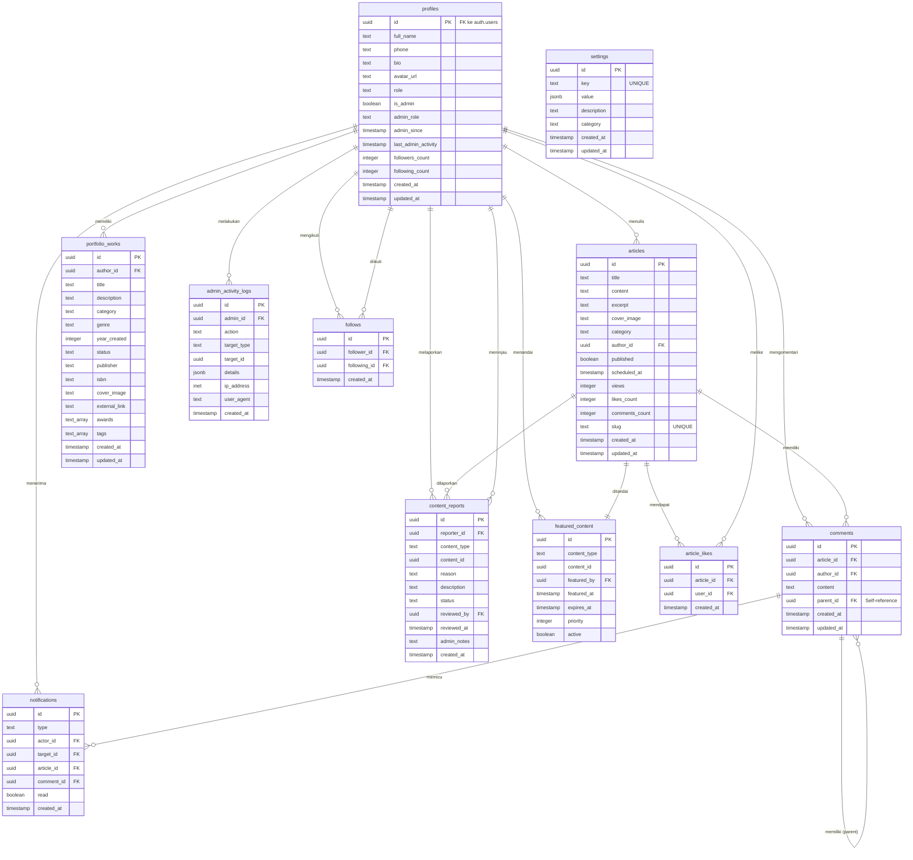
```mermaid
erDiagram
    profiles ||--o{ articles : "menulis"
    profiles ||--o{ comments : "mengomentari"
    profiles ||--o{ portfolio_works : "memiliki"
    profiles ||--o{ notifications : "menerima"
    profiles ||--o{ content_reports : "melaporkan"
    profiles ||--o{ featured_content : "menandai"
    profiles ||--o{ admin_activity_logs : "melakukan"
    
    articles ||--o{ comments : "memiliki"
    articles ||--o{ article_likes : "mendapat"
    articles ||--o{ content_reports : "dilaporkan"
    articles ||--|| featured_content : "ditandai"
    
    comments ||--o{ comments : "memiliki (parent)"
    comments ||--o{ notifications : "memicu"
    
    profiles ||--o{ article_likes : "melike"
    profiles ||--o{ follows : "mengikuti"
    profiles ||--o{ follows : "diikuti"
    
    profiles ||--o{ content_reports : "meninjau"

    profiles {
        uuid id PK "FK ke auth.users"
        text full_name
        text phone
        text bio
        text avatar_url
        text role
        boolean is_admin
        text admin_role
        timestamp admin_since
        timestamp last_admin_activity
        integer followers_count
        integer following_count
        timestamp created_at
        timestamp updated_at
    }

    articles {
        uuid id PK
        text title
        text content
        text excerpt
        text cover_image
        text category
        uuid author_id FK
        boolean published
        timestamp scheduled_at
        integer views
        integer likes_count
        integer comments_count
        text slug "UNIQUE"
        timestamp created_at
        timestamp updated_at
    }

    comments {
        uuid id PK
        uuid article_id FK
        uuid author_id FK
        text content
        uuid parent_id FK "Self-reference"
        timestamp created_at
        timestamp updated_at
    }

    article_likes {
        uuid id PK
        uuid article_id FK
        uuid user_id FK
        timestamp created_at
    }

    follows {
        uuid id PK
        uuid follower_id FK
        uuid following_id FK
        timestamp created_at
    }

    portfolio_works {
        uuid id PK
        uuid author_id FK
        text title
        text description
        text category
        text genre
        integer year_created
        text status
        text publisher
        text isbn
        text cover_image
        text external_link
        text_array awards
        text_array tags
        timestamp created_at
        timestamp updated_at
    }

    notifications {
        uuid id PK
        text type
        uuid actor_id FK
        uuid target_id FK
        uuid article_id FK
        uuid comment_id FK
        boolean read
        timestamp created_at
    }

    content_reports {
        uuid id PK
        uuid reporter_id FK
        text content_type
        uuid content_id
        text reason
        text description
        text status
        uuid reviewed_by FK
        timestamp reviewed_at
        text admin_notes
        timestamp created_at
    }

    featured_content {
        uuid id PK
        text content_type
        uuid content_id
        uuid featured_by FK
        timestamp featured_at
        timestamp expires_at
        integer priority
        boolean active
    }

    admin_activity_logs {
        uuid id PK
        uuid admin_id FK
        text action
        text target_type
        uuid target_id
        jsonb details
        inet ip_address
        text user_agent
        timestamp created_at
    }

    settings {
        uuid id PK
        text key "UNIQUE"
        jsonb value
        text description
        text category
        timestamp created_at
        timestamp updated_at
    }
```

> **Catatan:** Untuk visualisasi ERD yang lebih interaktif dan dapat diekspor sebagai gambar, gunakan file `ERD_PaberLand.md` yang berisi format dbdiagram.io, PlantUML, dan panduan lengkap lainnya. Atau gunakan placeholder screenshot: `bab4-erd.png`

#### **A. Entitas Utama dan Atribut Lengkap**

**1. ENTITAS: profiles**

Entitas `profiles` merupakan entitas sentral yang menyimpan informasi dasar semua pengguna platform. Entitas ini memiliki relasi dengan `auth.users` dari Supabase Auth melalui foreign key `id` yang juga berfungsi sebagai primary key.

**Atribut:**
- `id` (UUID, PK, FK ke `auth.users.id`) - Identifier unik pengguna yang sama dengan ID di sistem autentikasi
- `full_name` (TEXT, NOT NULL) - Nama lengkap pengguna
- `phone` (TEXT, NULLABLE) - Nomor telepon pengguna (opsional)
- `bio` (TEXT, NULLABLE) - Biografi singkat pengguna
- `avatar_url` (TEXT, NULLABLE) - URL gambar avatar pengguna yang disimpan di Supabase Storage
- `role` (TEXT, DEFAULT 'Penulis') - Peran pengguna dalam komunitas (Penulis, Ilustrator, Kreator Buku, Pekerja Buku) dengan CHECK constraint
- `is_admin` (BOOLEAN, DEFAULT false) - Flag untuk menandai apakah pengguna adalah administrator
- `admin_role` (TEXT, NULLABLE) - Peran admin khusus (super_admin, moderator) dengan CHECK constraint
- `admin_since` (TIMESTAMP WITH TIME ZONE, NULLABLE) - Tanggal kapan pengguna diangkat menjadi admin
- `last_admin_activity` (TIMESTAMP WITH TIME ZONE, NULLABLE) - Timestamp aktivitas admin terakhir
- `followers_count` (INTEGER, DEFAULT 0) - Jumlah pengikut (denormalisasi untuk performa)
- `following_count` (INTEGER, DEFAULT 0) - Jumlah yang diikuti (denormalisasi untuk performa)
- `created_at` (TIMESTAMP WITH TIME ZONE, NOT NULL, DEFAULT NOW()) - Timestamp pembuatan profil
- `updated_at` (TIMESTAMP WITH TIME ZONE, NOT NULL, DEFAULT NOW()) - Timestamp pembaruan terakhir profil

**Constraint:**
- Primary Key: `id`
- Foreign Key: `id` REFERENCES `auth.users(id)` ON DELETE CASCADE
- Check Constraint: `role IN ('Penulis', 'Ilustrator', 'Kreator Buku', 'Pekerja Buku')`
- Check Constraint: `admin_role IN ('super_admin', 'moderator')` atau NULL

**2. ENTITAS: articles**

Entitas `articles` menyimpan semua konten artikel yang dibuat oleh penulis. Setiap artikel harus memiliki penulis (author) dan dapat memiliki banyak komentar, like, dan laporan.

**Atribut:**
- `id` (UUID, PK, DEFAULT gen_random_uuid()) - Identifier unik artikel
- `title` (TEXT, NOT NULL) - Judul artikel
- `content` (TEXT, NOT NULL) - Konten artikel dalam format HTML dari TinyMCE editor
- `excerpt` (TEXT, NULLABLE, MAX 500 karakter) - Ringkasan artikel untuk preview
- `cover_image` (TEXT, NULLABLE) - URL gambar cover artikel
- `category` (TEXT, NOT NULL) - Kategori artikel dengan CHECK constraint: 'Info/Berita', 'Cerpen', 'Dongeng', 'Puisi', 'Cerita Rakyat', 'Novel', 'Cerbung', 'Cermin', 'Lainnya'
- `author_id` (UUID, FK ke `profiles.id`, NOT NULL) - Penulis artikel dengan ON DELETE CASCADE
- `published` (BOOLEAN, DEFAULT false) - Status publikasi artikel
- `scheduled_at` (TIMESTAMP WITH TIME ZONE, NULLABLE) - Jadwal publikasi otomatis di masa depan
- `views` (INTEGER, DEFAULT 0) - Jumlah views artikel (denormalisasi)
- `likes_count` (INTEGER, DEFAULT 0) - Jumlah like artikel (denormalisasi)
- `comments_count` (INTEGER, DEFAULT 0) - Jumlah komentar artikel (denormalisasi)
- `slug` (TEXT, UNIQUE) - URL-friendly identifier artikel untuk SEO
- `created_at` (TIMESTAMP WITH TIME ZONE, NOT NULL, DEFAULT NOW()) - Timestamp pembuatan artikel
- `updated_at` (TIMESTAMP WITH TIME ZONE, NOT NULL, DEFAULT NOW()) - Timestamp pembaruan terakhir artikel

**Constraint:**
- Primary Key: `id`
- Foreign Key: `author_id` REFERENCES `profiles(id)` ON DELETE CASCADE
- Unique Constraint: `slug` harus unik
- Check Constraint: `category` harus dalam daftar kategori yang valid

**Index:**
- `idx_articles_author_id` pada `author_id` untuk query artikel per penulis
- `idx_articles_category` pada `category` untuk filter kategori
- `idx_articles_published` pada `published` untuk query artikel yang dipublikasikan
- `idx_articles_created_at` pada `created_at DESC` untuk sorting artikel terbaru
- `idx_articles_slug` pada `slug` untuk pencarian artikel berdasarkan slug

**3. ENTITAS: comments**

Entitas `comments` menyimpan komentar berulir (threaded comments) pada artikel. Komentar dapat memiliki parent comment untuk membentuk struktur hierarkis.

**Atribut:**
- `id` (UUID, PK, DEFAULT gen_random_uuid()) - Identifier unik komentar
- `article_id` (UUID, FK ke `articles.id`, NOT NULL) - Artikel yang dikomentari dengan ON DELETE CASCADE
- `author_id` (UUID, FK ke `profiles.id`, NOT NULL) - Penulis komentar dengan ON DELETE CASCADE
- `content` (TEXT, NOT NULL) - Isi komentar
- `parent_id` (UUID, FK ke `comments.id`, NULLABLE) - Komentar parent untuk struktur berulir dengan ON DELETE CASCADE
- `created_at` (TIMESTAMP WITH TIME ZONE, NOT NULL, DEFAULT NOW()) - Timestamp pembuatan komentar
- `updated_at` (TIMESTAMP WITH TIME ZONE, NOT NULL, DEFAULT NOW()) - Timestamp pembaruan terakhir komentar

**Constraint:**
- Primary Key: `id`
- Foreign Key: `article_id` REFERENCES `articles(id)` ON DELETE CASCADE
- Foreign Key: `author_id` REFERENCES `profiles(id)` ON DELETE CASCADE
- Foreign Key: `parent_id` REFERENCES `comments(id)` ON DELETE CASCADE (self-referencing)

**Index:**
- `idx_comments_article_id` pada `article_id` untuk query komentar per artikel
- `idx_comments_author_id` pada `author_id` untuk query komentar per penulis
- `idx_comments_parent_id` pada `parent_id` untuk query komentar berulir

**4. ENTITAS: article_likes**

Entitas `article_likes` merupakan tabel junction yang menyimpan relasi many-to-many antara artikel dan pengguna yang memberikan like. Tabel ini memungkinkan satu artikel memiliki banyak like dari banyak pengguna, dan satu pengguna dapat memberikan like pada banyak artikel.

**Atribut:**
- `id` (UUID, PK, DEFAULT gen_random_uuid()) - Identifier unik like
- `article_id` (UUID, FK ke `articles.id`, NOT NULL) - Artikel yang dilike dengan ON DELETE CASCADE
- `user_id` (UUID, FK ke `profiles.id`, NOT NULL) - Pengguna yang memberikan like dengan ON DELETE CASCADE
- `created_at` (TIMESTAMP WITH TIME ZONE, DEFAULT NOW()) - Timestamp pemberian like

**Constraint:**
- Primary Key: `id`
- Foreign Key: `article_id` REFERENCES `articles(id)` ON DELETE CASCADE
- Foreign Key: `user_id` REFERENCES `profiles(id)` ON DELETE CASCADE
- Unique Constraint: `(article_id, user_id)` - Satu pengguna hanya dapat memberikan like sekali per artikel

**Index:**
- `idx_article_likes_article_id` pada `article_id` untuk query like per artikel
- `idx_article_likes_user_id` pada `user_id` untuk query artikel yang dilike oleh pengguna

**Trigger:**
- `trigger_update_article_likes_count` - Otomatis memperbarui `likes_count` di tabel `articles` ketika like ditambahkan atau dihapus

**5. ENTITAS: follows**

Entitas `follows` merupakan tabel junction yang menyimpan relasi many-to-many antara pengguna yang mengikuti (follower) dan pengguna yang diikuti (following). Tabel ini memungkinkan sistem follow antar penulis.

**Atribut:**
- `id` (UUID, PK, DEFAULT gen_random_uuid()) - Identifier unik relasi follow
- `follower_id` (UUID, FK ke `profiles.id`, NOT NULL) - Pengguna yang mengikuti dengan ON DELETE CASCADE
- `following_id` (UUID, FK ke `profiles.id`, NOT NULL) - Pengguna yang diikuti dengan ON DELETE CASCADE
- `created_at` (TIMESTAMP WITH TIME ZONE, DEFAULT NOW()) - Timestamp relasi follow dibuat

**Constraint:**
- Primary Key: `id`
- Foreign Key: `follower_id` REFERENCES `profiles(id)` ON DELETE CASCADE
- Foreign Key: `following_id` REFERENCES `profiles(id)` ON DELETE CASCADE
- Unique Constraint: `(follower_id, following_id)` - Satu pengguna hanya dapat mengikuti pengguna lain sekali
- Check Constraint: `follower_id != following_id` - Pengguna tidak dapat mengikuti dirinya sendiri

**Index:**
- `idx_follows_follower_id` pada `follower_id` untuk query siapa yang diikuti oleh pengguna
- `idx_follows_following_id` pada `following_id` untuk query siapa yang mengikuti pengguna

**Trigger:**
- `trigger_update_profile_follow_counts` - Otomatis memperbarui `followers_count` dan `following_count` di tabel `profiles` ketika follow ditambahkan atau dihapus
- `trigger_create_follow_notification` - Otomatis membuat notifikasi ketika ada pengguna baru yang mengikuti

**6. ENTITAS: portfolio_works**

Entitas `portfolio_works` menyimpan karya portofolio penulis yang dapat ditampilkan di profil publik. Karya portofolio dapat berupa buku, artikel eksternal, sertifikat, penghargaan, atau proyek lainnya.

**Atribut:**
- `id` (UUID, PK, DEFAULT gen_random_uuid()) - Identifier unik karya portofolio
- `author_id` (UUID, FK ke `profiles.id`, NOT NULL) - Pemilik karya dengan ON DELETE CASCADE
- `title` (TEXT, NOT NULL) - Judul karya
- `description` (TEXT, NULLABLE) - Deskripsi lengkap karya
- `category` (TEXT, NOT NULL) - Kategori karya dengan CHECK constraint: 'cerpen', 'puisi', 'artikel', 'cerita-rakyat', 'novel-berseri', 'buku', 'lainnya'
- `genre` (TEXT, NULLABLE) - Genre karya
- `year_created` (INTEGER, NULLABLE) - Tahun pembuatan karya
- `status` (TEXT, DEFAULT 'unpublished') - Status karya dengan CHECK constraint: 'published', 'unpublished', 'in_progress', 'completed'
- `publisher` (TEXT, NULLABLE) - Nama penerbit
- `isbn` (TEXT, NULLABLE) - ISBN jika karya adalah buku
- `cover_image` (TEXT, NULLABLE) - URL gambar cover karya
- `external_link` (TEXT, NULLABLE) - Tautan eksternal ke karya (jika ada)
- `awards` (TEXT[], NULLABLE) - Array penghargaan yang diterima
- `tags` (TEXT[], NULLABLE) - Array tag untuk kategorisasi
- `created_at` (TIMESTAMP WITH TIME ZONE, NOT NULL, DEFAULT NOW()) - Timestamp pembuatan karya
- `updated_at` (TIMESTAMP WITH TIME ZONE, NOT NULL, DEFAULT NOW()) - Timestamp pembaruan terakhir karya

**Constraint:**
- Primary Key: `id`
- Foreign Key: `author_id` REFERENCES `profiles(id)` ON DELETE CASCADE
- Check Constraint: `category` harus dalam daftar kategori yang valid
- Check Constraint: `status` harus dalam daftar status yang valid

**Index:**
- `idx_portfolio_works_author_id` pada `author_id` untuk query karya per penulis
- `idx_portfolio_works_category` pada `category` untuk filter kategori
- `idx_portfolio_works_status` pada `status` untuk filter status
- `idx_portfolio_works_created_at` pada `created_at DESC` untuk sorting karya terbaru

**Trigger:**
- `update_portfolio_works_updated_at` - Otomatis memperbarui `updated_at` ketika data karya diubah

**7. ENTITAS: notifications**

Entitas `notifications` menyimpan semua notifikasi sistem untuk pengguna, termasuk notifikasi follow, like, comment, dan mention.

**Atribut:**
- `id` (UUID, PK, DEFAULT gen_random_uuid()) - Identifier unik notifikasi
- `type` (TEXT, NOT NULL) - Tipe notifikasi dengan CHECK constraint: 'follow', 'like', 'comment', 'mention'
- `actor_id` (UUID, FK ke `profiles.id`, NOT NULL) - Pengguna yang melakukan aksi yang memicu notifikasi dengan ON DELETE CASCADE
- `target_id` (UUID, FK ke `profiles.id`, NOT NULL) - Pengguna yang menerima notifikasi dengan ON DELETE CASCADE
- `article_id` (UUID, FK ke `articles.id`, NULLABLE) - Artikel terkait (jika notifikasi terkait artikel) dengan ON DELETE CASCADE
- `comment_id` (UUID, FK ke `comments.id`, NULLABLE) - Komentar terkait (jika notifikasi terkait komentar) dengan ON DELETE CASCADE
- `read` (BOOLEAN, DEFAULT false) - Status apakah notifikasi sudah dibaca
- `created_at` (TIMESTAMP WITH TIME ZONE, NOT NULL, DEFAULT NOW()) - Timestamp pembuatan notifikasi

**Constraint:**
- Primary Key: `id`
- Foreign Key: `actor_id` REFERENCES `profiles(id)` ON DELETE CASCADE
- Foreign Key: `target_id` REFERENCES `profiles(id)` ON DELETE CASCADE
- Foreign Key: `article_id` REFERENCES `articles(id)` ON DELETE CASCADE
- Foreign Key: `comment_id` REFERENCES `comments(id)` ON DELETE CASCADE
- Check Constraint: `type` harus dalam daftar tipe yang valid

**Index:**
- `idx_notifications_target_id` pada `target_id` untuk query notifikasi per penerima
- `idx_notifications_actor_id` pada `actor_id` untuk query notifikasi per aktor
- `idx_notifications_created_at` pada `created_at DESC` untuk sorting notifikasi terbaru
- `idx_notifications_read` pada `read` untuk query notifikasi yang belum dibaca

**Trigger:**
- `trigger_create_follow_notification` - Otomatis membuat notifikasi ketika ada follow baru
- `trigger_create_like_notification` - Otomatis membuat notifikasi ketika ada like baru
- `trigger_create_comment_notification` - Otomatis membuat notifikasi ketika ada komentar baru

**8. ENTITAS: content_reports**

Entitas `content_reports` menyimpan laporan konten yang dibuat oleh pengguna terhadap artikel, komentar, atau pengguna lain yang dianggap melanggar aturan.

**Atribut:**
- `id` (UUID, PK, DEFAULT gen_random_uuid()) - Identifier unik laporan
- `reporter_id` (UUID, FK ke `profiles.id`, NOT NULL) - Pengguna yang melaporkan dengan ON DELETE CASCADE
- `content_type` (TEXT, NOT NULL) - Tipe konten yang dilaporkan dengan CHECK constraint: 'article', 'comment', 'user'
- `content_id` (UUID, NOT NULL) - ID konten yang dilaporkan (dapat merujuk ke artikel, komentar, atau profil)
- `reason` (TEXT, NOT NULL) - Alasan laporan dengan CHECK constraint: 'spam', 'inappropriate', 'harassment', 'copyright', 'other'
- `description` (TEXT, NULLABLE) - Deskripsi detail alasan laporan
- `status` (TEXT, DEFAULT 'pending') - Status laporan dengan CHECK constraint: 'pending', 'reviewed', 'resolved', 'dismissed'
- `reviewed_by` (UUID, FK ke `profiles.id`, NULLABLE) - Admin/moderator yang meninjau laporan dengan ON DELETE SET NULL
- `reviewed_at` (TIMESTAMP WITH TIME ZONE, NULLABLE) - Timestamp peninjauan laporan
- `admin_notes` (TEXT, NULLABLE) - Catatan admin tentang penanganan laporan
- `created_at` (TIMESTAMP WITH TIME ZONE, NOT NULL, DEFAULT NOW()) - Timestamp pembuatan laporan

**Constraint:**
- Primary Key: `id`
- Foreign Key: `reporter_id` REFERENCES `profiles(id)` ON DELETE CASCADE
- Foreign Key: `reviewed_by` REFERENCES `profiles(id)` ON DELETE SET NULL
- Check Constraint: `content_type` harus dalam daftar tipe yang valid
- Check Constraint: `reason` harus dalam daftar alasan yang valid
- Check Constraint: `status` harus dalam daftar status yang valid

**Index:**
- `idx_content_reports_status` pada `status` untuk filter laporan berdasarkan status
- `idx_content_reports_content_type` pada `content_type` untuk filter berdasarkan tipe konten
- `idx_content_reports_reporter_id` pada `reporter_id` untuk query laporan per pelapor
- `idx_content_reports_created_at` pada `created_at DESC` untuk sorting laporan terbaru

**9. ENTITAS: featured_content**

Entitas `featured_content` menyimpan daftar konten yang ditandai sebagai konten pilihan (featured) yang akan ditampilkan di homepage atau halaman khusus.

**Atribut:**
- `id` (UUID, PK, DEFAULT gen_random_uuid()) - Identifier unik featured content
- `content_type` (TEXT, NOT NULL) - Tipe konten yang di-featured dengan CHECK constraint: 'article', 'user'
- `content_id` (UUID, NOT NULL) - ID konten yang di-featured (dapat merujuk ke artikel atau profil)
- `featured_by` (UUID, FK ke `profiles.id`, NOT NULL) - Admin/moderator yang menandai sebagai featured dengan ON DELETE CASCADE
- `featured_at` (TIMESTAMP WITH TIME ZONE, NOT NULL, DEFAULT NOW()) - Timestamp konten di-featured
- `expires_at` (TIMESTAMP WITH TIME ZONE, NULLABLE) - Timestamp kapan featured content berakhir (jika ada)
- `priority` (INTEGER, DEFAULT 1) - Prioritas urutan tampilan (semakin tinggi semakin prioritas)
- `active` (BOOLEAN, DEFAULT true) - Status apakah featured content masih aktif

**Constraint:**
- Primary Key: `id`
- Foreign Key: `featured_by` REFERENCES `profiles(id)` ON DELETE CASCADE
- Unique Constraint: `(content_type, content_id)` - Satu konten hanya dapat di-featured sekali
- Check Constraint: `content_type` harus dalam daftar tipe yang valid

**Index:**
- `idx_featured_content_active` pada `active` untuk query featured content yang aktif
- `idx_featured_content_content_type` pada `content_type` untuk filter berdasarkan tipe
- `idx_featured_content_priority` pada `priority DESC` untuk sorting berdasarkan prioritas
- `idx_featured_content_featured_at` pada `featured_at DESC` untuk sorting berdasarkan waktu

**10. ENTITAS: admin_activity_logs**

Entitas `admin_activity_logs` menyimpan catatan lengkap semua aktivitas yang dilakukan oleh administrator dan moderator untuk keperluan audit trail dan compliance.

**Atribut:**
- `id` (UUID, PK, DEFAULT gen_random_uuid()) - Identifier unik log aktivitas
- `admin_id` (UUID, FK ke `profiles.id`, NOT NULL) - Admin/moderator yang melakukan aksi dengan ON DELETE CASCADE
- `action` (TEXT, NOT NULL) - Tipe aksi yang dilakukan (contoh: 'delete_article', 'ban_user', 'approve_report', 'feature_content')
- `target_type` (TEXT, NOT NULL) - Tipe target aksi (contoh: 'article', 'user', 'comment', 'report')
- `target_id` (UUID, NOT NULL) - ID target aksi
- `details` (JSONB, NULLABLE) - Detail tambahan aksi dalam format JSON (dapat menyimpan data sebelum dan sesudah perubahan)
- `ip_address` (INET, NULLABLE) - Alamat IP admin saat melakukan aksi
- `user_agent` (TEXT, NULLABLE) - User agent browser admin saat melakukan aksi
- `created_at` (TIMESTAMP WITH TIME ZONE, NOT NULL, DEFAULT NOW()) - Timestamp aktivitas dilakukan

**Constraint:**
- Primary Key: `id`
- Foreign Key: `admin_id` REFERENCES `profiles(id)` ON DELETE CASCADE

**Index:**
- `idx_admin_activity_logs_admin_id` pada `admin_id` untuk query log per admin
- `idx_admin_activity_logs_created_at` pada `created_at DESC` untuk sorting log terbaru
- `idx_admin_activity_logs_target_type` pada `target_type` untuk filter berdasarkan tipe target
- `idx_admin_activity_logs_action` pada `action` untuk filter berdasarkan tipe aksi

**11. ENTITAS: settings**

Entitas `settings` menyimpan konfigurasi platform yang dapat diubah oleh administrator melalui admin panel.

**Atribut:**
- `id` (UUID, PK, DEFAULT gen_random_uuid()) - Identifier unik setting
- `key` (TEXT, UNIQUE, NOT NULL) - Kunci setting (contoh: 'site_name', 'allow_registration', 'max_article_length')
- `value` (JSONB, NOT NULL) - Nilai setting dalam format JSON (dapat menyimpan berbagai tipe data)
- `description` (TEXT, NULLABLE) - Deskripsi setting untuk dokumentasi
- `category` (TEXT, NOT NULL, DEFAULT 'general') - Kategori setting (contoh: 'site', 'users', 'content', 'notifications')
- `created_at` (TIMESTAMP WITH TIME ZONE, DEFAULT NOW()) - Timestamp pembuatan setting
- `updated_at` (TIMESTAMP WITH TIME ZONE, DEFAULT NOW()) - Timestamp pembaruan terakhir setting

**Constraint:**
- Primary Key: `id`
- Unique Constraint: `key` harus unik

**Index:**
- `idx_settings_category` pada `category` untuk query setting per kategori
- `idx_settings_key` pada `key` untuk query setting berdasarkan kunci

#### **B. Relasi Antar Entitas dengan Cardinality**

**Relasi One-to-Many (1:N):**

1. **profiles (1) —— (N) articles**
   - Satu pengguna dapat membuat banyak artikel
   - Satu artikel hanya dimiliki oleh satu pengguna
   - Foreign Key: `articles.author_id` → `profiles.id`
   - On Delete: CASCADE (jika pengguna dihapus, semua artikelnya juga dihapus)

2. **profiles (1) —— (N) comments**
   - Satu pengguna dapat membuat banyak komentar
   - Satu komentar hanya dibuat oleh satu pengguna
   - Foreign Key: `comments.author_id` → `profiles.id`
   - On Delete: CASCADE

3. **profiles (1) —— (N) portfolio_works**
   - Satu pengguna dapat memiliki banyak karya portofolio
   - Satu karya portofolio hanya dimiliki oleh satu pengguna
   - Foreign Key: `portfolio_works.author_id` → `profiles.id`
   - On Delete: CASCADE

4. **profiles (1) —— (N) notifications** (sebagai target)
   - Satu pengguna dapat menerima banyak notifikasi
   - Satu notifikasi hanya ditujukan untuk satu pengguna
   - Foreign Key: `notifications.target_id` → `profiles.id`
   - On Delete: CASCADE

5. **profiles (1) —— (N) notifications** (sebagai actor)
   - Satu pengguna dapat menjadi aktor untuk banyak notifikasi
   - Satu notifikasi hanya memiliki satu aktor
   - Foreign Key: `notifications.actor_id` → `profiles.id`
   - On Delete: CASCADE

6. **profiles (1) —— (N) content_reports** (sebagai reporter)
   - Satu pengguna dapat membuat banyak laporan
   - Satu laporan hanya dibuat oleh satu pengguna
   - Foreign Key: `content_reports.reporter_id` → `profiles.id`
   - On Delete: CASCADE

7. **profiles (1) —— (N) content_reports** (sebagai reviewer)
   - Satu admin dapat meninjau banyak laporan
   - Satu laporan dapat ditinjau oleh satu admin (atau NULL jika belum ditinjau)
   - Foreign Key: `content_reports.reviewed_by` → `profiles.id`
   - On Delete: SET NULL (jika admin dihapus, laporan tetap ada tapi reviewer menjadi NULL)

8. **profiles (1) —— (N) featured_content**
   - Satu admin dapat menandai banyak konten sebagai featured
   - Satu featured content hanya ditandai oleh satu admin
   - Foreign Key: `featured_content.featured_by` → `profiles.id`
   - On Delete: CASCADE

9. **profiles (1) —— (N) admin_activity_logs**
   - Satu admin dapat melakukan banyak aktivitas
   - Satu log aktivitas hanya dicatat untuk satu admin
   - Foreign Key: `admin_activity_logs.admin_id` → `profiles.id`
   - On Delete: CASCADE

10. **articles (1) —— (N) comments**
    - Satu artikel dapat memiliki banyak komentar
    - Satu komentar hanya terkait dengan satu artikel
    - Foreign Key: `comments.article_id` → `articles.id`
    - On Delete: CASCADE

11. **articles (1) —— (N) article_likes**
    - Satu artikel dapat memiliki banyak like
    - Satu like hanya terkait dengan satu artikel
    - Foreign Key: `article_likes.article_id` → `articles.id`
    - On Delete: CASCADE

12. **articles (1) —— (N) notifications**
    - Satu artikel dapat memicu banyak notifikasi
    - Satu notifikasi dapat terkait dengan satu artikel (atau NULL)
    - Foreign Key: `notifications.article_id` → `articles.id`
    - On Delete: CASCADE

13. **comments (1) —— (N) comments** (self-referencing untuk threaded comments)
    - Satu komentar dapat memiliki banyak komentar balasan
    - Satu komentar balasan hanya memiliki satu komentar parent
    - Foreign Key: `comments.parent_id` → `comments.id`
    - On Delete: CASCADE

14. **comments (1) —— (N) notifications**
    - Satu komentar dapat memicu banyak notifikasi
    - Satu notifikasi dapat terkait dengan satu komentar (atau NULL)
    - Foreign Key: `notifications.comment_id` → `comments.id`
    - On Delete: CASCADE

**Relasi Many-to-Many (N:M):**

1. **profiles (N) —— (M) profiles** melalui `follows`
   - Satu pengguna dapat mengikuti banyak pengguna lain
   - Satu pengguna dapat diikuti oleh banyak pengguna lain
   - Junction Table: `follows`
   - Foreign Keys: `follows.follower_id` → `profiles.id`, `follows.following_id` → `profiles.id`
   - Unique Constraint: `(follower_id, following_id)` mencegah duplikasi follow

2. **articles (N) —— (M) profiles** melalui `article_likes`
   - Satu artikel dapat dilike oleh banyak pengguna
   - Satu pengguna dapat melike banyak artikel
   - Junction Table: `article_likes`
   - Foreign Keys: `article_likes.article_id` → `articles.id`, `article_likes.user_id` → `profiles.id`
   - Unique Constraint: `(article_id, user_id)` mencegah duplikasi like

**Relasi One-to-One (1:1):**

1. **articles (1) —— (1) featured_content**
   - Satu artikel dapat ditandai sebagai featured (maksimal satu kali)
   - Satu featured content hanya terkait dengan satu artikel
   - Unique Constraint: `(content_type, content_id)` pada `featured_content` memastikan satu konten hanya di-featured sekali

#### **C. Constraint dan Integritas Data**

**Primary Key Constraints:**
- Semua entitas memiliki primary key berupa UUID yang di-generate otomatis menggunakan `gen_random_uuid()`, kecuali `profiles` yang menggunakan `id` dari `auth.users`.

**Foreign Key Constraints:**
- Semua foreign key menggunakan `ON DELETE CASCADE` untuk memastikan data terkait juga terhapus ketika parent dihapus, kecuali `content_reports.reviewed_by` yang menggunakan `ON DELETE SET NULL` untuk mempertahankan data laporan meskipun admin yang meninjau dihapus.

**Unique Constraints:**
- `articles.slug` - Memastikan setiap artikel memiliki slug yang unik untuk SEO
- `article_likes(article_id, user_id)` - Mencegah satu pengguna memberikan like lebih dari sekali pada artikel yang sama
- `follows(follower_id, following_id)` - Mencegah duplikasi relasi follow
- `featured_content(content_type, content_id)` - Memastikan satu konten hanya di-featured sekali
- `settings.key` - Memastikan setiap setting memiliki kunci yang unik

**Check Constraints:**
- `profiles.role` - Memastikan role hanya dalam daftar yang valid
- `profiles.admin_role` - Memastikan admin_role hanya dalam daftar yang valid atau NULL
- `articles.category` - Memastikan kategori artikel hanya dalam daftar yang valid
- `portfolio_works.category` - Memastikan kategori portofolio hanya dalam daftar yang valid
- `portfolio_works.status` - Memastikan status portofolio hanya dalam daftar yang valid
- `notifications.type` - Memastikan tipe notifikasi hanya dalam daftar yang valid
- `content_reports.content_type` - Memastikan tipe konten yang dilaporkan hanya dalam daftar yang valid
- `content_reports.reason` - Memastikan alasan laporan hanya dalam daftar yang valid
- `content_reports.status` - Memastikan status laporan hanya dalam daftar yang valid
- `featured_content.content_type` - Memastikan tipe konten featured hanya dalam daftar yang valid

#### **D. Index untuk Optimasi Performa**

Index dibuat pada kolom yang sering digunakan dalam query, filter, dan sorting untuk meningkatkan performa database:

**Index pada tabel articles:**
- `idx_articles_author_id` - Untuk query artikel per penulis
- `idx_articles_category` - Untuk filter berdasarkan kategori
- `idx_articles_published` - Untuk query artikel yang dipublikasikan
- `idx_articles_created_at` - Untuk sorting artikel terbaru
- `idx_articles_slug` - Untuk pencarian artikel berdasarkan slug

**Index pada tabel comments:**
- `idx_comments_article_id` - Untuk query komentar per artikel
- `idx_comments_author_id` - Untuk query komentar per penulis
- `idx_comments_parent_id` - Untuk query komentar berulir

**Index pada tabel article_likes:**
- `idx_article_likes_article_id` - Untuk query like per artikel
- `idx_article_likes_user_id` - Untuk query artikel yang dilike oleh pengguna

**Index pada tabel follows:**
- `idx_follows_follower_id` - Untuk query siapa yang diikuti oleh pengguna
- `idx_follows_following_id` - Untuk query siapa yang mengikuti pengguna

**Index pada tabel portfolio_works:**
- `idx_portfolio_works_author_id` - Untuk query karya per penulis
- `idx_portfolio_works_category` - Untuk filter berdasarkan kategori
- `idx_portfolio_works_status` - Untuk filter berdasarkan status
- `idx_portfolio_works_created_at` - Untuk sorting karya terbaru

**Index pada tabel notifications:**
- `idx_notifications_target_id` - Untuk query notifikasi per penerima
- `idx_notifications_actor_id` - Untuk query notifikasi per aktor
- `idx_notifications_created_at` - Untuk sorting notifikasi terbaru
- `idx_notifications_read` - Untuk query notifikasi yang belum dibaca

**Index pada tabel content_reports:**
- `idx_content_reports_status` - Untuk filter berdasarkan status
- `idx_content_reports_content_type` - Untuk filter berdasarkan tipe konten
- `idx_content_reports_reporter_id` - Untuk query laporan per pelapor
- `idx_content_reports_created_at` - Untuk sorting laporan terbaru

**Index pada tabel featured_content:**
- `idx_featured_content_active` - Untuk query featured content yang aktif
- `idx_featured_content_content_type` - Untuk filter berdasarkan tipe
- `idx_featured_content_priority` - Untuk sorting berdasarkan prioritas
- `idx_featured_content_featured_at` - Untuk sorting berdasarkan waktu

**Index pada tabel admin_activity_logs:**
- `idx_admin_activity_logs_admin_id` - Untuk query log per admin
- `idx_admin_activity_logs_created_at` - Untuk sorting log terbaru
- `idx_admin_activity_logs_target_type` - Untuk filter berdasarkan tipe target
- `idx_admin_activity_logs_action` - Untuk filter berdasarkan tipe aksi

**Index pada tabel settings:**
- `idx_settings_category` - Untuk query setting per kategori
- `idx_settings_key` - Untuk query setting berdasarkan kunci

#### **E. Trigger dan Function untuk Otomasi**

**Trigger untuk Update Counter (Denormalisasi):**

1. **trigger_update_article_likes_count** pada `article_likes`
   - Function: `update_article_likes_count()`
   - Tujuan: Otomatis memperbarui `likes_count` di tabel `articles` ketika like ditambahkan atau dihapus
   - Event: AFTER INSERT OR DELETE

2. **trigger_update_profile_follow_counts** pada `follows`
   - Function: `update_profile_follow_counts()`
   - Tujuan: Otomatis memperbarui `followers_count` dan `following_count` di tabel `profiles` ketika follow ditambahkan atau dihapus
   - Event: AFTER INSERT OR DELETE

3. **trigger_update_article_comments_count** pada `comments`
   - Function: `update_article_comments_count()`
   - Tujuan: Otomatis memperbarui `comments_count` di tabel `articles` ketika komentar ditambahkan atau dihapus
   - Event: AFTER INSERT OR DELETE

4. **trigger_update_article_views** pada `articles`
   - Function: `increment_article_views()`
   - Tujuan: Otomatis memperbarui `views` di tabel `articles` ketika artikel dilihat
   - Event: AFTER UPDATE (conditional)

**Trigger untuk Notifikasi:**

1. **trigger_create_follow_notification** pada `follows`
   - Function: `create_follow_notification()`
   - Tujuan: Otomatis membuat notifikasi ketika ada pengguna baru yang mengikuti
   - Event: AFTER INSERT
   - Kondisi: Tidak membuat notifikasi jika pengguna mengikuti dirinya sendiri

2. **trigger_create_like_notification** pada `article_likes`
   - Function: `create_like_notification()`
   - Tujuan: Otomatis membuat notifikasi ketika artikel dilike
   - Event: AFTER INSERT
   - Kondisi: Tidak membuat notifikasi jika pengguna melike artikelnya sendiri

3. **trigger_create_comment_notification** pada `comments`
   - Function: `create_comment_notification()`
   - Tujuan: Otomatis membuat notifikasi ketika ada komentar baru pada artikel
   - Event: AFTER INSERT
   - Kondisi: Tidak membuat notifikasi jika pengguna mengomentari artikelnya sendiri

**Trigger untuk Timestamp:**

1. **update_portfolio_works_updated_at** pada `portfolio_works`
   - Function: `update_updated_at_column()`
   - Tujuan: Otomatis memperbarui `updated_at` ketika data karya portofolio diubah
   - Event: BEFORE UPDATE

#### **F. Row Level Security (RLS) Policies**

Semua tabel memiliki RLS enabled untuk memastikan keamanan data. Policy RLS memastikan bahwa pengguna hanya dapat mengakses data yang diizinkan sesuai dengan peran dan kepemilikan mereka.

**Policy untuk profiles:**
- Semua pengguna dapat membaca profil publik semua pengguna
- Pengguna hanya dapat mengedit profil mereka sendiri
- Admin dapat mengedit semua profil

**Policy untuk articles:**
- Semua pengguna dapat membaca artikel yang published
- Pengguna dapat membaca artikel mereka sendiri (termasuk draft)
- Pengguna hanya dapat membuat, mengedit, dan menghapus artikel mereka sendiri
- Admin dapat mengelola semua artikel

**Policy untuk comments:**
- Semua pengguna dapat membaca komentar pada artikel yang published
- Pengguna hanya dapat membuat komentar pada artikel yang published
- Pengguna hanya dapat mengedit dan menghapus komentar mereka sendiri
- Admin dapat mengelola semua komentar

**Policy untuk article_likes:**
- Semua pengguna dapat melihat semua like
- Pengguna hanya dapat memberikan like dengan `user_id` mereka sendiri
- Pengguna hanya dapat menghapus like mereka sendiri

**Policy untuk follows:**
- Semua pengguna dapat melihat semua relasi follow
- Pengguna hanya dapat membuat follow dengan `follower_id` mereka sendiri
- Pengguna hanya dapat menghapus follow mereka sendiri

**Policy untuk portfolio_works:**
- Semua pengguna dapat melihat semua karya portofolio
- Pengguna hanya dapat membuat, mengedit, dan menghapus karya portofolio mereka sendiri
- Admin dapat mengelola semua karya portofolio

**Policy untuk notifications:**
- Pengguna hanya dapat melihat notifikasi mereka sendiri (target_id = auth.uid())
- Pengguna hanya dapat mengupdate notifikasi mereka sendiri
- Sistem dapat membuat notifikasi untuk semua pengguna

**Policy untuk content_reports:**
- Pengguna hanya dapat membuat laporan dengan `reporter_id` mereka sendiri
- Pengguna hanya dapat melihat laporan mereka sendiri
- Admin dapat mengelola semua laporan

**Policy untuk featured_content:**
- Semua pengguna dapat melihat featured content yang aktif
- Hanya admin yang dapat mengelola featured content

**Policy untuk admin_activity_logs:**
- Hanya admin yang dapat melihat log aktivitas
- Sistem dapat membuat log aktivitas untuk semua admin

**Policy untuk settings:**
- Hanya admin yang dapat membaca, membuat, mengupdate, dan menghapus settings

#### **G. Normalisasi Database**

Database dirancang mengikuti prinsip normalisasi hingga Third Normal Form (3NF) untuk menghilangkan redundansi data dan memastikan integritas data:

**First Normal Form (1NF):**
- Semua atribut memiliki nilai atomik (tidak ada array atau nested structure, kecuali untuk kolom JSONB dan array yang sengaja digunakan untuk fleksibilitas)
- Setiap baris memiliki identifier unik (primary key)

**Second Normal Form (2NF):**
- Semua atribut non-key sepenuhnya bergantung pada primary key
- Tidak ada partial dependency

**Third Normal Form (3NF):**
- Tidak ada transitive dependency
- Semua atribut non-key hanya bergantung pada primary key, bukan pada atribut non-key lainnya

**Denormalisasi Selektif:**
Untuk optimasi performa, beberapa data di-denormalisasi:
- `articles.likes_count`, `articles.comments_count`, `articles.views` - Counter yang diperbarui melalui trigger untuk menghindari COUNT query yang mahal
- `profiles.followers_count`, `profiles.following_count` - Counter yang diperbarui melalui trigger untuk menghindari COUNT query yang mahal

#### **H. Skalabilitas dan Optimasi**

ERD dirancang dengan mempertimbangkan skalabilitas di masa depan:

1. **UUID sebagai Primary Key** - Memungkinkan distribusi data tanpa konflik ID
2. **Index Strategis** - Index dibuat pada kolom yang sering digunakan dalam query untuk meningkatkan performa
3. **Denormalisasi Selektif** - Counter di-denormalisasi untuk menghindari query COUNT yang mahal pada tabel besar
4. **Partitioning Ready** - Struktur tabel siap untuk partitioning berdasarkan timestamp jika diperlukan di masa depan
5. **JSONB untuk Data Fleksibel** - Kolom JSONB digunakan untuk data yang strukturnya dapat berubah (seperti `notifications.data`, `admin_activity_logs.details`, `settings.value`)

#### **I. Visualisasi ERD dengan Notasi Crow's Foot**

ERD PaberLand digambarkan menggunakan notasi Crow's Foot (IE Notation) yang merupakan standar industri untuk menggambarkan relasi database. Berikut adalah panduan lengkap untuk memvisualisasikan ERD:

**Layout dan Posisi Entitas:**

Diagram ERD diorganisir dalam tiga zona utama untuk memudahkan pembacaan:

**ZONA ATAS (Core Entities - Entitas Inti):**
- **profiles** - Posisi tengah atas sebagai entitas sentral
- **articles** - Posisi kiri atas, di bawah profiles
- **comments** - Posisi kanan atas, di bawah profiles

**ZONA TENGAH (Social & Interaction Entities):**
- **article_likes** - Posisi kiri tengah, di antara articles dan profiles
- **follows** - Posisi tengah, di bawah profiles
- **notifications** - Posisi kanan tengah, di antara comments dan profiles
- **portfolio_works** - Posisi kiri bawah zona tengah, di bawah articles

**ZONA BAWAH (Admin & Management Entities):**
- **content_reports** - Posisi kiri bawah
- **featured_content** - Posisi tengah bawah
- **admin_activity_logs** - Posisi kanan bawah
- **settings** - Posisi paling bawah tengah (opsional, dapat digabung dengan admin_activity_logs)

**Representasi Visual Entitas:**

Setiap entitas direpresentasikan sebagai kotak persegi panjang dengan tiga bagian:

**Bagian 1 (Atas): Nama Entitas**
- Ditulis dengan huruf tebal, huruf kecil dengan underscore (contoh: `profiles`, `articles`)
- Background berbeda atau border tebal untuk membedakan dari bagian lain

**Bagian 2 (Tengah): Atribut dengan Primary Key**
- Primary Key ditandai dengan garis bawah (underline) atau simbol (PK)
- Format: `id` (PK) untuk primary key
- Atribut lain ditulis tanpa garis bawah
- Atribut Foreign Key ditandai dengan (FK) di akhir

**Bagian 3 (Bawah): Atribut Tambahan (Opsional)**
- Atribut non-kunci penting atau constraint dapat ditambahkan di bagian bawah

**Contoh Representasi Entitas profiles:**

```
┌─────────────────────────────┐
│        profiles             │
├─────────────────────────────┤
│ id (PK, FK → auth.users)    │
│ full_name                   │
│ phone                       │
│ bio                         │
│ avatar_url                  │
│ role                        │
│ is_admin                    │
│ admin_role                  │
│ followers_count             │
│ following_count             │
│ created_at                  │
│ updated_at                  │
└─────────────────────────────┘
```

**Representasi Visual Relasi:**

Relasi digambarkan dengan garis yang menghubungkan entitas dengan simbol Crow's Foot di ujung-ujungnya:

**1. Relasi One-to-Many (1:N):**

```
profiles ──┐
           │
           │ (1)
           │
           ├───┐
           │   │
           │   └─── (N) articles
           │
           └───┐
               │
               └─── (N) comments
```

**Notasi Crow's Foot:**
- Sisi "One" (1): Garis lurus dengan garis tegak di ujung (│)
- Sisi "Many" (N): Garis dengan "crow's foot" (└─┐ atau ┌─┘)

**2. Relasi Many-to-Many (N:M) melalui Junction Table:**

```
profiles ──┐
           │
           │ (N)
           │
           ├───┐
           │   │
           │   └─── article_likes
           │        ┌─────────────┐
           │        │ article_id  │
           │        │ user_id     │
           │        │ created_at  │
           │        └─────────────┘
           │        │
           │        │ (M)
           │        │
           └────────┴─── articles
```

**3. Relasi Self-Referencing (Recursive):**

```
comments ──┐
           │
           │ (1)
           │
           ├───┐
           │   │
           │   └─── (N) comments
           │        (parent_id)
```

**Label Relasi:**

Setiap relasi diberi label yang menjelaskan hubungan:

**Relasi dari profiles:**
- `profiles` ──[menulis]──> `articles` (1:N)
- `profiles` ──[mengomentari]──> `comments` (1:N)
- `profiles` ──[memiliki]──> `portfolio_works` (1:N)
- `profiles` ──[menerima]──> `notifications` (1:N, sebagai target_id)
- `profiles` ──[melakukan]──> `notifications` (1:N, sebagai actor_id)
- `profiles` ──[melaporkan]──> `content_reports` (1:N, sebagai reporter_id)
- `profiles` ──[meninjau]──> `content_reports` (1:N, sebagai reviewed_by)
- `profiles` ──[menandai]──> `featured_content` (1:N)
- `profiles` ──[melakukan]──> `admin_activity_logs` (1:N)

**Relasi dari articles:**
- `articles` ──[memiliki]──> `comments` (1:N)
- `articles` ──[mendapat]──> `article_likes` (1:N)
- `articles` ──[dilaporkan]──> `content_reports` (1:N)
- `articles` ──[ditandai]──> `featured_content` (1:1)

**Relasi dari comments:**
- `comments` ──[memiliki]──> `comments` (1:N, self-referencing untuk threaded comments)
- `comments` ──[memicu]──> `notifications` (1:N)

**Relasi Many-to-Many:**
- `profiles` ──[mengikuti]──> `follows` ──[diikuti oleh]──> `profiles` (N:M)
- `articles` ──[dilike oleh]──> `article_likes` ──[melike]──> `profiles` (N:M)

**Simbol dan Notasi:**

1. **Primary Key (PK):** Ditandai dengan garis bawah (underline) atau label (PK)
2. **Foreign Key (FK):** Ditandai dengan label (FK) atau panah yang menunjuk ke entitas referensi
3. **Optional (Nullable):** Ditandai dengan (O) atau lingkaran di ujung relasi
4. **Mandatory (NOT NULL):** Ditandai dengan garis lurus di ujung relasi
5. **Cardinality:**
   - `1` = Exactly one (wajib)
   - `0..1` = Zero or one (opsional)
   - `N` atau `*` = Many (satu atau lebih)
   - `0..N` = Zero or many (opsional, bisa banyak)

**Contoh ERD Lengkap (Text Representation):**

```
                    ┌──────────────┐
                    │   profiles   │
                    │──────────────│
                    │ id (PK)      │
                    │ full_name    │
                    │ role         │
                    │ is_admin     │
                    └──────────────┘
                         │ │ │ │
         ┌────────────────┼─┼─┼─┼──────────────┐
         │                │ │ │ │              │
    [menulis]        [mengomentari]    [memiliki]    [menerima]
    (1)              (1)              (1)          (1)
         │                │ │ │ │              │
         │                │ │ │ │              │
    ┌────▼────┐      ┌────▼─▼─▼─▼────┐    ┌────▼────┐
    │articles │      │   comments    │    │portfolio│
    │─────────│      │───────────────│    │_works   │
    │ id (PK) │      │ id (PK)        │    │─────────│
    │ title   │      │ article_id(FK) │    │ id (PK) │
    │ content │      │ author_id (FK) │    │ title   │
    │ category│      │ parent_id (FK) │    │ category│
    └─────────┘      └────────────────┘    └─────────┘
         │ │                │
    [mendapat]        [memiliki]
    (1)              (1)
         │ │                │
    ┌────▼─▼────┐      ┌────▼────┐
    │article_   │      │comments │
    │likes      │      │(self-ref)│
    │───────────│      └──────────┘
    │article_id │
    │user_id    │
    └───────────┘
```

**Panduan Warna (Opsional untuk Visualisasi Digital):**

- **Entitas Core (profiles, articles, comments):** Background biru muda
- **Entitas Social (article_likes, follows, notifications):** Background hijau muda
- **Entitas Admin (content_reports, featured_content, admin_activity_logs, settings):** Background orange/kuning muda
- **Junction Tables (article_likes, follows):** Border tebal atau background berbeda

**Legenda Diagram:**

Diagram harus dilengkapi dengan legenda yang menjelaskan:
1. Simbol cardinality (1, N, 0..1, 0..N)
2. Notasi Primary Key (PK) dan Foreign Key (FK)
3. Simbol optional (O) dan mandatory (│)
4. Arah panah relasi (jika menggunakan panah)

**Tips Visualisasi:**

1. **Gunakan Tool ERD:** Disarankan menggunakan tool seperti:
   - Draw.io (diagrams.net)
   - Lucidchart
   - dbdiagram.io
   - MySQL Workbench
   - pgAdmin ERD Tool
   - Visual Paradigm

2. **Hindari Overlapping:** Pastikan garis relasi tidak saling tumpang tindih. Gunakan routing yang jelas.

3. **Grouping:** Kelompokkan entitas yang terkait secara fungsional dalam area yang sama.

4. **Spacing:** Berikan jarak yang cukup antar entitas untuk memudahkan pembacaan.

5. **Font:** Gunakan font monospace atau font yang jelas untuk atribut, dan font tebal untuk nama entitas.

6. **Size:** Sesuaikan ukuran kotak entitas dengan jumlah atribut, tetapi usahakan konsisten.

Dengan ERD yang komprehensif ini, tim dapat dengan cepat menurunkan blueprint migrasi database yang detail, termasuk definisi tabel, indeks, constraint, trigger, dan function. ERD ini juga menjadi dasar untuk pembuatan diagram kelas dalam tahap perancangan detail, di mana setiap entitas dalam ERD akan direpresentasikan sebagai kelas dalam diagram kelas. Dokumentasi ERD ini memastikan bahwa seluruh tim memiliki pemahaman yang sama tentang struktur data sistem, sehingga mengurangi risiko kesalahan implementasi dan memudahkan proses maintenance di masa depan.

ERD disusun menggunakan notasi Crow's Foot yang merupakan standar industri untuk menggambarkan relasi database. Diagram ini dirancang melalui proses iteratif yang melibatkan analisis kebutuhan, normalisasi database, dan optimasi performa. Proses perancangan dimulai dengan identifikasi entitas dan atribut dari use case dan kebutuhan fungsional, kemudian dilakukan normalisasi untuk menghilangkan redundansi data dan memastikan integritas referensial. Setelah itu, dilakukan optimasi dengan menambahkan indeks, denormalisasi selektif untuk performa, dan tabel pendukung untuk caching dan pencarian.

Selain sepuluh entitas utama, terdapat pula tabel pendukung yang disiapkan khusus untuk optimasi performa dan fungsionalitas tambahan. Tabel `article_views_cache` digunakan untuk menyimpan cache jumlah views artikel untuk mengurangi beban query pada tabel utama. Tabel ini diperbarui secara asinkron menggunakan trigger dan background job untuk memastikan data selalu up-to-date tanpa mempengaruhi performa query utama. Tabel `search_index` digunakan untuk menyimpan indeks pencarian full-text yang memungkinkan pencarian cepat pada judul, konten, dan excerpt artikel. Indeks ini dibangun menggunakan PostgreSQL GIN index dan diperbarui secara real-time ketika artikel baru dibuat atau diperbarui.

Tabel pendukung lainnya termasuk `session_store` untuk menyimpan data sesi pengguna, `email_queue` untuk mengantri email yang akan dikirim, dan `analytics_events` untuk menyimpan event analytics yang kemudian diproses secara batch. Tabel-tabel ini dirancang dengan mempertimbangkan pola akses data, volume data yang diharapkan, dan kebutuhan performa untuk memastikan bahwa sistem dapat menangani beban yang tinggi dengan baik.

ERD ini dirancang agar memudahkan penerapan Row Level Security (RLS) yang merupakan fitur keamanan penting dalam PostgreSQL. Setiap entitas yang menyimpan data pengguna memiliki kolom `owner` atau `recipient` yang mengidentifikasi pemilik atau penerima data, sehingga policy RLS dapat ditulis secara deklaratif. Sebagai contoh, policy untuk tabel `articles` memastikan bahwa pengguna hanya dapat membaca artikel yang published atau artikel mereka sendiri, sementara policy untuk tabel `comments` memastikan bahwa pengguna hanya dapat mengedit atau menghapus komentar mereka sendiri.

Penerapan RLS dilakukan melalui policy yang didefinisikan menggunakan SQL dan diterapkan pada level tabel. Policy ini dievaluasi setiap kali query dijalankan, memastikan bahwa pengguna hanya dapat mengakses data yang diizinkan untuk mereka akses. Sebagai contoh, policy untuk tabel `profiles` memastikan bahwa pengguna dapat membaca profil publik semua pengguna, tetapi hanya dapat mengedit profil mereka sendiri. Policy untuk tabel `admin_activity_logs` memastikan bahwa hanya admin yang dapat membaca log aktivitas, sementara pengguna biasa tidak dapat mengakses data ini sama sekali.

Penambahan entitas `admin_activity_logs` dilakukan setelah sesi audit keamanan yang dilakukan oleh tim keamanan eksternal. Audit ini mengidentifikasi bahwa histori tindakan moderator perlu dilacak secara permanen untuk memenuhi persyaratan compliance dan memudahkan investigasi jika terjadi masalah. Entitas ini dirancang untuk menyimpan informasi lengkap tentang setiap tindakan yang dilakukan oleh admin atau moderator, termasuk siapa yang melakukan tindakan, kapan tindakan dilakukan, apa yang dilakukan, dan data sebelum dan sesudah perubahan jika relevan.

Struktur ERD juga mempertimbangkan kebutuhan skalabilitas di masa depan. Setiap entitas dirancang dengan mempertimbangkan pola pertumbuhan data yang diharapkan, dan relasi antar entitas dirancang untuk meminimalkan join yang kompleks yang dapat memperlambat query. Sebagai contoh, relasi antara `articles` dan `article_likes` menggunakan tabel junction `article_likes` yang memungkinkan query yang efisien untuk menghitung jumlah like tanpa perlu join yang kompleks.

ERD juga mencakup constraint yang memastikan integritas data, termasuk foreign key constraint untuk memastikan referensial integrity, check constraint untuk memastikan nilai data dalam rentang yang valid, dan unique constraint untuk memastikan keunikan data tertentu. Sebagai contoh, constraint pada tabel `articles` memastikan bahwa slug artikel harus unik, sementara constraint pada tabel `article_likes` memastikan bahwa seorang pengguna hanya dapat memberikan like sekali pada setiap artikel.

Dengan ERD yang komprehensif ini, tim dapat dengan cepat menurunkan blueprint migrasi database yang detail, termasuk definisi tabel, indeks, constraint, trigger, dan function. ERD ini juga menjadi dasar untuk pembuatan diagram kelas dalam tahap perancangan detail, di mana setiap entitas dalam ERD akan direpresentasikan sebagai kelas dalam diagram kelas. Dokumentasi ERD ini memastikan bahwa seluruh tim memiliki pemahaman yang sama tentang struktur data sistem, sehingga mengurangi risiko kesalahan implementasi dan memudahkan proses maintenance di masa depan.

# **BAB 5 PERANCANGAN SISTEM** {#bab-5-perancangan-sistem}

Perancangan sistem berisi rancangan-rancangan sistem yang mempermudah proses pengembangan agar lebih efektif. Bab ini berisi rancangan struktur kelas yaitu class diagram, desain alur sistem dari sequence diagram, dan rancangan basis data berupa Physical Database Design (PDD).

## **5.1 Class Diagram** {#5.1-class-diagram}

Dalam perancangan class diagram pada platform PaberLand, menghasilkan beberapa class diagram yang menggambarkan struktur komponen sistem. Class diagram disusun berdasarkan arsitektur Next.js dengan App Router yang menggunakan komponen React, API Routes, dan integrasi dengan Supabase.

**Gambar 5.1 Rancangan Class Diagram Komponen Frontend**

Diagram ini menggambarkan struktur komponen React yang digunakan di frontend platform PaberLand. Class diagram frontend terdiri dari komponen-komponen utama meliputi:

- **Layout Components**: Header, Footer, Sidebar yang digunakan di seluruh halaman
- **Article Components**: ArticleCard, ArticleDetail, ArticleList untuk menampilkan artikel
- **Editor Components**: WriteArticleForm, TinyMCEEditor untuk penulisan artikel
- **Comment Components**: CommentList, CommentItem, CommentForm untuk sistem komentar
- **Profile Components**: ProfileCard, ProfileEdit untuk manajemen profil
- **Admin Components**: AdminSidebar, UserManagement, ContentModeration untuk panel admin
- **Auth Components**: LoginForm, RegisterForm untuk autentikasi pengguna

Setiap komponen memiliki props yang didefinisikan dengan TypeScript interface untuk memastikan type safety. Komponen-komponen ini saling berinteraksi melalui props passing dan context API untuk state management global seperti autentikasi.

> **Placeholder Diagram:** `bab5-class-diagram-frontend.png`  
> **Deskripsi:** Diagram menunjukkan struktur komponen React dengan props, state, dan relasi antar komponen. Setiap komponen ditampilkan sebagai kotak dengan nama class, atribut (props), dan method (event handlers). Relasi ditunjukkan dengan panah yang menggambarkan komposisi, agregasi, atau dependency.  
> **Catatan:** Kode Mermaid di bawah ini dapat digunakan untuk generate gambar diagram. Export dari [Mermaid Live Editor](https://mermaid.live) atau tool lain sebagai PNG dengan nama `bab5-class-diagram-frontend.png`.


```mermaid
classDiagram
    %% Layout Components
    class Header {
        +user: User | null
        +notifications: Notification[]
        +searchQuery: string
        +handleSearch(query: string): void
        +handleLogout(): void
        +render(): JSX.Element
    }
    
    class Footer {
        +render(): JSX.Element
    }
    
    class AdminSidebar {
        +pendingReports: number
        +activePath: string
        +handleNavigation(path: string): void
        +render(): JSX.Element
    }
    
    %% Article Components
    class ArticleCard {
        +article: Article
        +onClick(): void
        +render(): JSX.Element
    }
    
    class ArticleDetail {
        +article: Article
        +author: Profile
        +onLike(): void
        +onShare(): void
        +render(): JSX.Element
    }
    
    class ArticleList {
        +articles: Article[]
        +loading: boolean
        +onLoadMore(): void
        +render(): JSX.Element
    }
    
    class ArticleContent {
        +content: string
        +render(): JSX.Element
    }
    
    class ArticleLikeSection {
        +articleId: string
        +likesCount: number
        +isLiked: boolean
        +onLike(): void
        +render(): JSX.Element
    }
    
    class ArticleMetadata {
        +article: Article
        +author: Profile
        +render(): JSX.Element
    }
    
    class AuthorProfile {
        +author: Profile
        +articleCount: number
        +onFollow(): void
        +render(): JSX.Element
    }
    
    class LikeButton {
        +articleId: string
        +isLiked: boolean
        +likesCount: number
        +onToggle(): void
        +render(): JSX.Element
    }
    
    class RelatedArticles {
        +currentArticleId: string
        +category: string
        +articles: Article[]
        +render(): JSX.Element
    }
    
    class SocialShare {
        +article: Article
        +onShare(platform: string): void
        +render(): JSX.Element
    }
    
    %% Editor Components
    class WriteArticleForm {
        +articleId: string | null
        +title: string
        +content: string
        +category: string
        +coverImage: File | null
        +onSave(): void
        +onPublish(): void
        +onAutoSave(): void
        +render(): JSX.Element
    }
    
    class TinyMCEEditor {
        +value: string
        +onChange(content: string): void
        +onImageUpload(file: File): string
        +render(): JSX.Element
    }
    
    %% Comment Components
    class CommentList {
        +articleId: string
        +comments: Comment[]
        +onReply(commentId: string): void
        +render(): JSX.Element
    }
    
    class CommentItem {
        +comment: Comment
        +author: Profile
        +replies: Comment[]
        +onReply(): void
        +onDelete(): void
        +render(): JSX.Element
    }
    
    class CommentForm {
        +articleId: string
        +parentId: string | null
        +onSubmit(content: string): void
        +render(): JSX.Element
    }
    
    class CommentsSection {
        +articleId: string
        +comments: Comment[]
        +onCommentAdded(): void
        +render(): JSX.Element
    }
    
    %% Profile Components
    class ProfileCard {
        +profile: Profile
        +isOwnProfile: boolean
        +onEdit(): void
        +onFollow(): void
        +render(): JSX.Element
    }
    
    class ProfileEdit {
        +profile: Profile
        +onSave(profile: Profile): void
        +onAvatarUpload(file: File): void
        +render(): JSX.Element
    }
    
    %% Admin Components
    class UserManagement {
        +users: Profile[]
        +onUpdateRole(userId: string, role: string): void
        +onDeleteUser(userId: string): void
        +render(): JSX.Element
    }
    
    class ContentModeration {
        +reports: ContentReport[]
        +onResolve(reportId: string, action: string): void
        +render(): JSX.Element
    }
    
    %% Auth Components
    class LoginForm {
        +email: string
        +password: string
        +onSubmit(): void
        +onGoogleLogin(): void
        +render(): JSX.Element
    }
    
    class RegisterForm {
        +fullName: string
        +email: string
        +password: string
        +role: string
        +onSubmit(): void
        +render(): JSX.Element
    }
    
    %% Notification Components
    class NotificationSystem {
        +notifications: Notification[]
        +unreadCount: number
        +onMarkAsRead(id: string): void
        +render(): JSX.Element
    }
    
    %% Report Components
    class ReportButton {
        +contentId: string
        +contentType: string
        +onClick(): void
        +render(): JSX.Element
    }
    
    class ReportModal {
        +contentId: string
        +contentType: string
        +onSubmit(reason: string, description: string): void
        +onClose(): void
        +render(): JSX.Element
    }
    
    %% Relationships - Composition
    ArticleDetail *-- ArticleContent : contains
    ArticleDetail *-- ArticleLikeSection : contains
    ArticleDetail *-- ArticleMetadata : contains
    ArticleDetail *-- AuthorProfile : contains
    ArticleDetail *-- RelatedArticles : contains
    ArticleDetail *-- SocialShare : contains
    ArticleDetail *-- CommentsSection : contains
    
    ArticleList *-- ArticleCard : contains
    
    CommentsSection *-- CommentList : contains
    CommentList *-- CommentItem : contains
    CommentItem *-- CommentForm : contains
    
    WriteArticleForm *-- TinyMCEEditor : contains
    
    Header *-- NotificationSystem : contains
    
    %% Relationships - Dependency
    ArticleCard ..> ArticleDetail : navigates to
    CommentForm ..> CommentList : updates
    LikeButton ..> ArticleLikeSection : updates
    ReportButton ..> ReportModal : opens
    ProfileCard ..> ProfileEdit : navigates to
    
    %% Relationships - Usage
    ArticleDetail ..> LikeButton : uses
    ArticleDetail ..> ReportButton : uses
    AdminSidebar ..> UserManagement : navigates to
    AdminSidebar ..> ContentModeration : navigates to
```

**Gambar 5.2 Rancangan Class Diagram API Routes dan Services**

Diagram ini menggambarkan struktur API Routes dan service layer yang menghubungkan frontend dengan backend Supabase. Class diagram backend terdiri dari:

- **API Route Handlers**: Artikel API, User API, Comment API, Like API, Report API, Admin API
- **Service Classes**: ArticleService, UserService, CommentService, NotificationService, AdminService
- **Utility Classes**: AuthHelper, ValidationHelper, ImageUploadHelper
- **Database Models**: TypeScript interfaces yang merepresentasikan struktur tabel database

Setiap API route handler menggunakan service class untuk melakukan operasi database melalui Supabase client. Service class mengabstraksi logika bisnis dan query database, sementara API route handler menangani HTTP request dan response.

> **Placeholder Diagram:** `bab5-class-diagram-backend.png`  
> **Deskripsi:** Diagram menunjukkan struktur API routes, service classes, dan database models dengan relasi dependency. Setiap class ditampilkan dengan method-method utama seperti create, read, update, delete, dan method khusus sesuai fungsionalitas. Relasi dependency ditunjukkan dengan panah putus-putus.  
> **Catatan:** Kode Mermaid di bawah ini dapat digunakan untuk generate gambar diagram. Export dari [Mermaid Live Editor](https://mermaid.live) atau tool lain sebagai PNG dengan nama `bab5-class-diagram-backend.png`.


```mermaid
classDiagram
    %% API Route Handlers
    class ArticleAPI {
        +GET /api/articles: getArticles()
        +GET /api/articles/[id]: getArticleById()
        +GET /api/articles/[slug]: getArticleBySlug()
        +POST /api/articles: createArticle()
        +PATCH /api/articles/[id]: updateArticle()
        +DELETE /api/articles/[id]: deleteArticle()
        +POST /api/articles/[id]/like: toggleLike()
        +GET /api/articles/featured: getFeaturedArticles()
    }
    
    class UserAPI {
        +GET /api/users: getUsers()
        +GET /api/users/[id]: getUserById()
        +GET /api/profile/[id]: getProfile()
        +PATCH /api/profile: updateProfile()
        +POST /api/users/[id]/follow: followUser()
        +DELETE /api/users/[id]/follow: unfollowUser()
    }
    
    class CommentAPI {
        +GET /api/articles/[id]/comments: getComments()
        +POST /api/articles/[id]/comments: createComment()
        +PATCH /api/comments/[id]: updateComment()
        +DELETE /api/comments/[id]: deleteComment()
    }
    
    class LikeAPI {
        +POST /api/articles/[id]/like: toggleLike()
        +GET /api/articles/[id]/likes: getLikes()
    }
    
    class ReportAPI {
        +POST /api/reports: createReport()
        +GET /api/reports: getReports()
        +PATCH /api/reports/[id]: updateReport()
    }
    
    class AdminAPI {
        +GET /api/admin/users: getUsers()
        +PATCH /api/admin/users/[id]/role: updateUserRole()
        +DELETE /api/admin/users/[id]: deleteUser()
        +GET /api/admin/reports: getReports()
        +PATCH /api/admin/reports/[id]: resolveReport()
        +GET /api/admin/analytics: getAnalytics()
        +POST /api/admin/featured: addFeatured()
    }
    
    class SearchAPI {
        +GET /api/search: searchContent()
    }
    
    class SettingsAPI {
        +GET /api/settings: getSettings()
        +PATCH /api/settings: updateSettings()
    }
    
    %% Service Classes
    class ArticleService {
        +getArticles(filters): Promise~Article[]~
        +getArticleById(id): Promise~Article~
        +getArticleBySlug(slug): Promise~Article~
        +createArticle(data): Promise~Article~
        +updateArticle(id, data): Promise~Article~
        +deleteArticle(id): Promise~void~
        +getFeaturedArticles(): Promise~Article[]~
        +getRelatedArticles(articleId, category): Promise~Article[]~
        +incrementViews(articleId): Promise~void~
    }
    
    class UserService {
        +getUsers(filters): Promise~Profile[]~
        +getUserById(id): Promise~Profile~
        +updateProfile(id, data): Promise~Profile~
        +followUser(userId, targetId): Promise~void~
        +unfollowUser(userId, targetId): Promise~void~
        +getFollowers(userId): Promise~Profile[]~
        +getFollowing(userId): Promise~Profile[]~
    }
    
    class CommentService {
        +getComments(articleId): Promise~Comment[]~
        +createComment(articleId, content, parentId): Promise~Comment~
        +updateComment(id, content): Promise~Comment~
        +deleteComment(id): Promise~void~
    }
    
    class NotificationService {
        +getNotifications(userId): Promise~Notification[]~
        +markAsRead(notificationId): Promise~void~
        +createNotification(data): Promise~Notification~
        +createLikeNotification(articleId, userId): Promise~void~
        +createCommentNotification(articleId, userId): Promise~void~
    }
    
    class AdminService {
        +getAllUsers(filters): Promise~Profile[]~
        +updateUserRole(userId, role): Promise~void~
        +deleteUser(userId): Promise~void~
        +getReports(filters): Promise~Report[]~
        +resolveReport(reportId, action): Promise~void~
        +getAnalytics(period): Promise~Analytics~
        +addFeaturedContent(articleId, priority): Promise~void~
    }
    
    class SearchService {
        +search(query, type, filters): Promise~SearchResult[]~
        +searchArticles(query): Promise~Article[]~
        +searchUsers(query): Promise~Profile[]~
        +searchCategories(query): Promise~Category[]~
    }
    
    %% Utility Classes
    class AuthHelper {
        +getCurrentUser(): Promise~User | null~
        +verifyAuth(): Promise~User~
        +checkAdminRole(userId): Promise~boolean~
        +checkOwnership(userId, resourceId): Promise~boolean~
    }
    
    class ValidationHelper {
        +validateArticle(data): ValidationResult~
        +validateComment(content): ValidationResult~
        +validateProfile(data): ValidationResult~
        +sanitizeInput(input): string~
    }
    
    class ImageUploadHelper {
        +uploadImage(file, folder): Promise~string | null~
        +getSignedUrl(filePath): Promise~string | null~
        +deleteImage(filePath): Promise~void~
        +validateImageFile(file): boolean~
    }
    
    class SlugHelper {
        +generateSlug(title): string~
        +checkSlugExists(slug): Promise~boolean~
    }
    
    %% Database Models (TypeScript Interfaces)
    class ArticleModel {
        +id: string
        +title: string
        +content: string
        +excerpt: string
        +category: string
        +author_id: string
        +published: boolean
        +slug: string
        +views: number
        +likes_count: number
        +comments_count: number
    }
    
    class ProfileModel {
        +id: string
        +full_name: string
        +email: string
        +bio: string | null
        +avatar_url: string | null
        +role: string
        +is_admin: boolean
    }
    
    class CommentModel {
        +id: string
        +article_id: string
        +author_id: string
        +content: string
        +parent_id: string | null
    }
    
    class NotificationModel {
        +id: string
        +type: string
        +actor_id: string
        +target_id: string
        +read: boolean
    }
    
    class ReportModel {
        +id: string
        +content_id: string
        +content_type: string
        +reporter_id: string
        +reason: string
        +status: string
    }
    
    %% Supabase Client
    class SupabaseClient {
        +from(table): QueryBuilder~
        +auth: AuthClient
        +storage: StorageClient
        +rpc(functionName, params): Promise~any~
    }
    
    %% Relationships - API Routes use Services
    ArticleAPI ..> ArticleService : uses
    UserAPI ..> UserService : uses
    CommentAPI ..> CommentService : uses
    LikeAPI ..> ArticleService : uses
    ReportAPI ..> AdminService : uses
    AdminAPI ..> AdminService : uses
    SearchAPI ..> SearchService : uses
    SettingsAPI ..> AdminService : uses
    
    %% Relationships - Services use Utilities
    ArticleService ..> AuthHelper : uses
    ArticleService ..> ValidationHelper : uses
    ArticleService ..> ImageUploadHelper : uses
    ArticleService ..> SlugHelper : uses
    UserService ..> AuthHelper : uses
    UserService ..> ValidationHelper : uses
    UserService ..> ImageUploadHelper : uses
    CommentService ..> AuthHelper : uses
    CommentService ..> ValidationHelper : uses
    CommentService ..> NotificationService : uses
    AdminService ..> AuthHelper : uses
    NotificationService ..> UserService : uses
    
    %% Relationships - Services use Database Models
    ArticleService ..> ArticleModel : uses
    UserService ..> ProfileModel : uses
    CommentService ..> CommentModel : uses
    NotificationService ..> NotificationModel : uses
    AdminService ..> ReportModel : uses
    
    %% Relationships - Services use Supabase Client
    ArticleService ..> SupabaseClient : uses
    UserService ..> SupabaseClient : uses
    CommentService ..> SupabaseClient : uses
    NotificationService ..> SupabaseClient : uses
    AdminService ..> SupabaseClient : uses
    SearchService ..> SupabaseClient : uses
```

**Gambar 5.3 Rancangan Class Diagram Database Models**

Diagram ini menggambarkan struktur model data yang merepresentasikan entitas dalam database PostgreSQL. Setiap model sesuai dengan tabel dalam ERD yang telah dibuat pada BAB 4. Model-model utama meliputi:

- **Profile Model**: Merepresentasikan tabel profiles dengan atribut id, full_name, bio, role, is_admin, dll.
- **Article Model**: Merepresentasikan tabel articles dengan atribut id, title, content, category, author_id, published, dll.
- **Comment Model**: Merepresentasikan tabel comments dengan atribut id, article_id, author_id, content, parent_id, dll.
- **Like Model**: Merepresentasikan tabel article_likes dengan atribut id, article_id, user_id
- **Follow Model**: Merepresentasikan tabel follows dengan atribut id, follower_id, following_id
- **Portfolio Model**: Merepresentasikan tabel portfolio_works dengan atribut lengkap
- **Notification Model**: Merepresentasikan tabel notifications dengan atribut type, actor_id, target_id, dll.
- **Report Model**: Merepresentasikan tabel content_reports dengan atribut lengkap
- **FeaturedContent Model**: Merepresentasikan tabel featured_content
- **AdminActivityLog Model**: Merepresentasikan tabel admin_activity_logs
- **Settings Model**: Merepresentasikan tabel settings

Setiap model memiliki method untuk validasi, transformasi data, dan relasi dengan model lain sesuai dengan foreign key di database.

> **Placeholder Diagram:** `bab5-class-diagram-models.png`  
> **Deskripsi:** Diagram menunjukkan struktur model data dengan atribut lengkap dan relasi antar model. Relasi one-to-many dan many-to-many ditunjukkan dengan panah dan cardinality. Setiap model ditampilkan sebagai kotak dengan nama class, atribut (sesuai kolom database), dan method helper.  
> **Catatan:** Kode Mermaid di bawah ini dapat digunakan untuk generate gambar diagram. Export dari [Mermaid Live Editor](https://mermaid.live) atau tool lain sebagai PNG dengan nama `bab5-class-diagram-models.png`.

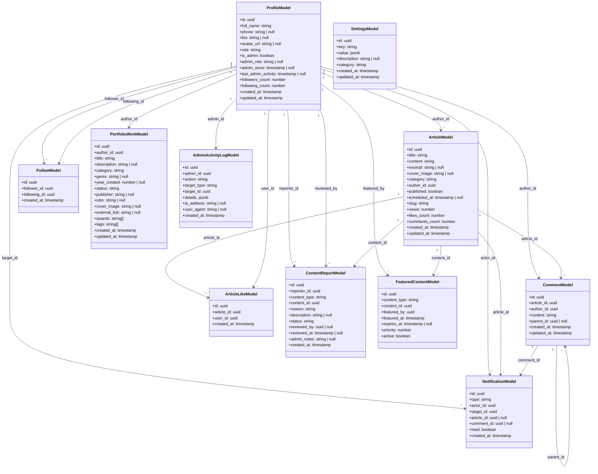
```mermaid
classDiagram
    %% Core Models
    class ProfileModel {
        +id: uuid
        +full_name: string
        +phone: string | null
        +bio: string | null
        +avatar_url: string | null
        +role: string
        +is_admin: boolean
        +admin_role: string | null
        +admin_since: timestamp | null
        +last_admin_activity: timestamp | null
        +followers_count: number
        +following_count: number
        +created_at: timestamp
        +updated_at: timestamp
    }
    
    class ArticleModel {
        +id: uuid
        +title: string
        +content: string
        +excerpt: string | null
        +cover_image: string | null
        +category: string
        +author_id: uuid
        +published: boolean
        +scheduled_at: timestamp | null
        +slug: string
        +views: number
        +likes_count: number
        +comments_count: number
        +created_at: timestamp
        +updated_at: timestamp
    }
    
    class CommentModel {
        +id: uuid
        +article_id: uuid
        +author_id: uuid
        +content: string
        +parent_id: uuid | null
        +created_at: timestamp
        +updated_at: timestamp
    }
    
    class ArticleLikeModel {
        +id: uuid
        +article_id: uuid
        +user_id: uuid
        +created_at: timestamp
    }
    
    class FollowModel {
        +id: uuid
        +follower_id: uuid
        +following_id: uuid
        +created_at: timestamp
    }
    
    class PortfolioWorkModel {
        +id: uuid
        +author_id: uuid
        +title: string
        +description: string | null
        +category: string
        +genre: string | null
        +year_created: number | null
        +status: string
        +publisher: string | null
        +isbn: string | null
        +cover_image: string | null
        +external_link: string | null
        +awards: string[]
        +tags: string[]
        +created_at: timestamp
        +updated_at: timestamp
    }
    
    class NotificationModel {
        +id: uuid
        +type: string
        +actor_id: uuid
        +target_id: uuid
        +article_id: uuid | null
        +comment_id: uuid | null
        +read: boolean
        +created_at: timestamp
    }
    
    class ContentReportModel {
        +id: uuid
        +reporter_id: uuid
        +content_type: string
        +content_id: uuid
        +reason: string
        +description: string | null
        +status: string
        +reviewed_by: uuid | null
        +reviewed_at: timestamp | null
        +admin_notes: string | null
        +created_at: timestamp
    }
    
    class FeaturedContentModel {
        +id: uuid
        +content_type: string
        +content_id: uuid
        +featured_by: uuid
        +featured_at: timestamp
        +expires_at: timestamp | null
        +priority: number
        +active: boolean
    }
    
    class AdminActivityLogModel {
        +id: uuid
        +admin_id: uuid
        +action: string
        +target_type: string
        +target_id: uuid
        +details: jsonb
        +ip_address: string | null
        +user_agent: string | null
        +created_at: timestamp
    }
    
    class SettingsModel {
        +id: uuid
        +key: string
        +value: jsonb
        +description: string | null
        +category: string
        +created_at: timestamp
        +updated_at: timestamp
    }
    
    %% Relationships - One-to-Many
    ProfileModel "1" --> "*" ArticleModel : author_id
    ProfileModel "1" --> "*" CommentModel : author_id
    ProfileModel "1" --> "*" PortfolioWorkModel : author_id
    ProfileModel "1" --> "*" NotificationModel : target_id
    ProfileModel "1" --> "*" NotificationModel : actor_id
    ProfileModel "1" --> "*" ContentReportModel : reporter_id
    ProfileModel "1" --> "*" ContentReportModel : reviewed_by
    ProfileModel "1" --> "*" FeaturedContentModel : featured_by
    ProfileModel "1" --> "*" AdminActivityLogModel : admin_id
    
    ArticleModel "1" --> "*" CommentModel : article_id
    ArticleModel "1" --> "*" ArticleLikeModel : article_id
    ArticleModel "1" --> "*" NotificationModel : article_id
    ArticleModel "1" --> "*" ContentReportModel : content_id
    ArticleModel "1" --> "*" FeaturedContentModel : content_id
    
    CommentModel "1" --> "*" CommentModel : parent_id
    CommentModel "1" --> "*" NotificationModel : comment_id
    
    ProfileModel "1" --> "*" ArticleLikeModel : user_id
    ProfileModel "1" --> "*" FollowModel : follower_id
    ProfileModel "1" --> "*" FollowModel : following_id
```

## **5.2 Sequence Diagram** {#5.2-sequence-diagram}

Sequence diagram menjelaskan interaksi yang dilakukan antar objek satu sama lain dalam suatu urutan waktu tertentu. Dalam penelitian ini, pembuatan sequence diagram mengacu pada use case scenario yang telah dibuat pada BAB 4 dan class diagram yang telah dirancang. Sequence diagram menggambarkan alur komunikasi antara komponen frontend (React components), API routes, service layer, dan database (Supabase) untuk setiap use case utama.

### **5.2.1 Sequence Diagram Daftar Akun** {#5.2.1-sequence-diagram-register}

Gambaran proses interaksi antar sistem saat pengunjung akan mendaftar akun baru dapat diamati pada Gambar 5.4. Sequence diagram ini menggambarkan alur registrasi dengan email verification.

**Gambar 5.4 Sequence Diagram Daftar Akun**

> **Placeholder Diagram:** `bab5-sequence-register.png`  
> **Deskripsi:** Diagram menunjukkan interaksi antara User, RegisterForm Component, AuthContext, Supabase Auth API, dan Database. Alur dimulai dari user membuka halaman register, user mengisi form (nama, email, password, konfirmasi password, peran), RegisterForm melakukan validasi client-side, RegisterForm memanggil AuthContext.signUp(), AuthContext memanggil Supabase Auth API signUp(), Supabase membuat user di auth.users, Supabase mengirim email verifikasi, Supabase membuat record di tabel profiles melalui trigger, AuthContext menyimpan session sementara, RegisterForm menampilkan pesan "Silakan cek email untuk verifikasi", user membuka email dan klik link verifikasi, Supabase memverifikasi token, Supabase mengaktifkan user, dan sistem mengarahkan user ke halaman login.  
> **Catatan:** Kode Mermaid di bawah ini dapat digunakan untuk generate gambar diagram. Export dari [Mermaid Live Editor](https://mermaid.live) atau tool lain sebagai PNG dengan nama `bab5-sequence-register.png`.

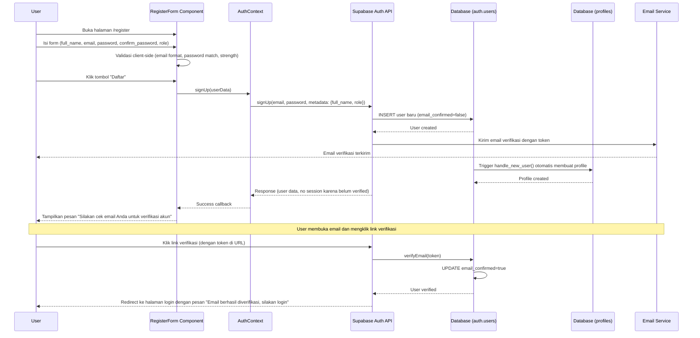
```mermaid
sequenceDiagram
    participant User
    participant RegisterForm as RegisterForm Component
    participant AuthContext
    participant SupabaseAuth as Supabase Auth API
    participant AuthDB as Database (auth.users)
    participant ProfilesDB as Database (profiles)
    participant EmailService as Email Service
    
    User->>RegisterForm: Buka halaman /register
    User->>RegisterForm: Isi form (full_name, email, password, confirm_password, role)
    RegisterForm->>RegisterForm: Validasi client-side (email format, password match, strength)
    User->>RegisterForm: Klik tombol "Daftar"
    RegisterForm->>AuthContext: signUp(userData)
    AuthContext->>SupabaseAuth: signUp(email, password, metadata: {full_name, role})
    SupabaseAuth->>AuthDB: INSERT user baru (email_confirmed=false)
    AuthDB-->>SupabaseAuth: User created
    SupabaseAuth->>EmailService: Kirim email verifikasi dengan token
    EmailService-->>User: Email verifikasi terkirim
    AuthDB->>ProfilesDB: Trigger handle_new_user() otomatis membuat profile
    ProfilesDB-->>AuthDB: Profile created
    SupabaseAuth-->>AuthContext: Response (user data, no session karena belum verified)
    AuthContext-->>RegisterForm: Success callback
    RegisterForm-->>User: Tampilkan pesan "Silakan cek email Anda untuk verifikasi akun"
    
    Note over User,EmailService: User membuka email dan mengklik link verifikasi
    
    User->>SupabaseAuth: Klik link verifikasi (dengan token di URL)
    SupabaseAuth->>AuthDB: verifyEmail(token)
    AuthDB->>AuthDB: UPDATE email_confirmed=true
    AuthDB-->>SupabaseAuth: User verified
    SupabaseAuth-->>User: Redirect ke halaman login dengan pesan "Email berhasil diverifikasi, silakan login"
```

**Alur Proses:**
1. User membuka halaman `/register` dan melihat form registrasi
2. User mengisi form dengan data: full_name, email, password, confirm_password, role
3. RegisterForm component melakukan validasi client-side (email format, password match, password strength)
4. User klik tombol "Daftar"
5. RegisterForm memanggil AuthContext.signUp(userData)
6. AuthContext memanggil Supabase Auth API signUp() dengan email, password, dan metadata (full_name, role)
7. Supabase Auth membuat user baru di tabel auth.users dengan status email_confirmed=false
8. Supabase Auth mengirim email verifikasi ke alamat email yang didaftarkan
9. Trigger database `handle_new_user()` otomatis membuat record di tabel profiles dengan data dari metadata
10. Supabase Auth mengembalikan response dengan user data (tanpa session karena belum verified)
11. AuthContext menampilkan pesan sukses
12. RegisterForm menampilkan pesan "Silakan cek email Anda untuk verifikasi akun"
13. User membuka email dan mengklik link verifikasi
14. Link verifikasi mengarah ke halaman verifikasi dengan token
15. Sistem memanggil Supabase Auth API verifyEmail(token)
16. Supabase memverifikasi token dan mengaktifkan user (email_confirmed=true)
17. Sistem mengarahkan user ke halaman login dengan pesan "Email berhasil diverifikasi, silakan login"

### **5.2.2 Sequence Diagram Login** {#5.2.2-sequence-diagram-login}

Gambaran proses interaksi antar sistem saat pengguna akan melakukan login dapat diamati pada Gambar 5.5. Sequence diagram login menggambarkan alur autentikasi menggunakan email/password atau Google OAuth melalui Supabase Auth.

**Gambar 5.5 Sequence Diagram Login**

> **Placeholder Diagram:** `bab5-sequence-login.png`  
> **Deskripsi:** Diagram menunjukkan interaksi antara User, LoginForm Component, AuthContext, Supabase Auth API, dan Database. Alur dimulai dari user memasukkan kredensial, LoginForm memanggil AuthContext.signIn(), AuthContext memanggil Supabase Auth API, Supabase memverifikasi kredensial dengan database, mengembalikan session token, AuthContext menyimpan session, dan LoginForm mengarahkan user ke halaman sesuai peran. Untuk Google OAuth, alur serupa namun menggunakan OAuth provider.  
> **Catatan:** Kode Mermaid di bawah ini dapat digunakan untuk generate gambar diagram. Export dari [Mermaid Live Editor](https://mermaid.live) atau tool lain sebagai PNG dengan nama `bab5-sequence-login.png`.

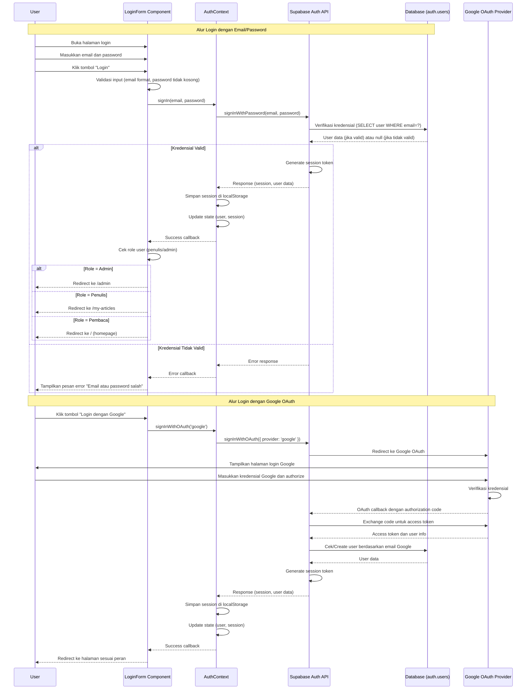
```mermaid
sequenceDiagram
    participant User
    participant LoginForm as LoginForm Component
    participant AuthContext
    participant SupabaseAuth as Supabase Auth API
    participant AuthDB as Database (auth.users)
    participant GoogleOAuth as Google OAuth Provider
    
    Note over User,AuthDB: Alur Login dengan Email/Password
    User->>LoginForm: Buka halaman login
    User->>LoginForm: Masukkan email dan password
    User->>LoginForm: Klik tombol "Login"
    LoginForm->>LoginForm: Validasi input (email format, password tidak kosong)
    LoginForm->>AuthContext: signIn(email, password)
    AuthContext->>SupabaseAuth: signInWithPassword(email, password)
    SupabaseAuth->>AuthDB: Verifikasi kredensial (SELECT user WHERE email=?)
    AuthDB-->>SupabaseAuth: User data (jika valid) atau null (jika tidak valid)
    
    alt Kredensial Valid
        SupabaseAuth->>SupabaseAuth: Generate session token
        SupabaseAuth-->>AuthContext: Response (session, user data)
        AuthContext->>AuthContext: Simpan session di localStorage
        AuthContext->>AuthContext: Update state (user, session)
        AuthContext-->>LoginForm: Success callback
        LoginForm->>LoginForm: Cek role user (penulis/admin)
        alt Role = Admin
            LoginForm-->>User: Redirect ke /admin
        else Role = Penulis
            LoginForm-->>User: Redirect ke /my-articles
        else Role = Pembaca
            LoginForm-->>User: Redirect ke / (homepage)
        end
    else Kredensial Tidak Valid
        SupabaseAuth-->>AuthContext: Error response
        AuthContext-->>LoginForm: Error callback
        LoginForm-->>User: Tampilkan pesan error "Email atau password salah"
    end
    
    Note over User,GoogleOAuth: Alur Login dengan Google OAuth
    User->>LoginForm: Klik tombol "Login dengan Google"
    LoginForm->>AuthContext: signInWithOAuth('google')
    AuthContext->>SupabaseAuth: signInWithOAuth({ provider: 'google' })
    SupabaseAuth->>GoogleOAuth: Redirect ke Google OAuth
    GoogleOAuth->>User: Tampilkan halaman login Google
    User->>GoogleOAuth: Masukkan kredensial Google dan authorize
    GoogleOAuth->>GoogleOAuth: Verifikasi kredensial
    GoogleOAuth-->>SupabaseAuth: OAuth callback dengan authorization code
    SupabaseAuth->>GoogleOAuth: Exchange code untuk access token
    GoogleOAuth-->>SupabaseAuth: Access token dan user info
    SupabaseAuth->>AuthDB: Cek/Create user berdasarkan email Google
    AuthDB-->>SupabaseAuth: User data
    SupabaseAuth->>SupabaseAuth: Generate session token
    SupabaseAuth-->>AuthContext: Response (session, user data)
    AuthContext->>AuthContext: Simpan session di localStorage
    AuthContext->>AuthContext: Update state (user, session)
    AuthContext-->>LoginForm: Success callback
    LoginForm-->>User: Redirect ke halaman sesuai peran
```

**Alur Proses:**
1. User membuka halaman login dan memasukkan email/password atau klik tombol "Login dengan Google"
2. LoginForm component memanggil method signIn() dari AuthContext
3. AuthContext memanggil Supabase Auth API (signInWithPassword atau signInWithOAuth)
4. Supabase Auth memverifikasi kredensial dengan database auth.users
5. Jika valid, Supabase mengembalikan session token dan user data
6. AuthContext menyimpan session di localStorage dan mengupdate state
7. LoginForm menerima callback success dan mengarahkan user ke halaman sesuai peran (dashboard untuk penulis, admin panel untuk admin)
8. Jika kredensial tidak valid, Supabase mengembalikan error dan LoginForm menampilkan pesan error

### **5.2.3 Sequence Diagram Reset Password** {#5.2.3-sequence-diagram-reset-password}

Gambaran proses interaksi antar sistem saat pengguna akan mereset password yang lupa dapat diamati pada Gambar 5.6. Sequence diagram ini menggambarkan alur reset password dengan email verification.

**Gambar 5.6 Sequence Diagram Reset Password**

> **Placeholder Diagram:** `bab5-sequence-reset-password.png`  
> **Deskripsi:** Diagram menunjukkan interaksi antara User, ForgotPasswordForm Component, ResetPasswordForm Component, AuthContext, Supabase Auth API, dan Database. Alur dimulai dari user klik "Lupa Password", user memasukkan email, ForgotPasswordForm memanggil AuthContext.resetPassword(email), Supabase Auth mengirim email reset password, user membuka email dan klik link, sistem mengarahkan ke halaman reset password dengan token, user memasukkan password baru, ResetPasswordForm memanggil AuthContext.updatePassword(token, newPassword), Supabase Auth memverifikasi token dan memperbarui password, sistem mengarahkan ke halaman login dengan pesan sukses.  
> **Catatan:** Kode Mermaid di bawah ini dapat digunakan untuk generate gambar diagram. Export dari [Mermaid Live Editor](https://mermaid.live) atau tool lain sebagai PNG dengan nama `bab5-sequence-reset-password.png`.

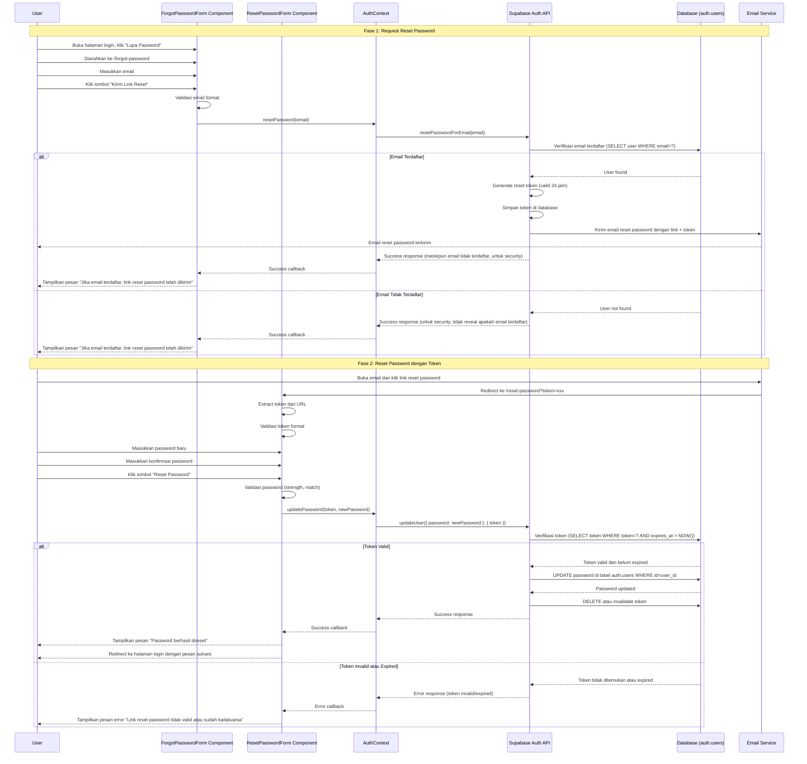
```mermaid
sequenceDiagram
    participant User
    participant ForgotPasswordForm as ForgotPasswordForm Component
    participant ResetPasswordForm as ResetPasswordForm Component
    participant AuthContext
    participant SupabaseAuth as Supabase Auth API
    participant AuthDB as Database (auth.users)
    participant EmailService as Email Service
    
    Note over User,EmailService: Fase 1: Request Reset Password
    User->>ForgotPasswordForm: Buka halaman login, klik "Lupa Password"
    User->>ForgotPasswordForm: Diarahkan ke /forgot-password
    User->>ForgotPasswordForm: Masukkan email
    User->>ForgotPasswordForm: Klik tombol "Kirim Link Reset"
    ForgotPasswordForm->>ForgotPasswordForm: Validasi email format
    ForgotPasswordForm->>AuthContext: resetPassword(email)
    AuthContext->>SupabaseAuth: resetPasswordForEmail(email)
    SupabaseAuth->>AuthDB: Verifikasi email terdaftar (SELECT user WHERE email=?)
    
    alt Email Terdaftar
        AuthDB-->>SupabaseAuth: User found
        SupabaseAuth->>SupabaseAuth: Generate reset token (valid 24 jam)
        SupabaseAuth->>SupabaseAuth: Simpan token di database
        SupabaseAuth->>EmailService: Kirim email reset password dengan link + token
        EmailService-->>User: Email reset password terkirim
        SupabaseAuth-->>AuthContext: Success response (meskipun email tidak terdaftar, untuk security)
        AuthContext-->>ForgotPasswordForm: Success callback
        ForgotPasswordForm-->>User: Tampilkan pesan "Jika email terdaftar, link reset password telah dikirim"
    else Email Tidak Terdaftar
        AuthDB-->>SupabaseAuth: User not found
        SupabaseAuth-->>AuthContext: Success response (untuk security, tidak reveal apakah email terdaftar)
        AuthContext-->>ForgotPasswordForm: Success callback
        ForgotPasswordForm-->>User: Tampilkan pesan "Jika email terdaftar, link reset password telah dikirim"
    end
    
    Note over User,EmailService: Fase 2: Reset Password dengan Token
    User->>EmailService: Buka email dan klik link reset password
    EmailService->>ResetPasswordForm: Redirect ke /reset-password?token=xxx
    ResetPasswordForm->>ResetPasswordForm: Extract token dari URL
    ResetPasswordForm->>ResetPasswordForm: Validasi token format
    User->>ResetPasswordForm: Masukkan password baru
    User->>ResetPasswordForm: Masukkan konfirmasi password
    User->>ResetPasswordForm: Klik tombol "Reset Password"
    ResetPasswordForm->>ResetPasswordForm: Validasi password (strength, match)
    ResetPasswordForm->>AuthContext: updatePassword(token, newPassword)
    AuthContext->>SupabaseAuth: updateUser({ password: newPassword }, { token })
    SupabaseAuth->>AuthDB: Verifikasi token (SELECT token WHERE token=? AND expires_at > NOW())
    
    alt Token Valid
        AuthDB-->>SupabaseAuth: Token valid dan belum expired
        SupabaseAuth->>AuthDB: UPDATE password di tabel auth.users WHERE id=user_id
        AuthDB-->>SupabaseAuth: Password updated
        SupabaseAuth->>AuthDB: DELETE atau invalidate token
        SupabaseAuth-->>AuthContext: Success response
        AuthContext-->>ResetPasswordForm: Success callback
        ResetPasswordForm-->>User: Tampilkan pesan "Password berhasil direset"
        ResetPasswordForm-->>User: Redirect ke halaman login dengan pesan sukses
    else Token Invalid atau Expired
        AuthDB-->>SupabaseAuth: Token tidak ditemukan atau expired
        SupabaseAuth-->>AuthContext: Error response (token invalid/expired)
        AuthContext-->>ResetPasswordForm: Error callback
        ResetPasswordForm-->>User: Tampilkan pesan error "Link reset password tidak valid atau sudah kadaluarsa"
    end
```

**Alur Proses:**
1. User membuka halaman login dan klik link "Lupa Password"
2. User diarahkan ke halaman `/forgot-password`
3. User memasukkan email di ForgotPasswordForm
4. User klik tombol "Kirim Link Reset"
5. ForgotPasswordForm memanggil AuthContext.resetPassword(email)
6. AuthContext memanggil Supabase Auth API resetPasswordForEmail(email)
7. Supabase Auth memverifikasi email terdaftar di database
8. Supabase Auth membuat reset token dan mengirim email berisi link reset password (valid 24 jam)
9. Supabase Auth mengembalikan response sukses (meskipun email tidak terdaftar, untuk security)
10. ForgotPasswordForm menampilkan pesan "Jika email terdaftar, link reset password telah dikirim"
11. User membuka email dan mengklik link reset password
12. Link mengarah ke halaman `/reset-password?token=xxx` dengan token di query parameter
13. User memasukkan password baru dan konfirmasi password di ResetPasswordForm
14. User klik tombol "Reset Password"
15. ResetPasswordForm memanggil AuthContext.updatePassword(token, newPassword)
16. AuthContext memanggil Supabase Auth API updateUser() dengan token dan password baru
17. Supabase Auth memverifikasi token (masih valid dan tidak expired)
18. Supabase Auth memperbarui password di tabel auth.users
19. Supabase Auth mengembalikan response sukses
20. AuthContext menampilkan pesan sukses
21. ResetPasswordForm mengarahkan user ke halaman login dengan pesan "Password berhasil direset, silakan login"

### **5.2.4 Sequence Diagram Melihat Beranda** {#5.2.4-sequence-diagram-homepage}

Gambaran proses interaksi antar sistem saat pengguna akan melihat halaman beranda dapat diamati pada Gambar 5.7. Sequence diagram ini menggambarkan alur loading homepage dengan featured content, latest articles, dan kategori.

**Gambar 5.7 Sequence Diagram Melihat Beranda**

> **Placeholder Diagram:** `bab5-sequence-homepage.png`  
> **Deskripsi:** Diagram menunjukkan interaksi antara User, HomePage Component, ArticleService, CategoryService, API Route, dan Supabase Database. Alur dimulai dari user membuka halaman beranda, HomePage component dimuat, HomePage memanggil ArticleService.getFeaturedArticles(), ArticleService memanggil API route, API route query tabel featured_content dengan active=true, API route join dengan articles untuk mendapatkan data lengkap, API route mengembalikan featured articles, HomePage menampilkan featured content, HomePage memanggil ArticleService.getLatestArticles(), API route query artikel terbaru dengan published=true, API route mengembalikan latest articles, HomePage menampilkan latest articles, HomePage memanggil CategoryService.getCategories(), API route query semua kategori dengan statistik, API route mengembalikan kategori, dan HomePage menampilkan daftar kategori.  
> **Catatan:** Kode Mermaid di bawah ini dapat digunakan untuk generate gambar diagram. Export dari [Mermaid Live Editor](https://mermaid.live) atau tool lain sebagai PNG dengan nama `bab5-sequence-homepage.png`.

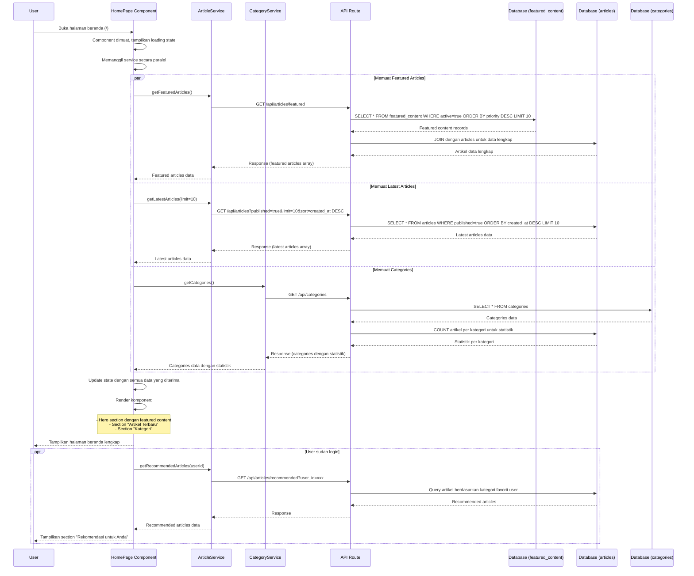
```mermaid
sequenceDiagram
    participant User
    participant HomePage as HomePage Component
    participant ArticleService
    participant CategoryService
    participant APIRoute as API Route
    participant FeaturedDB as Database (featured_content)
    participant ArticlesDB as Database (articles)
    participant CategoriesDB as Database (categories)
    
    User->>HomePage: Buka halaman beranda (/)
    HomePage->>HomePage: Component dimuat, tampilkan loading state
    HomePage->>HomePage: Memanggil service secara paralel
    
    par Memuat Featured Articles
        HomePage->>ArticleService: getFeaturedArticles()
        ArticleService->>APIRoute: GET /api/articles/featured
        APIRoute->>FeaturedDB: SELECT * FROM featured_content WHERE active=true ORDER BY priority DESC LIMIT 10
        FeaturedDB-->>APIRoute: Featured content records
        APIRoute->>ArticlesDB: JOIN dengan articles untuk data lengkap
        ArticlesDB-->>APIRoute: Artikel data lengkap
        APIRoute-->>ArticleService: Response (featured articles array)
        ArticleService-->>HomePage: Featured articles data
    and Memuat Latest Articles
        HomePage->>ArticleService: getLatestArticles(limit=10)
        ArticleService->>APIRoute: GET /api/articles?published=true&limit=10&sort=created_at DESC
        APIRoute->>ArticlesDB: SELECT * FROM articles WHERE published=true ORDER BY created_at DESC LIMIT 10
        ArticlesDB-->>APIRoute: Latest articles data
        APIRoute-->>ArticleService: Response (latest articles array)
        ArticleService-->>HomePage: Latest articles data
    and Memuat Categories
        HomePage->>CategoryService: getCategories()
        CategoryService->>APIRoute: GET /api/categories
        APIRoute->>CategoriesDB: SELECT * FROM categories
        CategoriesDB-->>APIRoute: Categories data
        APIRoute->>ArticlesDB: COUNT artikel per kategori untuk statistik
        ArticlesDB-->>APIRoute: Statistik per kategori
        APIRoute-->>CategoryService: Response (categories dengan statistik)
        CategoryService-->>HomePage: Categories data dengan statistik
    end
    
    HomePage->>HomePage: Update state dengan semua data yang diterima
    HomePage->>HomePage: Render komponen:
    Note over HomePage: - Hero section dengan featured content<br/>- Section "Artikel Terbaru"<br/>- Section "Kategori"
    HomePage-->>User: Tampilkan halaman beranda lengkap
    
    opt User sudah login
        HomePage->>ArticleService: getRecommendedArticles(userId)
        ArticleService->>APIRoute: GET /api/articles/recommended?user_id=xxx
        APIRoute->>ArticlesDB: Query artikel berdasarkan kategori favorit user
        ArticlesDB-->>APIRoute: Recommended articles
        APIRoute-->>ArticleService: Response
        ArticleService-->>HomePage: Recommended articles data
        HomePage-->>User: Tampilkan section "Rekomendasi untuk Anda"
    end
```

**Alur Proses:**
1. User membuka halaman beranda `/` (homepage)
2. HomePage component dimuat dan menampilkan loading state
3. HomePage secara paralel memanggil beberapa service:
   - ArticleService.getFeaturedArticles() untuk konten pilihan
   - ArticleService.getLatestArticles(limit=10) untuk artikel terbaru
   - CategoryService.getCategories() untuk daftar kategori
4. ArticleService.getFeaturedArticles() memanggil API route `/api/articles/featured`
5. API route melakukan query ke tabel featured_content dengan active=true, diurutkan berdasarkan priority DESC
6. API route melakukan JOIN dengan tabel articles untuk mendapatkan data lengkap artikel
7. API route mengembalikan array featured articles (maksimal 10)
8. ArticleService.getLatestArticles() memanggil API route `/api/articles?published=true&limit=10&sort=created_at DESC`
9. API route melakukan query ke tabel articles dengan published=true, diurutkan berdasarkan created_at DESC
10. API route mengembalikan array latest articles
11. CategoryService.getCategories() memanggil API route `/api/categories`
12. API route melakukan query ke tabel categories dengan statistik (jumlah artikel per kategori)
13. API route mengembalikan array categories dengan statistik
14. HomePage menerima semua response dan memperbarui state
15. HomePage menampilkan:
    - Hero section dengan featured content (jika ada)
    - Section "Artikel Terbaru" dengan latest articles
    - Section "Kategori" dengan daftar kategori dan statistik
16. Jika user sudah login, HomePage juga memuat rekomendasi artikel berdasarkan kategori yang disukai

### **5.2.5 Sequence Diagram Melihat Kategori** {#5.2.5-sequence-diagram-view-category}

Gambaran proses interaksi antar sistem saat pengguna akan melihat halaman detail kategori dapat diamati pada Gambar 5.8. Sequence diagram ini menggambarkan alur kategori dengan statistik dan daftar artikel.

**Gambar 5.8 Sequence Diagram Melihat Kategori**

> **Placeholder Diagram:** `bab5-sequence-view-category.png`  
> **Deskripsi:** Diagram menunjukkan interaksi antara User, CategoryDetailPage Component, CategoryService, ArticleService, API Route, dan Supabase Database. Alur dimulai dari user membuka halaman kategori dengan slug, CategoryDetailPage memanggil CategoryService.getCategoryBySlug(slug), API route query kategori dengan statistik, API route mengembalikan kategori dan statistik, CategoryDetailPage menampilkan header kategori, CategoryDetailPage memanggil ArticleService.getArticlesByCategory(categoryId, sort, page), API route query artikel dengan filter kategori dan published=true, API route mengembalikan artikel dengan pagination, dan CategoryDetailPage menampilkan daftar artikel dengan opsi sorting.  
> **Catatan:** Kode Mermaid di bawah ini dapat digunakan untuk generate gambar diagram. Export dari [Mermaid Live Editor](https://mermaid.live) atau tool lain sebagai PNG dengan nama `bab5-sequence-view-category.png`.

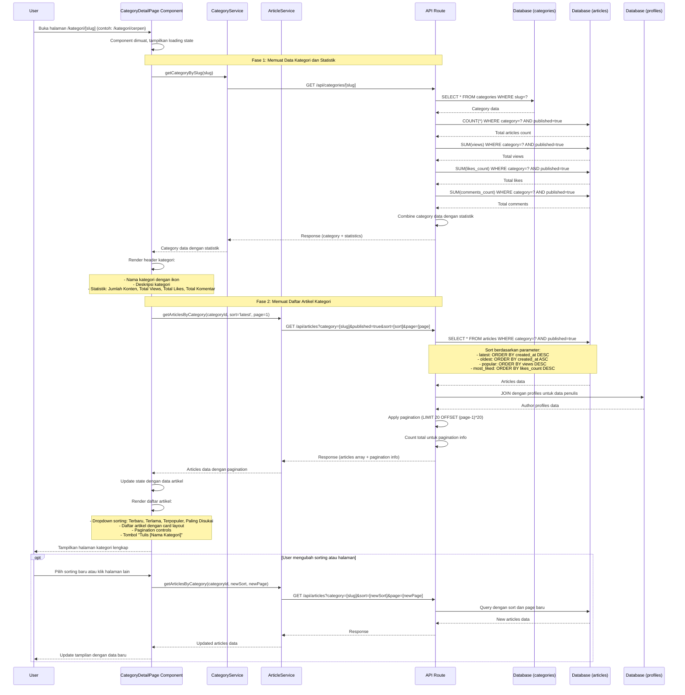
```mermaid
sequenceDiagram
    participant User
    participant CategoryDetailPage as CategoryDetailPage Component
    participant CategoryService
    participant ArticleService
    participant APIRoute as API Route
    participant CategoriesDB as Database (categories)
    participant ArticlesDB as Database (articles)
    participant ProfilesDB as Database (profiles)
    
    User->>CategoryDetailPage: Buka halaman /kategori/[slug] (contoh: /kategori/cerpen)
    CategoryDetailPage->>CategoryDetailPage: Component dimuat, tampilkan loading state
    
    Note over CategoryDetailPage,APIRoute: Fase 1: Memuat Data Kategori dan Statistik
    CategoryDetailPage->>CategoryService: getCategoryBySlug(slug)
    CategoryService->>APIRoute: GET /api/categories/[slug]
    APIRoute->>CategoriesDB: SELECT * FROM categories WHERE slug=?
    CategoriesDB-->>APIRoute: Category data
    
    APIRoute->>ArticlesDB: COUNT(*) WHERE category=? AND published=true
    ArticlesDB-->>APIRoute: Total articles count
    APIRoute->>ArticlesDB: SUM(views) WHERE category=? AND published=true
    ArticlesDB-->>APIRoute: Total views
    APIRoute->>ArticlesDB: SUM(likes_count) WHERE category=? AND published=true
    ArticlesDB-->>APIRoute: Total likes
    APIRoute->>ArticlesDB: SUM(comments_count) WHERE category=? AND published=true
    ArticlesDB-->>APIRoute: Total comments
    
    APIRoute->>APIRoute: Combine category data dengan statistik
    APIRoute-->>CategoryService: Response (category + statistics)
    CategoryService-->>CategoryDetailPage: Category data dengan statistik
    CategoryDetailPage->>CategoryDetailPage: Render header kategori:
    Note over CategoryDetailPage: - Nama kategori dengan ikon<br/>- Deskripsi kategori<br/>- Statistik: Jumlah Konten, Total Views, Total Likes, Total Komentar
    
    Note over CategoryDetailPage,APIRoute: Fase 2: Memuat Daftar Artikel Kategori
    CategoryDetailPage->>ArticleService: getArticlesByCategory(categoryId, sort='latest', page=1)
    ArticleService->>APIRoute: GET /api/articles?category=[slug]&published=true&sort=[sort]&page=[page]
    
    APIRoute->>ArticlesDB: SELECT * FROM articles WHERE category=? AND published=true
    Note over APIRoute,ArticlesDB: Sort berdasarkan parameter:<br/>- latest: ORDER BY created_at DESC<br/>- oldest: ORDER BY created_at ASC<br/>- popular: ORDER BY views DESC<br/>- most_liked: ORDER BY likes_count DESC
    ArticlesDB-->>APIRoute: Articles data
    
    APIRoute->>ProfilesDB: JOIN dengan profiles untuk data penulis
    ProfilesDB-->>APIRoute: Author profiles data
    APIRoute->>APIRoute: Apply pagination (LIMIT 20 OFFSET (page-1)*20)
    APIRoute->>APIRoute: Count total untuk pagination info
    APIRoute-->>ArticleService: Response (articles array + pagination info)
    ArticleService-->>CategoryDetailPage: Articles data dengan pagination
    
    CategoryDetailPage->>CategoryDetailPage: Update state dengan data artikel
    CategoryDetailPage->>CategoryDetailPage: Render daftar artikel:
    Note over CategoryDetailPage: - Dropdown sorting: Terbaru, Terlama, Terpopuler, Paling Disukai<br/>- Daftar artikel dengan card layout<br/>- Pagination controls<br/>- Tombol "Tulis [Nama Kategori]"
    CategoryDetailPage-->>User: Tampilkan halaman kategori lengkap
    
    opt User mengubah sorting atau halaman
        User->>CategoryDetailPage: Pilih sorting baru atau klik halaman lain
        CategoryDetailPage->>ArticleService: getArticlesByCategory(categoryId, newSort, newPage)
        ArticleService->>APIRoute: GET /api/articles?category=[slug]&sort=[newSort]&page=[newPage]
        APIRoute->>ArticlesDB: Query dengan sort dan page baru
        ArticlesDB-->>APIRoute: New articles data
        APIRoute-->>ArticleService: Response
        ArticleService-->>CategoryDetailPage: Updated articles data
        CategoryDetailPage-->>User: Update tampilan dengan data baru
    end
```

**Alur Proses:**
1. User membuka halaman kategori melalui URL `/kategori/[slug]` (contoh: `/kategori/cerpen`)
2. CategoryDetailPage component dimuat dan menampilkan loading state
3. CategoryDetailPage memanggil CategoryService.getCategoryBySlug(slug)
4. CategoryService memanggil API route `/api/categories/[slug]` dengan method GET
5. API route melakukan query ke tabel categories berdasarkan slug
6. API route menghitung statistik kategori:
   - COUNT artikel dengan kategori tersebut dan published=true
   - SUM views dari artikel kategori tersebut
   - SUM likes_count dari artikel kategori tersebut
   - SUM comments_count dari artikel kategori tersebut
7. API route mengembalikan response dengan data kategori dan statistik
8. CategoryDetailPage menampilkan header kategori dengan:
   - Nama kategori dengan ikon
   - Deskripsi kategori
   - Statistik: Jumlah Konten, Total Views, Total Likes, Total Komentar
9. CategoryDetailPage memanggil ArticleService.getArticlesByCategory(categoryId, sort='latest', page=1)
10. CategoryService memanggil API route `/api/articles?category=[category]&published=true&sort=[sort]&page=[page]`
11. API route melakukan query ke tabel articles dengan:
    - Filter: category = categorySlug, published = true
    - Sort berdasarkan parameter (latest, oldest, popular, most_liked)
    - Pagination (limit 20 per halaman)
12. API route melakukan JOIN dengan profiles untuk mendapatkan data penulis
13. API route mengembalikan response dengan array artikel dan pagination info
14. CategoryDetailPage menampilkan:
    - Dropdown sorting: Terbaru, Terlama, Terpopuler, Paling Disukai
    - Daftar artikel dengan card layout (judul, penulis, tanggal, views, likes, excerpt)
    - Pagination controls
    - Tombol "Tulis [Nama Kategori]" untuk mendorong partisipasi
15. User dapat mengubah sorting dan halaman akan refresh dengan data baru
16. User dapat mengklik artikel untuk melihat detail

### **5.2.6 Sequence Diagram Mencari Konten** {#5.2.6-sequence-diagram-search}

Gambaran proses interaksi antar sistem saat pengguna akan mencari konten di platform dapat diamati pada Gambar 5.9. Sequence diagram ini menggambarkan alur pencarian global dengan filter dan pagination.

**Gambar 5.9 Sequence Diagram Mencari Konten**

> **Placeholder Diagram:** `bab5-sequence-search.png`  
> **Deskripsi:** Diagram menunjukkan interaksi antara User, SearchPage Component, SearchService, API Route, dan Supabase Database. Alur dimulai dari user memasukkan keyword di search bar, SearchPage melakukan debounce (tunggu 300ms), SearchService memanggil API route dengan query parameters, API route melakukan full-text search di database menggunakan PostgreSQL GIN index, query mencari di tabel articles (title, content, excerpt), profiles (full_name, bio), dan categories (nama), API route mengembalikan hasil dengan pagination, SearchService memperbarui state, dan SearchPage menampilkan hasil pencarian dengan highlight keyword.  
> **Catatan:** Kode Mermaid di bawah ini dapat digunakan untuk generate gambar diagram. Export dari [Mermaid Live Editor](https://mermaid.live) atau tool lain sebagai PNG dengan nama `bab5-sequence-search.png`.

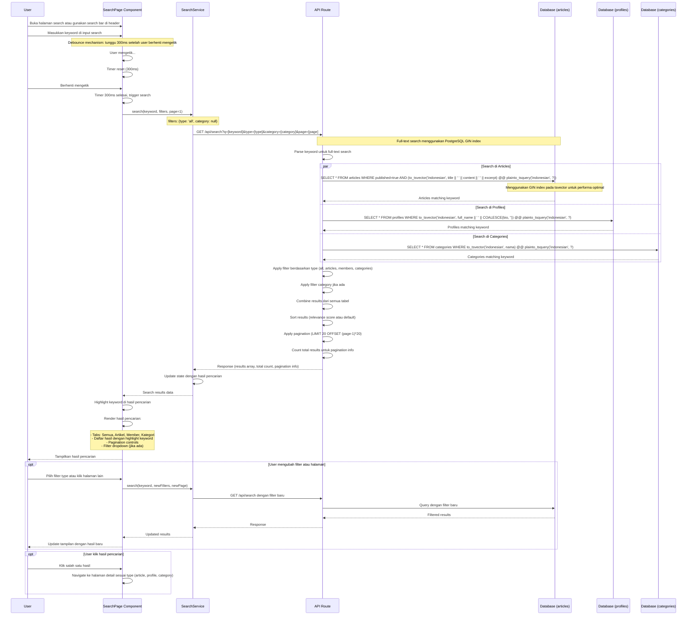
```mermaid
sequenceDiagram
    participant User
    participant SearchPage as SearchPage Component
    participant SearchService
    participant APIRoute as API Route
    participant ArticlesDB as Database (articles)
    participant ProfilesDB as Database (profiles)
    participant CategoriesDB as Database (categories)
    
    User->>SearchPage: Buka halaman search atau gunakan search bar di header
    User->>SearchPage: Masukkan keyword di input search
    
    Note over SearchPage: Debounce mechanism: tunggu 300ms setelah user berhenti mengetik
    SearchPage->>SearchPage: User mengetik...
    SearchPage->>SearchPage: Timer reset (300ms)
    User->>SearchPage: Berhenti mengetik
    SearchPage->>SearchPage: Timer 300ms selesai, trigger search
    
    SearchPage->>SearchService: search(keyword, filters, page=1)
    Note over SearchService: filters: {type: 'all', category: null}
    SearchService->>APIRoute: GET /api/search?q=[keyword]&type=[type]&category=[category]&page=[page]
    
    Note over APIRoute,ArticlesDB: Full-text search menggunakan PostgreSQL GIN index
    APIRoute->>APIRoute: Parse keyword untuk full-text search
    
    par Search di Articles
        APIRoute->>ArticlesDB: SELECT * FROM articles WHERE published=true AND (to_tsvector('indonesian', title || ' ' || content || ' ' || excerpt) @@ plainto_tsquery('indonesian', ?))
        Note over ArticlesDB: Menggunakan GIN index pada tsvector untuk performa optimal
        ArticlesDB-->>APIRoute: Articles matching keyword
    and Search di Profiles
        APIRoute->>ProfilesDB: SELECT * FROM profiles WHERE to_tsvector('indonesian', full_name || ' ' || COALESCE(bio, '')) @@ plainto_tsquery('indonesian', ?)
        ProfilesDB-->>APIRoute: Profiles matching keyword
    and Search di Categories
        APIRoute->>CategoriesDB: SELECT * FROM categories WHERE to_tsvector('indonesian', nama) @@ plainto_tsquery('indonesian', ?)
        CategoriesDB-->>APIRoute: Categories matching keyword
    end
    
    APIRoute->>APIRoute: Apply filter berdasarkan type (all, articles, members, categories)
    APIRoute->>APIRoute: Apply filter category jika ada
    APIRoute->>APIRoute: Combine results dari semua tabel
    APIRoute->>APIRoute: Sort results (relevance score atau default)
    APIRoute->>APIRoute: Apply pagination (LIMIT 20 OFFSET (page-1)*20)
    APIRoute->>APIRoute: Count total results untuk pagination info
    
    APIRoute-->>SearchService: Response (results array, total count, pagination info)
    SearchService->>SearchService: Update state dengan hasil pencarian
    SearchService-->>SearchPage: Search results data
    
    SearchPage->>SearchPage: Highlight keyword di hasil pencarian
    SearchPage->>SearchPage: Render hasil pencarian:
    Note over SearchPage: - Tabs: Semua, Artikel, Member, Kategori<br/>- Daftar hasil dengan highlight keyword<br/>- Pagination controls<br/>- Filter dropdown (jika ada)
    SearchPage-->>User: Tampilkan hasil pencarian
    
    opt User mengubah filter atau halaman
        User->>SearchPage: Pilih filter type atau klik halaman lain
        SearchPage->>SearchService: search(keyword, newFilters, newPage)
        SearchService->>APIRoute: GET /api/search dengan filter baru
        APIRoute->>ArticlesDB: Query dengan filter baru
        ArticlesDB-->>APIRoute: Filtered results
        APIRoute-->>SearchService: Response
        SearchService-->>SearchPage: Updated results
        SearchPage-->>User: Update tampilan dengan hasil baru
    end
    
    opt User klik hasil pencarian
        User->>SearchPage: Klik salah satu hasil
        SearchPage->>SearchPage: Navigate ke halaman detail sesuai type (article, profile, category)
    end
```

**Alur Proses:**
1. User membuka halaman search atau menggunakan search bar di header
2. User memasukkan keyword di input search
3. SearchPage component melakukan debounce (menunggu 300ms setelah user berhenti mengetik)
4. SearchPage memanggil SearchService.search(keyword, filters, page)
5. SearchService memanggil API route `/api/search` dengan query parameters (q, type, category, page)
6. API route melakukan full-text search di database menggunakan PostgreSQL:
   - Mencari di tabel articles pada kolom title, content, excerpt menggunakan tsvector
   - Mencari di tabel profiles pada kolom full_name, bio
   - Mencari di tabel categories pada kolom nama
7. Query menggunakan GIN index untuk performa optimal
8. API route menerapkan filter berdasarkan type (all, articles, members, categories) dan category jika ada
9. API route melakukan pagination (limit 20 hasil per halaman)
10. API route mengembalikan response dengan hasil pencarian, total count, dan pagination info
11. SearchService memperbarui state dengan hasil pencarian
12. SearchPage menampilkan hasil dengan highlight keyword dan pagination controls
13. User dapat mengklik hasil untuk navigasi ke halaman detail

### **5.2.7 Sequence Diagram Melihat Detail Artikel** {#5.2.7-sequence-diagram-view-article}

Gambaran proses interaksi antar sistem saat pengguna akan melihat detail artikel dapat diamati pada Gambar 5.10. Sequence diagram ini menggambarkan alur loading artikel detail dengan increment views, related articles, dan komentar.

**Gambar 5.10 Sequence Diagram Melihat Detail Artikel**

> **Placeholder Diagram:** `bab5-sequence-view-article.png`  
> **Deskripsi:** Diagram menunjukkan interaksi antara User, ArticleDetailPage Component, ArticleService, CommentService, ViewService, API Route, dan Supabase Database. Alur dimulai dari user membuka halaman artikel dengan slug, ArticleDetailPage memanggil ArticleService.getArticleBySlug(slug), API route query artikel dari database, API route increment views menggunakan function increment_article_views(), API route mengembalikan artikel lengkap, ArticleDetailPage menampilkan artikel, ArticleDetailPage memanggil CommentService.getComments(articleId), API route query komentar dengan parent_id NULL untuk top-level comments, API route mengembalikan komentar, ArticleDetailPage menampilkan komentar, ArticleDetailPage memanggil ArticleService.getRelatedArticles(articleId, category), API route query artikel terkait berdasarkan kategori, API route mengembalikan related articles, dan ArticleDetailPage menampilkan related articles.  
> **Catatan:** Kode Mermaid di bawah ini dapat digunakan untuk generate gambar diagram. Export dari [Mermaid Live Editor](https://mermaid.live) atau tool lain sebagai PNG dengan nama `bab5-sequence-view-article.png`.

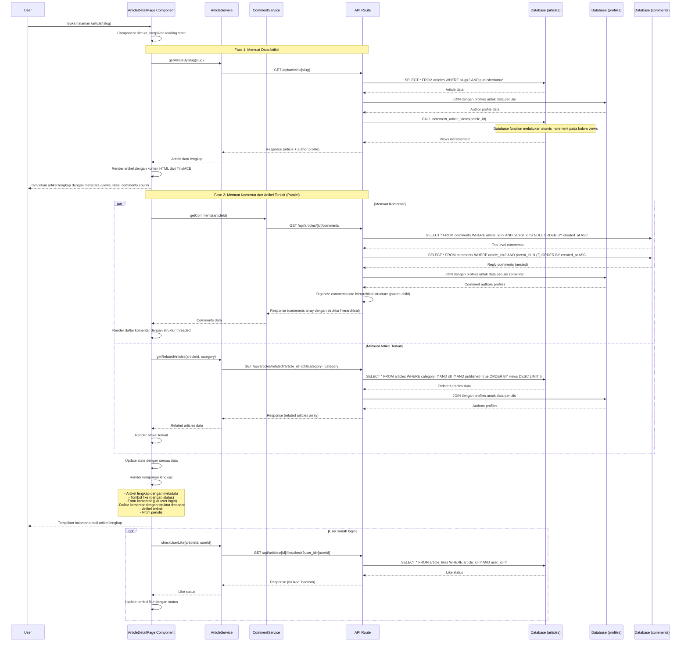
```mermaid
sequenceDiagram
    participant User
    participant ArticleDetailPage as ArticleDetailPage Component
    participant ArticleService
    participant CommentService
    participant APIRoute as API Route
    participant ArticlesDB as Database (articles)
    participant ProfilesDB as Database (profiles)
    participant CommentsDB as Database (comments)
    
    User->>ArticleDetailPage: Buka halaman /article/[slug]
    ArticleDetailPage->>ArticleDetailPage: Component dimuat, tampilkan loading state
    
    Note over ArticleDetailPage,APIRoute: Fase 1: Memuat Data Artikel
    ArticleDetailPage->>ArticleService: getArticleBySlug(slug)
    ArticleService->>APIRoute: GET /api/articles/[slug]
    APIRoute->>ArticlesDB: SELECT * FROM articles WHERE slug=? AND published=true
    ArticlesDB-->>APIRoute: Article data
    APIRoute->>ProfilesDB: JOIN dengan profiles untuk data penulis
    ProfilesDB-->>APIRoute: Author profile data
    APIRoute->>ArticlesDB: CALL increment_article_views(article_id)
    Note over ArticlesDB: Database function melakukan atomic increment pada kolom views
    ArticlesDB-->>APIRoute: Views incremented
    APIRoute-->>ArticleService: Response (article + author profile)
    ArticleService-->>ArticleDetailPage: Article data lengkap
    ArticleDetailPage->>ArticleDetailPage: Render artikel dengan konten HTML dari TinyMCE
    ArticleDetailPage-->>User: Tampilkan artikel lengkap dengan metadata (views, likes, comments count)
    
    Note over ArticleDetailPage,APIRoute: Fase 2: Memuat Komentar dan Artikel Terkait (Paralel)
    par Memuat Komentar
        ArticleDetailPage->>CommentService: getComments(articleId)
        CommentService->>APIRoute: GET /api/articles/[id]/comments
        APIRoute->>CommentsDB: SELECT * FROM comments WHERE article_id=? AND parent_id IS NULL ORDER BY created_at ASC
        CommentsDB-->>APIRoute: Top-level comments
        APIRoute->>CommentsDB: SELECT * FROM comments WHERE article_id=? AND parent_id IN (?) ORDER BY created_at ASC
        CommentsDB-->>APIRoute: Reply comments (nested)
        APIRoute->>ProfilesDB: JOIN dengan profiles untuk data penulis komentar
        ProfilesDB-->>APIRoute: Comment authors profiles
        APIRoute->>APIRoute: Organize comments into hierarchical structure (parent-child)
        APIRoute-->>CommentService: Response (comments array dengan struktur hierarchical)
        CommentService-->>ArticleDetailPage: Comments data
        ArticleDetailPage->>ArticleDetailPage: Render daftar komentar dengan struktur threaded
    and Memuat Artikel Terkait
        ArticleDetailPage->>ArticleService: getRelatedArticles(articleId, category)
        ArticleService->>APIRoute: GET /api/articles/related?article_id=[id]&category=[category]
        APIRoute->>ArticlesDB: SELECT * FROM articles WHERE category=? AND id!=? AND published=true ORDER BY views DESC LIMIT 5
        ArticlesDB-->>APIRoute: Related articles data
        APIRoute->>ProfilesDB: JOIN dengan profiles untuk data penulis
        ProfilesDB-->>APIRoute: Authors profiles
        APIRoute-->>ArticleService: Response (related articles array)
        ArticleService-->>ArticleDetailPage: Related articles data
        ArticleDetailPage->>ArticleDetailPage: Render artikel terkait
    end
    
    ArticleDetailPage->>ArticleDetailPage: Update state dengan semua data
    ArticleDetailPage->>ArticleDetailPage: Render komponen lengkap:
    Note over ArticleDetailPage: - Artikel lengkap dengan metadata<br/>- Tombol like (dengan status)<br/>- Form komentar (jika user login)<br/>- Daftar komentar dengan struktur threaded<br/>- Artikel terkait<br/>- Profil penulis
    ArticleDetailPage-->>User: Tampilkan halaman detail artikel lengkap
    
    opt User sudah login
        ArticleDetailPage->>ArticleService: checkUserLike(articleId, userId)
        ArticleService->>APIRoute: GET /api/articles/[id]/like/check?user_id=[userId]
        APIRoute->>ArticlesDB: SELECT * FROM article_likes WHERE article_id=? AND user_id=?
        ArticlesDB-->>APIRoute: Like status
        APIRoute-->>ArticleService: Response (isLiked: boolean)
        ArticleService-->>ArticleDetailPage: Like status
        ArticleDetailPage->>ArticleDetailPage: Update tombol like dengan status
    end
```

**Alur Proses:**
1. User membuka halaman detail artikel melalui URL `/article/[slug]`
2. ArticleDetailPage component dimuat dan menampilkan loading state
3. ArticleDetailPage memanggil ArticleService.getArticleBySlug(slug)
4. ArticleService memanggil API route `/api/articles/[slug]` dengan method GET
5. API route melakukan query ke tabel articles berdasarkan slug
6. API route melakukan JOIN dengan tabel profiles untuk mendapatkan data penulis
7. API route memanggil database function increment_article_views(article_id) untuk increment counter views
8. Database function memperbarui kolom views di tabel articles (atomic increment)
9. API route mengembalikan response dengan data artikel lengkap termasuk author profile
10. ArticleDetailPage menampilkan artikel dengan konten HTML dari TinyMCE
11. ArticleDetailPage secara paralel memanggil:
    - CommentService.getComments(articleId) untuk komentar
    - ArticleService.getRelatedArticles(articleId, category) untuk artikel terkait
12. CommentService memanggil API route `/api/articles/[id]/comments`
13. API route melakukan query ke tabel comments dengan article_id, diurutkan berdasarkan created_at
14. API route melakukan JOIN dengan profiles untuk mendapatkan data penulis komentar
15. API route mengembalikan array komentar dengan struktur hierarchical (parent-child)
16. ArticleService.getRelatedArticles() memanggil API route `/api/articles/related?article_id=xxx&category=xxx`
17. API route melakukan query artikel lain dengan kategori yang sama, exclude artikel saat ini, limit 5
18. API route mengembalikan array related articles
19. ArticleDetailPage menampilkan:
    - Artikel lengkap dengan metadata (views, likes, comments count)
    - Tombol like (dengan status apakah user sudah like)
    - Form komentar (jika user login)
    - Daftar komentar
    - Artikel terkait
    - Profil penulis

### **5.2.8 Sequence Diagram Menulis dan Mempublikasikan Artikel** {#5.2.8-sequence-diagram-menulis-artikel}

Gambaran proses interaksi antar sistem saat administrator atau moderator akan menandai artikel sebagai konten pilihan (featured) dapat diamati pada Gambar 5.11. Sequence diagram ini menggambarkan alur featured content management.

**Gambar 5.11 Sequence Diagram Menulis dan Mempublikasikan Artikel**

> **Placeholder Diagram:** `bab5-sequence-write-article.png`  
> **Deskripsi:** Diagram menunjukkan interaksi antara Penulis, WriteArticleForm Component, TinyMCE Editor, ArticleService, API Route, Supabase Database, dan Storage. Alur dimulai dari penulis membuka halaman write, editor memuat template (jika dipilih), penulis menulis konten, auto-save setiap 30 detik menyimpan draft, penulis mengisi metadata (judul, kategori, cover), penulis klik publish, sistem melakukan validasi, upload cover image ke Supabase Storage (jika ada), menyimpan artikel ke database dengan status published, memperbarui cache, dan menampilkan notifikasi sukses.  
> **Catatan:** Kode Mermaid di bawah ini dapat digunakan untuk generate gambar diagram. Export dari [Mermaid Live Editor](https://mermaid.live) atau tool lain sebagai PNG dengan nama `bab5-sequence-write-article.png`.

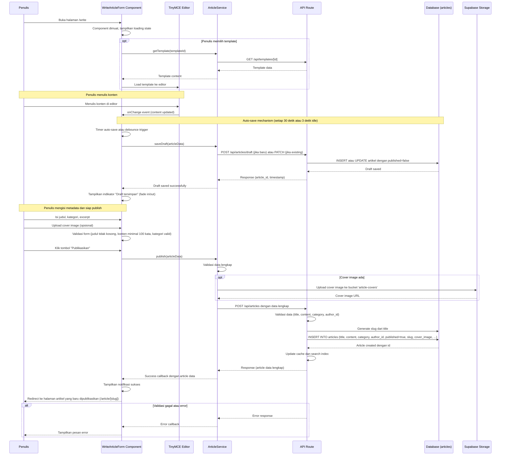
```mermaid
sequenceDiagram
    participant Penulis
    participant WriteArticleForm as WriteArticleForm Component
    participant TinyMCE as TinyMCE Editor
    participant ArticleService
    participant APIRoute as API Route
    participant ArticlesDB as Database (articles)
    participant Storage as Supabase Storage
    
    Penulis->>WriteArticleForm: Buka halaman /write
    WriteArticleForm->>WriteArticleForm: Component dimuat, tampilkan loading state
    
    opt Penulis memilih template
        WriteArticleForm->>ArticleService: getTemplate(templateId)
        ArticleService->>APIRoute: GET /api/templates/[id]
        APIRoute-->>ArticleService: Template data
        ArticleService-->>WriteArticleForm: Template content
        WriteArticleForm->>TinyMCE: Load template ke editor
    end
    
    Note over Penulis,TinyMCE: Penulis menulis konten
    Penulis->>TinyMCE: Menulis konten di editor
    TinyMCE->>WriteArticleForm: onChange event (content updated)
    
    Note over WriteArticleForm,ArticlesDB: Auto-save mechanism (setiap 30 detik atau 3 detik idle)
    WriteArticleForm->>WriteArticleForm: Timer auto-save atau debounce trigger
    WriteArticleForm->>ArticleService: saveDraft(articleData)
    ArticleService->>APIRoute: POST /api/articles/draft (jika baru) atau PATCH (jika existing)
    APIRoute->>ArticlesDB: INSERT atau UPDATE artikel dengan published=false
    ArticlesDB-->>APIRoute: Draft saved
    APIRoute-->>ArticleService: Response (article_id, timestamp)
    ArticleService-->>WriteArticleForm: Draft saved successfully
    WriteArticleForm->>WriteArticleForm: Tampilkan indikator "Draft tersimpan" (fade in/out)
    
    Note over Penulis,WriteArticleForm: Penulis mengisi metadata dan siap publish
    Penulis->>WriteArticleForm: Isi judul, kategori, excerpt
    Penulis->>WriteArticleForm: Upload cover image (opsional)
    WriteArticleForm->>WriteArticleForm: Validasi form (judul tidak kosong, konten minimal 100 kata, kategori valid)
    Penulis->>WriteArticleForm: Klik tombol "Publikasikan"
    
    WriteArticleForm->>ArticleService: publish(articleData)
    ArticleService->>ArticleService: Validasi data lengkap
    
    opt Cover image ada
        ArticleService->>Storage: Upload cover image ke bucket 'article-covers'
        Storage-->>ArticleService: Cover image URL
    end
    
    ArticleService->>APIRoute: POST /api/articles dengan data lengkap
    APIRoute->>APIRoute: Validasi data (title, content, category, author_id)
    APIRoute->>ArticlesDB: Generate slug dari title
    APIRoute->>ArticlesDB: INSERT INTO articles (title, content, category, author_id, published=true, slug, cover_image, ...)
    ArticlesDB-->>APIRoute: Article created dengan id
    APIRoute->>APIRoute: Update cache dan search index
    APIRoute-->>ArticleService: Response (article data lengkap)
    ArticleService-->>WriteArticleForm: Success callback dengan article data
    WriteArticleForm->>WriteArticleForm: Tampilkan notifikasi sukses
    WriteArticleForm-->>Penulis: Redirect ke halaman artikel yang baru dipublikasikan (/article/[slug])
    
    alt Validasi gagal atau error
        APIRoute-->>ArticleService: Error response
        ArticleService-->>WriteArticleForm: Error callback
        WriteArticleForm-->>Penulis: Tampilkan pesan error
    end
```

**Alur Proses:**
1. Admin membuka halaman `/admin/featured` dan melihat daftar artikel yang bisa di-featured
2. Admin memilih artikel dan klik tombol "Tambah ke Featured"
3. AdminFeaturedPage menampilkan modal untuk mengatur priority (1-10)
4. Admin mengatur priority dan klik "Konfirmasi"
5. AdminFeaturedPage memanggil FeaturedService.addFeatured(articleId, priority)
6. FeaturedService memanggil API route `/api/admin/featured` dengan method POST
7. API route memverifikasi permission admin
8. API route memeriksa kuota slot featured (maksimal 10 artikel aktif)
9. Jika masih ada slot, API route menyimpan record ke tabel featured_content dengan active=true
10. Jika slot penuh, API route mengembalikan error
11. Sistem memperbarui cache untuk homepage agar featured content terbaru langsung muncul
12. Sistem mencatat aktivitas di admin_activity_logs
13. API route mengembalikan response sukses
14. FeaturedService memperbarui state
15. AdminFeaturedPage menampilkan notifikasi sukses dan memperbarui daftar featured content

### **5.2.9 Sequence Diagram Menyimpan Draft (Auto-save)** {#5.2.9-sequence-diagram-auto-save}

Gambaran proses interaksi antar sistem saat pengunjung akan mendaftar akun baru dapat diamati pada Gambar 5.12. Sequence diagram ini menggambarkan alur registrasi dengan email verification.

**Gambar 5.12 Sequence Diagram Menyimpan Draft (Auto-save)**

> **Placeholder Diagram:** `bab5-sequence-auto-save.png`  
> **Deskripsi:** Diagram menunjukkan interaksi antara Penulis, WriteArticleForm Component, AutoSaveService, API Route, dan Supabase Database. Alur dimulai dari penulis menulis di editor, WriteArticleForm mendeteksi perubahan konten, timer auto-save (30 detik) atau debounce (3 detik idle), WriteArticleForm memanggil AutoSaveService.saveDraft(articleId, data), AutoSaveService memanggil API route, API route menyimpan atau memperbarui draft di tabel articles dengan published=false, API route mengembalikan response, dan WriteArticleForm menampilkan indikator "Draft tersimpan" secara diskret. Jika artikel baru, sistem membuat record baru. Jika artikel existing, sistem memperbarui record.  
> **Catatan:** Kode Mermaid di bawah ini dapat digunakan untuk generate gambar diagram. Export dari [Mermaid Live Editor](https://mermaid.live) atau tool lain sebagai PNG dengan nama `bab5-sequence-auto-save.png`.

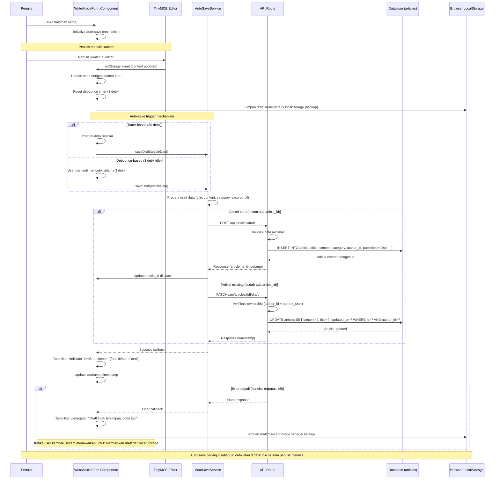
```mermaid
sequenceDiagram
    participant Penulis
    participant WriteArticleForm as WriteArticleForm Component
    participant TinyMCE as TinyMCE Editor
    participant AutoSaveService
    participant APIRoute as API Route
    participant ArticlesDB as Database (articles)
    participant LocalStorage as Browser LocalStorage
    
    Penulis->>WriteArticleForm: Buka halaman /write
    WriteArticleForm->>WriteArticleForm: Initialize auto-save mechanism
    
    Note over Penulis,TinyMCE: Penulis menulis konten
    Penulis->>TinyMCE: Menulis konten di editor
    TinyMCE->>WriteArticleForm: onChange event (content updated)
    WriteArticleForm->>WriteArticleForm: Update state dengan konten baru
    WriteArticleForm->>WriteArticleForm: Reset debounce timer (3 detik)
    WriteArticleForm->>LocalStorage: Simpan draft sementara di localStorage (backup)
    
    Note over WriteArticleForm,AutoSaveService: Auto-save trigger mechanism
    alt Timer-based (30 detik)
        WriteArticleForm->>WriteArticleForm: Timer 30 detik selesai
        WriteArticleForm->>AutoSaveService: saveDraft(articleData)
    else Debounce-based (3 detik idle)
        WriteArticleForm->>WriteArticleForm: User berhenti mengetik selama 3 detik
        WriteArticleForm->>AutoSaveService: saveDraft(articleData)
    end
    
    AutoSaveService->>AutoSaveService: Prepare draft data (title, content, category, excerpt, dll)
    
    alt Artikel baru (belum ada article_id)
        AutoSaveService->>APIRoute: POST /api/articles/draft
        APIRoute->>APIRoute: Validasi data minimal
        APIRoute->>ArticlesDB: INSERT INTO articles (title, content, category, author_id, published=false, ...)
        ArticlesDB-->>APIRoute: Article created dengan id
        APIRoute-->>AutoSaveService: Response (article_id, timestamp)
        AutoSaveService->>WriteArticleForm: Update article_id di state
    else Artikel existing (sudah ada article_id)
        AutoSaveService->>APIRoute: PATCH /api/articles/[id]/draft
        APIRoute->>APIRoute: Verifikasi ownership (author_id = current_user)
        APIRoute->>ArticlesDB: UPDATE articles SET content=?, title=?, updated_at=? WHERE id=? AND author_id=?
        ArticlesDB-->>APIRoute: Article updated
        APIRoute-->>AutoSaveService: Response (timestamp)
    end
    
    AutoSaveService-->>WriteArticleForm: Success callback
    WriteArticleForm->>WriteArticleForm: Tampilkan indikator "Draft tersimpan" (fade in/out, 2 detik)
    WriteArticleForm->>WriteArticleForm: Update lastSaved timestamp
    
    alt Error terjadi (koneksi terputus, dll)
        APIRoute-->>AutoSaveService: Error response
        AutoSaveService-->>WriteArticleForm: Error callback
        WriteArticleForm->>WriteArticleForm: Tampilkan peringatan "Draft tidak tersimpan, coba lagi"
        WriteArticleForm->>LocalStorage: Simpan draft di localStorage sebagai backup
        Note over WriteArticleForm: Ketika user kembali, sistem menawarkan untuk memulihkan draft dari localStorage
    end
    
    Note over Penulis,LocalStorage: Auto-save berlanjut setiap 30 detik atau 3 detik idle selama penulis menulis
```

**Alur Proses:**
1. Penulis membuka halaman `/write` dan mulai menulis di TinyMCE editor
2. WriteArticleForm component mendeteksi perubahan konten melalui onChange event
3. WriteArticleForm mengaktifkan auto-save mechanism:
   - Timer: Setiap 30 detik otomatis menyimpan
   - Debounce: Jika user berhenti mengetik selama 3 detik, langsung menyimpan
4. WriteArticleForm memanggil AutoSaveService.saveDraft(articleData)
5. AutoSaveService memanggil API route `/api/articles/draft` dengan method POST (jika artikel baru) atau PATCH (jika artikel existing)
6. API route memverifikasi bahwa user sudah login
7. Jika artikel baru (belum ada id):
   - API route membuat record baru di tabel articles dengan published=false
   - API route mengembalikan article_id yang baru dibuat
8. Jika artikel existing (sudah ada id):
   - API route memverifikasi ownership
   - API route memperbarui record di tabel articles dengan data terbaru
   - API route memperbarui updated_at timestamp
9. API route mengembalikan response sukses dengan timestamp save
10. AutoSaveService memperbarui state dengan article_id (jika baru)
11. WriteArticleForm menampilkan indikator "Draft tersimpan" di pojok kanan bawah secara diskret (fade in/out)
12. Indikator menghilang setelah 2 detik
13. Jika terjadi error (misalnya koneksi terputus), WriteArticleForm menampilkan peringatan "Draft tidak tersimpan, coba lagi"
14. WriteArticleForm menyimpan draft juga di localStorage sebagai backup
15. Ketika user kembali ke halaman, sistem memeriksa apakah ada draft yang belum tersimpan dan menawarkan untuk memulihkan

### **5.2.10 Sequence Diagram Menjadwalkan Publikasi** {#5.2.10-sequence-diagram-schedule-publish}

Gambaran proses interaksi antar sistem saat pengguna akan mereset password yang lupa dapat diamati pada Gambar 5.13. Sequence diagram ini menggambarkan alur reset password dengan email verification.

**Gambar 5.13 Sequence Diagram Menjadwalkan Publikasi**

> **Placeholder Diagram:** `bab5-sequence-schedule-publish.png`  
> **Deskripsi:** Diagram menunjukkan interaksi antara Penulis, WriteArticleForm Component, ArticleService, API Route, Supabase Database, dan Scheduled Job. Alur dimulai dari penulis mengisi jadwal publikasi di datetime input, penulis klik "Jadwalkan Publikasi", WriteArticleForm memanggil ArticleService.schedulePublish(articleId, scheduledAt), API route menyimpan artikel dengan published=false dan scheduled_at terisi, API route membuat scheduled job atau menandai untuk background process, sistem menampilkan konfirmasi, ketika waktu scheduled_at tiba, background job atau cron job memeriksa artikel yang harus dipublikasikan, sistem memperbarui published=true, dan artikel otomatis muncul di platform.  
> **Catatan:** Kode Mermaid di bawah ini dapat digunakan untuk generate gambar diagram. Export dari [Mermaid Live Editor](https://mermaid.live) atau tool lain sebagai PNG dengan nama `bab5-sequence-schedule-publish.png`.

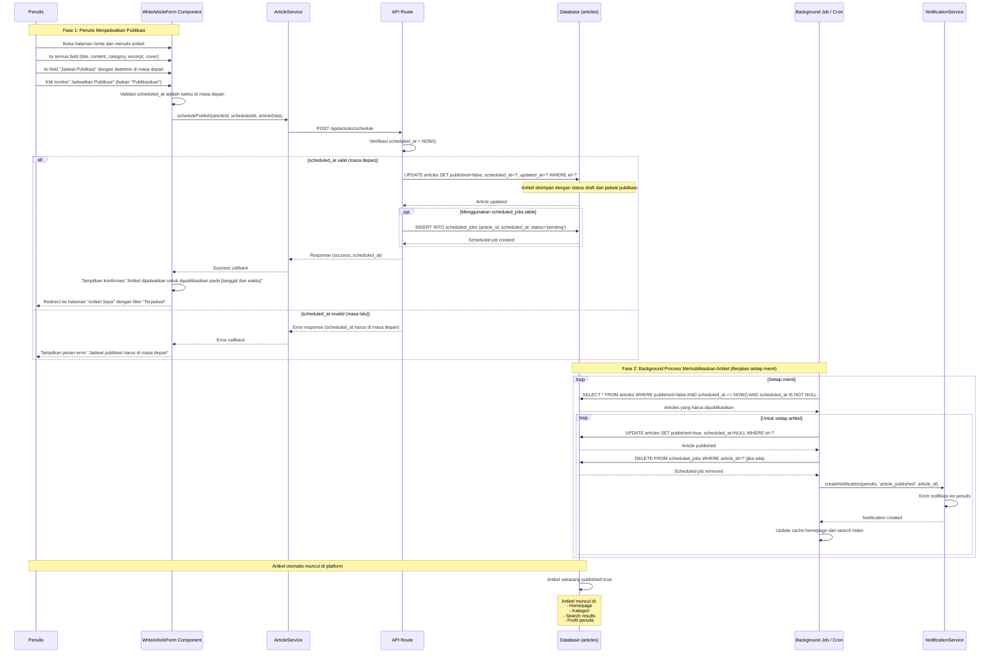
```mermaid
sequenceDiagram
    participant Penulis
    participant WriteArticleForm as WriteArticleForm Component
    participant ArticleService
    participant APIRoute as API Route
    participant ArticlesDB as Database (articles)
    participant ScheduledJob as Background Job / Cron
    participant NotificationService
    
    Note over Penulis,WriteArticleForm: Fase 1: Penulis Menjadwalkan Publikasi
    Penulis->>WriteArticleForm: Buka halaman /write dan menulis artikel
    Penulis->>WriteArticleForm: Isi semua field (title, content, category, excerpt, cover)
    Penulis->>WriteArticleForm: Isi field "Jadwal Publikasi" dengan datetime di masa depan
    Penulis->>WriteArticleForm: Klik tombol "Jadwalkan Publikasi" (bukan "Publikasikan")
    
    WriteArticleForm->>WriteArticleForm: Validasi scheduled_at adalah waktu di masa depan
    WriteArticleForm->>ArticleService: schedulePublish(articleId, scheduledAt, articleData)
    ArticleService->>APIRoute: POST /api/articles/schedule
    APIRoute->>APIRoute: Verifikasi scheduled_at > NOW()
    
    alt scheduled_at valid (masa depan)
        APIRoute->>ArticlesDB: UPDATE articles SET published=false, scheduled_at=?, updated_at=? WHERE id=?
        Note over ArticlesDB: Artikel disimpan dengan status draft dan jadwal publikasi
        ArticlesDB-->>APIRoute: Article updated
        
        opt Menggunakan scheduled_jobs table
            APIRoute->>ArticlesDB: INSERT INTO scheduled_jobs (article_id, scheduled_at, status='pending')
            ArticlesDB-->>APIRoute: Scheduled job created
        end
        
        APIRoute-->>ArticleService: Response (success, scheduled_at)
        ArticleService-->>WriteArticleForm: Success callback
        WriteArticleForm->>WriteArticleForm: Tampilkan konfirmasi "Artikel dijadwalkan untuk dipublikasikan pada [tanggal dan waktu]"
        WriteArticleForm-->>Penulis: Redirect ke halaman "Artikel Saya" dengan filter "Terjadwal"
    else scheduled_at invalid (masa lalu)
        APIRoute-->>ArticleService: Error response (scheduled_at harus di masa depan)
        ArticleService-->>WriteArticleForm: Error callback
        WriteArticleForm-->>Penulis: Tampilkan pesan error "Jadwal publikasi harus di masa depan"
    end
    
    Note over ScheduledJob,ArticlesDB: Fase 2: Background Process Memublikasikan Artikel (Berjalan setiap menit)
    loop Setiap menit
        ScheduledJob->>ArticlesDB: SELECT * FROM articles WHERE published=false AND scheduled_at <= NOW() AND scheduled_at IS NOT NULL
        ArticlesDB-->>ScheduledJob: Articles yang harus dipublikasikan
        
        loop Untuk setiap artikel
            ScheduledJob->>ArticlesDB: UPDATE articles SET published=true, scheduled_at=NULL WHERE id=?
            ArticlesDB-->>ScheduledJob: Article published
            
            ScheduledJob->>ArticlesDB: DELETE FROM scheduled_jobs WHERE article_id=? (jika ada)
            ArticlesDB-->>ScheduledJob: Scheduled job removed
            
            ScheduledJob->>NotificationService: createNotification(penulis, 'article_published', article_id)
            NotificationService->>NotificationService: Kirim notifikasi ke penulis
            NotificationService-->>ScheduledJob: Notification created
            
            ScheduledJob->>ScheduledJob: Update cache homepage dan search index
        end
    end
    
    Note over ArticlesDB,Penulis: Artikel otomatis muncul di platform
    ArticlesDB->>ArticlesDB: Artikel sekarang published=true
    Note over ArticlesDB: Artikel muncul di:<br/>- Homepage<br/>- Kategori<br/>- Search results<br/>- Profil penulis
```

**Alur Proses:**

### **5.2.11 Sequence Diagram Mengedit Artikel** {#5.2.11-sequence-diagram-edit-article}

Gambaran proses interaksi antar sistem saat pengguna akan melihat halaman beranda dapat diamati pada Gambar 5.14. Sequence diagram ini menggambarkan alur loading homepage dengan featured content, latest articles, dan kategori.

**Gambar 5.14 Sequence Diagram Mengedit Artikel**

> **Placeholder Diagram:** `bab5-sequence-edit-article.png`  
> **Deskripsi:** Diagram menunjukkan interaksi antara Penulis, WriteArticleForm Component (mode edit), ArticleService, API Route, dan Supabase Database. Alur dimulai dari penulis membuka halaman `/write?edit=articleId`, WriteArticleForm memanggil ArticleService.getArticleForEdit(articleId), API route query artikel dengan verifikasi ownership (author_id = current_user), API route mengembalikan artikel, WriteArticleForm memuat data ke form editor, penulis mengedit konten, penulis klik "Simpan Perubahan", WriteArticleForm memanggil ArticleService.updateArticle(articleId, data), API route memverifikasi ownership, API route memperbarui artikel di database, API route mengembalikan response, dan WriteArticleForm menampilkan notifikasi sukses.  
> **Catatan:** Kode Mermaid di bawah ini dapat digunakan untuk generate gambar diagram. Export dari [Mermaid Live Editor](https://mermaid.live) atau tool lain sebagai PNG dengan nama `bab5-sequence-edit-article.png`.

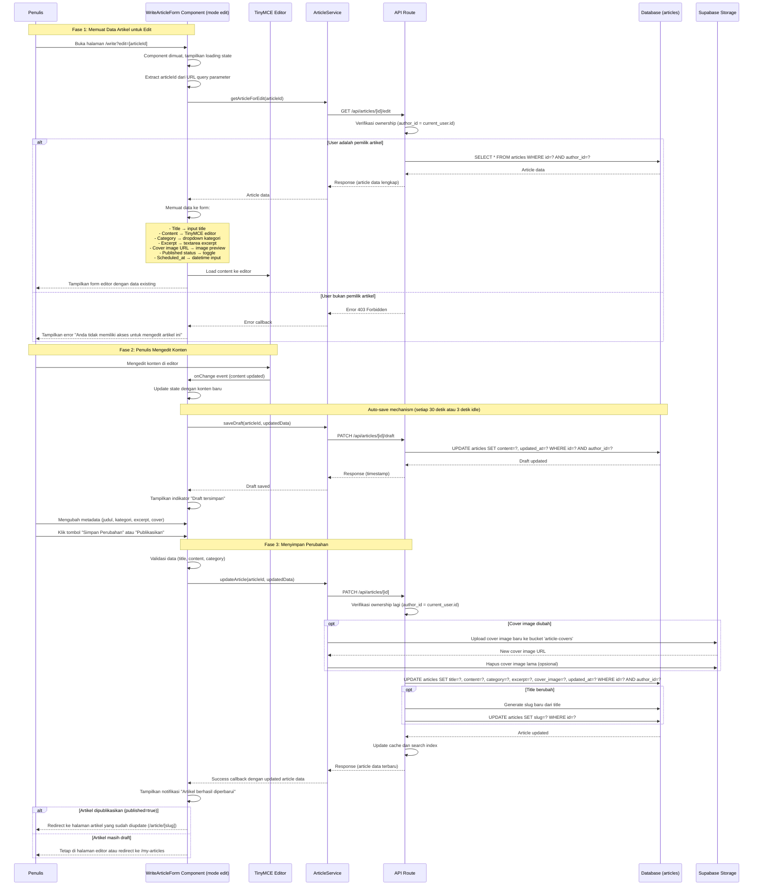
```mermaid
sequenceDiagram
    participant Penulis
    participant WriteArticleForm as WriteArticleForm Component (mode edit)
    participant TinyMCE as TinyMCE Editor
    participant ArticleService
    participant APIRoute as API Route
    participant ArticlesDB as Database (articles)
    participant Storage as Supabase Storage
    
    Note over Penulis,WriteArticleForm: Fase 1: Memuat Data Artikel untuk Edit
    Penulis->>WriteArticleForm: Buka halaman /write?edit=[articleId]
    WriteArticleForm->>WriteArticleForm: Component dimuat, tampilkan loading state
    WriteArticleForm->>WriteArticleForm: Extract articleId dari URL query parameter
    WriteArticleForm->>ArticleService: getArticleForEdit(articleId)
    ArticleService->>APIRoute: GET /api/articles/[id]/edit
    APIRoute->>APIRoute: Verifikasi ownership (author_id = current_user.id)
    
    alt User adalah pemilik artikel
        APIRoute->>ArticlesDB: SELECT * FROM articles WHERE id=? AND author_id=?
        ArticlesDB-->>APIRoute: Article data
        APIRoute-->>ArticleService: Response (article data lengkap)
        ArticleService-->>WriteArticleForm: Article data
        
        WriteArticleForm->>WriteArticleForm: Memuat data ke form:
        Note over WriteArticleForm: - Title → input title<br/>- Content → TinyMCE editor<br/>- Category → dropdown kategori<br/>- Excerpt → textarea excerpt<br/>- Cover image URL → image preview<br/>- Published status → toggle<br/>- Scheduled_at → datetime input
        WriteArticleForm->>TinyMCE: Load content ke editor
        WriteArticleForm-->>Penulis: Tampilkan form editor dengan data existing
    else User bukan pemilik artikel
        APIRoute-->>ArticleService: Error 403 Forbidden
        ArticleService-->>WriteArticleForm: Error callback
        WriteArticleForm-->>Penulis: Tampilkan error "Anda tidak memiliki akses untuk mengedit artikel ini"
    end
    
    Note over Penulis,TinyMCE: Fase 2: Penulis Mengedit Konten
    Penulis->>TinyMCE: Mengedit konten di editor
    TinyMCE->>WriteArticleForm: onChange event (content updated)
    WriteArticleForm->>WriteArticleForm: Update state dengan konten baru
    
    Note over WriteArticleForm,ArticlesDB: Auto-save mechanism (setiap 30 detik atau 3 detik idle)
    WriteArticleForm->>ArticleService: saveDraft(articleId, updatedData)
    ArticleService->>APIRoute: PATCH /api/articles/[id]/draft
    APIRoute->>ArticlesDB: UPDATE articles SET content=?, updated_at=? WHERE id=? AND author_id=?
    ArticlesDB-->>APIRoute: Draft updated
    APIRoute-->>ArticleService: Response (timestamp)
    ArticleService-->>WriteArticleForm: Draft saved
    WriteArticleForm->>WriteArticleForm: Tampilkan indikator "Draft tersimpan"
    
    Penulis->>WriteArticleForm: Mengubah metadata (judul, kategori, excerpt, cover)
    Penulis->>WriteArticleForm: Klik tombol "Simpan Perubahan" atau "Publikasikan"
    
    Note over WriteArticleForm,APIRoute: Fase 3: Menyimpan Perubahan
    WriteArticleForm->>WriteArticleForm: Validasi data (title, content, category)
    WriteArticleForm->>ArticleService: updateArticle(articleId, updatedData)
    ArticleService->>APIRoute: PATCH /api/articles/[id]
    APIRoute->>APIRoute: Verifikasi ownership lagi (author_id = current_user.id)
    
    opt Cover image diubah
        ArticleService->>Storage: Upload cover image baru ke bucket 'article-covers'
        Storage-->>ArticleService: New cover image URL
        ArticleService->>Storage: Hapus cover image lama (opsional)
    end
    
    APIRoute->>ArticlesDB: UPDATE articles SET title=?, content=?, category=?, excerpt=?, cover_image=?, updated_at=? WHERE id=? AND author_id=?
    
    opt Title berubah
        APIRoute->>ArticlesDB: Generate slug baru dari title
        APIRoute->>ArticlesDB: UPDATE articles SET slug=? WHERE id=?
    end
    
    ArticlesDB-->>APIRoute: Article updated
    APIRoute->>APIRoute: Update cache dan search index
    APIRoute-->>ArticleService: Response (article data terbaru)
    ArticleService-->>WriteArticleForm: Success callback dengan updated article data
    WriteArticleForm->>WriteArticleForm: Tampilkan notifikasi "Artikel berhasil diperbarui"
    
    alt Artikel dipublikasikan (published=true)
        WriteArticleForm-->>Penulis: Redirect ke halaman artikel yang sudah diupdate (/article/[slug])
    else Artikel masih draft
        WriteArticleForm-->>Penulis: Tetap di halaman editor atau redirect ke /my-articles
    end
```

**Alur Proses:**

### **5.2.12 Sequence Diagram Menghapus Artikel** {#5.2.12-sequence-diagram-delete-article}

Gambaran proses interaksi antar sistem saat penulis akan menghapus artikel miliknya dapat diamati pada Gambar 5.15. Sequence diagram ini menggambarkan alur delete artikel dengan konfirmasi dan cascade delete.

**Gambar 5.15 Sequence Diagram Menghapus Artikel**

> **Placeholder Diagram:** `bab5-sequence-delete-article.png`  
> **Deskripsi:** Diagram menunjukkan interaksi antara Penulis, MyArticlesPage Component, ArticleService, API Route, dan Supabase Database. Alur dimulai dari penulis membuka halaman "Artikel Saya", penulis melihat daftar artikel, penulis klik tombol "Hapus" pada artikel tertentu, MyArticlesPage menampilkan modal konfirmasi, penulis mengkonfirmasi penghapusan, MyArticlesPage memanggil ArticleService.deleteArticle(articleId), ArticleService memanggil API route, API route memverifikasi ownership, API route menghapus artikel dari database (ON DELETE CASCADE akan menghapus komentar, likes, reports terkait), API route mengembalikan response, dan MyArticlesPage memperbarui daftar artikel.  
> **Catatan:** Kode Mermaid di bawah ini dapat digunakan untuk generate gambar diagram. Export dari [Mermaid Live Editor](https://mermaid.live) atau tool lain sebagai PNG dengan nama `bab5-sequence-delete-article.png`.

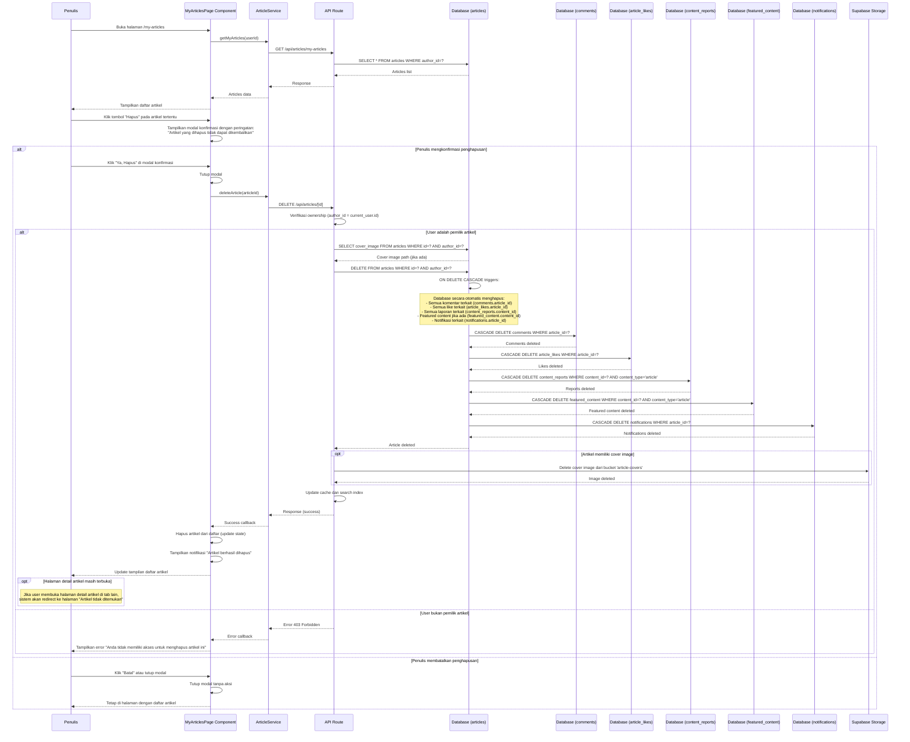
```mermaid
sequenceDiagram
    participant Penulis
    participant MyArticlesPage as MyArticlesPage Component
    participant ArticleService
    participant APIRoute as API Route
    participant ArticlesDB as Database (articles)
    participant CommentsDB as Database (comments)
    participant LikesDB as Database (article_likes)
    participant ReportsDB as Database (content_reports)
    participant FeaturedDB as Database (featured_content)
    participant NotificationsDB as Database (notifications)
    participant Storage as Supabase Storage
    
    Penulis->>MyArticlesPage: Buka halaman /my-articles
    MyArticlesPage->>ArticleService: getMyArticles(userId)
    ArticleService->>APIRoute: GET /api/articles/my-articles
    APIRoute->>ArticlesDB: SELECT * FROM articles WHERE author_id=?
    ArticlesDB-->>APIRoute: Articles list
    APIRoute-->>ArticleService: Response
    ArticleService-->>MyArticlesPage: Articles data
    MyArticlesPage-->>Penulis: Tampilkan daftar artikel
    
    Penulis->>MyArticlesPage: Klik tombol "Hapus" pada artikel tertentu
    MyArticlesPage->>MyArticlesPage: Tampilkan modal konfirmasi dengan peringatan:<br/>"Artikel yang dihapus tidak dapat dikembalikan"
    
    alt Penulis mengkonfirmasi penghapusan
        Penulis->>MyArticlesPage: Klik "Ya, Hapus" di modal konfirmasi
        MyArticlesPage->>MyArticlesPage: Tutup modal
        MyArticlesPage->>ArticleService: deleteArticle(articleId)
        ArticleService->>APIRoute: DELETE /api/articles/[id]
        APIRoute->>APIRoute: Verifikasi ownership (author_id = current_user.id)
        
        alt User adalah pemilik artikel
            APIRoute->>ArticlesDB: SELECT cover_image FROM articles WHERE id=? AND author_id=?
            ArticlesDB-->>APIRoute: Cover image path (jika ada)
            
            APIRoute->>ArticlesDB: DELETE FROM articles WHERE id=? AND author_id=?
            ArticlesDB->>ArticlesDB: ON DELETE CASCADE triggers:
            Note over ArticlesDB: Database secara otomatis menghapus:<br/>- Semua komentar terkait (comments.article_id)<br/>- Semua like terkait (article_likes.article_id)<br/>- Semua laporan terkait (content_reports.content_id)<br/>- Featured content jika ada (featured_content.content_id)<br/>- Notifikasi terkait (notifications.article_id)
            
            ArticlesDB->>CommentsDB: CASCADE DELETE comments WHERE article_id=?
            CommentsDB-->>ArticlesDB: Comments deleted
            ArticlesDB->>LikesDB: CASCADE DELETE article_likes WHERE article_id=?
            LikesDB-->>ArticlesDB: Likes deleted
            ArticlesDB->>ReportsDB: CASCADE DELETE content_reports WHERE content_id=? AND content_type='article'
            ReportsDB-->>ArticlesDB: Reports deleted
            ArticlesDB->>FeaturedDB: CASCADE DELETE featured_content WHERE content_id=? AND content_type='article'
            FeaturedDB-->>ArticlesDB: Featured content deleted
            ArticlesDB->>NotificationsDB: CASCADE DELETE notifications WHERE article_id=?
            NotificationsDB-->>ArticlesDB: Notifications deleted
            
            ArticlesDB-->>APIRoute: Article deleted
            
            opt Artikel memiliki cover image
                APIRoute->>Storage: Delete cover image dari bucket 'article-covers'
                Storage-->>APIRoute: Image deleted
            end
            
            APIRoute->>APIRoute: Update cache dan search index
            APIRoute-->>ArticleService: Response (success)
            ArticleService-->>MyArticlesPage: Success callback
            MyArticlesPage->>MyArticlesPage: Hapus artikel dari daftar (update state)
            MyArticlesPage->>MyArticlesPage: Tampilkan notifikasi "Artikel berhasil dihapus"
            MyArticlesPage-->>Penulis: Update tampilan daftar artikel
            
            opt Halaman detail artikel masih terbuka
                Note over Penulis: Jika user membuka halaman detail artikel di tab lain,<br/>sistem akan redirect ke halaman "Artikel tidak ditemukan"
            end
        else User bukan pemilik artikel
            APIRoute-->>ArticleService: Error 403 Forbidden
            ArticleService-->>MyArticlesPage: Error callback
            MyArticlesPage-->>Penulis: Tampilkan error "Anda tidak memiliki akses untuk menghapus artikel ini"
        end
    else Penulis membatalkan penghapusan
        Penulis->>MyArticlesPage: Klik "Batal" atau tutup modal
        MyArticlesPage->>MyArticlesPage: Tutup modal tanpa aksi
        MyArticlesPage-->>Penulis: Tetap di halaman dengan daftar artikel
    end
```

**Alur Proses:**
1. Penulis membuka halaman `/my-articles` dan melihat daftar artikel miliknya
2. Penulis melihat artikel yang ingin dihapus dan klik tombol "Hapus"
3. MyArticlesPage component menampilkan modal konfirmasi dengan peringatan "Artikel yang dihapus tidak dapat dikembalikan"
4. Penulis mengkonfirmasi penghapusan dengan klik "Ya, Hapus"
5. MyArticlesPage memanggil ArticleService.deleteArticle(articleId)
6. ArticleService memanggil API route `/api/articles/[id]` dengan method DELETE
7. API route memverifikasi bahwa user adalah pemilik artikel (author_id = current_user.id)
8. Jika bukan pemilik, API route mengembalikan error 403 Forbidden
9. Jika pemilik, API route melakukan DELETE pada tabel articles berdasarkan id
10. Database secara otomatis melakukan CASCADE DELETE:
    - Menghapus semua komentar terkait (tabel comments dengan article_id)
    - Menghapus semua like terkait (tabel article_likes dengan article_id)
    - Menghapus semua laporan terkait (tabel content_reports dengan content_id)
    - Menghapus featured content jika ada (tabel featured_content dengan content_id)
    - Menghapus notifikasi terkait (tabel notifications dengan article_id)
11. Jika artikel memiliki cover image, sistem dapat menghapus file dari Supabase Storage (opsional)
12. API route mengembalikan response sukses
13. ArticleService memperbarui state
14. MyArticlesPage menghapus artikel dari daftar dan menampilkan notifikasi "Artikel berhasil dihapus"
15. Jika halaman detail artikel masih terbuka, sistem mengarahkan ke halaman "Artikel tidak ditemukan"

### **5.2.13 Sequence Diagram Memberi Like Artikel** {#5.2.13-sequence-diagram-like-artikel}

Gambaran proses interaksi antar sistem saat penulis akan mengedit artikel yang sudah dibuat dapat diamati pada Gambar 5.16. Sequence diagram ini menggambarkan alur edit artikel dengan loading data existing dan update.

**Gambar 5.16 Sequence Diagram Memberi Like Artikel**

> **Placeholder Diagram:** `bab5-sequence-like-article.png`  
> **Deskripsi:** Diagram menunjukkan interaksi antara User, ArticleDetailPage Component, LikeButton Component, LikeService, API Route, Supabase Database, dan NotificationService. Alur dimulai dari user klik tombol like, ArticleDetailPage melakukan optimistic update (langsung update UI), LikeService memanggil API route, API route memeriksa apakah user sudah like sebelumnya, jika belum menyimpan like ke tabel article_likes, trigger database memperbarui likes_count di tabel articles, sistem membuat notifikasi untuk penulis artikel (jika bukan like sendiri), API mengembalikan response, dan jika gagal, UI di-rollback ke state sebelumnya.  
> **Catatan:** Kode Mermaid di bawah ini dapat digunakan untuk generate gambar diagram. Export dari [Mermaid Live Editor](https://mermaid.live) atau tool lain sebagai PNG dengan nama `bab5-sequence-like-article.png`.

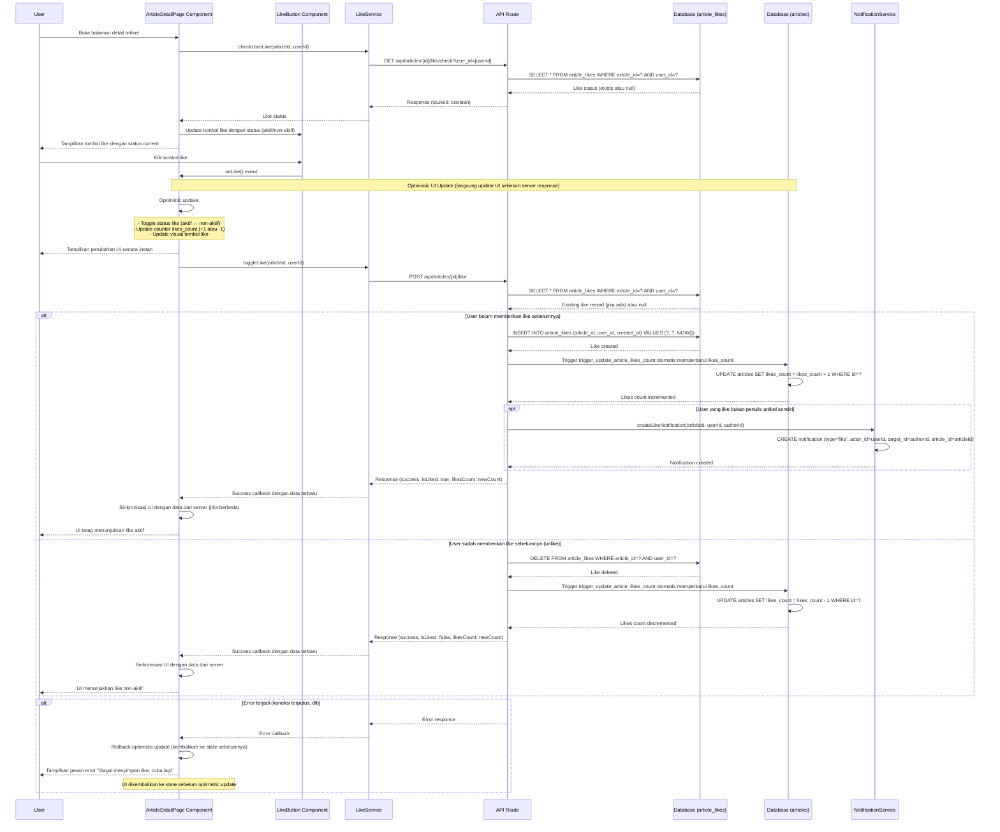
```mermaid
sequenceDiagram
    participant User
    participant ArticleDetailPage as ArticleDetailPage Component
    participant LikeButton as LikeButton Component
    participant LikeService
    participant APIRoute as API Route
    participant LikesDB as Database (article_likes)
    participant ArticlesDB as Database (articles)
    participant NotificationService
    
    User->>ArticleDetailPage: Buka halaman detail artikel
    ArticleDetailPage->>LikeService: checkUserLike(articleId, userId)
    LikeService->>APIRoute: GET /api/articles/[id]/like/check?user_id=[userId]
    APIRoute->>LikesDB: SELECT * FROM article_likes WHERE article_id=? AND user_id=?
    LikesDB-->>APIRoute: Like status (exists atau null)
    APIRoute-->>LikeService: Response (isLiked: boolean)
    LikeService-->>ArticleDetailPage: Like status
    ArticleDetailPage->>LikeButton: Update tombol like dengan status (aktif/non-aktif)
    ArticleDetailPage-->>User: Tampilkan tombol like dengan status current
    
    User->>LikeButton: Klik tombol like
    LikeButton->>ArticleDetailPage: onLike() event
    
    Note over ArticleDetailPage,ArticlesDB: Optimistic UI Update (langsung update UI sebelum server response)
    ArticleDetailPage->>ArticleDetailPage: Optimistic update:
    Note over ArticleDetailPage: - Toggle status like (aktif ↔ non-aktif)<br/>- Update counter likes_count (+1 atau -1)<br/>- Update visual tombol like
    ArticleDetailPage-->>User: Tampilkan perubahan UI secara instan
    
    ArticleDetailPage->>LikeService: toggleLike(articleId, userId)
    LikeService->>APIRoute: POST /api/articles/[id]/like
    APIRoute->>LikesDB: SELECT * FROM article_likes WHERE article_id=? AND user_id=?
    LikesDB-->>APIRoute: Existing like record (jika ada) atau null
    
    alt User belum memberikan like sebelumnya
        APIRoute->>LikesDB: INSERT INTO article_likes (article_id, user_id, created_at) VALUES (?, ?, NOW())
        LikesDB-->>APIRoute: Like created
        APIRoute->>ArticlesDB: Trigger trigger_update_article_likes_count otomatis memperbarui likes_count
        ArticlesDB->>ArticlesDB: UPDATE articles SET likes_count = likes_count + 1 WHERE id=?
        ArticlesDB-->>APIRoute: Likes count incremented
        
        opt User yang like bukan penulis artikel sendiri
            APIRoute->>NotificationService: createLikeNotification(articleId, userId, authorId)
            NotificationService->>NotificationService: CREATE notification (type='like', actor_id=userId, target_id=authorId, article_id=articleId)
            NotificationService-->>APIRoute: Notification created
        end
        
        APIRoute-->>LikeService: Response (success, isLiked: true, likesCount: newCount)
        LikeService-->>ArticleDetailPage: Success callback dengan data terbaru
        ArticleDetailPage->>ArticleDetailPage: Sinkronisasi UI dengan data dari server (jika berbeda)
        ArticleDetailPage-->>User: UI tetap menunjukkan like aktif
    else User sudah memberikan like sebelumnya (unlike)
        APIRoute->>LikesDB: DELETE FROM article_likes WHERE article_id=? AND user_id=?
        LikesDB-->>APIRoute: Like deleted
        APIRoute->>ArticlesDB: Trigger trigger_update_article_likes_count otomatis memperbarui likes_count
        ArticlesDB->>ArticlesDB: UPDATE articles SET likes_count = likes_count - 1 WHERE id=?
        ArticlesDB-->>APIRoute: Likes count decremented
        APIRoute-->>LikeService: Response (success, isLiked: false, likesCount: newCount)
        LikeService-->>ArticleDetailPage: Success callback dengan data terbaru
        ArticleDetailPage->>ArticleDetailPage: Sinkronisasi UI dengan data dari server
        ArticleDetailPage-->>User: UI menunjukkan like non-aktif
    end
    
    alt Error terjadi (koneksi terputus, dll)
        APIRoute-->>LikeService: Error response
        LikeService-->>ArticleDetailPage: Error callback
        ArticleDetailPage->>ArticleDetailPage: Rollback optimistic update (kembalikan ke state sebelumnya)
        ArticleDetailPage-->>User: Tampilkan pesan error "Gagal menyimpan like, coba lagi"
        Note over ArticleDetailPage: UI dikembalikan ke state sebelum optimistic update
    end
```

**Alur Proses:**
1. User membuka halaman detail artikel dan melihat tombol like
2. ArticleDetailPage memanggil LikeService.checkUserLike() untuk memeriksa status like user
3. API route memeriksa apakah user sudah memberikan like sebelumnya
4. ArticleDetailPage menampilkan tombol like dengan status current (aktif/non-aktif)
5. User klik tombol like
6. ArticleDetailPage melakukan optimistic update: langsung memperbarui UI (tombol like menjadi aktif, counter bertambah) tanpa menunggu server response
7. ArticleDetailPage memanggil LikeService.toggleLike(articleId)
8. LikeService memanggil API route `/api/articles/[id]/like` dengan method POST
9. API route memeriksa apakah user sudah memberikan like sebelumnya
10. Jika belum, API route menyimpan record baru ke tabel article_likes
11. Trigger database `trigger_update_article_likes_count` otomatis memperbarui `likes_count` di tabel articles
12. Jika user yang like bukan penulis artikel sendiri, sistem membuat notifikasi melalui NotificationService
13. API route mengembalikan response sukses dengan data like terbaru
14. LikeService memperbarui state dengan data dari server (untuk sinkronisasi)
15. ArticleDetailPage menampilkan UI dengan status like terbaru
16. Jika terjadi error, ArticleDetailPage melakukan rollback optimistic update dan menampilkan pesan error

### **5.2.14 Sequence Diagram Menulis Komentar** {#5.2.14-sequence-diagram-komentar}

Gambaran proses interaksi antar sistem saat pengguna akan menulis komentar pada artikel dapat diamati pada Gambar 5.17. Sequence diagram ini menggambarkan alur komentar dengan dukungan threaded comments (komentar berulir).

**Gambar 5.17 Sequence Diagram Menulis Komentar**

> **Placeholder Diagram:** `bab5-sequence-comment.png`  
> **Deskripsi:** Diagram menunjukkan interaksi antara User, ArticleDetail Component, CommentForm, CommentService, API Route, Supabase Database, dan NotificationService. Alur dimulai dari user mengisi form komentar, user klik submit, CommentForm melakukan validasi, CommentService memanggil API route, API route menyimpan komentar ke tabel comments, trigger database memperbarui comments_count di tabel articles, sistem membuat notifikasi untuk penulis artikel, API mengembalikan komentar yang baru dibuat, CommentService memperbarui state, dan CommentForm menampilkan komentar baru di list dengan optimistic UI.  
> **Catatan:** Kode Mermaid di bawah ini dapat digunakan untuk generate gambar diagram. Export dari [Mermaid Live Editor](https://mermaid.live) atau tool lain sebagai PNG dengan nama `bab5-sequence-comment.png`.

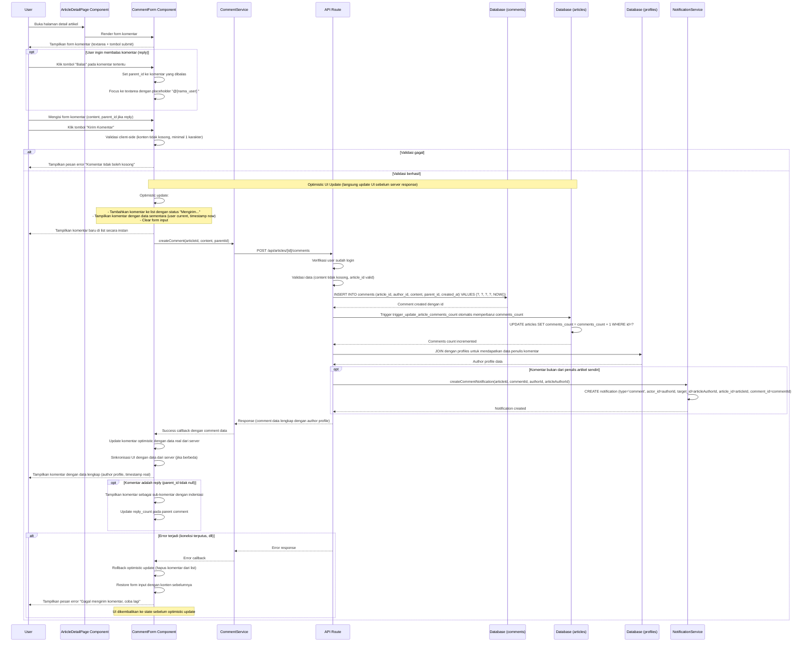
```mermaid
sequenceDiagram
    participant User
    participant ArticleDetailPage as ArticleDetailPage Component
    participant CommentForm as CommentForm Component
    participant CommentService
    participant APIRoute as API Route
    participant CommentsDB as Database (comments)
    participant ArticlesDB as Database (articles)
    participant ProfilesDB as Database (profiles)
    participant NotificationService
    
    User->>ArticleDetailPage: Buka halaman detail artikel
    ArticleDetailPage->>CommentForm: Render form komentar
    CommentForm-->>User: Tampilkan form komentar (textarea + tombol submit)
    
    opt User ingin membalas komentar (reply)
        User->>CommentForm: Klik tombol "Balas" pada komentar tertentu
        CommentForm->>CommentForm: Set parent_id ke komentar yang dibalas
        CommentForm->>CommentForm: Focus ke textarea dengan placeholder "@[nama_user] "
    end
    
    User->>CommentForm: Mengisi form komentar (content, parent_id jika reply)
    User->>CommentForm: Klik tombol "Kirim Komentar"
    
    CommentForm->>CommentForm: Validasi client-side (konten tidak kosong, minimal 1 karakter)
    
    alt Validasi gagal
        CommentForm-->>User: Tampilkan pesan error "Komentar tidak boleh kosong"
    else Validasi berhasil
        Note over CommentForm,ArticlesDB: Optimistic UI Update (langsung update UI sebelum server response)
        CommentForm->>CommentForm: Optimistic update:
        Note over CommentForm: - Tambahkan komentar ke list dengan status "Mengirim..."<br/>- Tampilkan komentar dengan data sementara (user current, timestamp now)<br/>- Clear form input
        CommentForm-->>User: Tampilkan komentar baru di list secara instan
        
        CommentForm->>CommentService: createComment(articleId, content, parentId)
        CommentService->>APIRoute: POST /api/articles/[id]/comments
        APIRoute->>APIRoute: Verifikasi user sudah login
        APIRoute->>APIRoute: Validasi data (content tidak kosong, article_id valid)
        
        APIRoute->>CommentsDB: INSERT INTO comments (article_id, author_id, content, parent_id, created_at) VALUES (?, ?, ?, ?, NOW())
        CommentsDB-->>APIRoute: Comment created dengan id
        
        APIRoute->>ArticlesDB: Trigger trigger_update_article_comments_count otomatis memperbarui comments_count
        ArticlesDB->>ArticlesDB: UPDATE articles SET comments_count = comments_count + 1 WHERE id=?
        ArticlesDB-->>APIRoute: Comments count incremented
        
        APIRoute->>ProfilesDB: JOIN dengan profiles untuk mendapatkan data penulis komentar
        ProfilesDB-->>APIRoute: Author profile data
        
        opt Komentar bukan dari penulis artikel sendiri
            APIRoute->>NotificationService: createCommentNotification(articleId, commentId, authorId, articleAuthorId)
            NotificationService->>NotificationService: CREATE notification (type='comment', actor_id=authorId, target_id=articleAuthorId, article_id=articleId, comment_id=commentId)
            NotificationService-->>APIRoute: Notification created
        end
        
        APIRoute-->>CommentService: Response (comment data lengkap dengan author profile)
        CommentService-->>CommentForm: Success callback dengan comment data
        CommentForm->>CommentForm: Update komentar optimistic dengan data real dari server
        CommentForm->>CommentForm: Sinkronisasi UI dengan data dari server (jika berbeda)
        CommentForm-->>User: Tampilkan komentar dengan data lengkap (author profile, timestamp real)
        
        opt Komentar adalah reply (parent_id tidak null)
            CommentForm->>CommentForm: Tampilkan komentar sebagai sub-komentar dengan indentasi
            CommentForm->>CommentForm: Update reply_count pada parent comment
        end
        
        alt Error terjadi (koneksi terputus, dll)
            APIRoute-->>CommentService: Error response
            CommentService-->>CommentForm: Error callback
            CommentForm->>CommentForm: Rollback optimistic update (hapus komentar dari list)
            CommentForm->>CommentForm: Restore form input dengan konten sebelumnya
            CommentForm-->>User: Tampilkan pesan error "Gagal mengirim komentar, coba lagi"
            Note over CommentForm: UI dikembalikan ke state sebelum optimistic update
        end
    end
```

**Alur Proses:**
1. User membuka halaman detail artikel dan melihat form komentar
2. User mengisi form komentar (jika reply, parent_id diisi)
3. User klik tombol "Kirim Komentar"
4. CommentForm component melakukan validasi (konten tidak kosong)
5. CommentForm memanggil CommentService.createComment(articleId, content, parentId)
6. CommentService memanggil API route `/api/articles/[id]/comments` dengan method POST
7. API route menyimpan komentar ke tabel comments dengan author_id dari session
8. Trigger database `trigger_update_article_comments_count` otomatis memperbarui `comments_count` di tabel articles
9. Jika komentar bukan dari penulis artikel sendiri, sistem membuat notifikasi melalui NotificationService.createCommentNotification()
10. API route mengembalikan response dengan data komentar lengkap termasuk author profile
11. CommentService memperbarui state komentar di ArticleDetail
12. CommentForm menampilkan komentar baru di list komentar dengan animasi
13. Jika komentar adalah reply, komentar ditampilkan sebagai sub-komentar dengan indentasi

### **5.2.15 Sequence Diagram Membalas Komentar** {#5.2.15-sequence-diagram-reply-comment}

Gambaran proses interaksi antar sistem saat penulis akan menambahkan, mengedit, atau menghapus karya portofolio dapat diamati pada Gambar 5.18. Sequence diagram ini menggambarkan alur CRUD portofolio.

**Gambar 5.18 Sequence Diagram Membalas Komentar**

> **Placeholder Diagram:** `bab5-sequence-reply-comment.png`  
> **Deskripsi:** Diagram menunjukkan interaksi antara User, ArticleDetailPage Component, CommentForm Component, CommentService, API Route, dan Supabase Database. Alur dimulai dari user melihat komentar di artikel, user klik tombol "Balas" pada komentar tertentu, CommentForm muncul dengan parent_id terisi, user menulis balasan, user klik "Kirim", CommentForm memanggil CommentService.createComment(articleId, content, parentId), API route menyimpan komentar dengan parent_id, trigger database memperbarui comments_count, sistem membuat notifikasi untuk penulis komentar parent (jika berbeda), API mengembalikan komentar baru, dan CommentForm menampilkan balasan sebagai sub-komentar dengan indentasi.  
> **Catatan:** Kode Mermaid di bawah ini dapat digunakan untuk generate gambar diagram. Export dari [Mermaid Live Editor](https://mermaid.live) atau tool lain sebagai PNG dengan nama `bab5-sequence-reply-comment.png`.

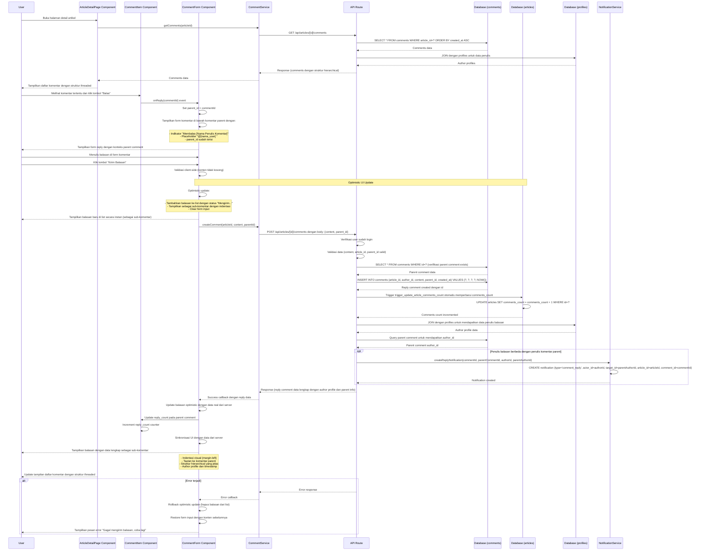
```mermaid
sequenceDiagram
    participant User
    participant ArticleDetailPage as ArticleDetailPage Component
    participant CommentItem as CommentItem Component
    participant CommentForm as CommentForm Component
    participant CommentService
    participant APIRoute as API Route
    participant CommentsDB as Database (comments)
    participant ArticlesDB as Database (articles)
    participant ProfilesDB as Database (profiles)
    participant NotificationService
    
    User->>ArticleDetailPage: Buka halaman detail artikel
    ArticleDetailPage->>CommentService: getComments(articleId)
    CommentService->>APIRoute: GET /api/articles/[id]/comments
    APIRoute->>CommentsDB: SELECT * FROM comments WHERE article_id=? ORDER BY created_at ASC
    CommentsDB-->>APIRoute: Comments data
    APIRoute->>ProfilesDB: JOIN dengan profiles untuk data penulis
    ProfilesDB-->>APIRoute: Author profiles
    APIRoute-->>CommentService: Response (comments dengan struktur hierarchical)
    CommentService-->>ArticleDetailPage: Comments data
    ArticleDetailPage-->>User: Tampilkan daftar komentar dengan struktur threaded
    
    User->>CommentItem: Melihat komentar tertentu dan klik tombol "Balas"
    CommentItem->>CommentForm: onReply(commentId) event
    CommentForm->>CommentForm: Set parent_id = commentId
    CommentForm->>CommentForm: Tampilkan form komentar di bawah komentar parent dengan:
    Note over CommentForm: - Indikator "Membalas [Nama Penulis Komentar]"<br/>- Placeholder "@[nama_user] "<br/>- parent_id sudah terisi
    CommentForm-->>User: Tampilkan form reply dengan konteks parent comment
    
    User->>CommentForm: Menulis balasan di form komentar
    User->>CommentForm: Klik tombol "Kirim Balasan"
    
    CommentForm->>CommentForm: Validasi client-side (konten tidak kosong)
    
    Note over CommentForm,ArticlesDB: Optimistic UI Update
    CommentForm->>CommentForm: Optimistic update:
    Note over CommentForm: - Tambahkan balasan ke list dengan status "Mengirim..."<br/>- Tampilkan sebagai sub-komentar dengan indentasi<br/>- Clear form input
    CommentForm-->>User: Tampilkan balasan baru di list secara instan (sebagai sub-komentar)
    
    CommentForm->>CommentService: createComment(articleId, content, parentId)
    CommentService->>APIRoute: POST /api/articles/[id]/comments dengan body: {content, parent_id}
    APIRoute->>APIRoute: Verifikasi user sudah login
    APIRoute->>APIRoute: Validasi data (content, article_id, parent_id valid)
    
    APIRoute->>CommentsDB: SELECT * FROM comments WHERE id=? (verifikasi parent comment exists)
    CommentsDB-->>APIRoute: Parent comment data
    
    APIRoute->>CommentsDB: INSERT INTO comments (article_id, author_id, content, parent_id, created_at) VALUES (?, ?, ?, ?, NOW())
    CommentsDB-->>APIRoute: Reply comment created dengan id
    
    APIRoute->>ArticlesDB: Trigger trigger_update_article_comments_count otomatis memperbarui comments_count
    ArticlesDB->>ArticlesDB: UPDATE articles SET comments_count = comments_count + 1 WHERE id=?
    ArticlesDB-->>APIRoute: Comments count incremented
    
    APIRoute->>ProfilesDB: JOIN dengan profiles untuk mendapatkan data penulis balasan
    ProfilesDB-->>APIRoute: Author profile data
    
    APIRoute->>CommentsDB: Query parent comment untuk mendapatkan author_id
    CommentsDB-->>APIRoute: Parent comment author_id
    
    opt Penulis balasan berbeda dengan penulis komentar parent
        APIRoute->>NotificationService: createReplyNotification(commentId, parentCommentId, authorId, parentAuthorId)
        NotificationService->>NotificationService: CREATE notification (type='comment_reply', actor_id=authorId, target_id=parentAuthorId, article_id=articleId, comment_id=commentId)
        NotificationService-->>APIRoute: Notification created
    end
    
    APIRoute-->>CommentService: Response (reply comment data lengkap dengan author profile dan parent info)
    CommentService-->>CommentForm: Success callback dengan reply data
    CommentForm->>CommentForm: Update balasan optimistic dengan data real dari server
    CommentForm->>CommentItem: Update reply_count pada parent comment
    CommentItem->>CommentItem: Increment reply_count counter
    CommentForm->>CommentForm: Sinkronisasi UI dengan data dari server
    CommentForm-->>User: Tampilkan balasan dengan data lengkap sebagai sub-komentar:
    Note over CommentForm: - Indentasi visual (margin-left)<br/>- Tautan ke komentar parent<br/>- Struktur hierarchical yang jelas<br/>- Author profile dan timestamp
    ArticleDetailPage-->>User: Update tampilan daftar komentar dengan struktur threaded
    
    alt Error terjadi
        APIRoute-->>CommentService: Error response
        CommentService-->>CommentForm: Error callback
        CommentForm->>CommentForm: Rollback optimistic update (hapus balasan dari list)
        CommentForm->>CommentForm: Restore form input dengan konten sebelumnya
        CommentForm-->>User: Tampilkan pesan error "Gagal mengirim balasan, coba lagi"
    end
```

**Alur Proses:**
1. User membuka halaman detail artikel dan melihat daftar komentar
2. User melihat komentar yang ingin dibalas dan klik tombol "Balas"
3. CommentForm component muncul di bawah komentar tersebut dengan parent_id sudah terisi
4. CommentForm menampilkan indikator "Membalas [Nama Penulis Komentar]"
5. User menulis balasan di form komentar
6. User klik tombol "Kirim Balasan"
7. CommentForm memanggil CommentService.createComment(articleId, content, parentId)
8. CommentService memanggil API route `/api/articles/[id]/comments` dengan method POST
9. API route menyimpan komentar ke tabel comments dengan:
    - article_id: ID artikel
    - author_id: current_user.id
    - content: isi balasan
    - parent_id: ID komentar yang dibalas
10. Trigger database `trigger_update_article_comments_count` memperbarui `comments_count` di tabel articles
11. API route melakukan query untuk mendapatkan data komentar parent
12. Jika penulis balasan berbeda dengan penulis komentar parent, sistem membuat notifikasi melalui NotificationService
13. API route mengembalikan response dengan data komentar baru termasuk author profile
14. CommentService memperbarui state komentar di ArticleDetailPage
15. CommentForm menampilkan balasan sebagai sub-komentar dengan:
    - Indentasi visual (margin-left)
    - Tautan ke komentar parent
    - Struktur hierarchical yang jelas
16. CommentItem memperbarui reply_count pada komentar parent
17. Jika terjadi error, CommentForm melakukan rollback optimistic update dan menampilkan pesan error

### **5.2.16 Sequence Diagram Follow/Unfollow User** {#5.2.16-sequence-diagram-follow}
1. Penulis membuka halaman detail portofolio dan klik tombol "Edit"
2. PortfolioForm component dimuat dengan data existing
3. Penulis melakukan perubahan pada data portofolio
4. Penulis klik tombol "Simpan Perubahan"
5. PortfolioForm memanggil PortfolioService.updatePortfolio(portfolioId, updatedData)
6. PortfolioService memanggil API route `/api/portfolio/[id]` dengan method PATCH
7. API route memverifikasi ownership (author_id = current_user.id)
8. Jika cover image diubah, API route mengupload gambar baru dan menghapus yang lama
9. API route memperbarui record di tabel portfolio_works
10. API route mengembalikan response sukses
11. PortfolioForm menampilkan notifikasi sukses

**Alur Proses Hapus Portofolio:**
1. Penulis klik tombol "Hapus" pada karya portofolio
2. PortfolioPage menampilkan modal konfirmasi
3. Penulis mengkonfirmasi penghapusan
4. PortfolioPage memanggil PortfolioService.deletePortfolio(portfolioId)
5. PortfolioService memanggil API route `/api/portfolio/[id]` dengan method DELETE
6. API route memverifikasi ownership
7. API route menghapus record dari tabel portfolio_works
8. Jika ada cover image, API route menghapus file dari Storage
9. API route mengembalikan response sukses
10. PortfolioPage menghapus karya dari daftar dan menampilkan notifikasi

### **5.2.16 Sequence Diagram Follow/Unfollow User** {#5.2.16-sequence-diagram-follow}

Gambaran proses interaksi antar sistem saat pengguna akan mengikuti atau berhenti mengikuti member lain dapat diamati pada Gambar 5.19. Sequence diagram ini menggambarkan alur follow/unfollow dengan optimistic update dan notifikasi.

**Gambar 5.19 Sequence Diagram Follow/Unfollow User**

> **Placeholder Diagram:** `bab5-sequence-follow.png`  
> **Deskripsi:** Diagram menunjukkan interaksi antara User, ProfilePage Component, FollowService, API Route, Supabase Database, dan NotificationService. Alur dimulai dari user membuka profil member lain, user melihat tombol "Ikuti", user klik tombol "Ikuti", ProfilePage melakukan optimistic update (tombol menjadi "Mengikuti", counter bertambah), FollowService.follow(userId), API route menyimpan ke tabel follows, trigger database memperbarui followers_count dan following_count, sistem membuat notifikasi untuk user yang diikuti, API mengembalikan response, dan ProfilePage memperbarui state. Untuk unfollow, alur serupa dengan delete dari tabel follows.  
> **Catatan:** Kode Mermaid di bawah ini dapat digunakan untuk generate gambar diagram. Export dari [Mermaid Live Editor](https://mermaid.live) atau tool lain sebagai PNG dengan nama `bab5-sequence-follow.png`.


```mermaid
sequenceDiagram
    participant User
    participant ProfilePage as ProfilePage Component
    participant FollowService
    participant APIRoute as API Route
    participant FollowsDB as Database (follows)
    participant ProfilesDB as Database (profiles)
    participant NotificationService
    
    rect rgb(240, 248, 255)
        Note over User,NotificationService: === ALUR FOLLOW USER ===
        
        User->>ProfilePage: Buka halaman profil member lain (/member/[slug])
        ProfilePage->>FollowService: getFollowStatus(targetUserId)
        FollowService->>APIRoute: GET /api/users/[id]/follow/status
        APIRoute->>FollowsDB: SELECT * FROM follows WHERE follower_id=? AND following_id=?
        FollowsDB-->>APIRoute: Follow status (exists atau null)
        APIRoute-->>FollowService: Response (isFollowing: boolean)
        FollowService-->>ProfilePage: Follow status
        ProfilePage->>ProfilesDB: Query profil target untuk followers_count
        ProfilesDB-->>ProfilePage: Profile data dengan followers_count
        ProfilePage-->>User: Tampilkan profil dengan tombol "Ikuti" (jika belum follow) atau "Mengikuti" (jika sudah follow)
        
        User->>ProfilePage: Klik tombol "Ikuti"
        
        Note over ProfilePage,ProfilesDB: Optimistic UI Update
        ProfilePage->>ProfilePage: Optimistic update:
        Note over ProfilePage: - Tombol langsung berubah menjadi "Mengikuti" dengan style berbeda<br/>- Counter "Pengikut" bertambah 1 secara instan<br/>- Disable tombol untuk mencegah double-click
        ProfilePage-->>User: Tampilkan perubahan UI secara instan (tombol "Mengikuti", counter +1)
        
        ProfilePage->>FollowService: follow(targetUserId)
        FollowService->>APIRoute: POST /api/users/[id]/follow dengan body: {following_id: targetUserId}
        APIRoute->>APIRoute: Verifikasi user sudah login
        APIRoute->>APIRoute: Validasi: user tidak mengikuti dirinya sendiri (follower_id != following_id)
        
        APIRoute->>FollowsDB: SELECT * FROM follows WHERE follower_id=? AND following_id=? (cek duplikasi)
        FollowsDB-->>APIRoute: Existing follow record (jika ada) atau null
        
        alt Follow relationship sudah ada
            APIRoute-->>FollowService: Error: "Sudah mengikuti user ini"
            FollowService-->>ProfilePage: Error callback
            ProfilePage->>ProfilePage: Rollback optimistic update
            ProfilePage-->>User: Tampilkan pesan error "Anda sudah mengikuti user ini"
        else Follow relationship belum ada
            APIRoute->>FollowsDB: INSERT INTO follows (follower_id, following_id, created_at) VALUES (current_user.id, targetUserId, NOW())
            FollowsDB-->>APIRoute: Follow record created dengan id
            
            APIRoute->>ProfilesDB: Trigger trigger_update_profile_follow_counts otomatis memperbarui:
            ProfilesDB->>ProfilesDB: UPDATE profiles SET followers_count = followers_count + 1 WHERE id = targetUserId
            ProfilesDB->>ProfilesDB: UPDATE profiles SET following_count = following_count + 1 WHERE id = current_user.id
            ProfilesDB-->>APIRoute: Counters updated
            
            APIRoute->>NotificationService: Trigger trigger_create_follow_notification membuat notifikasi
            NotificationService->>NotificationService: CREATE notification (type='follow', actor_id=current_user.id, target_id=targetUserId)
            NotificationService-->>APIRoute: Notification created
            
            APIRoute->>ProfilesDB: Query updated profile data dengan followers_count dan following_count
            ProfilesDB-->>APIRoute: Updated profile data
            APIRoute-->>FollowService: Response sukses dengan updated profile data
            FollowService-->>ProfilePage: Success callback dengan data dari server
            ProfilePage->>ProfilePage: Sinkronisasi UI dengan data real dari server (update counters dengan nilai exact)
            ProfilePage-->>User: Tampilkan UI final dengan data terbaru dari server
            
            alt Error terjadi
                APIRoute-->>FollowService: Error response
                FollowService-->>ProfilePage: Error callback
                ProfilePage->>ProfilePage: Rollback optimistic update:
                Note over ProfilePage: - Tombol kembali menjadi "Ikuti"<br/>- Counter "Pengikut" dikurangi 1<br/>- Enable tombol kembali
                ProfilePage-->>User: Tampilkan pesan error "Gagal mengikuti user, coba lagi"
            end
        end
    end
    
    rect rgb(255, 248, 240)
        Note over User,NotificationService: === ALUR UNFOLLOW USER ===
        
        User->>ProfilePage: Klik tombol "Mengikuti" (yang sudah aktif)
        ProfilePage->>ProfilePage: Tampilkan modal konfirmasi "Berhenti mengikuti [Nama]?"
        ProfilePage-->>User: Modal konfirmasi muncul
        
        User->>ProfilePage: Klik "Ya, Berhenti Mengikuti" (konfirmasi)
        
        Note over ProfilePage,ProfilesDB: Optimistic UI Update
        ProfilePage->>ProfilePage: Optimistic update:
        Note over ProfilePage: - Tombol langsung berubah menjadi "Ikuti"<br/>- Counter "Pengikut" berkurang 1 secara instan<br/>- Disable tombol untuk mencegah double-click
        ProfilePage-->>User: Tampilkan perubahan UI secara instan (tombol "Ikuti", counter -1)
        
        ProfilePage->>FollowService: unfollow(targetUserId)
        FollowService->>APIRoute: DELETE /api/users/[id]/follow dengan query: ?following_id=targetUserId
        APIRoute->>APIRoute: Verifikasi user sudah login
        APIRoute->>FollowsDB: SELECT * FROM follows WHERE follower_id=? AND following_id=? (verifikasi follow exists)
        FollowsDB-->>APIRoute: Follow record
        
        alt Follow relationship tidak ada
            APIRoute-->>FollowService: Error: "Tidak mengikuti user ini"
            FollowService-->>ProfilePage: Error callback
            ProfilePage->>ProfilePage: Rollback optimistic update
            ProfilePage-->>User: Tampilkan pesan error "Anda tidak mengikuti user ini"
        else Follow relationship ada
            APIRoute->>FollowsDB: DELETE FROM follows WHERE follower_id=? AND following_id=?
            FollowsDB-->>APIRoute: Follow record deleted
            
            APIRoute->>ProfilesDB: Trigger trigger_update_profile_follow_counts otomatis memperbarui:
            ProfilesDB->>ProfilesDB: UPDATE profiles SET followers_count = followers_count - 1 WHERE id = targetUserId
            ProfilesDB->>ProfilesDB: UPDATE profiles SET following_count = following_count - 1 WHERE id = current_user.id
            ProfilesDB-->>APIRoute: Counters updated
            
            APIRoute->>ProfilesDB: Query updated profile data dengan followers_count dan following_count
            ProfilesDB-->>APIRoute: Updated profile data
            APIRoute-->>FollowService: Response sukses dengan updated profile data
            FollowService-->>ProfilePage: Success callback dengan data dari server
            ProfilePage->>ProfilePage: Sinkronisasi UI dengan data real dari server (update counters dengan nilai exact)
            ProfilePage-->>User: Tampilkan UI final dengan data terbaru dari server
            
            alt Error terjadi
                APIRoute-->>FollowService: Error response
                FollowService-->>ProfilePage: Error callback
                ProfilePage->>ProfilePage: Rollback optimistic update:
                Note over ProfilePage: - Tombol kembali menjadi "Mengikuti"<br/>- Counter "Pengikut" ditambah 1<br/>- Enable tombol kembali
                ProfilePage-->>User: Tampilkan pesan error "Gagal berhenti mengikuti user, coba lagi"
            end
        end
    end
```

**Alur Proses Follow:**
1. User membuka halaman profil member lain melalui URL `/member/[slug]`
2. ProfilePage component memuat data profil dan memeriksa status follow
3. ProfilePage menampilkan tombol "Ikuti" jika belum follow, atau "Mengikuti" jika sudah follow
4. User klik tombol "Ikuti"
5. ProfilePage melakukan optimistic update:
    - Tombol langsung berubah menjadi "Mengikuti" dengan style berbeda
    - Counter "Pengikut" bertambah 1
6. ProfilePage memanggil FollowService.follow(targetUserId)
7. FollowService memanggil API route `/api/users/[id]/follow` dengan method POST
8. API route memverifikasi bahwa user tidak mengikuti dirinya sendiri
9. API route memeriksa apakah relasi follow sudah ada (untuk mencegah duplikasi)
10. API route menyimpan record ke tabel follows dengan follower_id = current_user.id, following_id = targetUserId
11. Trigger database `trigger_update_profile_follow_counts` otomatis memperbarui:
    - `followers_count` di profil user yang diikuti (+1)
    - `following_count` di profil user yang mengikuti (+1)
12. Trigger database `trigger_create_follow_notification` membuat notifikasi untuk user yang diikuti
13. API route mengembalikan response sukses
14. FollowService memperbarui state dengan data dari server (untuk sinkronisasi)
15. Jika terjadi error, ProfilePage melakukan rollback optimistic update dan menampilkan pesan error

**Alur Proses Unfollow:**
1. User klik tombol "Mengikuti" (yang sudah aktif)
2. ProfilePage menampilkan konfirmasi "Berhenti mengikuti [Nama]?"
3. User mengkonfirmasi
4. ProfilePage melakukan optimistic update (tombol menjadi "Ikuti", counter berkurang 1)
5. ProfilePage memanggil FollowService.unfollow(targetUserId)
6. FollowService memanggil API route `/api/users/[id]/follow` dengan method DELETE
7. API route menghapus record dari tabel follows
8. Trigger database memperbarui counters (mengurangi 1)
9. API route mengembalikan response sukses
10. ProfilePage memperbarui state

### **5.2.17 Sequence Diagram Melihat Notifikasi** {#5.2.17-sequence-diagram-notifications}

Gambaran proses interaksi antar sistem saat pengguna akan melihat dan mengelola notifikasi dapat diamati pada Gambar 5.19. Sequence diagram ini menggambarkan alur notifikasi dengan real-time update.

**Gambar 5.19 Sequence Diagram Melihat Notifikasi**

> **Placeholder Diagram:** `bab5-sequence-notifications.png`  
> **Deskripsi:** Diagram menunjukkan interaksi antara User, NotificationDropdown Component, NotificationPage Component, NotificationService, API Route, Supabase Database, dan Real-time Subscription. Alur dimulai dari user membuka dropdown notifikasi, NotificationService.getNotifications(), API route query notifikasi dengan target_id = current_user, API route mengembalikan notifikasi belum dibaca, NotificationDropdown menampilkan badge count, user klik notifikasi, NotificationService.markAsRead(notificationId), API route memperbarui read = true, user membuka halaman notifikasi lengkap, NotificationService.getAllNotifications(), API route query semua notifikasi dengan pagination, API route mengembalikan notifikasi, dan NotificationPage menampilkan daftar lengkap. Real-time subscription mendengarkan notifikasi baru dan memperbarui UI secara otomatis.  
> **Catatan:** Kode Mermaid di bawah ini dapat digunakan untuk generate gambar diagram. Export dari [Mermaid Live Editor](https://mermaid.live) atau tool lain sebagai PNG dengan nama `bab5-sequence-notifications.png`.

```mermaid
sequenceDiagram
    participant User
    participant NotificationDropdown as NotificationDropdown Component
    participant NotificationPage as NotificationPage Component
    participant NotificationService
    participant APIRoute as API Route
    participant NotificationsDB as Database (notifications)
    participant ProfilesDB as Database (profiles)
    participant RealtimeSub as Real-time Subscription
    
    rect rgb(240, 248, 255)
        Note over User,RealtimeSub: === ALUR MELIHAT DROPDOWN NOTIFIKASI ===
        
        User->>NotificationDropdown: Klik ikon bell di header
        NotificationDropdown->>NotificationService: getUnreadNotifications()
        NotificationService->>APIRoute: GET /api/notifications?read=false&limit=10
        APIRoute->>APIRoute: Verifikasi user sudah login
        APIRoute->>NotificationsDB: SELECT * FROM notifications WHERE target_id=? AND read=false ORDER BY created_at DESC LIMIT 10
        NotificationsDB-->>APIRoute: Unread notifications array
        APIRoute->>ProfilesDB: JOIN dengan profiles untuk mendapatkan data actor (actor_id)
        ProfilesDB-->>APIRoute: Actor profiles data
        APIRoute->>NotificationsDB: JOIN dengan articles, comments jika ada (untuk context)
        NotificationsDB-->>APIRoute: Notifications dengan context data
        APIRoute-->>NotificationService: Response (notifications array dengan actor, article, comment info)
        NotificationService-->>NotificationDropdown: Notifications data
        
        NotificationDropdown->>NotificationDropdown: Hitung jumlah notifikasi belum dibaca
        NotificationDropdown-->>User: Tampilkan dropdown dengan:
        Note over NotificationDropdown: - Badge dengan jumlah notifikasi belum dibaca<br/>- Daftar notifikasi (maksimal 10 terbaru)<br/>- Setiap notifikasi menampilkan:<br/>  * Icon sesuai tipe (like, comment, follow, dll)<br/>  * Avatar dan nama actor<br/>  * Pesan notifikasi<br/>  * Waktu relatif (contoh: "5 menit yang lalu")<br/>  * Indikator "belum dibaca" (dot biru)
    end
    
    rect rgb(255, 248, 240)
        Note over User,RealtimeSub: === ALUR MARK AS READ ===
        
        User->>NotificationDropdown: Klik salah satu notifikasi
        NotificationDropdown->>NotificationService: markAsRead(notificationId)
        NotificationService->>APIRoute: PATCH /api/notifications/[id] dengan body: {read: true}
        APIRoute->>APIRoute: Verifikasi user sudah login
        APIRoute->>NotificationsDB: SELECT * FROM notifications WHERE id=? AND target_id=? (verifikasi ownership)
        NotificationsDB-->>APIRoute: Notification record
        
        alt Notification tidak ditemukan atau bukan milik user
            APIRoute-->>NotificationService: Error: "Notifikasi tidak ditemukan"
            NotificationService-->>NotificationDropdown: Error callback
            NotificationDropdown-->>User: Tampilkan pesan error
        else Notification valid
            APIRoute->>NotificationsDB: UPDATE notifications SET read=true, read_at=NOW() WHERE id=?
            NotificationsDB-->>APIRoute: Notification updated
            APIRoute-->>NotificationService: Response sukses
            NotificationService-->>NotificationDropdown: Success callback
            NotificationDropdown->>NotificationDropdown: Update notifikasi di list (hilangkan indikator "belum dibaca")
            NotificationDropdown->>NotificationDropdown: Update badge count (berkurang 1)
            NotificationDropdown-->>User: Update UI (badge count berkurang, notifikasi ditandai sudah dibaca)
            
            opt User klik notifikasi untuk melihat detail
                NotificationDropdown->>NotificationDropdown: Tentukan halaman tujuan berdasarkan tipe notifikasi:
                Note over NotificationDropdown: - type='like' → /article/[slug]<br/>- type='comment' → /article/[slug]#comment-[id]<br/>- type='comment_reply' → /article/[slug]#comment-[id]<br/>- type='follow' → /member/[slug]<br/>- type='article_published' → /article/[slug]
                NotificationDropdown-->>User: Redirect ke halaman terkait
            end
        end
    end
    
    rect rgb(248, 255, 248)
        Note over User,RealtimeSub: === ALUR MELIHAT HALAMAN NOTIFIKASI LENGKAP ===
        
        User->>NotificationPage: Buka halaman /notifications
        NotificationPage->>NotificationService: getAllNotifications(page=1, limit=20, filter='all')
        NotificationService->>APIRoute: GET /api/notifications?page=1&limit=20&filter=all
        APIRoute->>APIRoute: Verifikasi user sudah login
        APIRoute->>NotificationsDB: SELECT COUNT(*) FROM notifications WHERE target_id=? (untuk pagination total)
        NotificationsDB-->>APIRoute: Total count
        APIRoute->>NotificationsDB: SELECT * FROM notifications WHERE target_id=? ORDER BY created_at DESC LIMIT 20 OFFSET 0
        NotificationsDB-->>APIRoute: Notifications array (page 1)
        APIRoute->>ProfilesDB: JOIN dengan profiles untuk actor data
        ProfilesDB-->>APIRoute: Actor profiles
        APIRoute->>NotificationsDB: JOIN dengan articles, comments untuk context
        NotificationsDB-->>APIRoute: Notifications dengan full context
        APIRoute-->>NotificationService: Response (notifications array, pagination info: {total, page, limit, totalPages})
        NotificationService-->>NotificationPage: Notifications data dengan pagination
        
        NotificationPage->>NotificationPage: Render daftar notifikasi dengan:
        Note over NotificationPage: - Filter tabs: Semua, Belum Dibaca, Sudah Dibaca<br/>- Sort options: Terbaru, Terlama<br/>- Setiap notifikasi menampilkan:<br/>  * Icon dan tipe notifikasi<br/>  * Avatar dan nama actor<br/>  * Pesan lengkap<br/>  * Waktu lengkap (tanggal dan jam)<br/>  * Link ke artikel/profil terkait<br/>  * Tombol "Tandai sudah dibaca" (jika belum)<br/>- Pagination controls (Previous, Next, Page numbers)
        NotificationPage-->>User: Tampilkan halaman notifikasi lengkap
        
        opt User mengubah filter
            User->>NotificationPage: Klik filter tab (Belum Dibaca / Sudah Dibaca)
            NotificationPage->>NotificationService: getAllNotifications(page=1, filter='unread' atau 'read')
            NotificationService->>APIRoute: GET /api/notifications?filter=unread&page=1
            APIRoute->>NotificationsDB: SELECT * FROM notifications WHERE target_id=? AND read=false ORDER BY created_at DESC
            NotificationsDB-->>APIRoute: Filtered notifications
            APIRoute-->>NotificationService: Response
            NotificationService-->>NotificationPage: Filtered notifications
            NotificationPage-->>User: Update daftar notifikasi sesuai filter
        end
        
        opt User mengubah halaman (pagination)
            User->>NotificationPage: Klik "Next" atau nomor halaman
            NotificationPage->>NotificationService: getAllNotifications(page=2, limit=20)
            NotificationService->>APIRoute: GET /api/notifications?page=2&limit=20
            APIRoute->>NotificationsDB: SELECT * FROM notifications WHERE target_id=? ORDER BY created_at DESC LIMIT 20 OFFSET 20
            NotificationsDB-->>APIRoute: Notifications page 2
            APIRoute-->>NotificationService: Response
            NotificationService-->>NotificationPage: Notifications page 2
            NotificationPage-->>User: Tampilkan notifikasi halaman 2
        end
        
        opt User mark all as read
            User->>NotificationPage: Klik "Tandai Semua Sudah Dibaca"
            NotificationPage->>NotificationService: markAllAsRead()
            NotificationService->>APIRoute: PATCH /api/notifications/mark-all-read
            APIRoute->>NotificationsDB: UPDATE notifications SET read=true, read_at=NOW() WHERE target_id=? AND read=false
            NotificationsDB-->>APIRoute: Updated count
            APIRoute-->>NotificationService: Response sukses
            NotificationService-->>NotificationPage: Success callback
            NotificationPage->>NotificationPage: Update semua notifikasi menjadi "sudah dibaca"
            NotificationPage->>NotificationDropdown: Update badge count menjadi 0
            NotificationPage-->>User: Tampilkan semua notifikasi sudah ditandai dibaca
        end
    end
    
    rect rgb(255, 255, 240)
        Note over User,RealtimeSub: === REAL-TIME SUBSCRIPTION ===
        
        NotificationPage->>RealtimeSub: Subscribe ke channel 'notifications:target_id=current_user.id'
        RealtimeSub->>RealtimeSub: Supabase Realtime connection established
        
        loop Real-time updates
            RealtimeSub->>RealtimeSub: Listen untuk INSERT events pada tabel notifications WHERE target_id=current_user.id
            opt Notifikasi baru dibuat (INSERT)
                NotificationsDB->>RealtimeSub: Event: INSERT notification (type, actor_id, target_id, article_id, dll)
                RealtimeSub->>NotificationService: onNotificationReceived(newNotification)
                NotificationService->>NotificationService: Parse notification data
                NotificationService->>ProfilesDB: Query actor profile untuk notifikasi baru
                ProfilesDB-->>NotificationService: Actor profile
                NotificationService-->>NotificationDropdown: New notification event
                NotificationService-->>NotificationPage: New notification event (jika halaman terbuka)
                
                NotificationDropdown->>NotificationDropdown: Tambahkan notifikasi baru ke list (di posisi teratas)
                NotificationDropdown->>NotificationDropdown: Increment badge count (+1)
                NotificationDropdown-->>User: Update dropdown dengan notifikasi baru (tanpa refresh)
                
                opt NotificationPage terbuka
                    NotificationPage->>NotificationPage: Tambahkan notifikasi baru ke list (di posisi teratas)
                    NotificationPage->>NotificationPage: Update pagination total (+1)
                    NotificationPage-->>User: Update halaman dengan notifikasi baru (tanpa refresh)
                end
            end
            
            opt Notifikasi diupdate (UPDATE)
                NotificationsDB->>RealtimeSub: Event: UPDATE notification (read status berubah)
                RealtimeSub->>NotificationService: onNotificationUpdated(updatedNotification)
                NotificationService-->>NotificationDropdown: Updated notification event
                NotificationService-->>NotificationPage: Updated notification event (jika halaman terbuka)
                
                NotificationDropdown->>NotificationDropdown: Update notifikasi di list (ubah status read)
                NotificationDropdown->>NotificationDropdown: Update badge count jika perlu
                NotificationDropdown-->>User: Update dropdown (tanpa refresh)
                
                opt NotificationPage terbuka
                    NotificationPage->>NotificationPage: Update notifikasi di list
                    NotificationPage-->>User: Update halaman (tanpa refresh)
                end
            end
        end
        
        opt User menutup halaman atau logout
            NotificationPage->>RealtimeSub: Unsubscribe dari channel
            RealtimeSub->>RealtimeSub: Close connection
        end
    end
```

**Alur Proses:**
1. User membuka dropdown notifikasi di header (ikon bell)
2. NotificationDropdown component memanggil NotificationService.getUnreadNotifications()
3. NotificationService memanggil API route `/api/notifications?read=false&limit=10` dengan method GET
4. API route melakukan query ke tabel notifications dengan target_id = current_user.id dan read = false
5. API route mengurutkan berdasarkan created_at DESC
6. API route melakukan JOIN dengan profiles untuk mendapatkan data actor
7. API route mengembalikan array notifikasi belum dibaca
8. NotificationDropdown menampilkan:
    - Badge dengan jumlah notifikasi belum dibaca
    - Daftar notifikasi (maksimal 10 terbaru)
    - Setiap notifikasi menampilkan: tipe, actor, pesan, waktu
9. User mengklik salah satu notifikasi
10. NotificationDropdown memanggil NotificationService.markAsRead(notificationId)
11. NotificationService memanggil API route `/api/notifications/[id]` dengan method PATCH
12. API route memperbarui kolom read = true di tabel notifications
13. API route mengembalikan response sukses
14. NotificationDropdown memperbarui badge count (berkurang 1)
15. NotificationDropdown mengarahkan user ke halaman terkait (artikel, profil, dll) sesuai tipe notifikasi
16. User membuka halaman `/notifications` untuk melihat semua notifikasi
17. NotificationPage component memanggil NotificationService.getAllNotifications(page)
18. NotificationService memanggil API route `/api/notifications?page=1&limit=20`
19. API route melakukan query dengan pagination
20. API route mengembalikan array notifikasi dengan pagination info
21. NotificationPage menampilkan daftar lengkap notifikasi dengan:
    - Filter: Semua, Belum Dibaca, Sudah Dibaca
    - Sort: Terbaru, Terlama
    - Pagination controls
22. Real-time subscription: Sistem menggunakan Supabase Realtime untuk mendengarkan notifikasi baru
23. Ketika notifikasi baru dibuat, subscription trigger memperbarui UI secara otomatis tanpa refresh

### **5.2.18 Sequence Diagram Mengedit Profil** {#5.2.18-sequence-diagram-edit-profile}

Gambaran proses interaksi antar sistem saat pengguna akan mengedit profil pribadi dapat diamati pada Gambar 5.21. Sequence diagram ini menggambarkan alur edit profil dengan upload avatar dan update data profil.

**Gambar 5.21 Sequence Diagram Mengedit Profil**

> **Placeholder Diagram:** `bab5-sequence-edit-profile.png`  
> **Deskripsi:** Diagram menunjukkan interaksi antara User, ProfileEditPage Component, ProfileService, API Route, Supabase Database, dan Storage. Alur dimulai dari user membuka halaman edit profil, ProfileEditPage memuat data profil existing, user mengubah data (nama, bio, role), user upload avatar baru, ProfileService.uploadAvatar(file), API route upload ke Storage, API route mendapatkan URL, user klik "Simpan Perubahan", ProfileService.updateProfile(data), API route memperbarui tabel profiles, API route mengembalikan response, dan ProfileEditPage menampilkan notifikasi sukses.  
> **Catatan:** Kode Mermaid di bawah ini dapat digunakan untuk generate gambar diagram. Export dari [Mermaid Live Editor](https://mermaid.live) atau tool lain sebagai PNG dengan nama `bab5-sequence-edit-profile.png`.

```mermaid
sequenceDiagram
    participant User
    participant ProfileEditPage as ProfileEditPage Component
    participant ProfileService
    participant APIRoute as API Route
    participant ProfilesDB as Database (profiles)
    participant Storage as Supabase Storage
    participant AuthAPI as Supabase Auth API
    participant AuthContext
    
    rect rgb(240, 248, 255)
        Note over User,AuthContext: === ALUR MEMUAT DATA PROFIL ===
        
        User->>ProfileEditPage: Buka halaman /profile/edit
        ProfileEditPage->>AuthContext: Cek apakah user sudah login
        AuthContext-->>ProfileEditPage: User data (current_user)
        
        alt User belum login
            ProfileEditPage-->>User: Redirect ke /auth/login
        else User sudah login
            ProfileEditPage->>ProfileService: getCurrentProfile()
            ProfileService->>APIRoute: GET /api/profile/me
            APIRoute->>APIRoute: Verifikasi user sudah login
            APIRoute->>ProfilesDB: SELECT * FROM profiles WHERE id=current_user.id
            ProfilesDB-->>APIRoute: Profile data (full_name, bio, phone, avatar_url, role, member_id, prestasi, alamat)
            APIRoute-->>ProfileService: Response (profile data)
            ProfileService-->>ProfileEditPage: Profile data
            ProfileEditPage->>ProfileEditPage: Memuat data ke form:
            Note over ProfileEditPage: - full_name<br/>- bio<br/>- phone<br/>- role<br/>- member_id<br/>- prestasi (achievements array)<br/>- alamat<br/>- avatar_url (untuk preview)
            ProfileEditPage-->>User: Tampilkan form edit profil dengan data existing
        end
    end
    
    rect rgb(255, 248, 240)
        Note over User,AuthContext: === ALUR UPLOAD AVATAR ===
        
        User->>ProfileEditPage: Pilih file avatar baru (drag & drop atau file picker)
        ProfileEditPage->>ProfileEditPage: Validasi file:
        Note over ProfileEditPage: - Format: JPG, PNG, GIF, WebP<br/>- Size maksimal: 2MB<br/>- Generate preview image
        ProfileEditPage->>ProfileEditPage: Set avatarFile dan avatarPreview state
        ProfileEditPage-->>User: Tampilkan preview avatar baru
        
        User->>ProfileEditPage: Klik "Upload Avatar" atau otomatis saat submit form
        
        ProfileEditPage->>ProfileService: uploadAvatar(file)
        ProfileService->>APIRoute: POST /api/profile/avatar (multipart/form-data)
        APIRoute->>APIRoute: Verifikasi user sudah login
        APIRoute->>APIRoute: Validasi file (format, size)
        
        alt File tidak valid
            APIRoute-->>ProfileService: Error: "Format file tidak didukung atau ukuran terlalu besar"
            ProfileService-->>ProfileEditPage: Error callback
            ProfileEditPage-->>User: Tampilkan pesan error
        else File valid
            APIRoute->>Storage: Upload file ke bucket 'avatars' dengan nama unik (UUID + timestamp)
            Storage-->>APIRoute: File uploaded dengan public URL
            APIRoute->>Storage: Generate public URL untuk avatar
            Storage-->>APIRoute: Avatar URL
            APIRoute-->>ProfileService: Response (avatar_url)
            ProfileService-->>ProfileEditPage: Avatar URL
            ProfileEditPage->>ProfileEditPage: Update avatar_url di form state
            ProfileEditPage->>ProfileEditPage: Update avatarPreview dengan URL baru
            ProfileEditPage-->>User: Tampilkan preview avatar baru dengan URL dari server
        end
    end
    
    rect rgb(248, 255, 248)
        Note over User,AuthContext: === ALUR UPDATE PROFIL ===
        
        User->>ProfileEditPage: Mengubah data profil:
        Note over User: - Mengubah nama, bio, phone<br/>- Mengubah role (dropdown)<br/>- Menambah/mengubah member_id<br/>- Menambah/mengubah prestasi (achievements)<br/>- Menambah/mengubah alamat
        ProfileEditPage->>ProfileEditPage: Update form state dengan perubahan
        
        User->>ProfileEditPage: Klik tombol "Simpan Perubahan"
        ProfileEditPage->>ProfileEditPage: Validasi form client-side:
        Note over ProfileEditPage: - full_name tidak kosong<br/>- bio maksimal 500 karakter<br/>- phone format valid (jika diisi)<br/>- role harus valid
        ProfileEditPage->>ProfileEditPage: Combine achievements array menjadi prestasi text (join dengan newline)
        
        alt Validasi gagal
            ProfileEditPage-->>User: Tampilkan pesan error validasi
        else Validasi berhasil
            ProfileEditPage->>ProfileService: updateProfile(profileData)
            ProfileService->>APIRoute: PATCH /api/profile dengan body: {full_name, bio, phone, avatar_url, role, member_id, prestasi, alamat, updated_at}
            APIRoute->>APIRoute: Verifikasi user sudah login
            APIRoute->>ProfilesDB: SELECT * FROM profiles WHERE id=? (verifikasi ownership)
            ProfilesDB-->>APIRoute: Profile record
            
            alt Profile tidak ditemukan atau bukan milik user
                APIRoute-->>ProfileService: Error: "Profil tidak ditemukan atau tidak memiliki akses"
                ProfileService-->>ProfileEditPage: Error callback
                ProfileEditPage-->>User: Tampilkan pesan error
            else Profile valid
                opt Avatar lama ada dan diubah
                    APIRoute->>Storage: Hapus avatar lama dari bucket 'avatars' (opsional, untuk cleanup)
                    Storage-->>APIRoute: Old avatar deleted
                end
                
                APIRoute->>ProfilesDB: UPDATE profiles SET full_name=?, bio=?, phone=?, avatar_url=?, role=?, member_id=?, prestasi=?, alamat=?, updated_at=NOW() WHERE id=?
                ProfilesDB-->>APIRoute: Profile updated
                
                APIRoute->>AuthAPI: updateUser({data: {full_name, role}}) untuk update auth metadata
                AuthAPI-->>APIRoute: Auth metadata updated
                
                APIRoute->>ProfilesDB: SELECT * FROM profiles WHERE id=? (query updated profile)
                ProfilesDB-->>APIRoute: Updated profile data
                APIRoute-->>ProfileService: Response sukses dengan updated profile data
                ProfileService-->>ProfileEditPage: Success callback dengan updated profile
                ProfileEditPage->>AuthContext: refreshUser() untuk update user data di context
                AuthContext->>AuthContext: Refresh user profile dari database
                AuthContext-->>ProfileEditPage: User data refreshed
                ProfileEditPage-->>User: Tampilkan notifikasi sukses "Profil berhasil diperbarui!"
                ProfileEditPage->>ProfileEditPage: Redirect ke /profile/[id] setelah 1.5 detik
                ProfileEditPage-->>User: Redirect ke halaman profil publik yang sudah diupdate
            end
        end
    end
    
    rect rgb(255, 255, 240)
        Note over User,AuthContext: === ALUR UBAH PASSWORD (OPSIONAL) ===
        
        User->>ProfileEditPage: Klik tab "Ubah Password"
        ProfileEditPage-->>User: Tampilkan form ubah password
        
        User->>ProfileEditPage: Mengisi form password:
        Note over User: - Password saat ini<br/>- Password baru<br/>- Konfirmasi password baru
        ProfileEditPage->>ProfileEditPage: Validasi password:
        Note over ProfileEditPage: - Password baru minimal 8 karakter<br/>- Password baru = konfirmasi password<br/>- Password baru berbeda dengan password lama
        
        User->>ProfileEditPage: Klik "Ubah Password"
        
        ProfileEditPage->>AuthAPI: updateUser({password: newPassword}) dengan current password verification
        AuthAPI->>AuthAPI: Verifikasi password saat ini
        AuthAPI->>AuthAPI: Hash password baru
        AuthAPI->>AuthAPI: Update password di auth.users
        
        alt Password saat ini salah
            AuthAPI-->>ProfileEditPage: Error: "Password saat ini salah"
            ProfileEditPage-->>User: Tampilkan pesan error
        else Password berhasil diubah
            AuthAPI-->>ProfileEditPage: Success response
            ProfileEditPage-->>User: Tampilkan notifikasi sukses "Password berhasil diubah"
            ProfileEditPage->>ProfileEditPage: Clear form password
        end
    end
```

**Alur Proses:**
1. User membuka halaman `/profile/edit` atau klik "Edit Profil" dari halaman profil
2. ProfileEditPage component dimuat dan memanggil ProfileService.getCurrentProfile()
3. ProfileService memanggil API route `/api/profile/me` dengan method GET
4. API route melakukan query ke tabel profiles berdasarkan current_user.id
5. API route mengembalikan data profil lengkap
6. ProfileEditPage memuat data ke form: full_name, bio, role, avatar_url, phone, member_id, prestasi, alamat
7. User melakukan perubahan:
    - Mengubah nama, bio, atau role
    - Upload avatar baru (jika ada)
    - Mengubah informasi kontak dan prestasi
8. Jika user upload avatar, ProfileEditPage memanggil ProfileService.uploadAvatar(file)
9. ProfileService memanggil API route `/api/profile/avatar` dengan method POST (multipart/form-data)
10. API route memverifikasi file (format, size maksimal 2MB)
11. API route mengupload file ke Supabase Storage di bucket `avatars` dengan nama file unik
12. API route mendapatkan public URL dari Storage
13. API route mengembalikan URL avatar baru
14. ProfileEditPage memperbarui preview avatar
15. User klik tombol "Simpan Perubahan"
16. ProfileEditPage memanggil ProfileService.updateProfile(profileData)
17. ProfileService memanggil API route `/api/profile` dengan method PATCH
18. API route memverifikasi bahwa user hanya dapat mengedit profil sendiri
19. API route memperbarui record di tabel profiles dengan data baru
20. API route juga memperbarui auth metadata (full_name, role) di Supabase Auth
21. Jika avatar lama ada dan diubah, API route dapat menghapus file lama dari Storage (opsional)
22. API route mengembalikan response sukses dengan data profil terbaru
23. ProfileService memperbarui state di AuthContext melalui refreshUser()
24. ProfileEditPage menampilkan notifikasi "Profil berhasil diperbarui"
25. ProfileEditPage mengarahkan ke halaman profil publik yang sudah diupdate setelah 1.5 detik

### **5.2.19 Sequence Diagram Mengelola Portofolio** {#5.2.19-sequence-diagram-portfolio}

Gambaran proses interaksi antar sistem saat penulis akan menambahkan, mengedit, atau menghapus karya portofolio dapat diamati pada Gambar 5.22. Sequence diagram ini menggambarkan alur CRUD portofolio.

**Gambar 5.22 Sequence Diagram Mengelola Portofolio**

> **Placeholder Diagram:** `bab5-sequence-portfolio.png`  
> **Deskripsi:** Diagram menunjukkan interaksi antara Penulis, PortfolioPage Component, PortfolioForm Component, PortfolioService, API Route, Supabase Database, dan Storage. Untuk tambah: penulis klik "Tambah Karya", PortfolioForm muncul, penulis mengisi form, PortfolioService.createPortfolio(data), API route menyimpan ke tabel portfolio_works, upload cover image ke Storage jika ada, API mengembalikan response. Untuk edit: penulis klik "Edit", PortfolioForm memuat data existing, penulis mengubah data, PortfolioService.updatePortfolio(id, data), API route memperbarui data. Untuk hapus: penulis klik "Hapus", konfirmasi, PortfolioService.deletePortfolio(id), API route menghapus dari database.  
> **Catatan:** Kode Mermaid di bawah ini dapat digunakan untuk generate gambar diagram. Export dari [Mermaid Live Editor](https://mermaid.live) atau tool lain sebagai PNG dengan nama `bab5-sequence-portfolio.png`.

```mermaid
sequenceDiagram
    participant Penulis
    participant PortfolioPage as PortfolioPage Component
    participant PortfolioForm as PortfolioForm Component
    participant PortfolioService
    participant APIRoute as API Route
    participant PortfolioDB as Database (portfolio_works)
    participant Storage as Supabase Storage
    
    rect rgb(240, 248, 255)
        Note over Penulis,Storage: === ALUR TAMBAH PORTOFOLIO ===
        
        Penulis->>PortfolioPage: Buka halaman /member/[slug]/portfolio atau /portfolio/add
        PortfolioPage->>PortfolioPage: Cek apakah user sudah login
        
        alt User belum login
            PortfolioPage-->>Penulis: Redirect ke /auth/login
        else User sudah login
            Penulis->>PortfolioPage: Klik tombol "Tambah Karya Portofolio"
            PortfolioPage->>PortfolioForm: Navigate ke /portfolio/add
            PortfolioForm->>PortfolioForm: Render form kosong dengan fields:
            Note over PortfolioForm: - title (required)<br/>- description<br/>- category (dropdown: cerpen, puisi, artikel, cerita-rakyat, novel-berseri, lainnya)<br/>- genre<br/>- year_created<br/>- status (dropdown: published, unpublished, in_progress, completed)<br/>- publisher<br/>- isbn<br/>- external_link<br/>- awards (array)<br/>- tags (array)<br/>- cover_image (file upload)
            PortfolioForm-->>Penulis: Tampilkan form tambah portofolio
            
            Penulis->>PortfolioForm: Mengisi form portofolio
            Penulis->>PortfolioForm: Upload cover image (opsional, drag & drop atau file picker)
            PortfolioForm->>PortfolioForm: Validasi file cover image:
            Note over PortfolioForm: - Format: JPG, PNG, GIF, WebP<br/>- Size maksimal: 5MB<br/>- Generate preview
            PortfolioForm->>PortfolioForm: Set coverImageFile dan coverImagePreview state
            PortfolioForm-->>Penulis: Tampilkan preview cover image
            
            Penulis->>PortfolioForm: Klik tombol "Simpan"
            PortfolioForm->>PortfolioForm: Validasi form client-side:
            Note over PortfolioForm: - title tidak kosong<br/>- category harus valid<br/>- year_created harus angka (jika diisi)
            
            alt Validasi gagal
                PortfolioForm-->>Penulis: Tampilkan pesan error validasi
            else Validasi berhasil
                PortfolioForm->>PortfolioService: createPortfolio(portfolioData)
                PortfolioService->>APIRoute: POST /api/portfolio dengan body: {title, description, category, genre, year_created, status, publisher, isbn, external_link, awards, tags}
                APIRoute->>APIRoute: Verifikasi user sudah login
                APIRoute->>APIRoute: Validasi data (title, category required)
                
                opt Cover image ada
                    PortfolioService->>APIRoute: Upload cover image ke /api/portfolio/upload-cover
                    APIRoute->>Storage: Upload file ke bucket 'portfolio-covers' dengan nama unik (UUID + timestamp)
                    Storage-->>APIRoute: File uploaded dengan public URL
                    APIRoute-->>PortfolioService: Cover image URL
                    PortfolioService->>PortfolioService: Set cover_image = URL dari Storage
                end
                
                PortfolioService->>APIRoute: POST /api/portfolio dengan cover_image URL
                APIRoute->>PortfolioDB: INSERT INTO portfolio_works (author_id, title, description, category, genre, year_created, status, publisher, isbn, cover_image, external_link, awards, tags, created_at, updated_at) VALUES (current_user.id, ?, ?, ?, ?, ?, ?, ?, ?, ?, ?, ?, ?, NOW(), NOW())
                PortfolioDB-->>APIRoute: Portfolio work created dengan id
                APIRoute->>PortfolioDB: SELECT * FROM portfolio_works WHERE id=? (query created work)
                PortfolioDB-->>APIRoute: Created portfolio work data
                APIRoute-->>PortfolioService: Response sukses dengan portfolio work data
                PortfolioService-->>PortfolioForm: Success callback dengan portfolio data
                PortfolioForm-->>Penulis: Tampilkan notifikasi sukses "Karya portofolio berhasil ditambahkan"
                PortfolioForm->>PortfolioForm: Redirect ke /member/[slug]/portfolio
                PortfolioForm-->>Penulis: Redirect ke halaman portofolio
            end
        end
    end
    
    rect rgb(255, 248, 240)
        Note over Penulis,Storage: === ALUR EDIT PORTOFOLIO ===
        
        Penulis->>PortfolioPage: Buka halaman detail portofolio dan klik tombol "Edit"
        PortfolioPage->>PortfolioForm: Navigate ke /portfolio/edit/[id]
        PortfolioForm->>PortfolioService: getPortfolioWorkById(portfolioId)
        PortfolioService->>APIRoute: GET /api/portfolio/[id]
        APIRoute->>PortfolioDB: SELECT * FROM portfolio_works WHERE id=?
        PortfolioDB-->>APIRoute: Portfolio work data
        APIRoute->>APIRoute: Verifikasi ownership (author_id = current_user.id)
        
        alt Portfolio work tidak ditemukan atau bukan milik penulis
            APIRoute-->>PortfolioService: Error: "Portfolio work tidak ditemukan atau tidak memiliki akses"
            PortfolioService-->>PortfolioForm: Error callback
            PortfolioForm-->>Penulis: Tampilkan pesan error dan redirect
        else Portfolio work valid
            APIRoute-->>PortfolioService: Response dengan portfolio work data
            PortfolioService-->>PortfolioForm: Portfolio work data
            PortfolioForm->>PortfolioForm: Memuat data ke form:
            Note over PortfolioForm: - title, description, category, genre<br/>- year_created, status, publisher, isbn<br/>- cover_image (untuk preview)<br/>- external_link, awards (array), tags (array)
            PortfolioForm-->>Penulis: Tampilkan form edit dengan data existing
            
            Penulis->>PortfolioForm: Melakukan perubahan pada data portofolio
            opt Penulis upload cover image baru
                Penulis->>PortfolioForm: Pilih file cover image baru
                PortfolioForm->>PortfolioForm: Validasi file dan generate preview
                PortfolioForm-->>Penulis: Tampilkan preview cover image baru
            end
            
            Penulis->>PortfolioForm: Klik tombol "Simpan Perubahan"
            PortfolioForm->>PortfolioForm: Validasi form
            PortfolioForm->>PortfolioService: updatePortfolio(portfolioId, updatedData)
            PortfolioService->>APIRoute: PATCH /api/portfolio/[id] dengan body: {title, description, category, genre, year_created, status, publisher, isbn, external_link, awards, tags}
            APIRoute->>APIRoute: Verifikasi user sudah login
            APIRoute->>PortfolioDB: SELECT * FROM portfolio_works WHERE id=? (verifikasi ownership)
            PortfolioDB-->>APIRoute: Portfolio work record
            
            alt Portfolio work tidak ditemukan atau bukan milik penulis
                APIRoute-->>PortfolioService: Error: "Portfolio work tidak ditemukan atau tidak memiliki akses"
                PortfolioService-->>PortfolioForm: Error callback
                PortfolioForm-->>Penulis: Tampilkan pesan error
            else Portfolio work valid
                opt Cover image diubah
                    PortfolioService->>APIRoute: Upload cover image baru ke /api/portfolio/upload-cover
                    APIRoute->>Storage: Upload file baru ke bucket 'portfolio-covers'
                    Storage-->>APIRoute: New cover image URL
                    APIRoute->>Storage: Hapus cover image lama dari Storage (jika ada)
                    Storage-->>APIRoute: Old cover image deleted
                    APIRoute-->>PortfolioService: New cover image URL
                    PortfolioService->>PortfolioService: Set cover_image = URL baru
                end
                
                PortfolioService->>APIRoute: PATCH /api/portfolio/[id] dengan cover_image (jika diubah)
                APIRoute->>PortfolioDB: UPDATE portfolio_works SET title=?, description=?, category=?, genre=?, year_created=?, status=?, publisher=?, isbn=?, cover_image=?, external_link=?, awards=?, tags=?, updated_at=NOW() WHERE id=? AND author_id=current_user.id
                PortfolioDB-->>APIRoute: Portfolio work updated
                APIRoute->>PortfolioDB: SELECT * FROM portfolio_works WHERE id=? (query updated work)
                PortfolioDB-->>APIRoute: Updated portfolio work data
                APIRoute-->>PortfolioService: Response sukses dengan updated portfolio work data
                PortfolioService-->>PortfolioForm: Success callback dengan updated portfolio data
                PortfolioForm-->>Penulis: Tampilkan notifikasi sukses "Karya portofolio berhasil diperbarui"
                PortfolioForm->>PortfolioForm: Redirect ke /member/[slug]/portfolio
                PortfolioForm-->>Penulis: Redirect ke halaman portofolio
            end
        end
    end
    
    rect rgb(248, 255, 248)
        Note over Penulis,Storage: === ALUR HAPUS PORTOFOLIO ===
        
        Penulis->>PortfolioPage: Klik tombol "Hapus" pada karya portofolio
        PortfolioPage->>PortfolioPage: Tampilkan modal konfirmasi "Apakah Anda yakin ingin menghapus karya ini?"
        PortfolioPage-->>Penulis: Modal konfirmasi muncul
        
        alt Penulis klik "Batal"
            PortfolioPage->>PortfolioPage: Tutup modal
            PortfolioPage-->>Penulis: Modal ditutup, tidak ada perubahan
        else Penulis klik "Ya, Hapus" (konfirmasi)
            PortfolioPage->>PortfolioService: deletePortfolio(portfolioId)
            PortfolioService->>APIRoute: DELETE /api/portfolio/[id]
            APIRoute->>APIRoute: Verifikasi user sudah login
            APIRoute->>PortfolioDB: SELECT * FROM portfolio_works WHERE id=? (verifikasi ownership)
            PortfolioDB-->>APIRoute: Portfolio work record dengan cover_image URL
            
            alt Portfolio work tidak ditemukan atau bukan milik penulis
                APIRoute-->>PortfolioService: Error: "Portfolio work tidak ditemukan atau tidak memiliki akses"
                PortfolioService-->>PortfolioPage: Error callback
                PortfolioPage-->>Penulis: Tampilkan pesan error
            else Portfolio work valid
                opt Cover image ada
                    APIRoute->>Storage: Hapus cover image dari bucket 'portfolio-covers'
                    Storage-->>APIRoute: Cover image deleted
                end
                
                APIRoute->>PortfolioDB: DELETE FROM portfolio_works WHERE id=? AND author_id=current_user.id
                PortfolioDB-->>APIRoute: Portfolio work deleted
                APIRoute-->>PortfolioService: Response sukses
                PortfolioService-->>PortfolioPage: Success callback
                PortfolioPage->>PortfolioPage: Hapus karya dari daftar portofolio (update state)
                PortfolioPage-->>Penulis: Tampilkan notifikasi sukses "Karya portofolio berhasil dihapus"
                PortfolioPage-->>Penulis: Update daftar portofolio (karya dihapus dari list)
            end
        end
    end
    
    rect rgb(255, 255, 240)
        Note over Penulis,Storage: === ALUR MELIHAT DAFTAR PORTOFOLIO ===
        
        Penulis->>PortfolioPage: Buka halaman /member/[slug]/portfolio
        PortfolioPage->>PortfolioService: getAuthorPortfolio(authorId atau current_user.id)
        PortfolioService->>APIRoute: GET /api/portfolio?author_id=?
        APIRoute->>PortfolioDB: SELECT * FROM portfolio_works WHERE author_id=? ORDER BY created_at DESC
        PortfolioDB-->>APIRoute: Portfolio works array
        APIRoute-->>PortfolioService: Response (portfolio works array)
        PortfolioService-->>PortfolioPage: Portfolio works data
        PortfolioPage->>PortfolioPage: Render daftar portofolio dengan:
        Note over PortfolioPage: - Card untuk setiap karya portofolio<br/>- Cover image (jika ada)<br/>- Title, category, status<br/>- Year created, publisher (jika ada)<br/>- Awards dan tags (jika ada)<br/>- Tombol Edit dan Hapus (jika owner)<br/>- Link ke detail portofolio
        PortfolioPage-->>Penulis: Tampilkan daftar portofolio lengkap
    end
```

**Alur Proses Tambah Portofolio:**
1. Penulis membuka halaman `/member/[slug]/portfolio` atau `/portfolio/add`
2. Penulis klik tombol "Tambah Karya Portofolio"
3. PortfolioForm component muncul dengan form kosong
4. Penulis mengisi form: title, description, category, genre, year_created, status, publisher, isbn, external_link, awards, tags
5. Penulis upload cover image (drag & drop atau file picker)
6. Penulis klik tombol "Simpan"
7. PortfolioForm memanggil PortfolioService.createPortfolio(portfolioData)
8. PortfolioService memanggil API route `/api/portfolio` dengan method POST
9. API route memverifikasi bahwa user sudah login
10. Jika cover image ada, API route mengupload ke Supabase Storage di bucket `portfolio-covers`
11. API route mendapatkan URL cover image dari Storage
12. API route menyimpan record ke tabel portfolio_works dengan author_id = current_user.id
13. API route mengembalikan response sukses dengan data portofolio baru
14. PortfolioService memperbarui state
15. PortfolioForm menampilkan notifikasi "Karya portofolio berhasil ditambahkan" dan mengarahkan ke halaman portofolio

**Alur Proses Edit Portofolio:**
1. Penulis membuka halaman detail portofolio dan klik tombol "Edit"
2. PortfolioForm component dimuat dengan data existing
3. Penulis melakukan perubahan pada data portofolio
4. Penulis klik tombol "Simpan Perubahan"
5. PortfolioForm memanggil PortfolioService.updatePortfolio(portfolioId, updatedData)
6. PortfolioService memanggil API route `/api/portfolio/[id]` dengan method PATCH
7. API route memverifikasi ownership (author_id = current_user.id)
8. Jika cover image diubah, API route mengupload gambar baru dan menghapus yang lama
9. API route memperbarui record di tabel portfolio_works
10. API route mengembalikan response sukses
11. PortfolioForm menampilkan notifikasi sukses

**Alur Proses Hapus Portofolio:**
1. Penulis klik tombol "Hapus" pada karya portofolio
2. PortfolioPage menampilkan modal konfirmasi
3. Penulis mengkonfirmasi penghapusan
4. PortfolioPage memanggil PortfolioService.deletePortfolio(portfolioId)
5. PortfolioService memanggil API route `/api/portfolio/[id]` dengan method DELETE
6. API route memverifikasi ownership
7. API route menghapus record dari tabel portfolio_works
8. Jika ada cover image, API route menghapus file dari Storage
9. API route mengembalikan response sukses
10. PortfolioPage menghapus karya dari daftar dan menampilkan notifikasi

### **5.2.20 Sequence Diagram Melaporkan Konten** {#5.2.20-sequence-diagram-lapor-konten}

Gambaran proses interaksi antar sistem saat pengguna akan melaporkan konten yang dianggap tidak pantas dapat diamati pada Gambar 5.23. Sequence diagram ini menggambarkan alur pelaporan konten dengan validasi dan penyimpanan laporan.

**Gambar 5.23 Sequence Diagram Melaporkan Konten**

> **Placeholder Diagram:** `bab5-sequence-report-content.png`  
> **Deskripsi:** Diagram menunjukkan interaksi antara User, ReportButton Component, ReportModal Component, ReportService, API Route, dan Supabase Database. Alur dimulai dari user melihat konten (artikel/komentar), user klik tombol "Laporkan", ReportModal muncul, user memilih alasan laporan (spam, inappropriate, harassment, copyright, other), user mengisi deskripsi tambahan (opsional), user klik "Kirim Laporan", ReportService.createReport(), API route memverifikasi user sudah login, API route memeriksa duplikasi laporan, API route menyimpan ke tabel content_reports dengan status='pending', API mengembalikan response, dan ReportModal menampilkan notifikasi sukses.  
> **Catatan:** Kode Mermaid di bawah ini dapat digunakan untuk generate gambar diagram. Export dari [Mermaid Live Editor](https://mermaid.live) atau tool lain sebagai PNG dengan nama `bab5-sequence-report-content.png`.

```mermaid
sequenceDiagram
    participant User
    participant ArticleDetailPage as ArticleDetailPage / CommentItem Component
    participant ReportButton as ReportButton Component
    participant ReportModal as ReportModal Component
    participant ReportService
    participant APIRoute as API Route
    participant ReportsDB as Database (content_reports)
    participant ProfilesDB as Database (profiles)
    
    rect rgb(240, 248, 255)
        Note over User,ProfilesDB: === ALUR MEMBUKA MODAL LAPORAN ===
        
        User->>ArticleDetailPage: Melihat artikel atau komentar
        ArticleDetailPage->>ReportButton: Render tombol "Laporkan" di artikel/komentar
        ReportButton-->>User: Tampilkan tombol "Laporkan" dengan icon
        
        User->>ReportButton: Klik tombol "Laporkan"
        ReportButton->>ReportButton: Cek apakah user sudah login
        
        alt User belum login
            ReportButton-->>User: Alert "Silakan login untuk melaporkan konten"
        else User sudah login
            ReportButton->>ReportModal: setShowReportModal(true)
            ReportModal->>ReportModal: Initialize form dengan:
            Note over ReportModal: - contentType: 'article' atau 'comment' atau 'user'<br/>- contentId: ID konten yang dilaporkan<br/>- contentTitle: Judul konten (jika artikel)<br/>- reason: null (belum dipilih)<br/>- description: '' (kosong)
            ReportModal-->>User: Tampilkan modal laporan dengan form:
            Note over ReportModal: - Dropdown alasan laporan:<br/>  * spam<br/>  * inappropriate<br/>  * harassment<br/>  * copyright<br/>  * other<br/>- Textarea untuk deskripsi tambahan (opsional)<br/>- Tombol "Kirim Laporan" dan "Batal"
        end
    end
    
    rect rgb(255, 248, 240)
        Note over User,ProfilesDB: === ALUR MENGISI FORM LAPORAN ===
        
        User->>ReportModal: Memilih alasan laporan dari dropdown
        ReportModal->>ReportModal: Set reason state (spam, inappropriate, harassment, copyright, other)
        ReportModal-->>User: Update dropdown dengan alasan yang dipilih
        
        opt User ingin menambahkan deskripsi detail
            User->>ReportModal: Mengetik deskripsi tambahan di textarea
            ReportModal->>ReportModal: Set description state
            ReportModal-->>User: Update textarea dengan teks yang diketik
        end
        
        User->>ReportModal: Klik tombol "Kirim Laporan"
        ReportModal->>ReportModal: Validasi form client-side:
        Note over ReportModal: - reason harus dipilih (tidak null)<br/>- description boleh kosong (opsional)<br/>- user harus sudah login
        ReportModal->>ReportModal: Set submitting = true (disable form)
        ReportModal-->>User: Tampilkan loading state (disable tombol, show spinner)
    end
    
    rect rgb(248, 255, 248)
        Note over User,ProfilesDB: === ALUR MENYIMPAN LAPORAN ===
        
        ReportModal->>ReportService: createReport(reportData)
        ReportService->>APIRoute: POST /api/reports dengan body: {content_type, content_id, reason, description}
        APIRoute->>APIRoute: Verifikasi user sudah login (current_user)
        APIRoute->>ProfilesDB: SELECT * FROM profiles WHERE id=current_user.id (verifikasi user exists)
        ProfilesDB-->>APIRoute: User profile data
        
        alt User profile tidak ditemukan
            APIRoute-->>ReportService: Error: "User profile not found"
            ReportService-->>ReportModal: Error callback
            ReportModal->>ReportModal: Set submitting = false
            ReportModal-->>User: Tampilkan pesan error "Error: User profile not found"
        else User profile valid
            APIRoute->>ReportsDB: SELECT * FROM content_reports WHERE reporter_id=? AND content_type=? AND content_id=? (cek duplikasi laporan)
            ReportsDB-->>APIRoute: Existing report (jika ada) atau null
            
            alt Laporan duplikat (user sudah melaporkan konten yang sama sebelumnya)
                APIRoute-->>ReportService: Error: "Anda sudah melaporkan konten ini sebelumnya"
                ReportService-->>ReportModal: Error callback
                ReportModal->>ReportModal: Set submitting = false
                ReportModal-->>User: Tampilkan pesan error "Anda sudah melaporkan konten ini sebelumnya"
            else Laporan baru (belum pernah dilaporkan)
                APIRoute->>ReportsDB: INSERT INTO content_reports (reporter_id, content_type, content_id, reason, description, status, created_at) VALUES (current_user.id, ?, ?, ?, ?, 'pending', NOW())
                ReportsDB-->>APIRoute: Report created dengan id
                APIRoute->>ReportsDB: SELECT * FROM content_reports WHERE id=? (query created report)
                ReportsDB-->>APIRoute: Created report data
                APIRoute-->>ReportService: Response sukses dengan report data
                ReportService-->>ReportModal: Success callback dengan report data
                ReportModal->>ReportModal: Set submitting = false
                ReportModal->>ReportModal: Reset form (reason = null, description = '')
                ReportModal->>ReportModal: setShowReportModal(false) - tutup modal
                ReportModal-->>User: Tampilkan notifikasi sukses "Laporan berhasil dikirim. Terima kasih atas laporan Anda."
                ReportButton->>ReportButton: Update UI (opsional: disable tombol atau ubah teks menjadi "Sudah Dilaporkan")
                ReportButton-->>User: Update tampilan tombol laporan
            end
        end
    end
    
    rect rgb(255, 255, 240)
        Note over User,ProfilesDB: === ALUR ADMIN MENINJAU LAPORAN (OPSIONAL - UNTUK KONTEKS) ===
        
        Note over User,ProfilesDB: Setelah laporan dibuat, admin dapat meninjau laporan di halaman /admin/reports
        
        opt Admin membuka halaman /admin/reports
            Note over User,ProfilesDB: Admin dapat:<br/>- Melihat daftar laporan dengan status 'pending'<br/>- Melihat detail laporan (content_type, content_id, reason, description)<br/>- Melihat konten yang dilaporkan<br/>- Memberikan keputusan: resolved, dismissed<br/>- Menambahkan admin_notes<br/>- Update status menjadi 'reviewed' atau 'resolved' atau 'dismissed'
        end
    end
```

**Alur Proses:**
1. User melihat artikel atau komentar di halaman detail artikel
2. User melihat tombol "Laporkan" di artikel atau komentar
3. User klik tombol "Laporkan"
4. ReportButton component memeriksa apakah user sudah login
5. Jika belum login, tampilkan alert "Silakan login untuk melaporkan konten"
6. Jika sudah login, ReportModal component muncul dengan form laporan
7. User memilih alasan laporan dari dropdown:
    - spam
    - inappropriate
    - harassment
    - copyright
    - other
8. User mengisi deskripsi tambahan (opsional) di textarea
9. User klik tombol "Kirim Laporan"
10. ReportModal melakukan validasi form (reason harus dipilih)
11. ReportModal memanggil ReportService.createReport(reportData)
12. ReportService memanggil API route `/api/reports` dengan method POST
13. API route memverifikasi user sudah login
14. API route memverifikasi user profile exists
15. API route memeriksa duplikasi laporan (apakah user sudah melaporkan konten yang sama sebelumnya)
16. Jika duplikat, API route mengembalikan error "Anda sudah melaporkan konten ini sebelumnya"
17. Jika bukan duplikat, API route menyimpan laporan ke tabel content_reports dengan:
    - reporter_id: current_user.id
    - content_type: 'article' atau 'comment' atau 'user'
    - content_id: ID konten yang dilaporkan
    - reason: alasan yang dipilih
    - description: deskripsi tambahan (jika ada)
    - status: 'pending' (default)
    - created_at: NOW()
18. API route mengembalikan response sukses dengan data laporan
19. ReportModal menampilkan notifikasi sukses "Laporan berhasil dikirim. Terima kasih atas laporan Anda."
20. ReportModal menutup modal dan reset form
21. ReportButton dapat mengupdate UI (opsional: disable tombol atau ubah teks menjadi "Sudah Dilaporkan")
8. AnalyticsService.getTrends() memanggil API route `/api/admin/analytics/trends?period=30d`
9. API route melakukan query dengan GROUP BY tanggal untuk mendapatkan data per hari
10. API route mengembalikan array data trend (users per hari, articles per hari, views per hari)
11. AdminAnalyticsPage menampilkan:
    - KPI Cards: Total Users, Total Articles, Total Views, Total Likes, Pending Reports
    - Charts: User Growth, Article Publication, Views Trend, Engagement Rate
    - Tables: Top Articles, Top Authors, Most Active Categories
12. Admin dapat memilih periode (7 hari, 30 hari, 90 hari, 1 tahun)
13. Admin dapat export data sebagai CSV atau JSON melalui tombol "Export Data"
14. Export memanggil API route `/api/admin/analytics/export?format=csv`
15. API route menghasilkan file dan mengembalikan download link

### **5.2.21 Sequence Diagram Admin: Mengelola Pengguna** {#5.2.21-sequence-diagram-admin-users}

Gambaran proses interaksi antar sistem saat administrator akan mengelola pengguna (melihat daftar, mempromosikan menjadi admin, menghapus pengguna) dapat diamati pada Gambar 5.24. Sequence diagram ini menggambarkan alur manajemen pengguna dengan filter, search, dan aksi moderasi.

**Gambar 5.24 Sequence Diagram Admin: Mengelola Pengguna**

> **Placeholder Diagram:** `bab5-sequence-admin-users.png`  
> **Deskripsi:** Diagram menunjukkan interaksi antara Admin, AdminUsersPage Component, UserService, AdminService, API Route, Supabase Database, dan ActivityLogs. Alur dimulai dari admin membuka halaman `/admin/users`, AdminUsersPage memanggil UserService.getUsers(), API route query pengguna dengan filter dan pagination, API route mengembalikan daftar pengguna, AdminUsersPage menampilkan tabel pengguna, admin dapat filter (all/admin/regular) dan search, admin klik aksi (promote/delete), AdminService memanggil API route, API route memverifikasi permission admin, API route memperbarui atau menghapus pengguna, API route mencatat activity log, dan AdminUsersPage memperbarui daftar.  
> **Catatan:** Kode Mermaid di bawah ini dapat digunakan untuk generate gambar diagram. Export dari [Mermaid Live Editor](https://mermaid.live) atau tool lain sebagai PNG dengan nama `bab5-sequence-admin-users.png`.

```mermaid
sequenceDiagram
    participant Admin
    participant AdminUsersPage as AdminUsersPage Component
    participant UserService
    participant AdminService
    participant APIRoute as API Route
    participant ProfilesDB as Database (profiles)
    participant ActivityLogsDB as Database (admin_activity_logs)
    
    rect rgb(240, 248, 255)
        Note over Admin,ActivityLogsDB: === ALUR MEMUAT DAFTAR PENGGUNA ===
        
        Admin->>AdminUsersPage: Buka halaman /admin/users
        AdminUsersPage->>AdminUsersPage: Verifikasi admin permission (AdminProtectedRoute)
        
        alt Admin tidak memiliki permission
            AdminUsersPage-->>Admin: Redirect ke /admin atau tampilkan error
        else Admin memiliki permission
            AdminUsersPage->>UserService: getUsers(page=1, filter='all', search='')
            UserService->>APIRoute: GET /api/admin/users?page=1&limit=10&filter=all&search=
            APIRoute->>APIRoute: Verifikasi admin permission (is_admin = true)
            
            alt Admin tidak memiliki permission
                APIRoute-->>UserService: Error: "Unauthorized"
                UserService-->>AdminUsersPage: Error callback
                AdminUsersPage-->>Admin: Tampilkan error "Akses ditolak"
            else Admin memiliki permission
                APIRoute->>ProfilesDB: SELECT COUNT(*) FROM profiles (untuk total count)
                ProfilesDB-->>APIRoute: Total count
                APIRoute->>ProfilesDB: SELECT * FROM profiles WHERE (filter conditions) ORDER BY created_at DESC LIMIT 10 OFFSET 0
                ProfilesDB-->>APIRoute: Users array dengan pagination
                APIRoute-->>UserService: Response (users array, pagination info: {total, page, limit, totalPages})
                UserService-->>AdminUsersPage: Users data dengan pagination
                
                AdminUsersPage->>AdminService: getUserRoleCounts()
                AdminService->>APIRoute: GET /api/admin/users/counts
                APIRoute->>ProfilesDB: SELECT COUNT(*) FROM profiles WHERE is_admin=true
                ProfilesDB-->>APIRoute: Admin count
                APIRoute->>ProfilesDB: SELECT COUNT(*) FROM profiles WHERE is_admin=false
                ProfilesDB-->>APIRoute: Regular count
                APIRoute-->>AdminService: Response (adminCount, regularCount)
                AdminService-->>AdminUsersPage: Role counts
                
                AdminUsersPage->>AdminUsersPage: Render tabel pengguna dengan:
                Note over AdminUsersPage: - Header dengan statistik (Total Admin, Total Regular)<br/>- Search bar dengan debounce (500ms)<br/>- Filter tabs (All, Admin, Regular)<br/>- Tabel dengan kolom:<br/>  * Avatar, Nama, Email, Role, Status<br/>  * Created At, Admin Since (jika admin)<br/>  * Action menu (3 dots)<br/>- Pagination controls
                AdminUsersPage-->>Admin: Tampilkan halaman manajemen pengguna
            end
        end
    end
    
    rect rgb(255, 248, 240)
        Note over Admin,ActivityLogsDB: === ALUR FILTER DAN SEARCH ===
        
        opt Admin mengubah filter
            Admin->>AdminUsersPage: Klik filter tab (Admin / Regular)
            AdminUsersPage->>AdminUsersPage: Set filter state dan reset page ke 1
            AdminUsersPage->>UserService: getUsers(page=1, filter='admin' atau 'regular', search=searchQuery)
            UserService->>APIRoute: GET /api/admin/users?filter=admin&page=1
            APIRoute->>ProfilesDB: SELECT * FROM profiles WHERE is_admin=true/false ORDER BY created_at DESC
            ProfilesDB-->>APIRoute: Filtered users
            APIRoute-->>UserService: Response
            UserService-->>AdminUsersPage: Filtered users
            AdminUsersPage-->>Admin: Update tabel dengan filtered users
        end
        
        opt Admin melakukan search
            Admin->>AdminUsersPage: Mengetik di search bar
            AdminUsersPage->>AdminUsersPage: Set search state dan show searching indicator
            AdminUsersPage->>AdminUsersPage: Debounce timer (500ms)
            AdminUsersPage->>AdminUsersPage: Set searchQuery setelah debounce
            AdminUsersPage->>UserService: getUsers(page=1, filter=filter, search=searchQuery)
            UserService->>APIRoute: GET /api/admin/users?search=searchQuery&page=1
            APIRoute->>ProfilesDB: SELECT * FROM profiles WHERE full_name ILIKE '%searchQuery%' OR email ILIKE '%searchQuery%' ORDER BY created_at DESC
            ProfilesDB-->>APIRoute: Search results
            APIRoute-->>UserService: Response
            UserService-->>AdminUsersPage: Search results
            AdminUsersPage-->>Admin: Update tabel dengan search results
        end
    end
    
    rect rgb(248, 255, 248)
        Note over Admin,ActivityLogsDB: === ALUR MEMPROMOSIKAN PENGGUNA MENJADI ADMIN ===
        
        Admin->>AdminUsersPage: Klik menu aksi (3 dots) pada user tertentu
        AdminUsersPage->>AdminUsersPage: Tampilkan dropdown menu dengan opsi:
        Note over AdminUsersPage: - "Promosikan menjadi Admin" (jika bukan admin)<br/>- "Hapus Pengguna"<br/>- "Lihat Detail"
        AdminUsersPage-->>Admin: Dropdown menu muncul
        
        Admin->>AdminUsersPage: Klik "Promosikan menjadi Admin"
        AdminUsersPage->>AdminUsersPage: Tampilkan modal konfirmasi "Apakah Anda yakin ingin mempromosikan [Nama] menjadi admin?"
        AdminUsersPage-->>Admin: Modal konfirmasi muncul
        
        alt Admin klik "Batal"
            AdminUsersPage->>AdminUsersPage: Tutup modal
            AdminUsersPage-->>Admin: Modal ditutup
        else Admin klik "Ya, Promosikan" (konfirmasi)
            AdminUsersPage->>AdminService: promoteToAdmin(userId, adminId)
            AdminService->>APIRoute: PATCH /api/admin/users/[id]/role dengan body: {is_admin: true, admin_role: 'moderator', admin_since: NOW()}
            APIRoute->>APIRoute: Verifikasi admin permission
            APIRoute->>ProfilesDB: SELECT * FROM profiles WHERE id=? (verifikasi user exists)
            ProfilesDB-->>APIRoute: User data
            
            alt User tidak ditemukan
                APIRoute-->>AdminService: Error: "User not found"
                AdminService-->>AdminUsersPage: Error callback
                AdminUsersPage-->>Admin: Tampilkan pesan error
            else User sudah admin
                APIRoute-->>AdminService: Error: "User is already an admin"
                AdminService-->>AdminUsersPage: Error callback
                AdminUsersPage-->>Admin: Tampilkan pesan error "User sudah menjadi admin"
            else User valid dan belum admin
                APIRoute->>ProfilesDB: UPDATE profiles SET is_admin=true, admin_role='moderator', admin_since=NOW(), last_admin_activity=NOW() WHERE id=?
                ProfilesDB-->>APIRoute: User updated
                APIRoute->>ActivityLogsDB: INSERT INTO admin_activity_logs (admin_id, action, target_type, target_id, details) VALUES (adminId, 'promote_user', 'user', userId, {promoted_user_name, new_role})
                ActivityLogsDB-->>APIRoute: Activity log created
                APIRoute-->>AdminService: Response sukses
                AdminService-->>AdminUsersPage: Success callback
                AdminUsersPage->>AdminUsersPage: Refresh daftar pengguna (fetchUsers)
                AdminUsersPage->>AdminService: getUserRoleCounts() untuk update statistik
                AdminService->>APIRoute: GET /api/admin/users/counts
                APIRoute->>ProfilesDB: SELECT COUNT(*) FROM profiles WHERE is_admin=true
                ProfilesDB-->>APIRoute: Updated admin count
                APIRoute-->>AdminService: Updated counts
                AdminService-->>AdminUsersPage: Updated role counts
                AdminUsersPage-->>Admin: Tampilkan notifikasi sukses "[Nama] berhasil dipromosikan menjadi admin!"
                AdminUsersPage-->>Admin: Update tabel pengguna (user sekarang tampil sebagai admin)
            end
        end
    end
    
    rect rgb(255, 255, 240)
        Note over Admin,ActivityLogsDB: === ALUR MENGHAPUS PENGGUNA ===
        
        Admin->>AdminUsersPage: Klik menu aksi (3 dots) pada user tertentu
        AdminUsersPage->>AdminUsersPage: Tampilkan dropdown menu
        AdminUsersPage-->>Admin: Dropdown menu muncul
        
        Admin->>AdminUsersPage: Klik "Hapus Pengguna"
        AdminUsersPage->>AdminUsersPage: Tampilkan modal konfirmasi "Apakah Anda yakin ingin menghapus [Nama]? Tindakan ini tidak dapat dibatalkan."
        AdminUsersPage-->>Admin: Modal konfirmasi dengan warning muncul
        
        alt Admin klik "Batal"
            AdminUsersPage->>AdminUsersPage: Tutup modal
            AdminUsersPage-->>Admin: Modal ditutup
        else Admin klik "Ya, Hapus" (konfirmasi)
            AdminUsersPage->>AdminService: deleteUser(userId, adminId)
            AdminService->>APIRoute: DELETE /api/admin/users/[id]
            APIRoute->>APIRoute: Verifikasi admin permission
            APIRoute->>ProfilesDB: SELECT * FROM profiles WHERE id=? (verifikasi user exists dan get user name)
            ProfilesDB-->>APIRoute: User data dengan full_name
            
            alt User tidak ditemukan
                APIRoute-->>AdminService: Error: "User not found"
                AdminService-->>AdminUsersPage: Error callback
                AdminUsersPage-->>Admin: Tampilkan pesan error
            else User adalah admin sendiri
                APIRoute-->>AdminService: Error: "Cannot delete your own account"
                AdminService-->>AdminUsersPage: Error callback
                AdminUsersPage-->>Admin: Tampilkan pesan error "Tidak dapat menghapus akun sendiri"
            else User valid
                Note over ProfilesDB: ON DELETE CASCADE akan menghapus:<br/>- Semua artikel terkait (articles.author_id)<br/>- Semua komentar terkait (comments.author_id)<br/>- Semua like terkait (article_likes.user_id)<br/>- Semua portofolio terkait (portfolio_works.author_id)<br/>- Semua laporan terkait (content_reports.reporter_id)<br/>- Semua notifikasi terkait (notifications.target_id atau actor_id)<br/>- Semua follow terkait (follows.follower_id atau following_id)
                APIRoute->>ProfilesDB: DELETE FROM profiles WHERE id=?
                ProfilesDB-->>APIRoute: User deleted (CASCADE menghapus semua data terkait)
                APIRoute->>ActivityLogsDB: INSERT INTO admin_activity_logs (admin_id, action, target_type, target_id, details) VALUES (adminId, 'delete_user', 'user', userId, {deleted_user_name})
                ActivityLogsDB-->>APIRoute: Activity log created
                APIRoute-->>AdminService: Response sukses
                AdminService-->>AdminUsersPage: Success callback
                AdminUsersPage->>AdminUsersPage: Refresh daftar pengguna (fetchUsers)
                AdminUsersPage->>AdminService: getUserRoleCounts() untuk update statistik
                AdminService->>APIRoute: GET /api/admin/users/counts
                APIRoute->>ProfilesDB: SELECT COUNT(*) FROM profiles WHERE is_admin=true/false
                ProfilesDB-->>APIRoute: Updated counts
                APIRoute-->>AdminService: Updated counts
                AdminService-->>AdminUsersPage: Updated role counts
                AdminUsersPage-->>Admin: Tampilkan notifikasi sukses "Pengguna berhasil dihapus"
                AdminUsersPage-->>Admin: Update tabel pengguna (user dihapus dari list)
            end
        end
    end
```

**Alur Proses:**
1. Admin membuka halaman `/admin/users`
2. AdminUsersPage component memverifikasi admin permission
3. AdminUsersPage memanggil UserService.getUsers() dengan pagination dan filter
4. UserService memanggil API route `/api/admin/users` dengan method GET
5. API route memverifikasi admin permission (is_admin = true)
6. API route melakukan query ke tabel profiles dengan filter dan pagination
7. API route mengembalikan daftar pengguna dengan pagination info
8. AdminUsersPage memanggil AdminService.getUserRoleCounts() untuk statistik
9. AdminUsersPage menampilkan tabel pengguna dengan:
    - Header dengan statistik (Total Admin, Total Regular)
    - Search bar dengan debounce (500ms)
    - Filter tabs (All, Admin, Regular)
    - Tabel dengan kolom: Avatar, Nama, Email, Role, Status, Created At, Action menu
    - Pagination controls
10. Admin dapat melakukan filter (All/Admin/Regular) dan search
11. Admin klik menu aksi (3 dots) pada user tertentu
12. Admin memilih aksi: "Promosikan menjadi Admin" atau "Hapus Pengguna"
13. AdminUsersPage menampilkan modal konfirmasi
14. Admin mengkonfirmasi aksi
15. AdminService memanggil API route sesuai aksi (PATCH untuk promote, DELETE untuk delete)
16. API route memverifikasi admin permission dan user exists
17. API route memperbarui atau menghapus pengguna di tabel profiles
18. API route mencatat activity log di tabel admin_activity_logs
19. API route mengembalikan response sukses
20. AdminUsersPage refresh daftar pengguna dan update statistik
21. AdminUsersPage menampilkan notifikasi sukses

> **Placeholder Diagram:** `bab5-sequence-auto-save.png`  
> **Deskripsi:** Diagram menunjukkan interaksi antara Penulis, WriteArticleForm Component, AutoSaveService, API Route, dan Supabase Database. Alur dimulai dari penulis menulis di editor, WriteArticleForm mendeteksi perubahan konten, timer auto-save (30 detik) atau debounce (3 detik idle), WriteArticleForm memanggil AutoSaveService.saveDraft(articleId, data), AutoSaveService memanggil API route, API route menyimpan atau memperbarui draft di tabel articles dengan published=false, API route mengembalikan response, dan WriteArticleForm menampilkan indikator "Draft tersimpan" secara diskret. Jika artikel baru, sistem membuat record baru. Jika artikel existing, sistem memperbarui record.

**Alur Proses:**
1. Penulis membuka halaman `/write` dan mulai menulis di TinyMCE editor
2. WriteArticleForm component mendeteksi perubahan konten melalui onChange event
3. WriteArticleForm mengaktifkan auto-save mechanism:
    - Timer: Setiap 30 detik otomatis menyimpan
    - Debounce: Jika user berhenti mengetik selama 3 detik, langsung menyimpan
4. WriteArticleForm memanggil AutoSaveService.saveDraft(articleData)
5. AutoSaveService memanggil API route `/api/articles/draft` dengan method POST (jika artikel baru) atau PATCH (jika artikel existing)
6. API route memverifikasi bahwa user sudah login
7. Jika artikel baru (belum ada id):
    - API route membuat record baru di tabel articles dengan published=false
    - API route mengembalikan article_id yang baru dibuat
8. Jika artikel existing (sudah ada id):
    - API route memverifikasi ownership
    - API route memperbarui record di tabel articles dengan data terbaru
    - API route memperbarui updated_at timestamp
9. API route mengembalikan response sukses dengan timestamp save
10. AutoSaveService memperbarui state dengan article_id (jika baru)
11. WriteArticleForm menampilkan indikator "Draft tersimpan" di pojok kanan bawah secara diskret (fade in/out)
12. Indikator menghilang setelah 2 detik
13. Jika terjadi error (misalnya koneksi terputus), WriteArticleForm menampilkan peringatan "Draft tidak tersimpan, coba lagi"
14. WriteArticleForm menyimpan draft juga di localStorage sebagai backup
15. Ketika user kembali ke halaman, sistem memeriksa apakah ada draft yang belum tersimpan dan menawarkan untuk memulihkan

### **5.2.22 Sequence Diagram Admin: Menandai Konten Featured** {#5.2.22-sequence-diagram-admin-featured}

Gambaran proses interaksi antar sistem saat administrator atau moderator akan menandai artikel sebagai konten pilihan (featured) dapat diamati pada Gambar 5.25. Sequence diagram ini menggambarkan alur featured content management dengan validasi kuota dan cache update.

**Gambar 5.25 Sequence Diagram Admin: Menandai Konten Featured**

> **Placeholder Diagram:** `bab5-sequence-admin-featured.png`  
> **Deskripsi:** Diagram menunjukkan interaksi antara Admin, AdminFeaturedPage Component, FeaturedService, API Route, Supabase Database, ActivityLogs, dan Cache. Alur dimulai dari admin membuka halaman `/admin/featured`, AdminFeaturedPage memuat daftar artikel, admin klik tombol untuk menandai artikel sebagai featured, FeaturedService.toggleFeaturedContent(), API route memverifikasi kuota slot featured (maksimal 10), API route menyimpan ke tabel featured_content, sistem mencatat activity log, sistem memperbarui cache homepage, API mengembalikan response, dan AdminFeaturedPage memperbarui daftar. Untuk menghapus dari featured, alur serupa dengan delete dari tabel featured_content.  
> **Catatan:** Kode Mermaid di bawah ini dapat digunakan untuk generate gambar diagram. Export dari [Mermaid Live Editor](https://mermaid.live) atau tool lain sebagai PNG dengan nama `bab5-sequence-admin-featured.png`.

```mermaid
sequenceDiagram
    participant Admin
    participant AdminFeaturedPage as AdminFeaturedPage Component
    participant FeaturedService
    participant APIRoute as API Route
    participant FeaturedDB as Database (featured_content)
    participant ArticlesDB as Database (articles)
    participant ActivityLogsDB as Database (admin_activity_logs)
    participant Cache as Homepage Cache
    
    rect rgb(240, 248, 255)
        Note over Admin,Cache: === ALUR MEMUAT DAFTAR ARTIKEL ===
        
        Admin->>AdminFeaturedPage: Buka halaman /admin/featured
        AdminFeaturedPage->>AdminFeaturedPage: Verifikasi admin permission (AdminProtectedRoute)
        
        alt Admin tidak memiliki permission
            AdminFeaturedPage-->>Admin: Redirect ke /admin atau tampilkan error
        else Admin memiliki permission
            AdminFeaturedPage->>FeaturedService: getArticlesForAdmin(page=1, limit=10, status='published')
            FeaturedService->>APIRoute: GET /api/admin/articles?page=1&limit=10&status=published
            APIRoute->>APIRoute: Verifikasi admin permission
            APIRoute->>ArticlesDB: SELECT * FROM articles WHERE published=true ORDER BY created_at DESC LIMIT 10 OFFSET 0
            ArticlesDB-->>APIRoute: Articles array
            APIRoute->>FeaturedDB: LEFT JOIN dengan featured_content untuk cek status featured
            FeaturedDB-->>APIRoute: Featured status untuk setiap artikel
            APIRoute-->>FeaturedService: Response (articles array dengan featured flag)
            FeaturedService-->>AdminFeaturedPage: Articles data dengan featured status
            AdminFeaturedPage->>AdminFeaturedPage: Sort articles (featured di atas)
            AdminFeaturedPage->>AdminFeaturedPage: Render daftar artikel dengan:
            Note over AdminFeaturedPage: - Setiap artikel menampilkan:<br/>  * Cover image, title, excerpt, category<br/>  * Badge "🌟 Pilihan" jika featured<br/>  * Tombol toggle featured (berbeda style jika sudah featured)<br/>- Pagination controls
            AdminFeaturedPage-->>Admin: Tampilkan halaman manajemen featured content
        end
    end
    
    rect rgb(255, 248, 240)
        Note over Admin,Cache: === ALUR MENANDAI KONTEN SEBAGAI FEATURED ===
        
        Admin->>AdminFeaturedPage: Melihat artikel yang belum di-featured
        Admin->>AdminFeaturedPage: Klik tombol "Jadikan Pilihan" pada artikel tertentu
        AdminFeaturedPage->>AdminFeaturedPage: Set actionLoading untuk artikel tersebut
        AdminFeaturedPage->>FeaturedService: toggleFeaturedContent('article', articleId, adminId, featured=true)
        FeaturedService->>APIRoute: POST /api/admin/featured dengan body: {content_type: 'article', content_id: articleId, featured_by: adminId}
        APIRoute->>APIRoute: Verifikasi admin permission
        APIRoute->>ArticlesDB: SELECT * FROM articles WHERE id=? AND published=true (verifikasi artikel exists dan published)
        ArticlesDB-->>APIRoute: Article data
        
        alt Artikel tidak ditemukan atau belum published
            APIRoute-->>FeaturedService: Error: "Artikel tidak ditemukan atau belum dipublikasikan"
            FeaturedService-->>AdminFeaturedPage: Error callback
            AdminFeaturedPage-->>Admin: Tampilkan pesan error
        else Artikel valid
            APIRoute->>FeaturedDB: SELECT COUNT(*) FROM featured_content WHERE content_type='article' AND active=true (cek kuota slot featured)
            FeaturedDB-->>APIRoute: Current featured count
            
            alt Kuota slot featured sudah penuh (>= 10)
                APIRoute-->>FeaturedService: Error: "Kuota konten pilihan sudah penuh (maksimal 10)"
                FeaturedService-->>AdminFeaturedPage: Error callback
                AdminFeaturedPage-->>Admin: Tampilkan pesan error "Kuota konten pilihan sudah penuh. Hapus konten pilihan lain terlebih dahulu."
            else Masih ada slot featured
                APIRoute->>FeaturedDB: SELECT * FROM featured_content WHERE content_type='article' AND content_id=? (cek apakah sudah di-featured)
                FeaturedDB-->>APIRoute: Existing featured record (jika ada) atau null
                
                alt Artikel sudah di-featured sebelumnya
                    APIRoute-->>FeaturedService: Error: "Artikel sudah ditandai sebagai pilihan"
                    FeaturedService-->>AdminFeaturedPage: Error callback
                    AdminFeaturedPage-->>Admin: Tampilkan pesan error
                else Artikel belum di-featured
                    APIRoute->>FeaturedDB: INSERT INTO featured_content (content_type, content_id, featured_by, featured_at, priority, active) VALUES ('article', articleId, adminId, NOW(), 1, true)
                    FeaturedDB-->>APIRoute: Featured content created dengan id
                    APIRoute->>ActivityLogsDB: INSERT INTO admin_activity_logs (admin_id, action, target_type, target_id, details) VALUES (adminId, 'feature_content', 'article', articleId, {article_title, featured_at})
                    ActivityLogsDB-->>APIRoute: Activity log created
                    APIRoute->>Cache: Invalidate homepage cache untuk featured content
                    Cache->>Cache: Clear cache atau set stale
                    Cache-->>APIRoute: Cache invalidated
                    APIRoute-->>FeaturedService: Response sukses
                    FeaturedService-->>AdminFeaturedPage: Success callback
                    AdminFeaturedPage->>AdminFeaturedPage: Refresh daftar artikel (fetchArticles)
                    AdminFeaturedPage->>AdminFeaturedPage: Update featured status artikel di UI
                    AdminFeaturedPage-->>Admin: Tampilkan notifikasi sukses "Konten '[Judul]' berhasil dijadikan pilihan!"
                    AdminFeaturedPage-->>Admin: Update tampilan artikel (badge "🌟 Pilihan" muncul, tombol berubah style)
                end
            end
        end
    end
    
    rect rgb(248, 255, 248)
        Note over Admin,Cache: === ALUR MENGHAPUS DARI FEATURED ===
        
        Admin->>AdminFeaturedPage: Melihat artikel yang sudah di-featured
        Admin->>AdminFeaturedPage: Klik tombol "Hapus dari Pilihan" pada artikel featured
        AdminFeaturedPage->>AdminFeaturedPage: Set actionLoading untuk artikel tersebut
        AdminFeaturedPage->>FeaturedService: toggleFeaturedContent('article', articleId, adminId, featured=false)
        FeaturedService->>APIRoute: DELETE /api/admin/featured dengan query: ?content_type=article&content_id=articleId
        APIRoute->>APIRoute: Verifikasi admin permission
        APIRoute->>FeaturedDB: SELECT * FROM featured_content WHERE content_type='article' AND content_id=? (verifikasi featured exists)
        FeaturedDB-->>APIRoute: Featured content record
        
        alt Featured content tidak ditemukan
            APIRoute-->>FeaturedService: Error: "Konten tidak ditemukan dalam daftar pilihan"
            FeaturedService-->>AdminFeaturedPage: Error callback
            AdminFeaturedPage-->>Admin: Tampilkan pesan error
        else Featured content valid
            APIRoute->>FeaturedDB: DELETE FROM featured_content WHERE content_type='article' AND content_id=?
            FeaturedDB-->>APIRoute: Featured content deleted
            APIRoute->>ActivityLogsDB: INSERT INTO admin_activity_logs (admin_id, action, target_type, target_id, details) VALUES (adminId, 'unfeature_content', 'article', articleId, {article_title, unfeatured_at})
            ActivityLogsDB-->>APIRoute: Activity log created
            APIRoute->>Cache: Invalidate homepage cache untuk featured content
            Cache->>Cache: Clear cache atau set stale
            Cache-->>APIRoute: Cache invalidated
            APIRoute-->>FeaturedService: Response sukses
            FeaturedService-->>AdminFeaturedPage: Success callback
            AdminFeaturedPage->>AdminFeaturedPage: Refresh daftar artikel (fetchArticles)
            AdminFeaturedPage->>AdminFeaturedPage: Update featured status artikel di UI
            AdminFeaturedPage-->>Admin: Tampilkan notifikasi sukses "Konten '[Judul]' berhasil dihapus dari pilihan"
            AdminFeaturedPage-->>Admin: Update tampilan artikel (badge "🌟 Pilihan" hilang, tombol kembali ke style normal)
        end
    end
    
    rect rgb(255, 255, 240)
        Note over Admin,Cache: === ALUR HOMEPAGE MEMUAT FEATURED CONTENT ===
        
        Note over Admin,Cache: Ketika user membuka homepage, sistem akan memuat featured content dari cache atau database
        
        opt User membuka homepage
            Note over Admin,Cache: HomePage component memanggil ArticleService.getFeaturedArticles()<br/>API route query featured_content dengan active=true, diurutkan berdasarkan priority DESC<br/>Featured content ditampilkan di hero section homepage
        end
    end
```

**Alur Proses:**
1. Admin membuka halaman `/admin/featured` dan melihat daftar artikel yang bisa di-featured
2. AdminFeaturedPage component memverifikasi admin permission
3. AdminFeaturedPage memuat daftar artikel yang sudah dipublikasikan
4. AdminFeaturedPage melakukan LEFT JOIN dengan featured_content untuk menandai artikel yang sudah featured
5. AdminFeaturedPage menampilkan daftar artikel dengan badge "🌟 Pilihan" untuk artikel yang sudah featured
6. Admin memilih artikel dan klik tombol "Jadikan Pilihan" (atau "Hapus dari Pilihan" jika sudah featured)
7. AdminFeaturedPage memanggil FeaturedService.toggleFeaturedContent()
8. FeaturedService memanggil API route `/api/admin/featured` dengan method POST (untuk add) atau DELETE (untuk remove)
9. API route memverifikasi admin permission
10. API route memverifikasi artikel exists dan sudah published
11. Untuk add featured: API route memeriksa kuota slot featured (maksimal 10)
12. Untuk add featured: API route memeriksa apakah artikel sudah di-featured (unique constraint)
13. Jika masih ada slot dan belum di-featured, API route menyimpan record ke tabel featured_content dengan active=true
14. Jika menghapus dari featured, API route menghapus record dari tabel featured_content
15. API route mencatat activity log di tabel admin_activity_logs
16. API route menginvalidasi cache homepage untuk featured content
17. API route mengembalikan response sukses
18. AdminFeaturedPage refresh daftar artikel dan update UI
19. AdminFeaturedPage menampilkan notifikasi sukses
20. Featured content akan muncul di homepage pada hero section saat user membuka beranda
10. API route mengembalikan response sukses dengan scheduled_at
11. WriteArticleForm menampilkan konfirmasi "Artikel dijadwalkan untuk dipublikasikan pada [tanggal dan waktu]"
12. WriteArticleForm mengarahkan ke halaman "Artikel Saya" dengan filter "Terjadwal"
13. Background process (cron job atau Supabase Edge Function) berjalan setiap menit
14. Background process memeriksa artikel dengan:
    - published = false
    - scheduled_at <= NOW()
    - scheduled_at IS NOT NULL
15. Background process memperbarui artikel dengan published = true
16. Background process menghapus scheduled_at (atau membiarkannya untuk audit)
17. Sistem membuat notifikasi untuk penulis bahwa artikel telah dipublikasikan
18. Artikel otomatis muncul di homepage, kategori, dan search results

### **5.2.23 Sequence Diagram Admin: Melihat Analytics** {#5.2.23-sequence-diagram-admin-analytics}

Gambaran proses interaksi antar sistem saat administrator akan melihat analytics dan statistik platform dapat diamati pada Gambar 5.26. Sequence diagram ini menggambarkan alur analytics dashboard dengan berbagai metrik.

**Gambar 5.26 Sequence Diagram Admin: Melihat Analytics**

> **Placeholder Diagram:** `bab5-sequence-admin-analytics.png`  
> **Deskripsi:** Diagram menunjukkan interaksi antara Admin, AdminAnalyticsPage Component, AnalyticsService, API Route, dan Supabase Database. Alur dimulai dari admin membuka halaman `/admin/analytics`, AdminAnalyticsPage memanggil AnalyticsService.getPlatformStats(), API route melakukan query aggregate ke berbagai tabel (COUNT users, COUNT articles, SUM views, SUM likes, dll), API route mengembalikan statistik platform, AdminAnalyticsPage menampilkan KPI cards, AdminAnalyticsPage memanggil AnalyticsService.getTrends(period), API route query data dengan grouping berdasarkan tanggal, API route mengembalikan data trend, AdminAnalyticsPage menampilkan grafik trend, dan admin dapat export data sebagai CSV/JSON.  
> **Catatan:** Kode Mermaid di bawah ini dapat digunakan untuk generate gambar diagram. Export dari [Mermaid Live Editor](https://mermaid.live) atau tool lain sebagai PNG dengan nama `bab5-sequence-admin-analytics.png`.

```mermaid
sequenceDiagram
    participant Admin
    participant AdminAnalyticsPage as AdminAnalyticsPage Component
    participant AnalyticsService
    participant APIRoute as API Route
    participant ProfilesDB as Database (profiles)
    participant ArticlesDB as Database (articles)
    participant CommentsDB as Database (comments)
    participant ReportsDB as Database (content_reports)
    participant FeaturedDB as Database (featured_content)
    
    Admin->>AdminAnalyticsPage: Buka halaman /admin/analytics
    AdminAnalyticsPage->>AdminAnalyticsPage: Verifikasi admin permission (AdminProtectedRoute)
    
    alt Admin tidak memiliki permission
        AdminAnalyticsPage-->>Admin: Redirect ke /admin atau tampilkan error
    else Admin memiliki permission
        AdminAnalyticsPage->>AnalyticsService: getPlatformStats()
        AnalyticsService->>APIRoute: GET /api/admin/analytics/stats
        APIRoute->>APIRoute: Verifikasi admin permission
        
        par Query aggregate ke berbagai tabel
            APIRoute->>ProfilesDB: SELECT COUNT(*) FROM profiles (total users)
            ProfilesDB-->>APIRoute: Total users count
            APIRoute->>ProfilesDB: SELECT COUNT(*) FROM profiles WHERE created_at >= CURRENT_DATE (new users today)
            ProfilesDB-->>APIRoute: New users today count
            APIRoute->>ArticlesDB: SELECT COUNT(*) FROM articles WHERE published=true (total articles)
            ArticlesDB-->>APIRoute: Total articles count
            APIRoute->>ArticlesDB: SELECT COUNT(*) FROM articles WHERE published=true AND created_at >= CURRENT_DATE (new articles today)
            ArticlesDB-->>APIRoute: New articles today count
            APIRoute->>ArticlesDB: SELECT SUM(views) FROM articles (total views)
            ArticlesDB-->>APIRoute: Total views
            APIRoute->>ArticlesDB: SELECT SUM(likes_count) FROM articles (total likes)
            ArticlesDB-->>APIRoute: Total likes
            APIRoute->>CommentsDB: SELECT COUNT(*) FROM comments (total comments)
            CommentsDB-->>APIRoute: Total comments count
            APIRoute->>ReportsDB: SELECT COUNT(*) FROM content_reports (total reports)
            ReportsDB-->>APIRoute: Total reports count
            APIRoute->>ReportsDB: SELECT COUNT(*) FROM content_reports WHERE status='pending' (pending reports)
            ReportsDB-->>APIRoute: Pending reports count
            APIRoute->>FeaturedDB: SELECT COUNT(*) FROM featured_content WHERE active=true (featured content)
            FeaturedDB-->>APIRoute: Featured content count
        end
        
        APIRoute->>APIRoute: Aggregate semua statistik menjadi object
        APIRoute-->>AnalyticsService: Response (platform stats object)
        AnalyticsService-->>AdminAnalyticsPage: Platform stats data
        
        AdminAnalyticsPage->>AdminAnalyticsPage: Render KPI cards dengan statistik:
        Note over AdminAnalyticsPage: - Total Users, New Users Today<br/>- Total Articles, New Articles Today<br/>- Total Views, Total Likes<br/>- Total Comments, Engagement Rate<br/>- Total Reports, Pending Reports<br/>- Featured Content Count
        AdminAnalyticsPage-->>Admin: Tampilkan analytics dashboard dengan KPI cards
        
        opt Admin klik "Refresh Data"
            Admin->>AdminAnalyticsPage: Klik tombol refresh
            AdminAnalyticsPage->>AnalyticsService: getPlatformStats() (refresh)
            AnalyticsService->>APIRoute: GET /api/admin/analytics/stats
            APIRoute->>ProfilesDB: Query aggregate ulang
            ProfilesDB-->>APIRoute: Updated stats
            APIRoute-->>AnalyticsService: Updated response
            AnalyticsService-->>AdminAnalyticsPage: Updated stats
            AdminAnalyticsPage-->>Admin: Update KPI cards dengan data terbaru
        end
        
        opt Admin export data
            Admin->>AdminAnalyticsPage: Klik "Export Data" (CSV/JSON)
            AdminAnalyticsPage->>AnalyticsService: exportData(format)
            AnalyticsService->>APIRoute: GET /api/admin/analytics/export?format=csv
            APIRoute->>APIRoute: Generate file export dengan semua statistik
            APIRoute-->>AnalyticsService: File download link
            AnalyticsService-->>AdminAnalyticsPage: Download link
            AdminAnalyticsPage-->>Admin: Trigger file download
        end
    end
```

**Alur Proses:**
1. Admin membuka halaman `/admin/analytics`
2. AdminAnalyticsPage component memverifikasi admin permission
3. AdminAnalyticsPage memanggil AnalyticsService.getPlatformStats()
4. AnalyticsService memanggil API route `/api/admin/analytics/stats` dengan method GET
5. API route memverifikasi admin permission
6. API route melakukan query aggregate ke berbagai tabel secara paralel:
    - COUNT(*) FROM profiles (total users)
    - COUNT(*) FROM profiles WHERE created_at >= CURRENT_DATE (new users today)
    - COUNT(*) FROM articles WHERE published=true (total articles)
    - COUNT(*) FROM articles WHERE published=true AND created_at >= CURRENT_DATE (new articles today)
    - SUM(views) FROM articles (total views)
    - SUM(likes_count) FROM articles (total likes)
    - COUNT(*) FROM comments (total comments)
    - COUNT(*) FROM content_reports (total reports)
    - COUNT(*) FROM content_reports WHERE status='pending' (pending reports)
    - COUNT(*) FROM featured_content WHERE active=true (featured content)
7. API route mengaggregate semua statistik menjadi object
8. API route mengembalikan response dengan platform stats
9. AdminAnalyticsPage menampilkan KPI cards dengan statistik lengkap
10. Admin dapat klik "Refresh Data" untuk memperbarui statistik
11. Admin dapat export data sebagai CSV/JSON melalui tombol "Export Data"
2. CategoryDetailPage component dimuat dan menampilkan loading state
3. CategoryDetailPage memanggil CategoryService.getCategoryBySlug(slug)
4. CategoryService memanggil API route `/api/categories/[slug]` dengan method GET
5. API route melakukan query ke tabel categories berdasarkan slug
6. API route menghitung statistik kategori:
    - COUNT artikel dengan kategori tersebut dan published=true
    - SUM views dari artikel kategori tersebut
    - SUM likes_count dari artikel kategori tersebut
    - SUM comments_count dari artikel kategori tersebut
7. API route mengembalikan response dengan data kategori dan statistik
8. CategoryDetailPage menampilkan header kategori dengan:
    - Nama kategori dengan ikon
    - Deskripsi kategori
    - Statistik: Jumlah Konten, Total Views, Total Likes, Total Komentar
9. CategoryDetailPage memanggil ArticleService.getArticlesByCategory(categoryId, sort='latest', page=1)
10. CategoryService memanggil API route `/api/articles?category=[category]&published=true&sort=[sort]&page=[page]`
11. API route melakukan query ke tabel articles dengan:
    - Filter: category = categorySlug, published = true
    - Sort berdasarkan parameter (latest, oldest, popular, most_liked)
    - Pagination (limit 20 per halaman)
12. API route melakukan JOIN dengan profiles untuk mendapatkan data penulis
13. API route mengembalikan response dengan array artikel dan pagination info
14. CategoryDetailPage menampilkan:
    - Dropdown sorting: Terbaru, Terlama, Terpopuler, Paling Disukai
    - Daftar artikel dengan card layout (judul, penulis, tanggal, views, likes, excerpt)
    - Pagination controls
    - Tombol "Tulis [Nama Kategori]" untuk mendorong partisipasi
15. User dapat mengubah sorting dan halaman akan refresh dengan data baru
16. User dapat mengklik artikel untuk melihat detail

### **5.2.24 Sequence Diagram Admin: Melihat Activity Logs** {#5.2.24-sequence-diagram-admin-logs}

Gambaran proses interaksi antar sistem saat administrator akan melihat activity logs untuk audit trail dapat diamati pada Gambar 5.27. Sequence diagram ini menggambarkan alur melihat log aktivitas dengan filter dan detail.

**Gambar 5.27 Sequence Diagram Admin: Melihat Activity Logs**

> **Placeholder Diagram:** `bab5-sequence-admin-logs.png`  
> **Deskripsi:** Diagram menunjukkan interaksi antara Admin, AdminLogsPage Component, LogService, API Route, dan Supabase Database. Alur dimulai dari admin membuka halaman `/admin/logs`, AdminLogsPage memanggil LogService.getActivityLogs(filters), API route memverifikasi permission admin, API route query tabel admin_activity_logs dengan filter (tanggal, admin, action, target_type), API route melakukan JOIN dengan profiles untuk mendapatkan nama admin, API route mengembalikan logs dengan pagination, AdminLogsPage menampilkan tabel logs, admin klik log untuk melihat detail, AdminLogsPage menampilkan modal detail dengan informasi lengkap, dan admin dapat export logs sebagai CSV.  
> **Catatan:** Kode Mermaid di bawah ini dapat digunakan untuk generate gambar diagram. Export dari [Mermaid Live Editor](https://mermaid.live) atau tool lain sebagai PNG dengan nama `bab5-sequence-admin-logs.png`.

```mermaid
sequenceDiagram
    participant Admin
    participant AdminLogsPage as AdminLogsPage Component
    participant LogService
    participant APIRoute as API Route
    participant LogsDB as Database (admin_activity_logs)
    participant ProfilesDB as Database (profiles)
    
    Admin->>AdminLogsPage: Buka halaman /admin/logs
    AdminLogsPage->>AdminLogsPage: Verifikasi admin permission (AdminProtectedRoute)
    
    alt Admin tidak memiliki permission
        AdminLogsPage-->>Admin: Redirect ke /admin atau tampilkan error
    else Admin memiliki permission
        AdminLogsPage->>LogService: getActivityLogs(page=1, limit=25, filters={})
        LogService->>APIRoute: GET /api/admin/logs?page=1&limit=25
        APIRoute->>APIRoute: Verifikasi admin permission
        
        alt Admin tidak memiliki permission
            APIRoute-->>LogService: Error: "Unauthorized"
            LogService-->>AdminLogsPage: Error callback
            AdminLogsPage-->>Admin: Tampilkan error "Akses ditolak"
        else Admin memiliki permission
            APIRoute->>LogsDB: SELECT COUNT(*) FROM admin_activity_logs (untuk total count)
            LogsDB-->>APIRoute: Total count
            APIRoute->>LogsDB: SELECT * FROM admin_activity_logs ORDER BY created_at DESC LIMIT 25 OFFSET 0
            LogsDB-->>APIRoute: Activity logs array
            APIRoute->>ProfilesDB: JOIN dengan profiles untuk mendapatkan nama admin (admin_id)
            ProfilesDB-->>APIRoute: Admin profiles data
            APIRoute->>APIRoute: Combine logs dengan admin names
            APIRoute-->>LogService: Response (logs array dengan pagination info: {total, page, limit, totalPages})
            LogService-->>AdminLogsPage: Activity logs data dengan pagination
            
            AdminLogsPage->>AdminLogsPage: Render tabel logs dengan:
            Note over AdminLogsPage: - Kolom: Waktu, Admin, Aksi, Target, Detail<br/>- Icon sesuai tipe aksi (delete, promote, feature, dll)<br/>- Badge warna sesuai tipe aksi<br/>- Pagination controls
            AdminLogsPage-->>Admin: Tampilkan halaman activity logs dengan tabel
        end
    end
    
    opt Admin mengubah filter
        Admin->>AdminLogsPage: Pilih filter (tanggal, admin, action, target_type)
        AdminLogsPage->>LogService: getActivityLogs(page=1, filters={date, adminId, action, targetType})
        LogService->>APIRoute: GET /api/admin/logs?page=1&date=...&admin_id=...&action=...&target_type=...
        APIRoute->>LogsDB: SELECT * FROM admin_activity_logs WHERE (filter conditions) ORDER BY created_at DESC
        LogsDB-->>APIRoute: Filtered logs
        APIRoute->>ProfilesDB: JOIN dengan profiles
        ProfilesDB-->>APIRoute: Admin profiles
        APIRoute-->>LogService: Filtered response
        LogService-->>AdminLogsPage: Filtered logs
        AdminLogsPage-->>Admin: Update tabel dengan filtered logs
    end
    
    opt Admin klik log untuk melihat detail
        Admin->>AdminLogsPage: Klik baris log tertentu
        AdminLogsPage->>AdminLogsPage: Tampilkan modal detail dengan:
        Note over AdminLogsPage: - Waktu lengkap (tanggal dan jam)<br/>- Nama admin lengkap dengan avatar<br/>- Tipe aksi dan label<br/>- Target type dan target ID<br/>- Details (JSON viewer untuk payload)<br/>- IP address dan user agent (jika ada)
        AdminLogsPage-->>Admin: Modal detail muncul dengan informasi lengkap
    end
    
    opt Admin export logs
        Admin->>AdminLogsPage: Klik "Export Logs" (CSV)
        AdminLogsPage->>LogService: exportLogs(format='csv', filters)
        LogService->>APIRoute: GET /api/admin/logs/export?format=csv&filters=...
        APIRoute->>LogsDB: SELECT * FROM admin_activity_logs WHERE (filter conditions)
        LogsDB-->>APIRoute: All logs data
        APIRoute->>ProfilesDB: JOIN dengan profiles
        ProfilesDB-->>APIRoute: Admin profiles
        APIRoute->>APIRoute: Generate CSV file dengan semua data
        APIRoute-->>LogService: CSV file download link
        LogService-->>AdminLogsPage: Download link
        AdminLogsPage-->>Admin: Trigger file download
    end
```

**Alur Proses:**
1. Admin membuka halaman `/admin/logs`
2. AdminLogsPage component memverifikasi admin permission
3. AdminLogsPage memanggil LogService.getActivityLogs() dengan pagination
4. LogService memanggil API route `/api/admin/logs` dengan method GET
5. API route memverifikasi admin permission
6. API route melakukan query ke tabel admin_activity_logs dengan pagination
7. API route melakukan JOIN dengan profiles untuk mendapatkan nama admin
8. API route mengembalikan logs dengan pagination info
9. AdminLogsPage menampilkan tabel logs dengan kolom: Waktu, Admin, Aksi, Target, Detail
10. Admin dapat mengubah filter (tanggal, admin, action, target_type)
11. Admin dapat klik log untuk melihat detail lengkap di modal
12. Admin dapat export logs sebagai CSV melalui tombol "Export Logs"
    - Tabel logs dengan kolom: Waktu, Admin, Aksi, Target, Detail
    - Pagination controls
    - Tombol "Export CSV" untuk export data
10. Admin mengklik salah satu log untuk melihat detail lengkap
11. AdminLogsPage menampilkan modal detail dengan:
    - Informasi lengkap: Admin, Waktu, Aksi, Target Type, Target ID
    - Details dalam format JSON yang diformat dengan rapi
    - IP Address dan User Agent (jika ada)
    - Link ke target (jika masih ada)
12. Admin dapat memfilter logs berdasarkan:
    - Tanggal range (date picker)
    - Admin tertentu (dropdown)
    - Tipe aksi (dropdown: delete_article, ban_user, dll)
    - Tipe target (dropdown: article, user, comment, dll)
13. Admin klik "Export CSV" untuk mengekspor logs
14. LogService memanggil API route `/api/admin/logs/export?format=csv&filters=...`
15. API route menghasilkan file CSV dan mengembalikan download link
16. Browser mengunduh file CSV dengan nama `activity_logs_[tanggal].csv`

## **5.3 Physical Database Design (PDD)** {#5.3-physical-database-design}

Perancangan database fisik sistem platform PaberLand mengacu pada desain ERD yang telah dibuat pada BAB 4. Perbedaan antara ERD dengan PDD adalah PDD memiliki keterangan tipe data lengkap dari masing-masing field, constraint, index, dan konfigurasi database. Hasil desain PDD mendapatkan 11 tabel utama yang ditampilkan pada Gambar 5.12.

**Gambar 5.12 Rancangan Database Sistem Platform PaberLand**

> **Placeholder Diagram:** `bab5-pdd-diagram.png`  
> **Deskripsi:** Diagram menunjukkan struktur database fisik dengan semua tabel, kolom lengkap dengan tipe data, constraint (PRIMARY KEY, FOREIGN KEY, UNIQUE, CHECK), index, dan relasi antar tabel. Diagram menggunakan notasi yang sama dengan ERD namun dengan detail tipe data untuk setiap atribut. Setiap tabel ditampilkan dengan kolom-kolomnya, tipe data (UUID, TEXT, INTEGER, BOOLEAN, TIMESTAMP, JSONB, dll.), constraint, dan default value.  
> **Catatan:** Kode DBML di bawah ini dapat digunakan untuk generate gambar diagram di [dbdiagram.io](https://dbdiagram.io). Copy-paste kode ke editor dbdiagram.io dan export sebagai PNG dengan nama `bab5-pdd-diagram.png`.

```dbml
Table profiles {
  id uuid [pk]
  full_name text [not null]
  phone text
  bio text
  avatar_url text
  role text
  is_admin boolean [default: false]
  admin_role text
  followers_count integer [default: 0]
  following_count integer [default: 0]
  created_at timestamptz [not null, default: `now()`]
  updated_at timestamptz [not null, default: `now()`]
}

Table articles {
  id uuid [pk]
  title text [not null]
  content text [not null]
  excerpt text
  cover_image text
  category text [not null]
  author_id uuid [ref: > profiles.id]
  published boolean [default: false]
  scheduled_at timestamptz
  views integer [default: 0]
  likes_count integer [default: 0]
  comments_count integer [default: 0]
  slug text [unique, not null]
  created_at timestamptz [not null, default: `now()`]
  updated_at timestamptz [not null, default: `now()`]
}

Table comments {
  id uuid [pk]
  article_id uuid [ref: > articles.id]
  author_id uuid [ref: > profiles.id]
  content text [not null]
  parent_id uuid [ref: > comments.id]
  created_at timestamptz [not null, default: `now()`]
  updated_at timestamptz [not null, default: `now()`]
}

Table article_likes {
  id uuid [pk]
  article_id uuid [ref: > articles.id]
  user_id uuid [ref: > profiles.id]
  created_at timestamptz [default: `now()`]
  indexes {
    (article_id, user_id) [unique]
  }
}

Table follows {
  id uuid [pk]
  follower_id uuid [ref: > profiles.id]
  following_id uuid [ref: > profiles.id]
  created_at timestamptz [default: `now()`]
  indexes {
    (follower_id, following_id) [unique]
  }
}

Table portfolio_works {
  id uuid [pk]
  author_id uuid [ref: > profiles.id]
  title text [not null]
  description text
  category text [not null]
  genre text
  year_created integer
  status text [default: 'unpublished']
  cover_image text
  created_at timestamptz [not null, default: `now()`]
  updated_at timestamptz [not null, default: `now()`]
}

Table notifications {
  id uuid [pk]
  type text [not null]
  actor_id uuid [ref: > profiles.id]
  target_id uuid [ref: > profiles.id]
  article_id uuid [ref: > articles.id]
  comment_id uuid [ref: > comments.id]
  read boolean [default: false]
  created_at timestamptz [not null, default: `now()`]
}

Table content_reports {
  id uuid [pk]
  reporter_id uuid [ref: > profiles.id]
  content_type text [not null]
  content_id uuid [not null]
  reason text [not null]
  description text
  status text [default: 'pending']
  reviewed_by uuid [ref: > profiles.id]
  reviewed_at timestamptz
  created_at timestamptz [not null, default: `now()`]
}

Table featured_content {
  id uuid [pk]
  content_type text [not null]
  content_id uuid [not null]
  featured_by uuid [ref: > profiles.id]
  featured_at timestamptz [not null, default: `now()`]
  priority integer [default: 1]
  active boolean [default: true]
  indexes {
    (content_type, content_id) [unique]
  }
}

Table admin_activity_logs {
  id uuid [pk]
  admin_id uuid [ref: > profiles.id]
  action text [not null]
  target_type text [not null]
  target_id uuid [not null]
  details jsonb
  created_at timestamptz [not null, default: `now()`]
}

Table settings {
  id uuid [pk]
  key text [unique, not null]
  value jsonb [not null]
  category text [not null, default: 'general']
  created_at timestamptz [default: `now()`]
  updated_at timestamptz [default: `now()`]
}
```

**Keterangan Diagram:**

Diagram di atas menunjukkan struktur database fisik (Physical Database Design) sistem platform PaberLand dengan 11 tabel utama. Setiap tabel ditampilkan dengan kolom-kolom utama dan tipe data. Relasi antar tabel ditunjukkan dengan notasi `[ref: > table.column]` untuk foreign key. Diagram ini dirancang untuk dapat di-render di dbdiagram.io dengan ukuran yang sesuai untuk screenshot.

### **5.3.1 Tabel profiles** {#5.3.1-tabel-profiles}

Tabel `profiles` menyimpan data profil semua pengguna platform. Tabel ini memiliki relasi dengan tabel `auth.users` dari Supabase Auth.

| No | Nama Kolom | Tipe Data | Constraint | Keterangan |
|:---|:-----------|:----------|:-----------|:-----------|
| 1 | id | UUID | PRIMARY KEY, FOREIGN KEY ke auth.users.id, NOT NULL | Identifier unik pengguna |
| 2 | full_name | TEXT | NOT NULL | Nama lengkap pengguna |
| 3 | phone | TEXT | NULL | Nomor telepon (opsional) |
| 4 | bio | TEXT | NULL | Biografi pengguna |
| 5 | avatar_url | TEXT | NULL | URL gambar avatar di Supabase Storage |
| 6 | role | TEXT | DEFAULT 'Penulis', CHECK (role IN ('Penulis', 'Ilustrator', 'Kreator Buku', 'Pekerja Buku')) | Peran pengguna dalam komunitas |
| 7 | is_admin | BOOLEAN | DEFAULT false | Flag administrator |
| 8 | admin_role | TEXT | NULL, CHECK (admin_role IN ('super_admin', 'moderator')) | Peran admin khusus |
| 9 | admin_since | TIMESTAMP WITH TIME ZONE | NULL | Tanggal pengangkatan sebagai admin |
| 10 | last_admin_activity | TIMESTAMP WITH TIME ZONE | NULL | Timestamp aktivitas admin terakhir |
| 11 | followers_count | INTEGER | DEFAULT 0 | Jumlah pengikut (denormalisasi) |
| 12 | following_count | INTEGER | DEFAULT 0 | Jumlah yang diikuti (denormalisasi) |
| 13 | created_at | TIMESTAMP WITH TIME ZONE | NOT NULL, DEFAULT NOW() | Timestamp pembuatan profil |
| 14 | updated_at | TIMESTAMP WITH TIME ZONE | NOT NULL, DEFAULT NOW() | Timestamp pembaruan terakhir |

Tabel `profiles` menggunakan PRIMARY KEY pada kolom `id` sebagai identifier unik, dengan index tambahan pada kolom `role` untuk mempercepat filter berdasarkan peran pengguna dan index pada `is_admin` untuk optimasi query admin. Sistem juga menggunakan trigger database yang secara otomatis memperbarui kolom `updated_at` setiap kali data profil diubah, memastikan timestamp selalu akurat tanpa perlu update manual dari aplikasi.

### **5.3.2 Tabel articles** {#5.3.2-tabel-articles}

Tabel `articles` menyimpan semua konten artikel yang dibuat oleh penulis.

| No | Nama Kolom | Tipe Data | Constraint | Keterangan |
|:---|:-----------|:----------|:-----------|:-----------|
| 1 | id | UUID | PRIMARY KEY, DEFAULT gen_random_uuid(), NOT NULL | Identifier unik artikel |
| 2 | title | TEXT | NOT NULL | Judul artikel |
| 3 | content | TEXT | NOT NULL | Konten artikel dalam format HTML |
| 4 | excerpt | TEXT | NULL, MAX 500 karakter | Ringkasan artikel |
| 5 | cover_image | TEXT | NULL | URL gambar cover |
| 6 | category | TEXT | NOT NULL, CHECK (category IN ('Info/Berita', 'Cerpen', 'Dongeng', 'Puisi', 'Cerita Rakyat', 'Novel', 'Cerbung', 'Cermin', 'Lainnya')) | Kategori artikel |
| 7 | author_id | UUID | FOREIGN KEY ke profiles.id, NOT NULL, ON DELETE CASCADE | Penulis artikel |
| 8 | published | BOOLEAN | DEFAULT false | Status publikasi |
| 9 | scheduled_at | TIMESTAMP WITH TIME ZONE | NULL | Jadwal publikasi otomatis |
| 10 | views | INTEGER | DEFAULT 0 | Jumlah views (denormalisasi) |
| 11 | likes_count | INTEGER | DEFAULT 0 | Jumlah like (denormalisasi) |
| 12 | comments_count | INTEGER | DEFAULT 0 | Jumlah komentar (denormalisasi) |
| 13 | slug | TEXT | UNIQUE, NOT NULL | URL-friendly identifier untuk SEO |
| 14 | created_at | TIMESTAMP WITH TIME ZONE | NOT NULL, DEFAULT NOW() | Timestamp pembuatan |
| 15 | updated_at | TIMESTAMP WITH TIME ZONE | NOT NULL, DEFAULT NOW() | Timestamp pembaruan |

Tabel `articles` dilengkapi dengan PRIMARY KEY pada `id`, UNIQUE INDEX pada `slug` untuk memastikan URL artikel unik, serta index pada `author_id`, `category`, dan `published` untuk mempercepat query artikel per penulis, filter kategori, dan filter artikel yang dipublikasikan. Index pada `created_at DESC` digunakan untuk sorting artikel terbaru, sementara GIN INDEX pada `content` memungkinkan full-text search yang efisien. Sistem menggunakan trigger untuk auto-update `updated_at` saat artikel diubah, serta trigger yang secara otomatis memperbarui `likes_count` dan `comments_count` di tabel articles setiap kali ada perubahan pada tabel `article_likes` atau `comments`, memastikan data denormalisasi selalu sinkron.

### **5.3.3 Tabel comments** {#5.3.3-tabel-comments}

Tabel `comments` menyimpan komentar berulir pada artikel.

| No | Nama Kolom | Tipe Data | Constraint | Keterangan |
|:---|:-----------|:----------|:-----------|:-----------|
| 1 | id | UUID | PRIMARY KEY, DEFAULT gen_random_uuid(), NOT NULL | Identifier unik komentar |
| 2 | article_id | UUID | FOREIGN KEY ke articles.id, NOT NULL, ON DELETE CASCADE | Artikel yang dikomentari |
| 3 | author_id | UUID | FOREIGN KEY ke profiles.id, NOT NULL, ON DELETE CASCADE | Penulis komentar |
| 4 | content | TEXT | NOT NULL | Isi komentar |
| 5 | parent_id | UUID | FOREIGN KEY ke comments.id, NULL, ON DELETE CASCADE | Komentar parent untuk threading |
| 6 | created_at | TIMESTAMP WITH TIME ZONE | NOT NULL, DEFAULT NOW() | Timestamp pembuatan |
| 7 | updated_at | TIMESTAMP WITH TIME ZONE | NOT NULL, DEFAULT NOW() | Timestamp pembaruan |

Tabel `comments` menggunakan PRIMARY KEY pada `id` dan index pada `article_id`, `author_id`, serta `parent_id` untuk mempercepat query komentar per artikel, per penulis, dan untuk struktur komentar berulir (threaded comments). Sistem menggunakan trigger untuk auto-update `updated_at` saat komentar diubah, serta trigger yang secara otomatis memperbarui `comments_count` di tabel articles setiap kali ada komentar baru atau dihapus, menjaga konsistensi data denormalisasi.

### **5.3.4 Tabel article_likes** {#5.3.4-tabel-article-likes}

Tabel `article_likes` merupakan junction table untuk relasi many-to-many antara articles dan profiles.

| No | Nama Kolom | Tipe Data | Constraint | Keterangan |
|:---|:-----------|:----------|:-----------|:-----------|
| 1 | id | UUID | PRIMARY KEY, DEFAULT gen_random_uuid(), NOT NULL | Identifier unik like |
| 2 | article_id | UUID | FOREIGN KEY ke articles.id, NOT NULL, ON DELETE CASCADE | Artikel yang dilike |
| 3 | user_id | UUID | FOREIGN KEY ke profiles.id, NOT NULL, ON DELETE CASCADE | Pengguna yang memberikan like |
| 4 | created_at | TIMESTAMP WITH TIME ZONE | DEFAULT NOW() | Timestamp pemberian like |

Tabel `article_likes` menggunakan PRIMARY KEY pada `id` dan UNIQUE INDEX pada kombinasi `(article_id, user_id)` untuk mencegah seorang pengguna memberikan like ganda pada artikel yang sama. Index pada `article_id` dan `user_id` mempercepat query untuk melihat daftar like per artikel dan daftar artikel yang dilike oleh pengguna tertentu. Sistem menggunakan trigger yang secara otomatis memperbarui `likes_count` di tabel articles setiap kali ada like baru atau dihapus, memastikan counter selalu akurat.

### **5.3.5 Tabel follows** {#5.3.5-tabel-follows}

Tabel `follows` merupakan junction table untuk relasi many-to-many antara profiles (follow system).

| No | Nama Kolom | Tipe Data | Constraint | Keterangan |
|:---|:-----------|:----------|:-----------|:-----------|
| 1 | id | UUID | PRIMARY KEY, DEFAULT gen_random_uuid(), NOT NULL | Identifier unik follow |
| 2 | follower_id | UUID | FOREIGN KEY ke profiles.id, NOT NULL, ON DELETE CASCADE | Pengguna yang mengikuti |
| 3 | following_id | UUID | FOREIGN KEY ke profiles.id, NOT NULL, ON DELETE CASCADE | Pengguna yang diikuti |
| 4 | created_at | TIMESTAMP WITH TIME ZONE | DEFAULT NOW() | Timestamp relasi follow |

Tabel `follows` menggunakan PRIMARY KEY pada `id` dan UNIQUE INDEX pada kombinasi `(follower_id, following_id)` untuk mencegah duplikasi relasi follow. Index pada `follower_id` dan `following_id` mempercepat query untuk melihat daftar pengguna yang diikuti oleh seseorang dan daftar pengguna yang mengikuti seseorang. Sistem menggunakan trigger yang secara otomatis memperbarui `followers_count` dan `following_count` di tabel profiles setiap kali ada perubahan relasi follow, serta trigger yang membuat notifikasi untuk pengguna yang diikuti ketika ada follow baru.

### **5.3.6 Tabel portfolio_works** {#5.3.6-tabel-portfolio-works}

Tabel `portfolio_works` menyimpan karya portofolio penulis.

| No | Nama Kolom | Tipe Data | Constraint | Keterangan |
|:---|:-----------|:----------|:-----------|:-----------|
| 1 | id | UUID | PRIMARY KEY, DEFAULT gen_random_uuid(), NOT NULL | Identifier unik karya |
| 2 | author_id | UUID | FOREIGN KEY ke profiles.id, NOT NULL, ON DELETE CASCADE | Pemilik karya |
| 3 | title | TEXT | NOT NULL | Judul karya |
| 4 | description | TEXT | NULL | Deskripsi lengkap |
| 5 | category | TEXT | NOT NULL, CHECK (category IN ('cerpen', 'puisi', 'artikel', 'cerita-rakyat', 'novel-berseri', 'buku', 'lainnya')) | Kategori karya |
| 6 | genre | TEXT | NULL | Genre karya |
| 7 | year_created | INTEGER | NULL | Tahun pembuatan |
| 8 | status | TEXT | DEFAULT 'unpublished', CHECK (status IN ('published', 'unpublished', 'in_progress', 'completed')) | Status karya |
| 9 | publisher | TEXT | NULL | Nama penerbit |
| 10 | isbn | TEXT | NULL | ISBN jika buku |
| 11 | cover_image | TEXT | NULL | URL gambar cover |
| 12 | external_link | TEXT | NULL | Tautan eksternal |
| 13 | awards | TEXT[] | NULL | Array penghargaan |
| 14 | tags | TEXT[] | NULL | Array tag |
| 15 | created_at | TIMESTAMP WITH TIME ZONE | NOT NULL, DEFAULT NOW() | Timestamp pembuatan |
| 16 | updated_at | TIMESTAMP WITH TIME ZONE | NOT NULL, DEFAULT NOW() | Timestamp pembaruan |

Tabel `portfolio_works` menggunakan PRIMARY KEY pada `id` dan index pada `author_id`, `category`, `status`, serta `created_at DESC` untuk mempercepat query karya per penulis, filter berdasarkan kategori dan status, serta sorting karya terbaru. Sistem menggunakan trigger untuk auto-update `updated_at` setiap kali data portofolio diubah.

### **5.3.7 Tabel notifications** {#5.3.7-tabel-notifications}

Tabel `notifications` menyimpan semua notifikasi sistem untuk pengguna.

| No | Nama Kolom | Tipe Data | Constraint | Keterangan |
|:---|:-----------|:----------|:-----------|:-----------|
| 1 | id | UUID | PRIMARY KEY, DEFAULT gen_random_uuid(), NOT NULL | Identifier unik notifikasi |
| 2 | type | TEXT | NOT NULL, CHECK (type IN ('follow', 'like', 'comment', 'mention')) | Tipe notifikasi |
| 3 | actor_id | UUID | FOREIGN KEY ke profiles.id, NOT NULL, ON DELETE CASCADE | Pengguna yang melakukan aksi |
| 4 | target_id | UUID | FOREIGN KEY ke profiles.id, NOT NULL, ON DELETE CASCADE | Pengguna yang menerima notifikasi |
| 5 | article_id | UUID | FOREIGN KEY ke articles.id, NULL, ON DELETE CASCADE | Artikel terkait |
| 6 | comment_id | UUID | FOREIGN KEY ke comments.id, NULL, ON DELETE CASCADE | Komentar terkait |
| 7 | read | BOOLEAN | DEFAULT false | Status sudah dibaca |
| 8 | created_at | TIMESTAMP WITH TIME ZONE | NOT NULL, DEFAULT NOW() | Timestamp pembuatan |

Tabel `notifications` menggunakan PRIMARY KEY pada `id` dan index pada `target_id`, `actor_id`, `created_at DESC`, serta `read` untuk mempercepat query notifikasi per penerima, per aktor, sorting notifikasi terbaru, dan filter notifikasi yang belum dibaca. Sistem menggunakan trigger yang secara otomatis membuat notifikasi baru ketika ada aktivitas follow, like, atau comment baru, memastikan pengguna selalu mendapat notifikasi real-time.

### **5.3.8 Tabel content_reports** {#5.3.8-tabel-content-reports}

Tabel `content_reports` menyimpan laporan konten oleh pengguna.

| No | Nama Kolom | Tipe Data | Constraint | Keterangan |
|:---|:-----------|:----------|:-----------|:-----------|
| 1 | id | UUID | PRIMARY KEY, DEFAULT gen_random_uuid(), NOT NULL | Identifier unik laporan |
| 2 | reporter_id | UUID | FOREIGN KEY ke profiles.id, NOT NULL, ON DELETE CASCADE | Pengguna yang melaporkan |
| 3 | content_type | TEXT | NOT NULL, CHECK (content_type IN ('article', 'comment', 'user')) | Tipe konten yang dilaporkan |
| 4 | content_id | UUID | NOT NULL | ID konten yang dilaporkan |
| 5 | reason | TEXT | NOT NULL, CHECK (reason IN ('spam', 'inappropriate', 'harassment', 'copyright', 'other')) | Alasan laporan |
| 6 | description | TEXT | NULL | Deskripsi detail alasan |
| 7 | status | TEXT | DEFAULT 'pending', CHECK (status IN ('pending', 'reviewed', 'resolved', 'dismissed')) | Status laporan |
| 8 | reviewed_by | UUID | FOREIGN KEY ke profiles.id, NULL, ON DELETE SET NULL | Admin yang meninjau |
| 9 | reviewed_at | TIMESTAMP WITH TIME ZONE | NULL | Timestamp peninjauan |
| 10 | admin_notes | TEXT | NULL | Catatan admin |
| 11 | created_at | TIMESTAMP WITH TIME ZONE | NOT NULL, DEFAULT NOW() | Timestamp pembuatan |

Tabel `content_reports` menggunakan PRIMARY KEY pada `id` dan index pada `status`, `content_type`, `reporter_id`, serta `created_at DESC` untuk mempercepat filter laporan berdasarkan status dan tipe konten, query laporan per pelapor, serta sorting laporan terbaru yang memudahkan admin dalam proses moderasi.

### **5.3.9 Tabel featured_content** {#5.3.9-tabel-featured-content}

Tabel `featured_content` menyimpan daftar konten yang ditandai sebagai featured.

| No | Nama Kolom | Tipe Data | Constraint | Keterangan |
|:---|:-----------|:----------|:-----------|:-----------|
| 1 | id | UUID | PRIMARY KEY, DEFAULT gen_random_uuid(), NOT NULL | Identifier unik featured |
| 2 | content_type | TEXT | NOT NULL, CHECK (content_type IN ('article', 'user')) | Tipe konten |
| 3 | content_id | UUID | NOT NULL | ID konten yang di-featured |
| 4 | featured_by | UUID | FOREIGN KEY ke profiles.id, NOT NULL, ON DELETE CASCADE | Admin yang menandai |
| 5 | featured_at | TIMESTAMP WITH TIME ZONE | NOT NULL, DEFAULT NOW() | Timestamp featured |
| 6 | expires_at | TIMESTAMP WITH TIME ZONE | NULL | Timestamp berakhir |
| 7 | priority | INTEGER | DEFAULT 1 | Prioritas urutan (1-10) |
| 8 | active | BOOLEAN | DEFAULT true | Status aktif |

Tabel `featured_content` menggunakan PRIMARY KEY pada `id` dan UNIQUE INDEX pada kombinasi `(content_type, content_id)` untuk memastikan satu konten hanya dapat di-featured sekali. Index pada `active` mempercepat query featured content yang aktif, sementara index pada `priority DESC` memungkinkan sorting berdasarkan prioritas untuk menentukan urutan tampilan di homepage.

### **5.3.10 Tabel admin_activity_logs** {#5.3.10-tabel-admin-activity-logs}

Tabel `admin_activity_logs` menyimpan catatan aktivitas admin untuk audit trail.

| No | Nama Kolom | Tipe Data | Constraint | Keterangan |
|:---|:-----------|:----------|:-----------|:-----------|
| 1 | id | UUID | PRIMARY KEY, DEFAULT gen_random_uuid(), NOT NULL | Identifier unik log |
| 2 | admin_id | UUID | FOREIGN KEY ke profiles.id, NOT NULL, ON DELETE CASCADE | Admin yang melakukan aksi |
| 3 | action | TEXT | NOT NULL | Tipe aksi (contoh: 'delete_article', 'ban_user') |
| 4 | target_type | TEXT | NOT NULL | Tipe target (contoh: 'article', 'user') |
| 5 | target_id | UUID | NOT NULL | ID target aksi |
| 6 | details | JSONB | NULL | Detail tambahan dalam format JSON |
| 7 | ip_address | INET | NULL | Alamat IP admin |
| 8 | user_agent | TEXT | NULL | User agent browser |
| 9 | created_at | TIMESTAMP WITH TIME ZONE | NOT NULL, DEFAULT NOW() | Timestamp aktivitas |

Tabel `admin_activity_logs` menggunakan PRIMARY KEY pada `id` dan index pada `admin_id`, `created_at DESC`, `target_type`, serta `action` untuk mempercepat query log per admin, sorting log terbaru, dan filter berdasarkan tipe target dan aksi yang dilakukan, memudahkan proses audit trail dan investigasi aktivitas admin.

### **5.3.11 Tabel settings** {#5.3.11-tabel-settings}

Tabel `settings` menyimpan konfigurasi platform yang dapat diubah oleh admin.

| No | Nama Kolom | Tipe Data | Constraint | Keterangan |
|:---|:-----------|:----------|:-----------|:-----------|
| 1 | id | UUID | PRIMARY KEY, DEFAULT gen_random_uuid(), NOT NULL | Identifier unik setting |
| 2 | key | TEXT | UNIQUE, NOT NULL | Kunci setting (contoh: 'site_name') |
| 3 | value | JSONB | NOT NULL | Nilai setting dalam format JSON |
| 4 | description | TEXT | NULL | Deskripsi setting |
| 5 | category | TEXT | NOT NULL, DEFAULT 'general' | Kategori setting |
| 6 | created_at | TIMESTAMP WITH TIME ZONE | DEFAULT NOW() | Timestamp pembuatan |
| 7 | updated_at | TIMESTAMP WITH TIME ZONE | DEFAULT NOW() | Timestamp pembaruan |

Tabel `settings` menggunakan PRIMARY KEY pada `id`, UNIQUE INDEX pada `key` untuk memastikan setiap setting memiliki kunci unik, serta index pada `category` untuk mempercepat query setting per kategori. Sistem menggunakan trigger untuk auto-update `updated_at` setiap kali konfigurasi diubah, memastikan timestamp selalu akurat.

### **5.3.12 Konfigurasi Database** {#5.3.12-konfigurasi-database}

Database platform PaberLand menggunakan PostgreSQL 16 yang dihosting melalui Supabase dengan konfigurasi keamanan dan performa yang optimal. Semua tabel memiliki Row Level Security (RLS) enabled untuk memastikan keamanan data, di mana policy RLS memastikan pengguna hanya dapat mengakses data yang diizinkan sesuai peran mereka. Sistem menggunakan Supabase connection pooler untuk optimasi koneksi dengan maksimal 100 koneksi simultan, memungkinkan aplikasi menangani banyak request secara efisien. Backup otomatis dilakukan setiap hari dengan retensi 30 hari dan disimpan di Supabase storage untuk memastikan data dapat dipulihkan jika terjadi masalah. Untuk optimasi performa, database menggunakan index strategis pada kolom yang sering digunakan dalam query, GIN index untuk full-text search pada kolom content artikel, serta materialized view untuk statistik yang sering diakses, memastikan query berjalan dengan cepat meskipun data terus bertambah.

# **DAFTAR REFERENSI** {#daftar-referensi}

Ali Muakhir. (2023). Forum Penulis Bacaan Anak PABERLAND, 13 Tahun Merawat Literasi Bacaan Anak. Kumparan. Tersedia di: \<https://kumparan.com/ali-muakhir/forum-penulis-bacaan-anak-paberland-13-tahun-merawat-literasi-bacaan-anak\> \[Diakses 15 Agustus 2025\]

Bangor, A., Kortum, P. T., & Miller, J. T. (2008). An empirical evaluation of the system usability scale. International Journal of Human-Computer Studies, 66(2), 144-152.

Bass, L., Clements, P., & Kazman, R. (2021). Software Architecture in Practice (4th ed.). Boston: Addison-Wesley Professional.

Boehm, B. W., Gray, T. E., & Seewaldt, T. (1984). Prototyping versus specifying: a multiproject experiment. IEEE Transactions on Software Engineering, SE-10(3), 290-303.

Braun, V., & Clarke, V. (2006). Using thematic analysis in psychology. Qualitative Research in Psychology, 3(2), 77-101.

Codd, E. F. (1970). A relational model of data for large shared data banks. Communications of the ACM, 13(6), 377-387.

Datta, S., Joshi, A., & Ramaswamy, S. (2022). Analyzing the Structure of Reddit Comment Trees. arXiv preprint arXiv:2202.01980.

Davis, A. M. (1992). Operational prototyping: A new development approach. IEEE Software, 9(5), 70-78.

Denzin, N. K. (1978). The Research Act: A Theoretical Introduction to Sociological Methods (2nd ed.). New York: McGraw-Hill.

Fenton, N. E., & Bieman, J. (2014). Software Metrics: A Rigorous and Practical Approach (3rd ed.). Boca Raton: CRC Press.

Fielding, R. T. (2000). Architectural Styles and the Design of Network-based Software Architectures. Doctoral dissertation, University of California, Irvine.

Fowler, M. (2002). Patterns of Enterprise Application Architecture. Boston: Addison-Wesley Professional.

Halpin, H., Robu, V., & Shepherd, H. (2007). The complex dynamics of collaborative tagging. In Proceedings of the 16th international conference on World Wide Web (pp. 211-220). ACM.

IEEE. (1990). IEEE Standard Glossary of Software Engineering Terminology. IEEE Std 610.12-1990. New York: Institute of Electrical and Electronics Engineers.

IEEE. (2017). IEEE Standard for Software and System Test Documentation. IEEE Std 829-2008 (Revision of IEEE Std 829-1998). New York: Institute of Electrical and Electronics Engineers.

ISO/IEC. (2011). ISO/IEC 25010:2011 Systems and software engineering — Systems and software Quality Requirements and Evaluation (SQuaRE) — System and software quality models. Geneva: International Organization for Standardization.

ISTQB. (2023). Standard Glossary of Terms Used in Software Testing Version 4.0. International Software Testing Qualifications Board. Tersedia di: \<https://glossary.istqb.org/\> \[Diakses 20 Agustus 2025\]

Kraut, R. E., & Resnick, P. (2012). Building Successful Online Communities: Evidence-Based Social Design. Cambridge: MIT Press.

Lampe, C., & Resnick, P. (2004). Slash(dot) and Burn: Distributed Moderation in a Large Online Conversation Space. In Proceedings of the SIGCHI Conference on Human Factors in Computing Systems (pp. 543-550). ACM.

Larman, C. (2004). Applying UML and Patterns: An Introduction to Object-Oriented Analysis and Design and Iterative Development (3rd ed.). Upper Saddle River: Prentice Hall.

Myers, G. J., Sandler, C., & Badgett, T. (2011). The Art of Software Testing (3rd ed.). Hoboken: John Wiley & Sons.

Nielsen, J. (1994). Usability Engineering. San Francisco: Morgan Kaufmann Publishers.

Nielsen, J. (2000). Designing Web Usability: The Practice of Simplicity. Indianapolis: New Riders Publishing.

PostgreSQL Global Development Group. (2025). PostgreSQL 16 Documentation: Row Security Policies. Tersedia di: \<https://www.postgresql.org/docs/16/ddl-rowsecurity.html\> \[Diakses 25 Agustus 2025\]

Preece, J. (2000). Online Communities: Designing Usability and Supporting Sociability. New York: John Wiley & Sons.

Pressman, R. S., & Maxim, B. R. (2020). Software Engineering: A Practitioner's Approach (9th ed.). New York: McGraw-Hill Education.

React Team. (2025). React 19 Documentation: Concurrent Features and Server Components. Tersedia di: \<https://react.dev/blog/2024/04/25/react-19\> \[Diakses 10 September 2025\]

Sugiyono. (2015). Metode Penelitian dan Pengembangan (Research and Development/R\&D). Bandung: Alfabeta.

Shaw, M., & Garlan, D. (1996). Software Architecture: Perspectives on an Emerging Discipline. Upper Saddle River: Prentice Hall.

Sommerville, I. (2016). Software Engineering (10th ed.). Boston: Pearson.

Supabase Inc. (2025). Supabase Documentation: Database, Auth, and Real-time. Tersedia di: \<https://supabase.com/docs\> \[Diakses 5 September 2025\]

Tiny Technologies. (2025). TinyMCE Documentation: Rich Text Editor. Tersedia di: \<https://www.tiny.cloud/docs/\> \[Diakses 12 September 2025\]

Vercel. (2025). Next.js 15 Documentation: App Router and Performance Optimization. Tersedia di: \<https://nextjs.org/docs\> \[Diakses 8 September 2025\]

Wiegers, K., & Beatty, J. (2013). Software Requirements (3rd ed.). Redmond: Microsoft Press.